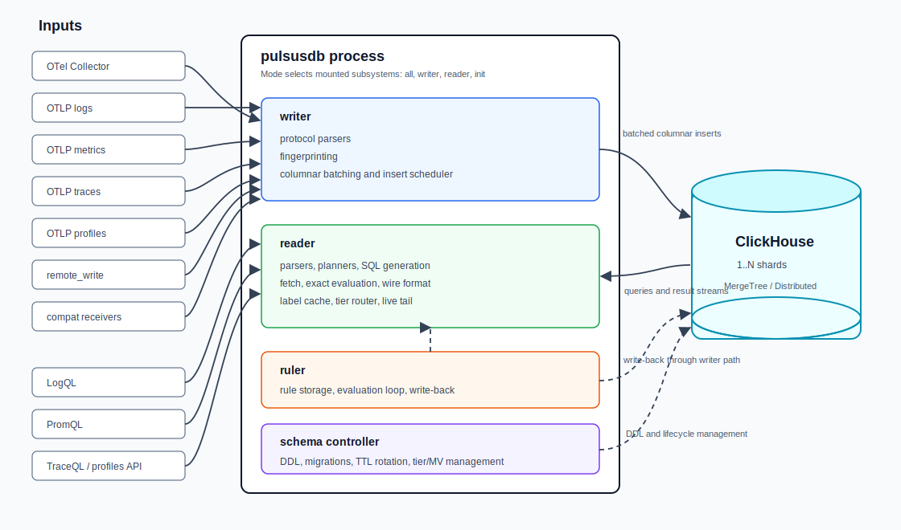
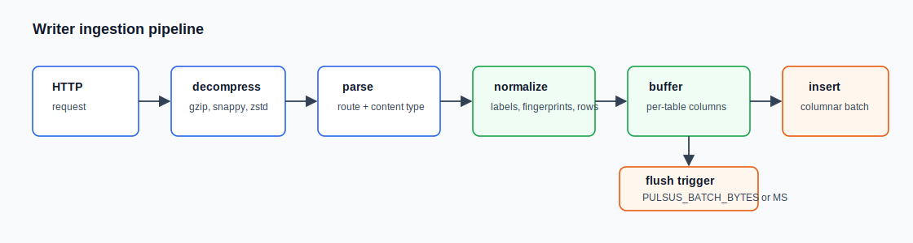

# PulsusDB Architecture

This document specifies the architecture of PulsusDB: process model, storage schemas, ingestion pipeline, query engines, and clustering. It is the authoritative design reference — implementation issues are scoped against this document.

**Design mandate:** PulsusDB is read-path first. Every schema and planner decision is justified by the queries it must serve (dashboard panels, log search, trace search, profile rendering), not by ingestion convenience. Where ingestion flexibility and read performance conflict, reads win.

---

## 1. Process model

PulsusDB compiles to a **single static binary** (`pulsusdb`). The role of a process is selected at runtime via `PULSUS_MODE`:

| Mode | Mounted subsystems | Typical use |
|------|--------------------|-------------|
| `all` (default) | writer + reader + ruler + schema controller | single-node deployments |
| `writer` | ingestion APIs only | horizontally scaled ingest tier |
| `reader` | query APIs only | horizontally scaled query tier |
| `init` | schema controller only; creates/migrates tables and exits | init containers, CI |

All durable state lives in ClickHouse. PulsusDB processes are stateless (the reader's in-memory caches are rebuildable) and can be scaled, restarted, and load-balanced freely. One HTTP listener per process serves every mounted API.

**API surfaces.** The primary ingestion path is the OpenTelemetry Collector: OTLP endpoints for logs, metrics, traces, and profiles are always on, alongside Prometheus remote write (the collector's alternative metrics exporter). Query APIs live under product-neutral paths (`/api/logs/v1`, `/api/traces/v1`, `/api/profiles/v1`, `/api/rules/v1`, and the standard Prometheus `/api/v1` for metrics). Third-party API surfaces — foreign push protocols and datasource-compatible query aliases — are mounted only when `PULSUS_COMPAT_ENDPOINTS=true`; they bind to the same handlers and add no semantics (see [api.md §8](api.md)).



### 1.1 Rust workspace layout

```
pulsusdb/
├── Cargo.toml                 # workspace root
├── crates/
│   ├── pulsus-server/         # binary: CLI, mode dispatch, router assembly
│   ├── pulsus-config/         # typed configuration: env/YAML load, validation, redaction
│   ├── pulsus-model/          # labels, fingerprints, samples, series, time types
│   ├── pulsus-clickhouse/     # client pool + columnar insert buffers (ADR 0001)
│   ├── pulsus-schema/         # DDL templates, migrations, TTL rotation, MV lifecycle
│   ├── pulsus-write/          # ingestion protocol parsers + insert services
│   ├── pulsus-read/           # query HTTP APIs, response encoders, live tail
│   ├── pulsus-logql/          # LogQL parser + planner + SQL generator
│   ├── pulsus-promql/         # PromQL planner + hybrid evaluation engine
│   ├── pulsus-traceql/        # TraceQL parser + planner + SQL generator
│   └── pulsus-ruler/          # rule storage, evaluation loop, write-back
└── docs/
```

### 1.2 Core dependencies (candidates, to be validated in M0)

| Concern | Choice |
|---------|--------|
| Async runtime / HTTP | `tokio`, `axum` (WebSocket via `axum::extract::ws`), `tower` middleware |
| ClickHouse client | **`clickhouse`** (HTTP + RowBinary) — chosen in M0 (spike: [ADR 0001](decisions/0001-clickhouse-client.md)). Bulk insert 0.86M rows/s (log) / 0.39M rows/s (metric), streaming fetch 0.25M rows/s at bounded RSS; round-trips `UInt64` fingerprints (>2^63) and `SimpleAggregateFunction`/`AggregateFunction` states correctly. `klickhouse` (native TCP) rejected on insert throughput (46–53% slower on both row shapes) despite passing every correctness/DDL gate. Fallback: `klickhouse`, already proven correct and DDL-capable in the spike; the wrapper's public API (`ChConnConfig`/`ChPool`/`ChClient`/`ChError`) is crate-agnostic so swapping is an internals-only change |
| Protobuf | `prost` (remote write `prompb`, OTLP via `opentelemetry-proto` — incl. the profiles signal, `pprof`) |
| Compression | `snap` (snappy for remote write/OTLP), `flate2` (gzip), `lz4_flex` |
| Hashing | `xxhash-rust` (metric fingerprints); **`ch_cityhash102`** for stream fingerprints — selected in M0 by the live length-class parity gate against `SELECT cityHash64(...)` (the only candidate bit-identical to ClickHouse's frozen CityHash 1.0.2 across all input-length branches; `cityhasher` implements upstream 1.1 and diverges) |
| PromQL parsing | `promql-parser` crate (faithful port of the upstream parser); LogQL and TraceQL parsers are written in-house (recursive descent) |
| JSON | `serde_json` for control paths; `simd-json` / hand-rolled streaming encoders on hot paths |

---

## 2. Data model fundamentals

### 2.1 Signals are separated

Logs, metrics, traces, and profiles have different query shapes, so each gets its own tables, ordering keys, and rollups. There is **no shared generic samples table**. This is the single largest departure from typical compatibility-layer designs, which pay for a unified table with two-stage lookups and scans on every read.

### 2.2 Fingerprints

A *fingerprint* is a 64-bit hash identifying a unique label set (a stream/series).

- **Metrics:** `xxhash64` over the label set serialized as `key \xff value \xff ...` with keys sorted and `__name__` excluded (the metric name is a first-class column). This keeps fingerprints stable across label reordering and lets the samples table stay string-free.
- **Logs, traces, profiles:** `cityHash64` over a single canonical buffer — each sorted label appended as `key ++ 0xFF ++ value ++ 0xFF` — using an implementation **bit-identical to ClickHouse's `cityHash64`** (ClickHouse's frozen CityHash 1.0.2 variant, not upstream CityHash 1.1). The writer is the sole fingerprint authority (the label-index MV only fans out the writer's fingerprint), but bit-identity keeps server-side derivation possible (`cityHash64(concat(...))` over the same buffer) and is enforced by a live cross-check test against `SELECT cityHash64(unhex(...))`.

Fingerprint computation is centralized in `pulsus-model` and covered by golden-value tests; a fingerprint mismatch between writer and MV silently corrupts the label index, so these functions are frozen by test vectors.

### 2.3 Canonical label model

Label keys are part of the user-visible query surface *and* the fingerprint input, so their normalization is fixed before any code exists:

- **Logs and metrics:** attribute keys are normalized to Prometheus-style names at ingest — characters outside `[a-zA-Z0-9_]` become `_` (OTel `service.name` → label `service_name`, `k8s.pod.name` → `k8s_pod_name`). This matches how the wider ecosystem (collectors, exporters, dashboards) already flattens OTel attributes, and it happens **before** fingerprinting, so a series has exactly one identity regardless of transport.
- **Traces:** span and resource attribute keys are stored **verbatim** in the attribute index — TraceQL addresses them by their OTel names (`span.http.status_code`, `resource.service.name`).
- **The promoted physical column is named `service` on the tables whose read paths are service-led — logs, traces, and profiles** — populated from `service.name` (resource) at ingest. It is an internal projection: users see the `service_name` label (logs/profiles) or `resource.service.name` (TraceQL); the planner maps both to the column. **Metrics deliberately have no `service` column**: the hot table stays `(metric_name, fingerprint, unix_milli, value)`, reads are metric-name + fingerprint driven, and service exists there only as the normalized `service_name` label.
- Golden tests pin the whole chain: `{service_name="checkout"}`, `resource.service.name = "checkout"`, and the physical `service` column must resolve to the same data.

### 2.4 Tenancy

v1 is **single-tenant**. One per-request escape hatch exists for routing: `X-Pulsus-Database` selects a target ClickHouse database. Retention is per-table configuration only — there is deliberately **no per-write TTL override** in v1 (row-level expiry columns would defeat whole-part TTL drops; one retention policy per database is the validatable baseline). A first-class org-ID tenancy layer is a deliberate non-goal until the single-tenant read path is proven.

---

## 3. Storage schemas

**The authoritative DDL, per-table rationale, generated-SQL read paths, and latency targets live in [schemas.md](schemas.md).** This section summarizes the decisions; where the two documents differ, schemas.md wins.

All DDL is owned by `pulsus-schema` as templated SQL (parameters: database, cluster clause, engine family, storage policy). Migrations are append-only and idempotent; a `schema_migrations` bookkeeping table records applied statements. When `PULSUS_CLUSTER` is set, `MergeTree` families swap to `ReplicatedMergeTree` equivalents and `*_dist` Distributed tables are created. Raw sample/span tables partition **daily** (short TTL, whole-part drops); series/index/tier tables partition **monthly**.

### 3.1 Metrics

Flat, metric-name-first layout ([schemas.md §2](schemas.md)): `metric_samples` ordered `(metric_name, fingerprint, unix_milli)` with no string data on the hot path, `metric_series` (activity-bucketed JSON labels feeding the label cache; bucket size is config — `1h` default, `1d` recommended at multi-million-series cardinality), and `metric_metadata` (metric types, which also license counter functions on rollup tiers). The metric name is a `LowCardinality` column and leads every ordering key, so a query touching one metric prunes to that metric's granules immediately — no inverted-index round trip.

Decisions and their reasons:

- **JSON labels, not `Map`.** `JSONExtractString(labels, k)` outperforms `Map` access in ClickHouse, and the reader rarely extracts labels in SQL anyway (see label cache, §5.2).
- **No `ReplacingMergeTree` on series.** `metric_series.unix_milli` is bucketed to the hour, so re-writes of a live series within an hour are natural duplicates collapsed at read time by `LIMIT 1 BY` — no `FINAL`, no merge-time dependence.
- **No per-day series duplication.** Monthly partitioning means a 30-day query reads series metadata from at most two partitions.

#### 3.1.1 Downsampling tiers

Rollups are maintained **entirely inside ClickHouse** by classic insert-triggered materialized views — no external driver or scheduled process. One `AggregatingMergeTree` table per tier (`metric_samples_5m`, `metric_samples_1h` by default; tiers are configurable) storing per-bucket `val_min/val_max/val_sum/val_count` and first/last time+value states (full DDL in [schemas.md §2.2](schemas.md)).

- **Insert-triggered and real-time.** Every stored aggregate is a mergeable state, so per-block partial aggregates converge under merges regardless of insert order; tiers trail raw data by at most one insert batch and can therefore serve a query's entire time range from one table.
- **Counter resets are handled at query time from bucket boundaries** (`first_value`/`last_value` per bucket), because per-sample deltas can't be computed correctly inside an incremental MV. The engine reconstructs reset-adjusted increases over the bucket sequence in O(buckets). **Any reset inside a bucket is approximate** — information is lost, sometimes undetectably (`100,150,10,140` reconstructs 40 where the truth is 190) — which is why `PULSUS_TIER_POLICY=exact` keeps counters on raw samples wherever raw exists and every tier-served counter segment is flagged approximate ([schemas.md §2.2](schemas.md)).
- The schema controller only issues DDL: create tier tables + MVs, recreate an MV when its config checksum changes, and a one-shot chunked backfill when a tier is first enabled over pre-existing data.

### 3.2 Logs

Label index (`log_streams_idx`, ordered `(key, val, fingerprint)`) + stream table (`log_streams`) + samples table (`log_samples`) + a configurable-resolution count/bytes rollup (`PULSUS_LOG_ROLLUP_RESOLUTION`, default 5s → `log_metrics_5s`), with four deliberate fixes over the classic layout: a service-led ordering key, co-sharded index, monthly index partitioning, and body skip indexes (full DDL and read-path SQL in [schemas.md §3](schemas.md)).

Decisions and their reasons:

- **`ORDER BY (service, fingerprint, timestamp_ns)` on samples, fixed.** `service` (OTel `service.name`, guaranteed present via the collector) is the one label promoted to a physical column: it clusters each service's streams contiguously, and because stream resolution returns full label sets the planner can always inject the `service` predicate — the primary index stays engaged even for queries that never mention it. Per-stream time-range reads remain sequential; the ordering is not configurable, eliminating a whole class of misdeployment. No other label is materialized.
- **Body skip indexes.** `|= "substring"` and `|~ "regex"` filters translate to `hasToken()` / token-and-ngram-prefiltered predicates so ClickHouse skips granules that cannot match, instead of scanning every log line in the time range. The planner uses the token index when the filter term tokenizes cleanly and the ngram index otherwise; filters that cannot be prefiltered (short terms, complex regexes) degrade gracefully to a scan *bounded by the stream selector*.
- **Monthly index partitions.** A stream appearing every day for 30 days produces 1–2 index rows, not 30. Retention still works: dropping a month's index partition follows the samples' TTL horizon.
- **Query-time dedup, not `FINAL`.** Index reads use `GROUP BY`/`DISTINCT` shapes that tolerate ReplacingMergeTree duplicates.
- **Count/bytes rollup at a configurable resolution.** `rate({app="x"}[5m])`-style range aggregations that don't inspect the body are answered from the rollup table instead of counting raw rows — when the query step is a multiple of the rollup resolution; otherwise raw rows are counted. Raw log timestamps are stored verbatim (ns); the rollup is derived data.

### 3.3 Traces

Span payload table (`trace_spans`, ordered `(trace_id, timestamp_ns)` with a `service_time` projection), attribute index (`trace_attrs_idx`, ordered `(key, val, timestamp_ns, trace_id, span_id)` with a typed `val_num` column for numeric comparisons), and a bounded `trace_tag_catalog` for tag APIs (full DDL and read-path SQL in [schemas.md §4](schemas.md)).

Decisions and their reasons:

- **Both access patterns served by one table.** Primary ordering `(trace_id, timestamp_ns)` makes trace-by-ID fetch a point read; the `service_time` **projection** gives service + time-range searches their own physically sorted copy, so "recent traces for service X" never scans by trace ID. Projections cost write amplification; that trade is accepted because trace search is the human-facing slow path.
- **`timestamp_ns` before `trace_id` in the attribute index ordering** so that TraceQL searches — which are always time-bounded — prune index granules by time within a `(key, val)` prefix.
- **Candidate-set discipline.** TraceQL planning caps intermediate trace-ID candidate sets (spill to a bounded top-K by recency) rather than joining unbounded sets against the payload table.

### 3.4 Profiles

Follows the same index + payload pattern: `profile_samples` ordered `(type_id, service, timestamp_ns)` — the dominant read (merge flamegraph for a type + service + range) is a pure primary-prefix scan — plus `profile_series` / `profile_series_idx` for label selectors (full DDL in [schemas.md §5](schemas.md)).

The flamegraph tree and function table are precomputed at ingest (from pprof or the OTLP profiles signal) so merge/render queries combine compact trees instead of re-symbolizing raw profiles.

### 3.5 Rules

Rule groups (`kind` = `logs` | `metrics`) live in a `rules` `ReplacingMergeTree` table keyed `(namespace, group_name, kind)`, alongside `schema_migrations` and `mv_checksums` bookkeeping tables ([schemas.md §6](schemas.md)).

### 3.6 Retention

Retention is TTL-driven and applied by the schema controller at startup and on a rotation timer: raw tables get `TTL ... + INTERVAL <PULSUS_RETENTION_DAYS> DAY DELETE` (with `ttl_only_drop_parts = 1` so expiry drops whole partitions); each metric tier carries its own longer retention. `PULSUS_STORAGE_POLICY` attaches a ClickHouse storage policy for hot/cold tiering.

---

## 4. Ingestion pipeline (writer)



- **Parsers** live in `pulsus-write::protocols`, one module per protocol. Primary: OTLP logs, OTLP metrics, OTLP traces, OTLP profiles, Prometheus remote write, pprof ingest. Compatibility (mounted only with `PULSUS_COMPAT_ENDPOINTS`): log push JSON/protobuf, Zipkin JSON, Influx line protocol, Datadog logs/metrics, Elastic bulk. Each parser is a pure function from request bytes to normalized rows — trivially unit-testable against captured fixtures.
- **Batching** is per destination table, with sync (request completes after flush succeeds) and async (`202` after enqueue) modes selectable per request via `X-Pulsus-Async`. Buffers are bounded; backpressure returns `429` rather than growing unbounded.
- **Series/stream registration** is write-through: new fingerprints (checked against a fast in-process LRU) emit rows to the series/streams tables; known fingerprints skip that insert entirely.
- **Errors are per-batch atomic**: a failed insert retries with exponential backoff and jitter; poison batches (schema mismatch) are dumped to a local spool file and skipped, with a counter exposed on `/metrics`.
- **Cluster-mode writes go through the `_dist` wrapper** (§7): the writer never freelances shard placement (schemas.md §7). Their cross-shard delivery is **eventually consistent even for sync-mode writes** — a sync-mode `FlushWait` confirms the `_dist` `INSERT` *returned*, not that ClickHouse's Distributed engine has forwarded every row to its owning shard. Strengthening this (`insert_distributed_sync=1` or an equivalent client-side-computed direct-to-shard write) is deferred to the **M7 operations epic**.

---

## 5. Query engines (reader)

### 5.1 PromQL — fully compliant hybrid engine

**Full PromQL compliance is a hard product requirement, and it does not depend on ClickHouse.** ClickHouse's own PromQL support covers only a small function subset and is never used; PulsusDB also does not transpile PromQL functions into SQL. ClickHouse's role is strictly **data reduction** — fetching, filtering, and pre-aggregating samples — while 100% of PromQL evaluation semantics live in the Rust engine.

The compliance contract:

- **Reference implementation:** the upstream Prometheus source at a pinned release (currently **v3.13**). Engine behaviors — function numerics, counter resets, extrapolation, staleness, lookback, native-histogram arithmetic, subquery evaluation — are ported from it, not re-derived.
- **Compliance gate:** the upstream data-driven PromQL test corpus (21 scenario files, ~11.7k lines covering aggregators, functions, operators, selectors, subqueries, `@`/`at_modifier`, staleness, range queries, duration expressions, and native histograms) is **vendored into this repo and replayed against PulsusDB in CI**. Full compliance means 100% pass; any temporary exclusion is an open issue, never a silent skip. The corpus is re-vendored on each reference-version bump.
- **Function coverage:** all functions in the pinned release's registry (89 at v3.13), including experimental ones gated behind a feature flag exactly as upstream gates them.
- **Parser:** the `promql-parser` crate is validated against the upstream parser test suite at the pinned version; gaps are patched or upstreamed, and if the crate cannot track the reference grammar (duration expressions, UTF-8 label names, etc.), the fallback is porting the upstream parser — the grammar is not negotiable.
- **Pushdown never changes semantics:** the tier/rollup pushdown (§below) is a transparent optimization for an enumerated construct list; anything outside it silently evaluates in the engine from raw samples. A pushdown that cannot reproduce engine results within the documented tier approximation is a bug, not a trade-off.

The evaluation flow:

1. **Parse** with the `promql-parser` crate into the upstream-shaped AST.
2. **Plan** into a `QueryPlan` IR capturing: metric name, label matchers, data window (start − range − lookback − offset), the function/aggregation/math chains, and binary-op subplans.
3. **Resolve series** — time-aware. If the query's data window lies inside the cache window, matchers (including regexes) evaluate in-process against the **label cache** (§5.2), producing a sorted fingerprint list, and SQL never sees a label matcher. Queries reaching further back resolve from `metric_series` with a time-bounded SQL subquery using **hour-bucket-aware bounds** (§5.2) — the cache is never consulted for ranges it cannot have seen.
4. **Fetch** minimal columns over the native protocol:
   ```sql
   SELECT fingerprint, unix_milli, value
   FROM metric_samples
   PREWHERE metric_name = {name}
   WHERE unix_milli > {start} AND unix_milli <= {end}
     AND fingerprint IN ({sorted fps})
   ORDER BY fingerprint, unix_milli
   ```
   Large fingerprint sets are split into parallel chunk fetches.
5. **Evaluate** series-first (all steps for one series before the next — samples stay cache-hot, group keys precomputed once) with Prometheus-exact semantics:
   - counter-reset correction and 1.1×-average-interval edge extrapolation in `rate`/`increase`/`delta`;
   - staleness: samples older than the 5-minute lookback or equal to the stale-NaN bit pattern `0x7FF0000000000002` are excluded; range windows are left-open right-closed `(start, end]`;
   - `histogram_quantile` with forced bucket monotonicity and linear interpolation;
   - Kahan–Neumaier compensated summation in aggregations.
6. **Encode** responses by streaming JSON directly to the socket — no intermediate DOM.

**Pushdown exceptions** (where SQL does more than fetch):

- The **tier router** governs when rollups replace raw fetches, under an explicit exactness policy (`PULSUS_TIER_POLICY`). Tier eligibility requires `tier.resolution ≤ query step` **and** `tier.resolution ≤ the range-vector window`; under the default `exact` policy, raw samples are preferred wherever they still exist (tiers serve only the range beyond raw retention, stitched with `UNION ALL`), while `fast` serves any eligible range from tiers. Every tier-served segment is **approximate by definition** (bucket-aligned windows, boundary-state counters) and is flagged as such in the response when `X-Pulsus-Explain` is set; exactness is judged **per step** — a step is raw-exact only when its full evaluation window (range + lookback) is covered by raw samples, so steps straddling the tier/raw boundary are flagged approximate too. Supported pushdowns: `avg/min/max/sum/count/stddev/stdvar/last/present_over_time` collapse to `GROUP BY step` over tier aggregate columns; `rate`/`increase` read per-bucket boundary states and finish with an O(steps + buckets) reset-adjusting sliding window in the engine; everything else routes to raw.
- `count`/`group` aggregations over label matchers alone are answered **from the label cache with zero ClickHouse queries** — only when the evaluation window lies inside the cache window; otherwise they resolve through `metric_series` like any historical query.

Binary expressions evaluate both sides concurrently. Instant and range queries share the planner; instant queries are a single-step range.

### 5.2 Label cache

An in-process map `fingerprint → labels` plus `metric_name → [fingerprints]`, populated by a periodic (default 60s) query:

```sql
SELECT fingerprint, metric_name, labels
FROM metric_series
WHERE unix_milli >= now - <window>
ORDER BY unix_milli DESC
LIMIT 1 BY metric_name, fingerprint
```

- Matcher evaluation (with a compiled-regex cache) happens against this map; results are sorted fingerprint vectors.
- **Time-awareness (correctness rule):** the cache may only answer a query whose data window lies within the cache window — a series alive last week but silent today is *absent from the cache*, and answering from it would return false empties. Historical queries always resolve via a time-bounded read of `metric_series` (`LIMIT 1 BY` for dedup) whose bounds account for the activity bucketing: both bounds floored to the configured bucket (`intDiv(ms, bucket_ms) * bucket_ms`, the same constant the writer uses; exact SQL in [schemas.md §2.1](schemas.md)) — the floor on the lower bound so a mid-hour window still matches the series' bucket row, the upper bound so series first seen after the query window are excluded. The cache is a fast path for the recent window, never the source of truth.
- **Recency gate (issue #30 code review, both edges checked):** the cache is authoritative for a query iff **both** the query's data-window start is at or after the cache's covered-from edge **and** the query's data-window end is at or before `sweep_time + staleness_threshold` (`staleness_threshold = staleness_multiplier × PULSUS_CACHE_TTL`, default 3×). The upper edge matters because a periodic-refresh cache structurally cannot know about a series whose first activity lands after its last sweep — a query reaching past that point risks a false empty for a brand-new series, the same failure mode the lower-bound rule already guards against. This yields a **bounded, documented recency gap**: in normal operation a brand-new series is invisible to the cache for at most one refresh interval (typically ≤ `PULSUS_CACHE_TTL`, worst case ≤ `staleness_threshold`), after which the query is forced onto the SQL fallback (which always sees the real table) — never an unbounded or silent gap, and every already-known series is answered exactly. This is the accepted advisory-degradation window: correctness is never compromised, only the fast path's applicability window narrows near the cache's own recency edge.
- **Cardinality guard — two distinct roles, stated explicitly (issue #30):** `PULSUS_CACHE_MAX_SERIES` is a **per-selector** guard, not a resident-cache size limit — if one selector's in-process match exceeds it, that selector's resolution falls back to a SQL JOIN/sub-query against `metric_series` instead of shipping a huge IN-list. **Residency** (how many fingerprints the cache holds at all) is bounded separately, by the **active-series time window** (`PULSUS_CACHE_WINDOW`, default 24h — the whole point of this section's time-awareness rule), never by a count. A refresh sweep whose resident size exceeds `PULSUS_CACHE_MAX_SERIES` is not rejected or truncated — it sets an advisory degraded/oversize gauge (on `/metrics`) and the cache keeps serving everything it holds; this gauge feeds the M3 scale benchmark's memory-at-cardinality measurement, it is not a correctness signal.
- The cache is advisory: a cold, stale, or out-of-window cache degrades to the SQL path, never to wrong results.
- **At design-target cardinality, label resolution — not sample fetching — is the metrics path's primary risk.** The full strategy ladder (cache matcher with planned incremental refresh → metric-scoped SQL fallback → an optional, fully spec'd `metric_series_idx` inverted index) and its M2/M3 benchmark-driven decision gate live in [schemas.md §2.1](schemas.md). The SQL fallback is not assumed rare: broad selectors over high-cardinality metrics hit it routinely, and the index ships if — and only if — the fallback misses latency targets on the 5M-series scale corpus.

### 5.3 LogQL

In-house recursive-descent parser → pipeline planner → SQL generator. A LogQL query plans into up to three stages:

1. **Stream resolution:** label matchers → `log_streams_idx` lookup (equality matchers as index prefix reads; regex/negative matchers evaluated over the candidate `(key, val)` space, intersected in SQL with `GROUP BY fingerprint HAVING count() = <n_matchers>`).
2. **Sample retrieval:** time-bounded read of `log_samples` for the resolved fingerprints; line filters (`|=`, `!=`, `|~`, `!~`) push down as `hasToken`/`match` predicates backed by the body skip indexes.
3. **Pipeline evaluation** in the engine: parsers (`json`, `logfmt`, `regexp`, `pattern`), label filters, `line_format`/`label_format`, unwrap, and range/vector aggregations. Range aggregations that reduce to counting (`rate`, `count_over_time`, `bytes_rate`, `bytes_over_time`) and don't depend on pipeline-created labels are rerouted to the log rollup table when the step is a multiple of its configured resolution.

Live tail (`/api/logs/v1/tail`) is a WebSocket loop polling the tail of `log_samples` for the resolved fingerprints with monotonic cursor advancement, `limit`/`start` support, and `dropped_entries` reporting under backpressure.

### 5.4 TraceQL

In-house parser → planner → SQL generator over `trace_attrs_idx` + `trace_spans`:

- Span-attribute conditions become index reads intersected per span (same `GROUP BY ... HAVING` shape as LogQL matchers); intrinsics (`duration`, `status`, `name`, service) filter directly on indexed columns.
- The planner produces a bounded candidate set of `(trace_id, span_id)` and hydrates from `trace_spans` — by primary key for ID fetches, via the `service_time` projection for service-scoped searches.
- **TraceQL metrics** (`/api/traces/v1/metrics/query_range`, `/api/traces/v1/metrics/query`) compile the same span filters into `GROUP BY toStartOfInterval(...)` aggregations evaluated fully in ClickHouse.

### 5.5 Profiles

Query endpoints (`/api/profiles/v1/{merge,select_series,export,render,render-diff}` and the label APIs) resolve profile series via `profile_series_idx`, then merge the precomputed `tree` structures across the selected time range in the engine, emitting flamebearer JSON, pprof, or Graphviz DOT (with `maxNodes`, unit-aware value formatting, and self-percentage-scaled font sizes).

---

## 6. Ruler

- Rule groups (LogQL and PromQL kinds) are stored in the `rules` table and managed via the standard rule CRUD APIs.
- An evaluation loop (poll interval `PULSUS_RULER_POLL_INTERVAL`, default 30s) leases groups, evaluates **recording rules** through the same reader engines used for ad-hoc queries, and writes results back through the writer's normal insert path (so recorded series are indistinguishable from ingested ones).
- **Alerting rules** are stored and validated in v1 but evaluated only post-1.0 (Alertmanager-compatible notification delivery). The API accepts them from day one so rule-management tooling round-trips cleanly.
- The ruler runs only in `all` mode (it needs both engines in-process); a dedicated `ruler` mode is future work.

---

## 7. Clustering

- **Single node** (default): plain MergeTree tables, no Distributed wrappers.
- **Sharded** (`PULSUS_CLUSTER` set): every table gets a `Replicated*` engine plus a `_dist` Distributed wrapper (cluster config with `internal_replication = true`). Sharding keys are chosen for read locality, and every table in a signal family uses the byte-identical expression:
  - Metrics family (`metric_samples`, tiers, `metric_series`): **`cityHash64(metric_name, fingerprint)`** — the metric fingerprint excludes `__name__`, so all metrics sharing a target's label set share one fingerprint; sharding by fingerprint alone would skew a whole target onto one shard. The shard key matches the true series identity `(metric_name, fingerprint)`: one series per shard, no target-level hotspots.
  - Logs family (`log_samples`, `log_streams`, `log_streams_idx`, rollup): **`fingerprint`** (never `rand()`). Label→fingerprint lookups still fan out (any shard may hold matching streams), but because index and samples co-shard, the fingerprint sets each shard produces are *local* to that shard's samples — intersections, joins, and per-series aggregation push down shard-locally, and only reduced results cross the network.
  - `trace_spans`, `trace_attrs_idx`: `cityHash64(trace_id)` — a trace is whole on one shard; span-level intersections are shard-local.
  - Writes go through the `_dist` wrappers (or compute the identical expression client-side) — co-location is an invariant, not a convention.
- **Reader fan-out discipline:** planners aggregate on shards (partial aggregation states) and merge at the initiator; time filters ride in `PREWHERE`; `skip_unavailable_shards` is configurable for degraded reads.
- **Cross-cluster reads:** a reader can target a remote cluster's tables via a configurable distributed-table suffix, enabling a query tier in one cluster over storage in another.

---

## 8. Observability of PulsusDB itself

- `/metrics` exposes Prometheus metrics: ingest rows/bytes/errors per protocol, batch flush latencies, insert retries, query latencies per API and per planner stage, label-cache hit/size/age, tier-router segment decisions, tail sessions.
- `/ready` gates on ClickHouse connectivity and (reader) label-cache warmup; `/config` dumps effective redacted config.
- Structured tracing via `tracing` with per-request spans; the generated SQL for any query is retrievable with a debug header (`X-Pulsus-Explain: 1` returns the SQL plan alongside results).

---

## 9. Testing strategy

- **Golden semantics tests:** fingerprint vectors; the **vendored upstream PromQL test corpus** (21 `.test` scenario files from the pinned Prometheus release, replayed natively by a test driver that implements the `.test` format) — this is the PromQL compliance gate, run in CI on every engine change; LogQL/TraceQL parser snapshot tests.
- **SQL plan snapshots:** every planner change shows its SQL diff in review.
- **Integration:** compose-file harness (ClickHouse + pulsusdb + OTel Collector; runs under podman compose or docker compose) driving every signal through a real collector pipeline into PulsusDB and reading back through every query API; compat receivers exercised with captured fixtures; a clustered variant with 2 shards validates distributed DDL and shard-local pushdown. Consequence of the `_dist` eventual-consistency model above: the collector-to-query e2e scenarios assert via **poll-until-visible** (bounded deadline, no fixed sleeps) rather than assuming a write is cross-shard-visible the instant its HTTP response returns.
- **Differential testing:** the same remote-write stream fed to Prometheus and PulsusDB, with per-series per-timestamp value comparison across the function matrix (the accuracy gate for M2).

---

## 10. Design risks and open questions

| Risk | Mitigation / decision point |
|------|-----------------------------|
| Rust ClickHouse client maturity (native protocol, aggregate-state columns) | M0 spike benchmarks `clickhouse` vs `klickhouse`; HTTP+RowBinary is an acceptable fallback for everything except `AggregateFunction` state reads, which can be avoided by `-Merge` in SQL |
| `promql-parser` crate lagging the pinned reference grammar (duration expressions, UTF-8 label names, experimental syntax) | M2 spike validates the crate against the upstream parser test suite; divergences are patched/upstreamed; the committed fallback is porting the upstream parser — full grammar compliance is non-negotiable |
| Tier counter accuracy: **any** counter reset inside a bucket is unrecoverable from boundary states (`100,150,10,140` → true increase 190, reconstructed 40 — and no reset is even detectable) | Inherent to incremental-MV aggregation; the default `exact` tier policy keeps counters on raw samples within raw retention; tier-served segments are flagged approximate; M3 accuracy report includes single-reset and misaligned-window cases |
| Tier gauge accuracy: bucket-aligned aggregates cannot answer range windows that start/end inside a bucket exactly | Same policy: raw within retention by default; tiered results defined and flagged as bucket-aligned approximations |
| Late/duplicate samples (remote-write retries) permanently inflate tier `sum`/`count` aggregates | Raw-path reads dedup `(fingerprint, timestamp)` at query time; tiers cannot — documented as a tier-accuracy caveat, measured in M3; writer batch atomicity keeps the common path duplicate-free |
| Label cache memory at design-target cardinality (millions of active series; ~300–600 B/series → GiB-scale reader RAM) | Active-window bounding + JOIN fallback (§5.2); the M3 scale corpus (5M active / 20M churned series) is the acceptance gate, incl. refresh-query cost and `metric_series` volume with a `1d` activity bucket |
| Label resolution at millions of series: cache refresh sweep cost; JSON-matching SQL fallback dominating broad/historical selectors; day-bucket over-inclusion widening metadata reads | Three-path benchmark on the scale corpus (cache / SQL fallback / prototype inverted index) is an explicit M2/M3 **decision gate**; incremental cache refresh and `metric_series_idx` are both fully specified in schemas.md §2.1, ready to ship on evidence |
| Skip-index false-positive rates on log bodies (scale-dependent: rate is a function of corpus size/content, not topology) | Tunable bloom sizes; planner records skip-index effectiveness metrics to guide defaults; validated at Tier-2 scale by the M1 follow-up (#25) — M1 Tier-1 evidence does not touch this row |
| Projection write amplification on `trace_spans` | Acceptable at typical trace volumes; if not, fall back to a second explicit table maintained by MV (same read path) |
| Shard-local execution claims (co-sharding → local joins/aggregation) are design intent, not yet observed behavior, for **metrics/traces/profiles**; the **logs family graduated in M1** (issue #16), covering both the stream-resolution/read path and label/tag discovery | M3/M4 distributed benchmarks verify the remaining signal families with `EXPLAIN PIPELINE` + `system.query_log` on a multi-shard cluster before those rows graduate from hypothesis; logs graduated on Tier-1 4-shard evidence captured **per stage and per shard, including the coordinator's own local-shard read, verified against a client-computed expected shard roster** (three CODE-review corrections on #16: terminal-stage-only spot check → per-stage capture; excluded coordinator shard → full shard roster; tolerant 1..N shard-count check → exact `fingerprint % total_weight`-derived roster, so a pruned shard is *proven* pruned rather than merely absent), see `docs/benchmarks/m1-logs-read-path.md` — Tier-2 latency-at-scale validation for logs is separately tracked by #25 |
| Profile rows duplicate tree/function arrays and payload per profile — storage and read-bandwidth amplification at high profile frequency | Start simple; M5 validation measures amplification; fallback design splits payload, function dictionary, and compact tree samples into separate tables |
