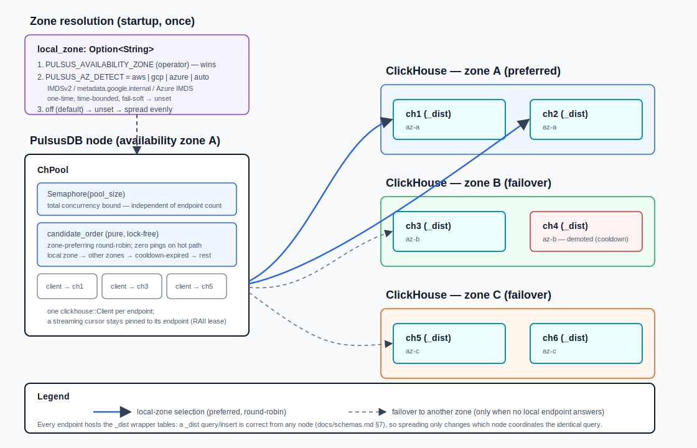

# Connection spreading & availability-zone affinity

PulsusDB can spread its ClickHouse connections across multiple endpoints and
prefer the ones in its own cloud availability zone (AZ), failing over to other
zones the moment a local endpoint stops answering. This cuts cross-AZ network
cost on the common path while keeping the deployment available when a zone or
node degrades.

This is a PulsusDB-side, connection-level concern. It does **not** change any
SQL, pushdown, granule pruning, projection choice, or `_dist` fan-out — a
`_dist` (Distributed) query or insert is correct from **any** cluster node
(docs/schemas.md §7), so spreading only changes *which node coordinates the
identical query*, never the result.



## Configuration

Two settings drive it (docs/configuration.md §2 and §4):

| Setting | Purpose |
|---------|---------|
| `CLICKHOUSE_SERVERS` (`clickhouse.servers`) | the endpoint list — `host[:port][=zone]`, comma-separated in the env form |
| `PULSUS_AVAILABILITY_ZONE` (`availability_zone`) | this node's own zone (operator-supplied) |
| `PULSUS_AZ_DETECT` (`az_detect`) | auto-detect this node's zone from cloud metadata when not set explicitly |

Backward compatible: with none of these set, PulsusDB dials the single
`CLICKHOUSE_SERVER`/`CLICKHOUSE_HTTP_PORT` endpoint exactly as before.

Example (6-node cluster, 2 per zone; this node in `az-a`):

```
CLICKHOUSE_SERVERS=ch1:8123=az-a,ch2:8123=az-a,ch3:8123=az-b,ch4:8123=az-b,ch5:8123=az-c,ch6:8123=az-c
PULSUS_AVAILABILITY_ZONE=az-a
```

YAML (use this for IPv6 literals, which the flat env form can't express):

```yaml
availability_zone: az-a
clickhouse:
  http_port: 8123          # per-entry fallback when an entry omits its own port
  servers:
    - { host: ch1, http_port: 8123, zone: az-a }
    - { host: ch2, zone: az-a }        # http_port inherits clickhouse.http_port
    - { host: ch3, http_port: 8123, zone: az-b }
    - { host: ch4, http_port: 8123, zone: az-b }
```

**Topology requirement:** every listed endpoint must be a cluster member that
hosts the `_dist` wrapper tables (see above).

## How the pool works

The connection pool (`crates/pulsus-clickhouse/src/pool.rs`) holds **one
`clickhouse::Client` per distinct endpoint** behind a **single semaphore**.
That semaphore bounds *total* concurrent requests to `PULSUS_CH_POOL_SIZE` —
it is not multiplied by the endpoint count, and the RAII lease discipline is
unchanged (a streaming cursor owns exactly one permit and one endpoint for its
whole lifetime, released on drop).

Each `get()` chooses an endpoint with a pure, lock-free policy
(`candidate_order`): endpoints in the node's local zone lead (round-robin
among them), then other-zone endpoints (round-robin), then demoted endpoints
whose cooldown has expired, then the rest. On the healthy path this is a few
atomic loads, a modulo, and a zone compare — **no ping, no allocation, no
extra round-trip.**

## Failover

Selection carries no active health probing on the hot path. Instead, a
**transport-class failure** on a real query — a connection/timeout/IO error or
a retryable ClickHouse server code, never a bad-SQL/decode/logic error —
demotes that endpoint (lock-free atomics, never an async mutex, never in
`Drop`). The next `get()` skips it until a short cooldown elapses, then
re-admits it as a probe candidate; a successful probe re-promotes it. This
matches "immediately start using other AZs on disconnect" with zero
healthy-path overhead: at most one failed request per newly-dead endpoint.

Startup uses "ping-any": the pool starts if at least one endpoint answers, so
a partially-degraded cluster is still serviceable.

## Availability-zone auto-detection

`local_zone` is a single `Option<String>` threaded through the pool. How it is
populated at startup is isolated in `crates/pulsus-server/src/azdetect.rs`:

1. an explicitly-set `PULSUS_AVAILABILITY_ZONE` always wins;
2. otherwise, if `PULSUS_AZ_DETECT` names a cloud (or `auto`), the zone is read
   once from the provider's instance-metadata service:
   - **AWS** — IMDSv2 (token-required `PUT /latest/api/token`, then
     `GET /latest/meta-data/placement/availability-zone`; IMDSv1 is not used,
     for SSRF hardening);
   - **GCP** — `GET /computeMetadata/v1/instance/zone` with
     `Metadata-Flavor: Google` (the trailing path segment is the zone);
   - **Azure** — `GET /metadata/instance/compute/zone?...&format=text` with
     `Metadata: true`;
3. otherwise (`off`, the default) the zone stays unset → even spreading.

Detection is a one-time startup probe, individually time-bounded, with proxies
disabled (a configured HTTP proxy must never intercept a link-local metadata
call), and **fail-soft**: any failure/timeout/miss leaves the zone unset
rather than blocking startup. The zone strings a provider returns (e.g.
`us-east-1a`, `us-central1-a`) must match the `=zone` labels given to
`CLICKHOUSE_SERVERS` for affinity to take effect.

The pool/selection/failover mechanics never see this module: auto-detection
only changes how the one `local_zone` field is filled, exactly as an
operator-supplied value would.
