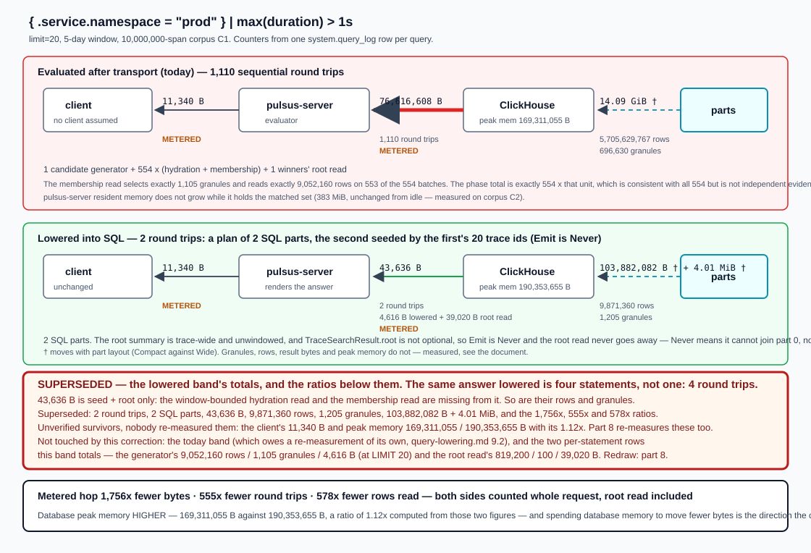
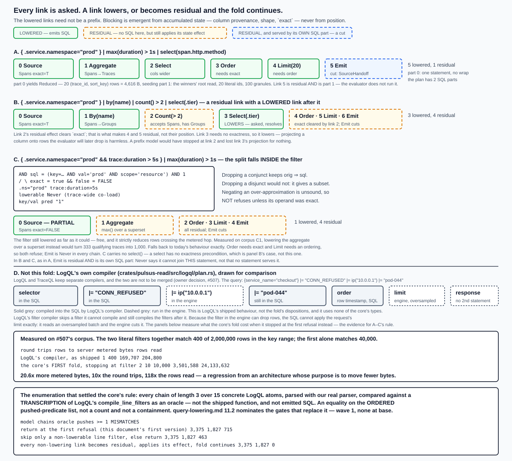

# Query lowering: compiling pipeline stages to SQL

A LogQL or TraceQL query is a **selector** followed by a **pipeline of stages**. Every stage can
be evaluated in `pulsus-server` over rows ClickHouse has already sent, and some can instead be
compiled into the SQL we send, so ClickHouse does the work next to the data and returns less.
This document describes the mechanism that decides which — the shared lowering core — and applies
it to both languages.

The decision it deliberately leaves out is the SQL shape several lowered stages compose into.
That is [ADR 0008](decisions/0008-sql-composition-for-lowered-pipelines.md).

Related: [architecture.md §5.3](architecture.md) (LogQL) and [§5.4](architecture.md) (TraceQL) for
the read paths this sits inside; [schemas.md §3.2 and §4.2](schemas.md) for the generated SQL;
[api.md §2.1 and §4.2](api.md) for the response contracts a lowered query must still satisfy.

**What this design is required to do.** The requirement is **one generic architecture with shared
code patterns for both LogQL and TraceQL, designed together** — not two designs sequenced. It has
to cover **multi-stage pipelines**, not a single stage at a time, and it has to carry **query
optimisation**: which stages compile into the SQL, in what shape, and what that saves on the hop
that is billed. The requirement is recorded on
[#492](https://github.com/digitalis-io/pulsusdb/issues/492) and on
[#507](https://github.com/digitalis-io/pulsusdb/issues/507); #492 carries the shared core and #507
the LogQL stage inventory and its measurements. Three obligations follow and every section below is
answerable against them: the core is exercised by **both** stage sets, a stage from each fits
through the same interface **without changing it**, and where the sharing stops is stated with
reasons rather than left as a gap (§6).

**What the compiler emits.** Not one statement: a **plan** — an ordered list of parts, each part
either one SQL statement or work in our own engine, with the value set that crosses between two
parts named, typed and bounded. §2.7 is the plan object and the four **cuts** that are the only ways
a plan gets a second SQL part. That is not an ambition: §9.2's worked request already sends **1,110**
statements, and an earlier form of this design had no field that could hold a number other than one.

**Status.** The core and the TraceQL side are designed and measured. The LogQL side is
**described but not measured here** — its inventory belongs to
[#507](https://github.com/digitalis-io/pulsusdb/issues/507) and §7 is structured to receive it.
The stage-by-stage statement text for both languages, with the answer each query must return, is
[query-to-sql.md](query-to-sql.md).
§10 states exactly what is demonstrated, what a compiler has now disproved and repaired, and what
the first implementation wave settles — including one **defect this design corrects** (the
pipeline's written order is observable on the reference and ignored here) and one **regression it
avoided** (§9.6: the fold's original stopping rule cost 20.6× more metered bytes than what ships
today, on an ordinary query).

---

## 1. Why this exists

**The lowering boundary is computed four times today, by hand, and none of the four can be
reused.**

LogQL computes it in three separate walks over the same stage list, in
[`crates/pulsus-read/src/logql/plan.rs`](../crates/pulsus-read/src/logql/plan.rs):

| function | line | what it computes |
|---|---|---|
| `compile_line_filters` | 3052 | the lowered prefix's predicates — walks the stages and `break`s at `LineFormat`, `Decolorize` or `Unpack` |
| `has_unpushed_dropping_stage` | 1655 | whether the boundary is short of the end — tracks `seen_line_format`, returns `true` at a `LabelFilter` or a post-rewrite line filter |
| `metric_pipeline_construct` | 1680 | the **first** stage that cannot lower, as a `&'static str` reason — a `find_map` over the ten stage variants |

Those are three projections of one traversal. `metric_pipeline_construct` is exactly "capability,
returning the first refusal and its reason"; `has_unpushed_dropping_stage` is "did the boundary
fall short"; `compile_line_filters` is "the predicate the fold accumulated".

Underneath them, `is_pushable_line_filter` (`plan.rs:3086`) carries a doc comment that states the
problem in the codebase's own words — *"the single source of truth for 'does this line filter push
down to SQL, or must it run in the client pipeline?' … so the two paths never drift"* — and it has
five call sites across three files: `plan.rs:1668`, `plan.rs:1686`, `plan.rs:3060`,
`pipeline.rs:1019`, `exec.rs:2261`.

TraceQL computes the same thing a fourth time and shares none of it:
[`filter::collect`](../crates/pulsus-read/src/traces/filter.rs) (line 2327) walks a boolean tree
choosing candidate generators, and
[`plan_pipeline`](../crates/pulsus-read/src/traces/search_plan.rs) (line 1083) walks the pipeline.

So a shared core is not an abstraction invented for a hypothetical future. It is the fourth
hand-written copy being replaced by the thing all four already are.

**And the cost of not having it is measurable.** TraceQL's spanset aggregate has no SQL path at
all: `PlannedAggregate` is built at `search_plan.rs:1218` and read at exactly one place,
`search_eval.rs:2420`. Every matching span is therefore transported and then discarded. On corpus
C1 (§9), `{ .service.namespace = "prod" } | max(duration) > 1s` at `limit=20` costs **1,110
sequential round trips** and moves **76,616,608 result bytes**; of that, the ~11 KB the client
receives is all that was wanted (11,340 B, measured on C2 — see §9.1).

**The same answer lowered is two statements, not one: 2 round trips and 43,636 result bytes.** The
lowered statement is 1 round trip and 4,616 B; the winners' root read stays residual in **every**
chain, because the root summary is read trace-wide with no time predicate (§3.1's `Emit` row, §5),
and it is the second — 1 round trip and 39,020 B, measured as its own row in §9.2. So the metered
hop carries **1,756× fewer bytes** (76,616,608 ÷ 43,636) over **555× fewer round trips**.

> **16,598× is not this document's figure and appears nowhere as one.** It is 76,616,608 ÷ 4,616 —
> today's whole request divided by the lowered *statement* alone, with the root read the lowered
> path still performs left out of the denominator. The figure this document uses everywhere is
> **1,756×**. The rejected number is written down exactly twice, here and at §9.2, and both times
> to reject it; a reader who computes it should know it has been considered, not wonder whether it
> was missed.



**What it is worth on LogQL, including the case that is worth least.** Measured by
[#507](https://github.com/digitalis-io/pulsusdb/issues/507) on its own corpus, metered-hop bytes
today against lowered:

| query | metered ratio |
|---|---|
| `{service_name="checkout"} \| json \| level="error"` | 42.1× |
| `{service_name="checkout"} \| json \| status >= 500` | 13.8× |
| `{service_name="checkout"} \| json \| line_format "{{.msg}}" \|= "pod-044"` | 68.9× |
| `{service_name="checkout"} \| trace_id="740eda9f12aec8e8"` | ≈24,800× |
| `sum by (level) (count_over_time({service_name="checkout"} \| json [1m]))` | 1,420× |
| **`sum by (trace_id) (count_over_time({service_name="checkout"} \| json [1m]))`** | **7.8×** |

**The last row is the one to design against, because it is the default shape.** Grouping by a
parser-derived high-cardinality label makes the output proportional to the input — 400,277 groups,
18 MB across the hop — and #507 captured the reference returning one series per distinct parsed
label set for an ungrouped `unwrap`, so high cardinality is what a user gets without asking for
it. 7.8× is still worth having, and it is **180× less** than the grouped-by-`level` row above it.

**A design justified on 24,800× that delivers 7.8× on what people actually run has been sold on
the wrong number.** The 24,800× row is real — it is a structured-metadata filter that today burns
127 round trips and about 53 GiB of reads **to return an empty partial answer** — but it is the
best case, not the expected one. Two consequences follow and both are load-bearing: a bound on the
number of groups is not optional (§8), and the case for this work rests on the round-trip collapse
and the 7.8×–70× band, not on its maximum.


---

## 2. The model

### 2.1 The pipeline as data

**Today there is nothing to fold over, and that is the root cause rather than an inconvenience.**
`plan_pipeline` sorts stages into buckets — `aggregates`, `select_fields`, `group_by`, `coalesce`,
`post_stages` — so a `SearchPlan` records *which* stages a query has and, except for
`post_stages`, not *in what order*. LogQL keeps its `Vec<Stage>` but walks it three times.

The intermediate representation is one linear chain, and **three of its links are synthesised
rather than written by the user**:

```
Source -> S1 -> S2 -> ... -> Sn -> Order -> Limit -> Emit
           \___ the language's own stages ___/   \__ synthesised __/
```

- `Source` carries the selector — a TraceQL `SpansetExpr` tree or a LogQL `StreamSelector` —
  lowered by the boolean lattice of §2.4, not by the stage fold.
- `S1..Sn` are the language's stages, **in order**.
- `Order` is the response's ordering contract, `Limit` the request's cap, `Emit` the response
  builder.

Making the last three ordinary links is the whole answer to "position matters for some stages": a
`LIMIT` is lowerable only when the rows are key-grouped and an ordering is already established,
and that is a precondition on accumulated state rather than a rule about `LIMIT`.

### 2.2 Capability, conditional on accumulated state

```rust
// crates/pulsus-read/src/compile/ — generic over the language.
// (Named `compile`, not `lower`: §6, "Where the code lives".)

pub trait Lang {
    /// The language's CHAIN LINK, which is not the same type as its AST
    /// stage enum. TraceQL's is `pulsus_traceql::PipelineStage` plus the
    /// three synthesised links; LogQL's is `LqlLink` (§7.1), of which
    /// `pulsus_logql::Stage` is ONE arm — the window and the two
    /// aggregation levels are not `Stage` variants.
    type Stage;
    type Source;                // which table(s), and how the selector lowered
    type ColExpr: Clone;        // a SQL column expression fragment
    type Shape: Shape;          // §2.3 — NOT a shared enum, see §6
    type Handoff;               // what crosses the boundary (trace ids | fingerprints)
    type Err;

    /// The ONE exhaustive match per language over the STAGE type. It is
    /// specified with no `_` arm, so that once wave 1 writes it, adding a
    /// stage variant will fail to compile here. It is not specified as the
    /// only such site: §11.3's two stage-variant gates —
    /// `every_logql_stage_variant_has_a_row_in_the_lowering_document` and
    /// `every_traceql_pipeline_stage_variant_has_a_row_in_the_lowering_document`,
    /// which do not exist at base either — are to be a second exhaustive match
    /// over the same type, on purpose (§11.5). Returns a stateless
    /// `&'static` dispatcher, which needs `Self: 'static` here and on the
    /// fold (R3b).
    fn lower_of(stage: &Self::Stage) -> &'static dyn Lower<Self> where Self: 'static;

    // `should_lower` — a per-link boolean cost hook with a `true`
    // default — is REMOVED from this trait. Its inputs cannot answer the
    // question it names, and no measured case in this document or in
    // query-to-sql.md is one where declining wins; §2.7.5 gives the
    // argument and what would falsify it. What replaces it is three
    // FACTS the plan builder needs and the core cannot know. The core
    // owns every RULE in §2.7; a language supplies only these.

    /// Which source this link would read, given what has accumulated.
    /// Returning something other than `rel.source` is what the core
    /// recognises as §2.7.2's source-handoff cut. Default: `rel.source`,
    /// i.e. no cut.
    fn source_of(_stage: &Self::Stage, rel: &Relation<Self>) -> SourceRef;

    /// The plan-time upper bound on a seed's cardinality, and where that
    /// bound comes from. `None` means unbounded, and the core then
    /// REFUSES the cut and leaves the links in the engine part
    /// (§2.7.6, rule 2).
    fn handoff_bound(_stage: &Self::Stage, rel: &Relation<Self>, cx: &PlanCx<'_>)
        -> Option<SeedBound>;

    /// Rendered size of a seed of `n` values, in query-text bytes and in
    /// database AST elements, so the core can apply §2.7.3's two ceilings
    /// without rendering the statement. O(1), no round trip.
    fn handoff_cost(n: u64) -> HandoffCost;
}

pub enum Capability {
    Yes,
    /// Lowerable in principle, not here. Carries why, so the boundary
    /// explains itself instead of being inferred.
    No(BlockReason),
    /// Not lowerable in any state, ever (§5). The type is what stops these
    /// being mistaken for unfinished work.
    Never(NeverReason),
}

pub trait Lower<L: Lang + ?Sized> {
    /// The stage is passed in. A dispatcher that never receives it cannot
    /// see the needle, the template, the label name or the operator (R3).
    fn capability(&self, stage: &L::Stage, rel: &Relation<L>) -> Capability;
    /// Contributes SQL and updates state. Called only when the link lowers.
    fn apply(&self, stage: &L::Stage, rel: Relation<L>, cx: &LowerCx<'_, L>)
        -> Result<Relation<L>, L::Err>;
    /// Updates state ONLY, contributing no SQL. Called when the link is
    /// RESIDUAL. This is what makes blocking emergent rather than
    /// positional, and it is the whole of R5's repair.
    fn residual_effect(&self, stage: &L::Stage, rel: Relation<L>) -> Relation<L>;
    /// What the SQL this link contributed MEANS, relative to the link
    /// (§2.7.7). Called only where `capability` answered `Yes` and the
    /// link was taken. Default `Wider` — the conservative side, and
    /// today's behaviour for every link.
    fn fidelity(&self, _stage: &L::Stage, _rel: &Relation<L>) -> Fidelity { Fidelity::Wider }
}

/// The SQL under construction, as an algebra term rather than text.
/// Rendering happens once, at the boundary (ADR 0008).
pub struct Relation<L: Lang + ?Sized> {
    pub source: SourceTerm<L>,        // Base(L::Source) | Wrapped(Box<Relation<L>>)
    pub predicate: Pred,              // an OVER-APPROXIMATING conjunction (§2.4)
    pub projection: Vec<(Name, L::ColExpr)>,
    pub grouping: Option<Grouping<L>>,
    pub ordering: Option<Ordering<L>>,
    pub limit: Option<u64>,
    pub shape: L::Shape,
    pub exact: bool,                  // does `predicate` mean exactly what the selector means?
    pub depth: u8,                    // subquery nesting, for ADR 0008's wrap rule
}
```

**`exact` is the field that makes capability conditional on what precedes it**, and it comes from
a correctness argument with a measured consequence. A candidate generator is *allowed* to be a
superset, because the evaluator re-filters afterwards. An aggregate is not: `max()` over a superset
can exceed the true maximum and admit a row that should not match, `min()` errs the other way, and
`count()` inflates. So an aggregate's `capability` is `No(NotExact)` when `!rel.exact`, and every
later stage that reads group membership inherits the precondition without restating it.

Measured on C1, the cost of getting this wrong is **333 qualifying traces becoming 1,000** (§9.3).

`Order` inherits the same precondition **in TraceQL**, and that is the part easy to miss: the
TraceQL sort key is `max(matched-span timestamp)`, so over a superset the **order** is wrong even
when the set is re-filtered. Measured on C1: sort key `…044006000` against `…044009000` for the same
trace. **LogQL's `Order` does not inherit it**, and the asymmetry is the reason the precondition is
per-link rather than global: a LogQL sort key is the row's own timestamp, which no dropped row
changes, so ordering a superset and then dropping rows leaves the surviving order correct. §7.1's
`Order` row therefore requires only that the ordering columns are in the projection, while §7.1's
`Limit` row does require `exact` — a `LIMIT` over a superset loses rows a residual link would have
kept.

**This scope rule matches the reference.** Tempo's `Aggregate.evaluate` iterates `ss.Spans` — the
spanset's spans, i.e. the matched set, not the trace's spans — and `aggregateCount` is
`len(ss.Spans)` (`pkg/traceql/ast_execute.go:243-280` @ grafana/tempo v3.0.2,
`0c4b926d09234186de39833e9c7ecb5b7614c8b9`). A span whose aggregated value is nil is skipped, and
a spanset with no non-nil value is dropped rather than emitted as zero — which is what our
`aggregate_value` (`search_eval.rs:1839`) returning `None` already does.

### 2.3 Shape composition, and the open column set

Each stage declares the input shape it accepts and the output shape it produces; the fold checks
they match. **A stage whose input shape does not match the accumulated shape returns `No`, and the
link becomes residual — a property of the chain, not of the stage. The fold does not stop; the
next link is asked against the state this one left behind.**

The part that decides whether the model is right is **columns**, because a LogQL parser adds
labels whose names are not known at plan time:

```rust
pub enum ColSet {
    Closed(Vec<Name>),
    /// Known columns, plus open sets each of which can resolve a name to
    /// a SQL expression — or refuse.
    ///
    /// Not `Box`: `Shape: Clone` forces `ColSet: Clone`, and a boxed
    /// trait object is not `Clone` (R1/R2 below). `Arc` and not `Rc`
    /// because a `QueryPlan` holding one is carried across an `.await` —
    /// see `OpenSource` below.
    Open { known: Vec<Name>, from: Vec<Arc<dyn OpenSource>> },
}

/// `Debug` is a supertrait and `id()` is an identity, because `ColSet`
/// must be `Clone + PartialEq + Eq + Debug` and `#[derive]` cannot see
/// through `dyn`. `ColSet`'s `PartialEq` is written by hand over `id()`.
///
/// `Send + Sync` because the language's own plan object holds a
/// `QueryPlan` across an `.await` — the TraceQL search handler builds one
/// before it acquires a connection and still holds it when the last row
/// arrives — and an axum handler's future must be `Send`. Measured: with
/// `Rc` and no bounds, `pulsus-server` does not compile, twice, with
/// `the trait bound … {search}: Handler<_, _> is not satisfied`
/// (issue #492 part 3). One implementor exists in the tree and it is
/// trivially `Send + Sync`.
pub trait OpenSource: std::fmt::Debug + Send + Sync {
    /// `Some(expr)` if this name is resolvable to SQL here; `None` if the
    /// only way to know its value is to run the stage in the evaluator.
    fn resolve(&self, name: &Name) -> Option<SqlExpr>;
    fn id(&self) -> OpenSourceId;
}
```

**This is not an accommodation for LogQL — TraceQL already needs it.** A TraceQL attribute
(`.foo`, `span.bar`) is a name that is not a column and resolves to a `trace_attrs_idx` semi-join
or value read. A LogQL `| json` label is a name that is not a column and resolves to a JSON
extraction over `body`. They are one concept, and writing them against one type made the model
smaller rather than larger.

`ColSet` also carries **provenance** per column — whether a column is the stored one or an
expression some stage computed. That single fact derives a rule LogQL currently writes down by
hand (§7.1).

### 2.4 Partial lowering, and the one invariant

A selector with three conditions where two can be lowered is the common case in both languages,
not an edge. Lowering a boolean expression returns a pair `(sql, exact)` under one invariant:

> **`orig ⟹ sql`** — the emitted predicate is implied by the expression it came from, so the SQL
> result is always a superset of the true match set. `exact` additionally asserts `orig ⟺ sql`.

| node | `sql` | `exact` |
|---|---|---|
| leaf, lowerable | its predicate | `true` |
| leaf, not lowerable | `1` | `false` |
| `a AND b` | `sql_a AND sql_b` | `exact_a && exact_b` |
| `a OR b` | `sql_a OR sql_b` | `exact_a && exact_b` |
| `NOT a`, `exact_a` | `NOT sql_a` | `true` |
| `NOT a`, `!exact_a` | `1` | `false` |

Three things this settles that a per-shape rule gets wrong:

- **Dropping a conjunct is safe; dropping a disjunct is not.** Under `AND` an unlowerable leaf
  becomes `1` and disappears — still a superset. Under `OR` it makes the whole disjunction `1`,
  which is correct and useless; lowering only the other branch would give a **subset** and
  silently lose rows. TraceQL already encodes this by hand — `filter::collect` requires *both*
  sides' generators for `a || b` — and LogQL encodes the same thing for `or` groups inside a line
  filter. The lattice is that rule generalised, not a new one.
- **`NOT` of an over-approximation is an under-approximation**, so negation must refuse unless its
  operand was exact. That is the one place the obvious rule breaks the invariant, and it is where
  a hand-written pushdown loses rows.
- **So: always lower maximally, and compute `exact` separately.** Pushing more conjuncts strictly
  reduces rows crossing the metered hop, and it never changes whether a later stage can lower — a
  later aggregate is blocked by `!exact` regardless of how much of the selector was pushed. The two
  facts are independent, which is why "partially, or not at all" has a clean answer: **partially,
  always; exactness is computed, not chosen.**

Cost evidence for the maximal choice, on C1: pushing the second conjunct of
`key='http.method' AND val='GET'` moves the read from 1,225 granules to 210 — 5.8x — and even a
conjunct that prunes nothing still removes rows before they cross the hop we pay for.

### 2.5 The fold, and why it is not a prefix

**This section was wrong in the first version of this document, and the correction is the most
important thing in it.** The fold originally returned at the first refusal, computing a *longest
lowerable prefix*. That is a measured regression against what ships today, and the measurement is
in §9.6.

The shipped `compile_line_filters` does not stop at a link it cannot lower — it **skips** that link
and carries on. Over 3,375 enumerated LogQL chains, the prefix model disagrees with shipped
behaviour on **715**; a narrower repair that skips only a non-lowerable line filter still
disagrees on **463**; and the model below disagrees on **0**.

**What that 0 covers, stated wherever the number appears.** The comparison is the **ordered list of
line-filter values the model would conjoin** against the ordered list a **transcription** of
`compile_line_filters` (`crates/pulsus-read/src/logql/plan.rs:3052`) emits — not against emitted
SQL, and not against a running server. So 0 means the two agree on **which filters push and in what
order**, over that atom set at that chain length. It does **not** cover the operator each filter
renders, the escaping, the rest of the statement, or any stage the atom set does not contain. Two
of the three shipped walks are not compared at all by it; §11.2 nominates one **wave-1** gate per
walk — `logql::plan::tests::the_model_reproduces_compile_line_filters_ordered_predicate_list`,
`logql::plan::tests::exact_after_the_fold_agrees_with_has_unpushed_dropping_stage` and
`logql::plan::tests::the_first_residual_pipe_link_agrees_with_metric_pipeline_construct`, none of
which exists at base — so the claim's domain and the check's domain are the same set.

> **A link either lowers, or becomes residual and the fold continues. Blocking is emergent from
> accumulated state — column provenance, shape, `exact` — never from position.**

The residual link still **applies its state effect**. That is the part that makes blocking work: a
`line_format` that does not lower still marks `body` as `Computed`, so a later line filter finds
no stored column to lower against and becomes residual too. Nothing is skipped silently.

```rust
/// Why a link did not lower. ONE variant per `Capability` outcome that is
/// not `Yes`-and-taken, so the fold's arms and this enum are in bijection
/// and neither can gain a case without the other failing to compile.
pub enum ResidualReason {
    /// `Capability::No(_)` — lowerable in principle, not in this state.
    Blocked(BlockReason),
    /// `Capability::Never(_)` — documentation, not control flow (below).
    Never(NeverReason),
}

/// One link's outcome. `Boundary { lowered: usize }` cannot express this,
/// because the lowered links need not be a prefix.
pub enum Disposition {
    /// Carries how faithful the SQL this link contributed is (§2.7.7).
    Lowered(Fidelity),
    Residual(ResidualReason),
}

/// The fold's own output. It is NOT the compiler's output any more:
/// `plan_of` (§2.7.1) consumes it and produces a `QueryPlan`, which is
/// what the executor sees.
pub struct Lowering<L: Lang + ?Sized> {
    pub rel: Relation<L>,
    /// One entry per link, in chain order.
    pub how: Vec<Disposition>,
}

pub fn lower_chain<L: Lang + ?Sized + 'static>(
    chain: &[L::Stage],
    seed: Relation<L>,
    cx: &LowerCx<'_, L>,
) -> Result<Lowering<L>, L::Err> {
    let mut rel = seed;
    let mut how = Vec::with_capacity(chain.len());
    for stage in chain {
        let lw = L::lower_of(stage);
        match lw.capability(stage, &rel) {
            Capability::Yes => {
                let f = lw.fidelity(stage, &rel);
                rel = lw.apply(stage, rel, cx)?;
                rel.exact &= matches!(f, Fidelity::Equivalent);
                how.push(Disposition::Lowered(f));
            }
            Capability::No(reason) => {
                rel = lw.residual_effect(stage, rel);
                how.push(Disposition::Residual(ResidualReason::Blocked(reason)));
            }
            Capability::Never(reason) => {
                rel = lw.residual_effect(stage, rel);
                how.push(Disposition::Residual(ResidualReason::Never(reason)));
            }
        }
    }
    Ok(Lowering { rel, how })
}
```

**This fold was compiled, and the previous one did not compile — but the interface has moved since,
and the transcripts below were produced BEFORE it moved.** The fold as it stood at the round-15
design review was written to a single file together with §2.2's `Lang`/`Lower`/`Capability`/`Relation`
and §2.3's `ColSet`, given a four-link LogQL-shaped chain, and built and run with
`rustc --edition 2021` from probe sources in that architect's session scratchpad.

> **What that compile does and does not cover, stated because this revision changed the types it
> compiled.** It covers the traversal, the three-way `Capability` match and the residual rule. It
> does **not** cover `Fidelity`, the three fact-suppliers of §2.2, the removal of
> `ResidualReason::Policy`, or anything in §2.7 — all of which were added after that build and
> **have not been compiled by anything**. The transcripts below therefore print `Lowered` where the
> type above now reads `Lowered(Fidelity)`, and their `how` lines carry no fidelity payload: they
> are quoted as what that probe printed, not as what this interface prints. Nothing else in them
> is affected, because the residual rule they execute never reads the payload. The probe sources
> are **no longer on the machine** — the session scratchpad they lived in has been cleared — so
> these three blocks cannot be re-run as they stand, and §10 records re-establishing them, against
> the interface as it now reads, as a **wave 1** obligation. **The three blocks below are what the commands
in them printed, whole**, re-run on this tree at `2f78c53`. Where one is trimmed or normalised, the
command that does it is part of the block — break A's writes `rustc`'s output to a file and trims
*that*, because piping `rustc` into `head` closes the pipe and turns its exit code from **1** into
**141**; and break B's pipes the panic through `sed` to replace the **process id** with `PID`,
because that field is the one thing in these three blocks that changes on every run. `pipefail`
is what keeps break B's reported `exit=` the binary's **101** and not `sed`'s 0. Run twice
back to back, the three blocks now `diff` clean against their reruns; without the `sed` the panic
line alone differs.

```
$ rustc --edition 2021 -o 492-fold-repaired.bin 492-fold-repaired.rs; echo "rustc exit=$?"; ./492-fold-repaired.bin 2>&1; echo "exit=$?"
rustc exit=0
how       = [Lowered, Residual(Blocked(NotYetLowered)), Residual(Blocked(BodyNotStored)), Residual(Never(NeedsUnwindowedRootRead))]
body      = Computed(SqlExpr("template({{.msg}})"))
predicate = 1 AND position(body, 'CONN_REFUSED') > 0
RESIDUAL RULE HOLDS: refused link applied its state effect; the next link saw it
exit=0
```

The chain is `|= "CONN_REFUSED"`, `| line_format "{{.msg}}"`, `|= "pod-044"`, `Emit`, and the run is
the residual rule executed rather than asserted in prose: **link 2 is refused, still applies its
state effect, and link 3 sees it and goes residual too**, so `pod-044` never reaches the predicate.
The previous version of this block did not compile at all: `Capability::No { reason, .. }` against
`No(BlockReason)` is `error[E0026]: variant Capability::No does not have a field named reason`, and
with that pattern corrected the match was `error[E0004]: non-exhaustive patterns:
Capability::Never(_) not covered` — so as written, a refused link such as `LineFormat` could not
reach `residual_effect` at all.

**Two deliberate breaks confirm the check is not vacuous.** Break A deletes the `Never` arm from the
fold, and the compiler refuses it:

```
$ rustc --edition 2021 -o 492-fold-breakA.bin 492-fold-breakA.rs 2> a.err; echo "rustc exit=$?"; head -2 a.err; echo "(the remaining $(( $(wc -l < a.err) - 2 )) lines are E0004's explanation and the aborting/explain notes)"
rustc exit=1
error[E0004]: non-exhaustive patterns: `Capability::Never(_)` not covered
   --> 492-fold-breakA.rs:156:15
(the remaining 22 lines are E0004's explanation and the aborting/explain notes)
```

Break B leaves the fold alone and makes `LineFormat::residual_effect` return the relation unchanged.
It compiles, runs, prints the wrong answer **before** it fails, and then panics on the `assert_eq!`
— process exit **101**:

```
$ set -o pipefail; rustc --edition 2021 -o 492-fold-breakB.bin 492-fold-breakB.rs; echo "rustc exit=$?"; ./492-fold-breakB.bin 2>&1 | sed -E "s/^thread 'main' \([0-9]+\)/thread 'main' (PID)/"; echo "exit=$?"
rustc exit=0
how       = [Lowered, Residual(Blocked(NotYetLowered)), Lowered, Residual(Never(NeedsUnwindowedRootRead))]
body      = Stored
predicate = 1 AND position(body, 'CONN_REFUSED') > 0 AND position(body, 'pod-044') > 0

thread 'main' (PID) panicked at 492-fold-breakB.rs:316:5:
assertion `left == right` failed: link 2 is refused, still applies its state effect, and link 3 sees it
  left: [Lowered, Residual(Blocked(NotYetLowered)), Lowered, Residual(Never(NeedsUnwindowedRootRead))]
 right: [Lowered, Residual(Blocked(NotYetLowered)), Residual(Blocked(BodyNotStored)), Residual(Never(NeedsUnwindowedRootRead))]
note: run with `RUST_BACKTRACE=1` environment variable to display a backtrace
exit=101
```

That run's `predicate` line is a line filter pushed into SQL **after** a `line_format`, which is
exactly the rule `compile_line_filters` breaks at today (`plan.rs:3067`). Break B's panic traces to the unchanged
provenance and nothing incidental: with `body` left `Stored`, link 3's `capability` answers `Yes`,
so it lowers.

**Every exit code this document states was re-run, not carried.** `rustc` exits **1** on a compile
failure, never 101 — an earlier version of this section said 101 and was wrong. The exit codes are:
the probe builds at 0 and runs at 0; break A fails to build at **1**; break B builds at **0** and
its run panics at **101**; a `cargo nextest` selector matching nothing exits **4** (§11); and
`cargo nextest --test <name>` naming a test target that does not exist fails at target selection at
**101** (§11.3).

**`Never` is documentation, not control flow.** It records that no future work will lower a link;
it does not stop the fold. A `Never` link becomes residual like any other and applies its state
effect. Conflating the two is what produced the regression.

**Soundness of continuing past a residual link.** A residual link is applied by the evaluator, so
the lowered SQL must remain a sound over-approximation without it. That holds for the same reason
dropping a conjunct holds in §2.4 — a row-removing link only widens the result — and it fails
exactly when a residual link would change what a later lowered link observes. It does not need a
separate rule: the residual link's state effect is what removes the later link's ability to lower.
A residual `by()` leaves the shape ungrouped, so a following aggregate that lowered would compute
per-trace instead of per-group; the shape it reads is the shape it gets, and it refuses.



**Greedy is the default, and it is a stated consequence of the cost model rather than a hook.**
Lowering one more stage always removes a round trip and never adds one. It can add rows read: the
lowered form loses the client-side early termination the TraceQL loop has, and the crossover is at
about one batch of `BATCH_TRACES` = 32 candidates
(`crates/pulsus-read/src/traces/exec.rs:115`). The accepted worst case is bounded by one key-range
scan — which is exactly what the phase-1 generator already costs — so there is no chain on which
greedy lowering costs more than one generator's read. §2.7.5 gives the argument in full, together
with the two measurements that looked like counterexamples and are not, and what would falsify it.

**The one real per-language cost regime is not a policy either.** LogQL's `fetch_until_limit`
keyset paging (`crates/pulsus-read/src/logql/plan.rs:1625`, field at `:80`) means compiling a
dropping stage changes the *paging strategy*, not only the byte count — and what decides that is
whether the compiled predicate is **equivalent** to the link or merely **wider** than it. That is a
property of the SQL a link contributed, so §2.7.7 makes the link say it, as `Fidelity`, rather than
leaving it to a boolean nobody can make return `false`.

### 2.6 What crosses, and what the evaluator may assume

```rust
pub enum BoundaryOutput<L: Lang + ?Sized> {
    /// superset rows — the evaluator MUST re-filter and owns the rest of the chain.
    Candidates(L::Handoff),
    /// exact rows — the evaluator MUST NOT re-filter. Re-filtering would be
    /// harmless; the assertion is what keeps the two paths honest.
    Exact(L::Handoff),
    /// key-grouped, ordered and limited — at most `limit` rows.
    Reduced(L::Handoff),
}
```

The output kind is a function of the FINAL accumulated `shape` and `exact` — not of where any
prefix ended — and it is the single thing the evaluator's precondition is written against. The
evaluator receives `Lowering::how` alongside it and applies exactly the links marked `Residual`,
in chain order. All three are bounded, which is what §8 uses to place the result-size limit.

**These three kinds stop being the fold's return value.** They become a field of the SQL part that
produced them — `SqlPart::yields` (§2.7.1) — because a request is not one statement and the fold
had no way to say which statement a kind belonged to. The kinds themselves, and the rule that
derives them from the final accumulated `shape` and `exact`, are unchanged.

**And what crosses between parts is a `Seed`, which is materialised values, never a subquery
(ADR 0008 D3), and always bounded.** It crosses from one part in every case but one: a seed drawn
from the MERGE of several source statements names all of them (§2.7.4). The bound is not a nicety: an unbounded seed is what turns a
plan into a mechanism that ships rewritten rows back to the database, so a link whose
`handoff_bound` (§2.2) answers `None` does not get a cut at all (§2.7.6, rule 2).

---

### 2.7 The compiler's output is a PLAN, not a statement

**§2.7 is built, and since issue #492 part 3 it RUNS on a served route.** The types below are
`crates/pulsus-read/src/compile/plan.rs`; `traces::search_plan::plan_search` builds one plan per
TraceQL search request, `traces::exec::batch_attrs` walks the resulting chain instead of six
hand-written index loops, and `X-Pulsus-Explain: 1` on the search route returns the plan's shape as
`data.explain.plan` (docs/api.md §2.1, §4.2). **No SQL moved**: every statement is still rendered by
the shipped builders, all 83 SQL goldens are byte-unchanged and `PINNED_SQL_CORPUS` is still
`0x5b8b_80d7_38cb_049b`. Nothing in §2.7 compiles a query stage yet; what it now does is say WHICH
statements a request sends and why each is its own statement. §10 records what that establishes and
what it does not.

#### 2.7.1 The plan object

The fold's output was one relation, one disposition per link and a boundary kind. **That cannot say
what a request actually does.** §9.2's worked query sends **1,110 statements**, and the fold's output
type had no field that could hold a number other than one; worse, a SQL statement — the winners'
root read — was being described as work in our own engine. A type that cannot represent what the
system already does is wrong independently of any new requirement.

So the compiler emits a plan: an ordered list of parts, each part either one SQL statement or work
in our own engine, with the value set that crosses between parts named, typed and bounded.

```rust
// crates/pulsus-read/src/compile/plan.rs

/// The compiler's output for one request. This — not SQL text, and not a
/// boundary index — is what the executor consumes. Never empty.
pub struct QueryPlan<L: Lang + ?Sized> {
    pub parts: Vec<Part<L>>,
    /// One entry per chain link, in chain order, so that every link in
    /// the user's pipeline can be traced to the part that runs it.
    pub links: Vec<LinkOutcome>,
}

pub struct LinkOutcome {
    /// Index into `QueryPlan::parts`.
    pub part: usize,
    /// Unchanged from the fold (§2.5).
    pub how: Disposition,
}

pub enum Part<L: Lang + ?Sized> {
    Sql(SqlPart<L>),
    /// Work in our own process: the residual links, applied in chain
    /// order. `links` indexes `QueryPlan::links`.
    Engine { links: std::ops::Range<usize> },
}

pub struct SqlPart<L: Lang + ?Sized> {
    /// The clause-slot term this statement renders from (ADR 0008 D1).
    pub rel: Relation<L>,
    /// What this statement consumes from the part or parts before it.
    /// `None` for a part that OPENS the plan — and a plan can open with
    /// SEVERAL, one per source of a disjunction, none of which consumes
    /// anything (issue #492 part 3, code review round 2).
    pub seed: Option<Seed<L>>,
    /// What it produces for the part after it — §2.6's three kinds.
    pub yields: BoundaryOutput<L>,
    /// How many times the statement is sent.
    pub issue: Issue,
    /// Why this is its own statement and not folded into the previous
    /// one. `None` only for the FIRST SQL part — and unlike `seed` above
    /// that really is only the first, because the second and later
    /// branches of a disjunction each carry `Cut::DisjointSources`.
    /// Measured over the 56 committed search goldens: the set of parts
    /// with no cut is `[0]` in all 56, while the set with no seed is
    /// `[0]` in 48 and `[0, 1]` in 8.
    pub cut: Option<Cut>,
}

/// A value set crossing from one part to the next. Always materialised
/// values, never a subquery (ADR 0008 D3), and always bounded.
pub struct Seed<L: Lang + ?Sized> {
    /// EVERY part whose result the values are drawn from, in plan order.
    /// A list because a seed can be a MERGE: a TraceQL search disjoining
    /// across two tables opens with two statements and hydrates their
    /// merged candidate set, and one index would credit one of the two.
    pub from_parts: Vec<usize>,
    /// The language's own handoff type — trace ids, fingerprints, a
    /// keyset cursor. Unchanged: this is `L::Handoff` (§2.2).
    pub values: L::Handoff,
    /// The plan-time upper bound on how many values can be in it, and
    /// where that bound comes from. A seed with no such bound is not
    /// admissible and the cut is refused (§2.7.6, rule 2).
    pub bound: SeedBound,
}

pub enum Issue {
    /// Sent AT MOST once, and no driver is attached.
    Once,
    /// Sent once per seed drawn from `driver`, until the driver stops.
    PerSeed(Driver),
}

pub enum Driver {
    /// The seed set is bounded but too large to write into one
    /// statement, so it is sent in chunks. `chunk` is the SMALLER of
    /// what the two ceilings of §2.7.3 admit and what the language
    /// batches at.
    Chunks { bound: u64, chunk: u64 },
    /// The request's LIMIT could not enter the statement, so pages are
    /// drawn, each resuming from the previous page's last sort key,
    /// until the limit fills, the window is exhausted, or a byte budget
    /// is spent. This is today's `stage3_keyset` loop, named.
    Keyset { page_rows: u32, over_fetch: u32 },
}

/// Why a part is its own statement and not folded into the previous one.
/// See §2.7.9 for what the set rests on and for the one measured shape it
/// does not cover, and §11.3's `every_cut_variant_has_a_row_in_the_design_record`
/// — **wave 1**, and it does not exist at base — makes a fifth a build
/// failure rather than a silent addition.
pub enum Cut {
    /// §2.7.2 — the next read is over a different source, keyed by this
    /// one's result.
    SourceHandoff { source: SourceRef, key: Name },
    /// §2.7.3 — the seed does not fit in one statement.
    HandoffExceedsBound { cost: HandoffCost },
    /// §2.7.4 — an `OR` whose sides resolve against different sources.
    DisjointSources { sources: Vec<SourceRef> },
    /// §2.7.5 — the request's `LIMIT` cannot enter the statement.
    InexactLimit,
}

/// Names one readable source — a table, or a table plus the projection
/// the planner would read it through. `Relation::source` (§2.2) is a
/// `SourceTerm`, which is either a `Base(L::Source)` or a wrapped
/// relation; `SourceRef` is the comparable identity `source_of` answers
/// with, so that "a different source" is an equality the core can decide
/// without knowing either language.
pub struct SourceRef(&'static str);

/// What the plan builder may read: the request's limit, window and step,
/// and the reader config the seed bounds come from. It carries no
/// connection and performs no query — every rule in §2.7 is decided at
/// plan time, in O(1), with no round trip.
pub struct PlanCx<'a> { /* request bounds + reader config */ _p: std::marker::PhantomData<&'a ()> }

pub struct HandoffCost { pub text_bytes: u64, pub ast_elements: u64 }

pub enum SeedBound {
    RequestLimit(u32),
    Config { name: &'static str, value: u64 },
    Constant { name: &'static str, value: u64 },
}

/// Partitions a completed fold into parts. The RULES live here, in the
/// core; the FACTS come from `Lang` (§2.2). The plan builder never asks a
/// link whether to cut — it asks what the link reads and how big the
/// crossing would be, and applies the four rules of §2.7.2 to §2.7.5.
pub fn plan_of<L: Lang + ?Sized + 'static>(
    lowering: Lowering<L>,
    cx: &PlanCx<'_>,
) -> Result<QueryPlan<L>, L::Err>;
```

`BoundaryOutput`, `Relation`, `Disposition`, `ResidualReason` and `Capability` keep the definitions
§2.2 to §2.6 give them. `Lowering<L>` becomes an internal value the plan builder consumes rather
than the compiler's public output.

**`Issue::Once` means AT MOST once, not exactly once** (issue #492 part 3). A plan is a plan-time
answer and the executor sends fewer statements when the data runs out. Measured live on a 7-span
corpus: `{ traceDuration > 2s }` and `{ span:childCount > 2 }` each issued their generator, their
hydration and their co-load and then **no root read at all**, because nothing matched and there were
no winners to summarise.

Nothing branches on the stronger reading. The variant's consumers were enumerated by renaming it at
its declaration and reading the compiler's error list, then rewriting all seven and re-running
`cargo check --workspace --all-targets` to exit 0 — which is what turned seven into *all* of them,
since `cargo check` stops at the first crate that fails and would otherwise never have reached the
packages downstream of `pulsus-read`. Of the seven, five construct the value, two are test
assertions on the wire word, and exactly one is a production branch: the inexact-limit rewrite in
`plan_of`, whose own comment reads `Once` as **no driver is attached** rather than *this will
execute*. Overwriting it is equally safe at zero executions and at one. Had any of the seven read it
as a guaranteed execution, a separate variant would have been owed and that site would have been a
defect; none does, so the repair is this sentence and the type is unchanged.

**The plan already exists in the shipped code; what is missing is a type that can say so.** The
committed TraceQL SQL goldens are written per part and index the repeated ones —
`== phase1 generator[0] ==`, `== phase2 hydration (sample batch) ==`, `== phase2 membership[0] ==`,
`== root hydration (sample winners) ==` in
`crates/pulsus-read/tests/golden/traces_search/worked_example.sql`. That file is the plan object
drawn by hand, one case at a time.

#### 2.7.2 `Cut::SourceHandoff` — the next read is over a different source, keyed by this one's result

A **cut** is the only way a plan gets a second SQL part. There are four, each decided from something
the planner already holds — no probe, no round trip, no statistics. **They were declared CLOSED and
they are not**: §2.7.9 records the measured shape none of the four explains.

**Recognised by:** `L::source_of(stage, &rel) != rel.source`, where the differing source is
reachable by a key `rel` projects. ADR 0008 D3 forbids expressing that as a subquery, on
measurement.

**Two shipped instances, and they are the whole of today's multi-statement structure.**

- LogQL resolves the selector to fingerprints over `log_streams_idx`
  (`crates/pulsus-read/src/logql/sql.rs:246`), then reads `log_streams` and `log_samples` filtered
  on `fingerprint IN (…)` (`sql.rs:489`, `sql.rs:538`). Three statements, two cuts. The seed is the
  fingerprint list, bounded by `DEFAULT_MAX_STREAMS = 100_000`
  (`crates/pulsus-read/src/logql/params.rs:121`).
- The TraceQL search response's root summary is read trace-wide with **no time bound**, and
  `TraceSearchResult.root` is not optional (`crates/pulsus-read/src/traces/exec.rs:386`,
  `crates/pulsus-read/src/traces/search_sql.rs:361`). The seed is the winners' trace ids, bounded
  by the request `limit`.

**This is the case §2.6's earlier form got structurally wrong.** `Emit` is `Never`, so §2.5's fold
makes it residual and "the evaluator owns it" — but the evaluator's way of owning it is **to send a
second SQL statement**. A plan that calls that "work in our engine" misdescribes what the request
does. The `Never` classification is correct and stays; what changes is that `plan_of` reads the
link's `source_of` and emits an `Sql` part, not an `Engine` part.

#### 2.7.3 `Cut::HandoffExceedsBound` — the seed does not fit in one statement

**Recognised by:** rendering the seed's bound against two measured ceilings, at plan time, in O(1)
— the same shape as `ensure_query_text_fits` (`crates/pulsus-read/src/querytext.rs`), no round trip.

| ceiling | value | where |
|---|---|---|
| database AST elements | 50,000 — 32,768 literal ids is 1,409,081 query bytes and is refused with `Code: 168. DB::Exception: AST is too big. Maximum: 50000.`; raising `max_query_size` does not help | ADR 0008 D3, measured |
| rendered SQL text | 8 MiB, `422 query_too_broad` | `MAX_QUERY_TEXT_BYTES`, `crates/pulsus-read/src/querytext.rs:52` |

Over either, the part becomes `Issue::PerSeed(Driver::Chunks { .. })`. That is today's phase-2 batch
loop named for what it is: `BATCH_TRACES = 32` (`crates/pulsus-read/src/traces/exec.rs:115`).

**And the chunk is 32 because the language says so, not because a ceiling says so** (issue #492
part 3). The ceilings above answer *what a statement CAN hold*; they do not answer *what the
executor sends*. Measured for a TraceQL search whose candidate seed is bounded at 100,000:

```
handoff_cost(100_000) = HandoffCost { text_bytes: 4_300_048, ast_elements: 200_004 }
handoff_cost( 24_998) = HandoffCost { text_bytes: 1_074_962, ast_elements:  50_000 }
handoff_cost( 24_999) = HandoffCost { text_bytes: 1_075_005, ast_elements:  50_002 }
```

so the AST ceiling binds at **24,998** — and the executor batches **32**. A plan reporting 24,998
would describe a batch no statement this tree has ever sent. `PlanConfig::seed_chunk_rows` carries
the language's own batch and `chunk_for` returns the smaller of the two; TraceQL passes
`Some(BATCH_TRACES)` and `None` — the default — leaves the ceilings deciding, which is what every
language did before. Pinned by `compile::plan::tests::a_language_supplied_chunk_wins_over_the_ceiling`
and `traces::compile::tests::the_phase_two_chunk_is_the_batch_constant`.

#### 2.7.4 `Cut::DisjointSources` — the disjuncts do not resolve against one source

**Recognised by:** the lattice of §2.4 already walks the boolean tree; the cut fires when an `OR`
node's two sides return different `source_of`. One `WHERE` cannot hold them, ADR 0008 D2 bans the
common-table form on measurement, and the union form is a second statement merged in our process.

**Shipped instance, and the part of it this cut does NOT cover.**
`SearchPlan::generator_sqls` is a `Vec<String>`, deduped and appended per disjunct, and executed one
at a time in the phase-1 loop (`crates/pulsus-read/src/traces/exec.rs`, module header lines 9-10). A
structural query registers two (`search_plan.rs` test
`structural_registers_both_operands_generators_and_probes`).

**It is not all of `generator_sqls`.** Measured over the 56 committed search goldens: eleven send two
phase-1 generators, and for **eight** of them the two read different tables — those eight are this
cut. For the other three (`nested_boolean`, `structural_sibling`, `structural_descendant`) both
generators read ONE table, so no `OR` over differing sources exists and this cut does not fire; the
planner sends two statements anyway. `filter.rs::collect`'s rule is about **completeness** — `a || b`
needs both sides' sets, because a match may satisfy either — and completeness is not a statement
about sources: one `WHERE` could hold `nested_boolean`'s two. Whether one `WHERE` over an `OR` prunes
as well as two ranked reads is a pushdown measurement nobody has taken, and it is owed by the part
that compiles a generator, not by the part whose contract is that no SQL moves. The three cases are a
frozen, named exception, asserted as an EQUALITY by
`traces_search_plan_parts::the_generator_fan_out_exception_is_exactly_these_three`, so a fourth
cannot join them silently.

**The literal SQL is committed and byte-frozen, so this is not a prediction.**
`crates/pulsus-read/tests/golden/traces_search/mixed_or.sql` is
`{ duration > 2s || span.foo = "x" }`, and it holds **two** phase-1 generators, one per source:

```sql
== phase1 generator[0] ==
SELECT trace_id, max(timestamp_ns) AS bound_ts
FROM trace_spans
WHERE timestamp_ns > 1700000000000000000 AND timestamp_ns <= 1700010800000000000
  AND (duration_ns > 2000000000)
GROUP BY trace_id
ORDER BY bound_ts DESC, trace_id ASC
LIMIT 100001

== phase1 generator[1] ==
SELECT trace_id, max(timestamp_ns) AS bound_ts
FROM trace_attrs_idx
WHERE date >= toDate('2023-11-14') AND date <= toDate('2023-11-15')
  AND timestamp_ns > 1700000000000000000 AND timestamp_ns <= 1700010800000000000
  AND (key = 'foo' AND val = 'x' AND scope = 'span')
GROUP BY trace_id
ORDER BY bound_ts DESC, trace_id ASC
LIMIT 100001
```

`duration` is a physical column of `trace_spans`; `span.foo` is a row of `trace_attrs_idx`. One
`WHERE` cannot hold both, so the shipped planner already emits two statements and merges them —
and this is `Cut::DisjointSources` with its recogniser (`source_of` differs across the `OR` node),
its `Issue::Once` on each part, and its literal SQL, in the tree today. The file is byte-frozen by
`the_sql_golden_corpus_matches_its_committed_digest`, which **exists** and prints `Starting 1 test`
at exit 0 (§11.1), so the quotation above cannot drift without that gate reddening.

**This narrows a rule §2.4 already carried and did not bound.** The lattice says `a || b` becomes
`sql_a OR sql_b` in one statement. That is right **when both sides read the same source**, and wrong
when they do not: `resource.service.name` is a physical column of `trace_spans`
(`crates/pulsus-schema/src/catalog.rs:358`, ordered by `(trace_id, timestamp_ns)`) while
`span.http.method` is a row of `trace_attrs_idx` (`catalog.rs:382`, ordered by
`(key, val, scope, timestamp_ns, trace_id, span_id)`). A disjunction over one of each is reachable,
not theoretical.

#### 2.7.5 `Cut::InexactLimit` — the request's `LIMIT` cannot enter the statement; and why compiling is greedy

**Recognised by:** `request.limit.is_some() && rel.limit.is_none() && !rel.exact` after the fold.
The last SQL part becomes `Issue::PerSeed(Driver::Keyset { .. })` — **unless its seed is already
bounded by the request's own `LIMIT`**, in which case it sits DOWNSTREAM of the limit rather than
being the loop that fills it, and no driver is attached (issue #492 part 3, D4). Every TraceQL
search's last statement is that shape: the winners' root read, seeded by at most `limit` trace ids
and issued once after the limit is satisfied. Measured over the 56 committed search goldens, no part
carries `Issue::PerSeed(Driver::Keyset { .. })` and none carries `Cut::InexactLimit`; the shipped
instance below is LogQL's, and it is the only one.

**Shipped instance:** `StreamsPlan::fetch_until_limit` (`crates/pulsus-read/src/logql/plan.rs:80`,
set at `:1625` from `has_unpushed_dropping_stage`, `:1655`), and when it is set the read is one
statement per page through `stage3_keyset` (`crates/pulsus-read/src/logql/sql.rs:625`) with
`scan_limit = result_limit × reader.logql_pipeline_scan_factor`. §2.7.7 is what can turn this cut
off.

**And this is where the greedy question is answered — once, here, rather than by a hook.** Under the
cost model of §9.1 — bytes counted per hop, the client hop and the `pulsus-server`↔database hop
metered, compute and database memory fixed — a link that can become SQL always should. It removes
rows from the metered hop, it never adds a round trip, and the only costs it can add are database
CPU and database memory. **Two measurements say the two natural objections are wrong, and both cut
the same way:**

- A LogQL predicate over a parser-produced name prunes **no granule at all**: over 3,000,000 rows
  `EXPLAIN indexes=1` lists `MinMax`, `Partition` and `PrimaryKey` and **no `Skip` section**; the
  primary key cuts 367 granules to 124 and nothing cuts further. It is still worth compiling: page
  density went from 250 matching entries per 1,000-row page to 1,000, so the page loop needs a
  quarter of the rounds and moves a quarter of the bytes for the same answer
  ([query-to-sql.md](query-to-sql.md) part 9, *Measured*).
- A TraceQL regular-expression leaf reads **245× the rows** of the equality form for an identical
  one-row answer (1,225 granules / 10,023,040 rows against 5 / 40,960 — §3.4). Not compiling it does
  not make the read narrower; it moves the same 10,035,200 rows across the metered hop instead of
  one.

So there is no measured case in either document where declining wins, and the honest form of that is
a stated consequence of the cost model, not a hook nobody can make return `false`. **What would
falsify it:** one query where a compiled link increases metered-hop bytes or round trips.
`should_lower` is deleted for that reason (§2.2), and `ResidualReason::Policy` goes with it, because
with no hook nothing could construct it and a variant with no producer is dead code shaped like a
decision point.

#### 2.7.6 Three shapes that must NOT cut, stated as rules because they are the expensive mistakes

1. **A residual link mid-pipeline does not cut.** The fold continues and a later link contributes to
   the *same* statement. Withdrawing this is the measured **20.6×** metered-byte regression of §9.6
   and it stands untouched. The boundary diagram's pipeline D is the shape.
2. **A part may not be seeded by a value our own engine computed per row.** Under the cost model
   (§9.1) such a seed crosses the metered hop twice and its size grows with the rows read. **Every
   admissible seed is bounded by a plan-time constant** — the request `limit`, `DEFAULT_MAX_STREAMS`,
   `reader.traceql_max_candidates`, `BATCH_TRACES` — and `L::handoff_bound` returning `None` is what
   refuses the cut. This is what stops a plan from shipping rewritten lines back to the database
   after a stage that rewrites the line.
3. **A predicate that engages no index does not cut and is not declined.** §2.7.5 measures why.

#### 2.7.7 `Fidelity` — what the compiled SQL means, relative to the link

Whether LogQL's third part is one statement carrying the request `LIMIT` or an iterated keyset loop
turns on whether the compiled predicate is **equivalent** to the link or merely **wider** than it.
§7.1's rows state that as a table cell; it is a property of the SQL a link contributed, so the link
is what says it (`Lower::fidelity`, §2.2):

```rust
pub enum Fidelity {
    /// `orig <=> sql`. The evaluator must NOT re-apply this link.
    Equivalent,
    /// `orig => sql`. The evaluator MUST re-apply this link.
    Wider,
}
```

The fold gains one line — `rel.exact &= matches!(f, Fidelity::Equivalent);` (§2.5) — and its
traversal, its arms and its bijection with `ResidualReason` are otherwise untouched.

**This settles [query-to-sql.md](query-to-sql.md)'s open question 5, which today costs a page loop.**
A filter over a structured-metadata key compiles to `JSONExtractString(structured_metadata, 'k') = 'v'`
over a stored column our own encoder writes and our own flat reader reads
(`crates/pulsus-read/src/logql/labels.rs:157-189`), with no guard and no ambiguity: that is
`Equivalent`, so `Limit` may lower, so the read is one statement rather than `stage3_keyset`'s loop.
A filter over a **parser-produced** name is `Wider` by construction — its predicate carries guard
terms that keep lines SQL cannot decide — so the loop stays. One mechanism, two answers, and neither
is a rule anyone has to remember.

**Why `Wider` is the default and not `Equivalent`:** `Wider` is exactly today's behaviour on every
link, so a link whose author has not thought about it cannot make the plan wrong — it can only make
it no better than today.

#### 2.7.8 One assumption `Fidelity` must NOT make: that a pipeline has one regex dialect

**A `Fidelity::Equivalent` verdict on a regex leaf would be a claim that two regular-expression
engines read the pattern the same way, and on the TraceQL path they do not.** This is recorded here
because §2.7.7's mechanism is exactly where the mistake would be made, and because it is measured
rather than suspected.

Our other two languages rewrite a user pattern into the Rust `regex` crate's dialect before
compiling it, so that the crate reads it the way RE2 does — `pulsus_re2::re2_pattern_to_rust`,
applied at `crates/pulsus-read/src/metrics/labels.rs:274` and `:620`,
`crates/pulsus-read/src/metrics/re2_authority.rs:89` and `crates/pulsus-read/src/logql/plan.rs:171`.
**The TraceQL path applies it nowhere.** `git grep -n re2_pattern_to_rust -- crates/pulsus-read/src/traces/ crates/pulsus-traceql/src/`
returns no line; `search_plan.rs:942` compiles the **raw** pattern with
`pulsus_re2::compile_user_regex_anchored(pat)`, which is `^(?:pat)$` built by
`regex::RegexBuilder` with a size budget and no rewrite
(`crates/pulsus-re2/src/compile_budget.rs:343`).

So one pattern gets two readings. Measured — the Rust side by a probe calling the two functions
directly, the RE2 side on ClickHouse **26.3.29.7** (a newer patch than the `26.3.17.110` every cost
figure in §9 and ADR 0008 was taken on; only the regex semantics below were taken on it):

| pattern | subject | rewritten to | ClickHouse RE2 — Phase 1 | raw Rust crate — Phase 2 |
|---|---|---|---|---|
| `\d` | `٤` U+0664 | `[0-9]` | **no** | **yes** |
| `\d` | `4` | `[0-9]` | yes | yes |
| `\w` | `é` U+00E9 | `[0-9A-Za-z_]` | **no** | **yes** |
| `\s` | U+00A0 | `[\t\n\f\r ]` | **no** | **yes** |

`a{2}`, `a}` and `\pL` agree on both sides, so the split is the three ASCII-class shorthands rather
than everything.

**Which leaves are exposed, and which are not.** An **attribute** regex is evaluated only in
ClickHouse, through `match(val, …)` (`crates/pulsus-read/src/traces/filter.rs:810`), so it has one
dialect and one reading. The exposed set is the leaves `plan_physical` and `plan_trace_ctx` compile
a `StrOp::Re`/`Nre` for (`search_plan.rs:961-1040`) — `name`, `service`, `statusMessage`,
`span:id`, `span:parentID`, `instrumentation:name`, `instrumentation:version`, `rootName` and
`rootServiceName` — because those are re-checked in our process at `search_plan.rs:201-202` after a
generator has already selected on them. The committed golden
`crates/pulsus-read/tests/golden/traces_search/service_regex.sql` shows the Phase-1 half for one of
them: `{ resource.service.name =~ "check.*" }` renders `match(val, '^(?:check.*)$')`.

**Three rules follow, and they bind wave 1.**

1. **No regex leaf may return `Fidelity::Equivalent`** unless the pattern is one the two engines
   provably read alike. `Wider` is the default and is the safe answer here — but note it is only
   safe in one direction. `Wider` means `orig ⟹ sql`; on the table above the SQL reading is
   **narrower** than our own evaluator's, so if our evaluator is taken as `orig` the invariant of
   §2.4 is **violated, not merely loosened**, and rows are lost rather than over-returned.
2. **Which reading is authoritative is not this document's to decide.** The reference is Go and
   therefore RE2, which is the ClickHouse side; that makes our Phase-2 evaluator the divergent half
   and the defect ours. Recorded, not fixed here.
3. **A cut may not be justified by "the evaluator re-applies it".** §2.7.6's rules are about where
   work happens; this is about whether the two places agree, and for these nine leaves they do not.

**What this does NOT establish.** The components were measured separately and the coupling was read,
not run: no request was sent end to end through both phases with one of these patterns. Component
agreement is not an end-to-end measurement, and the query that would settle it is named in the plan
on [#492](https://github.com/digitalis-io/pulsusdb/issues/492). It is also not this design's defect
to repair — it ships today, independently of anything here.

#### 2.7.9 What the four cuts rest on, and what would falsify it

The argument that the four were **closed** is that each is derived from one of exactly two things a
single statement cannot do — read a second source keyed by its own result, or hold more than fits —
plus the two forms of "more than fits": the seed's size (§2.7.3), and the answer's when the `LIMIT`
cannot enter (§2.7.5). **What would falsify it:** a query in either language whose correct plan has
two SQL parts and no cut in the list.

**That witness exists, it is committed, and the closure claim is therefore withdrawn** (issue #492
part 3). `crates/pulsus-read/tests/golden/traces_search/nested_boolean.sql` is
`{ (.a = "1" || .b = "2") && (.c = "3" || .d = "4") }` and it holds two phase-1 generator
statements, **both reading `trace_attrs_idx`**; `structural_sibling.sql` is the same shape and
`structural_descendant.sql` is the same shape against `trace_spans`. Two SQL parts, and no cut in
the set of four explains the second: `Cut::SourceHandoff` needs a different source,
`Cut::DisjointSources` needs an `OR` whose sides read different sources, `Cut::HandoffExceedsBound`
needs a seed that does not fit, and `Cut::InexactLimit` is about the answer's size. See §2.7.4 for
the rule that produces them and why it is not a rule about sources.

**No fifth cut is added here, and the reason is not caution.** Choosing between two ranked reads and
one `OR`ed read changes what SQL is sent; part 3's whole contract is that no SQL moves, so that
choice cannot be made inside it without destroying the one property that makes a moved golden
unambiguously a defect. The measurement — does one `WHERE` over an `OR` prune as well as two ranked
reads — is owed by the part that compiles a generator, and the three cases are frozen as a named
exception with the reason attached until then.

§11.3's `every_cut_variant_has_a_row_in_the_design_record` — **wave 1**, and it does not exist at
base — makes a fifth cut a build failure rather than a silent addition, but no gate can discover
that a fifth is *needed*: this one was found by building the plan and comparing it against what the
goldens render, which is what
`traces_search_plan_parts::the_plan_sql_parts_match_the_sections_each_golden_case_renders` now does
on every run.

**The measurements this rests on, and which of them we have.**

| measurement | have it? |
|---|---|
| does a predicate touch a table's key prefix, and is there a skip index on the column | **yes**, statically, from `crates/pulsus-schema/src/catalog.rs` |
| the request's limit, window and step | **yes** |
| a seed's plan-time upper bound | **yes** — every one is a request parameter, a config field or a named constant |
| a seed's rendered size against the two ceilings | **yes**, O(1), no round trip |
| how many rows a predicate will match — its selectivity | **no.** There is no statistics catalogue, and the only two shipped ways to get a number are round-trip probes: the regular-expression matcher `count()` probe (`crates/pulsus-read/src/logql/sql.rs:283`) and the grouping cardinality pre-flight. **No rule in §2.7 may depend on selectivity**, and none does |
| the per-row cost of a database-side expression against the cost of transporting the row | **no.** Nothing measures it. Under the cost model of §9.1 it does not matter; if that model is ever revised this is the first number needed |
| behaviour across shards | **out of scope** by owner ruling on [#492](https://github.com/digitalis-io/pulsusdb/issues/492) |
| behaviour at 1 TB | **no** — [#25](https://github.com/digitalis-io/pulsusdb/issues/25) |

---

## 3. TraceQL against the model

### 3.1 The complete TraceQL link set

**Enumerated from the AST, not from this design's needs.** `PipelineStage`
([`crates/pulsus-traceql/src/ast.rs`](../crates/pulsus-traceql/src/ast.rs), line 981) has exactly
**seven** variants; all seven are below, together with `Source` and the three synthesised links of
§2.1. Every row states the **residual state effect** — what the link applies to the accumulated
`Relation` when it does *not* lower (§2.5) — because a link with no stated effect is a link whose
blocking behaviour the reader has to infer.

#### Payload validation runs BEFORE the fold, and the rejection governs

**A disposition in the table below is only ever reached by a payload the shipped planner accepts.**
`plan_pipeline` (`crates/pulsus-read/src/traces/search_plan.rs:1083`) refuses several payloads of
`Aggregate`, `By` and `Select` with `PlanError`, which
`crates/pulsus-server/src/traces_api/error.rs:304` maps to **`400`** with
`Content-Type: text/plain; charset=utf-8` (`:270-277`). Without this rule the design would be a
silent widening of the accept surface: a payload the shipped code refuses would instead become a
residual link and be *answered*. So:

> **For every payload `plan_pipeline` rejects, the rejection governs and the disposition is
> unreachable.** The chain builder validates the payload first and returns the same `PlanError`;
> no link is constructed, no `Relation` exists, and the request is the same `400` it is today.
> Nothing in this document widens what a query may mean — issue #492's "not in scope: changing
> what the queries mean".

Every rejection, with the body captured from `plan_search` on this tree at `2f78c53`. The last
column says whether a **parsed and validated** query can reach the arm at all, or whether the
parser or `pulsus_traceql::validate` refuses first — a parser-shadowed arm is defence in depth and
cannot be reached by any request:

| variant | rejected payload | `400` body, verbatim | reachable from a parsed+validated query |
|---|---|---|---|
| `Aggregate` | regex comparison operator (`search_plan.rs:1161`) | `type mismatch: aggregate filters do not support regex operators` | **no** — `validate` answers `illegal operation for the given types: count() =~ 2` |
| `Aggregate` | `count()` given a field (`:1189`) | `type mismatch: count() takes no field` | **no** — parse error `expected ')' (count() takes no argument)` |
| `Aggregate` | a one-arity op given no field (`:1194`) | ``type mismatch: `<op>`() requires a field`` | **no** — parse error `expected an aggregatable field (duration or an attribute)` |
| `Aggregate` | a non-numeric intrinsic argument (`:1200`) | `type mismatch: span:childCount is not numerically aggregatable` | **yes** — `{ .service.namespace = "prod" } \| max(span:childCount) > 1` |
| `Aggregate` | a composite argument expression (`:1212`) | `type mismatch: max((.a + .b)) is not an executable aggregation source: only a bare duration or attribute can be aggregated` | **yes** — `… \| max(.a + .b) > 1` |
| `Aggregate` | a duration threshold on a non-duration aggregate (`:1057`) | `type mismatch: aggregate comparisons require a numeric (or duration, for duration aggregates) threshold` | **yes** — `… \| max(.a) > 1s` and `… \| count() > 1s` |
| `Aggregate` | a non-finite numeric threshold (`:1046`) | `type mismatch: not a finite number: "999…"` | **yes** — `… \| max(.a) > <310 nines>`. The arm parses the raw literal as `f64` and filters on `is_finite`, so any decimal integer literal above `f64::MAX` reaches it; **measured** at 309, 310 and 320 digits, all three rejected here, while a 320-digit *fraction* is finite and plans. `nan`, `inf`, `1e400` and a leading `-` are refused by the lexer, but they are not the only spelling |
| `By` | a composite key expression (`:1125`) | `type mismatch: by((.a + .b)) is not a group key this engine can execute: a grouping key must resolve to a single per-span value, so it must be an attribute or an intrinsic` | **yes** — `… \| by(.a + .b) \| count() > 1` |
| `By` | a span-event / span-link intrinsic key (`:1435`) | `unsupported field: by(event:name): grouping by a span-event / span-link intrinsic is not supported (a span carries a collection of events/links, so there is no single group value)` | **yes** — `… \| by(event:name) \| count() > 1` |
| `Select` | a nested-set intrinsic (`:1277`) | `type mismatch: select() of a nested-set intrinsic is not supported` | **yes** — `… \| select(nestedSetLeft)` |
| `Select` | one of the twelve trace-level / scoped / event / link intrinsics (`:1322`) | `type mismatch: select() of this intrinsic is not supported` | **yes** — `… \| select(rootName)` |

`Coalesce` is zero-arity and has no payload to reject. `Metric`, `MetricSecondStage` and `Compare`
are rejected whole rather than by payload and are already "not in the chain" below.

**Three of the eleven rows are unreachable, and the fourth was not.** An earlier revision of this
table marked the non-finite numeric threshold parser-shadowed on the strength of `nan`, `inf` and
`1e400` all being refused by the lexer. They are — but a long decimal literal is not, and
`{ .service.namespace = "prod" } | max(.a) > <320 nines>` parses, validates and returns
`400 type mismatch: not a finite number: "999…"` from `search_plan.rs:1046`, whose rule is
`raw.parse::<f64>()` filtered on `is_finite()`, `search_plan.rs:1042` to `:1046`. **An unreachability
claim is a universal over inputs**, so each of the four was re-checked by constructing the input
that would defeat it rather than by reading the lexer: three spellings each for the regex-operator,
`count()`-with-field and one-arity-without-field rows, and ten for the numeric threshold, including
309, 310 and 320 digits, a negative, a 320-digit *fraction* (which is finite and **plans**),
scientific notation, and the bare `nan` and `inf` words. The probe is `492-r6-probe-shadowing.rs`
in the architect's session scratchpad, run on this tree at `2f78c53`; §7.1's four shadowed rows were
re-checked the same way, with three to eight spellings each, and all four held.

| link | accepts → produces | precondition to lower | residual state effect | disposition | continuation |
|---|---|---|---|---|---|
| `Source` — `SpansetExpr` (`ast.rs:99`) | — → `Spans` | none; lowers by §2.4's lattice | n/a — the seed is always applied. An unlowerable leaf contributes `1` and clears `exact` | **always lowers, possibly partially** | *none*, unless the selector is a disjunction over two sources — then `Cut::DisjointSources` (§2.7.4) |
| `Aggregate { op, field, cmp, value }` (`ast.rs:994`) | `Spans` → `Traces` | `exact` **and** `grouping.is_none()` | **shape unchanged** — whatever the fold has accumulated, not reset to `Spans`; **clears `exact`** — the evaluator will drop traces the SQL returned | conditional, **over the accepted payload set only** (above) | *none* |
| `By { key }` (`ast.rs:1024`) | `Spans` → `Groups{key}` | `exact` **and** `grouping.is_none()` | **shape unchanged**; clears `exact`; records the key as an evaluator-owned group consumer, so a later `Aggregate` refuses | conditional, **over the accepted payload set only** | *none* |
| `Coalesce` (`ast.rs:1026`), after a `By` | `Groups` → `Spans` | a free grouping slot, obtained by **wrapping** (ADR 0008 D1) | **shape unchanged** — `Groups` in the ordinary case, but `Spans` if the preceding `By` was itself residual; clears `exact` | conditional | *none* |
| `Coalesce`, with no preceding `By` | `Spans` → `Spans` | none — the identity | none | **always lowers**, contributing no SQL | *none* |
| `Select { fields }` (`ast.rs:1002`) | any → same shape, wider `cols` | every field resolves in `cols`. **No exactness precondition** — projecting a column onto rows the evaluator will drop is harmless | `cols` unchanged; the fields become an evaluator-owned projection | conditional on resolution, **over the accepted payload set only** | *none* here; a left join would need an ADR 0008 clause that does not exist — [query-to-sql.md](query-to-sql.md) open question 4 |
| `Metric(MetricStage)` (`ast.rs:1033`) | — | **not a search-path link.** `plan_pipeline` answers `400` (`search_plan.rs:1228`) | n/a | **not in the chain** — the metrics routes compile it in full already (`metrics_sql.rs:90`) | n/a |
| `MetricSecondStage(SecondStage)` (`ast.rs:1037`) | — | `400` on search (`search_plan.rs:1235`) | n/a | not in the chain | n/a |
| `Compare { .. }` (`ast.rs:1049`) | — | `400` on search (`search_plan.rs:1241`) | n/a | not in the chain | n/a |
| `Order` (synthesised) | `Traces` → `Traces` | `exact` — over a superset the sort **key** is wrong, not just the set (§2.2) | leaves `ordering` unset | conditional | *none* |
| `Limit(n)` (synthesised) | `Traces` → `Traces` | `ordering.is_some()` | leaves `limit` unset | conditional | *none* |
| `Emit` (synthesised) | `Traces` \| `Groups` → answer | none — see below | records the winners' root read as the evaluator's | **must go residual**: `Never(NeedsUnwindowedRootRead)` | **served by a second SQL part, not by the evaluator** — `Cut::SourceHandoff` (§2.7.2), seeded by the winners' trace ids, `SeedBound::RequestLimit`, `Issue::Once` |

Four consequences fall out of the table rather than being written down.

- **`By` after `Aggregate` is `No`**, because `Aggregate` produced `Traces` and `By` accepts
  `Spans`. `By` becomes residual and the fold carries on to the links after it.
- **`Coalesce` after `By` lowers by wrapping**, because its grouping slot is occupied, while
  `Coalesce` with no preceding `By` is the identity and costs nothing — one rule, not two special
  cases.
- **`Emit` is `Never`, so a lowered TraceQL search is two statements, not one.** The root summary is
  read trace-wide with **no time predicate** (the true root may predate the search window —
  [schemas.md §4.2](schemas.md)), and `TraceSearchResult.root` is not optional
  (`crates/pulsus-read/src/traces/exec.rs:385`), so every search response needs it. That is exactly
  why the winners' root read exists today (`exec.rs:2063`), and lowering does not remove it: it
  removes the 1,108 round trips between it and the generator. §1, §4, §9.2 and
  [the hops diagram](diagrams/query-lowering-hops.svg) all count **2**.
- **The three metrics variants are not chain links at all on this route.** They are listed so the
  enumeration is complete against the AST rather than against the search planner's subset; a reader
  checking `PipelineStage` against this table finds every variant.

### 3.2 Group 1 — cannot be lowered

See §5, which covers both languages.

### 3.3 Group 2 — could be lowered, has not been

[`metrics_sql`](../crates/pulsus-read/src/traces/metrics_sql.rs) already compiles a `{...}` filter
body to SQL — `compile_filter_predicate` (line 90) → `render_expr` (200) → `lower_leaf` (354),
with attribute leaves lowered by `semi_join_sql` (490). **The search path does not call it.**
Every row below is "this compiler already handles the leaf; nothing wraps its output in the rest
of the pipeline."

| class | what it costs today | ranked from |
|---|---|---|
| **spanset aggregate** (`count`/`sum`/`avg`/`min`/`max`) | the whole two-phase loop: 1,110 round trips, 76,616,608 metered bytes, 5,705,629,767 rows read (§9.2) | **measured on C1** |
| **`by()` regrouping** | adds no query of its own; its saving is the same loop collapse when the selector is lowerable | argued — it adds no read |
| **`select()` projection** | one extra read per batch; +4.6 KiB per request and one extra round trip | measured on C2 (issue #478) |
| **field-vs-field comparison** `{ .a = .b }` | two `attr_values_sql` reads per batch | **not measured** |
| **cross-field arithmetic** `{ .a * 2 > .b }` | two `attr_values_sql` reads per batch | **not measured** |
| **event/link set comparison** `{ .a = event:name }` | one `event_set_sql` co-load per batch, one row per value | **not measured** |
| **negated physical leaf** `{ name != "x" }` | widens the candidate generator to the whole window (`GenClass::TimeRange`, `filter.rs:89`); adds no read | **not measured** |

Four of the seven are unranked because they were not measured, and they are not ranked from
reasoning. What the measured row establishes is that **every group-2 class shares one saving
mechanism** — collapsing the phase-2 loop — so the classes differ mainly in whether they *block*
the collapse, not in how much each would save alone.

### 3.4 Group 3 — lowered already, prunes nothing

`trace_attrs_idx` is `ORDER BY (key, val, scope, timestamp_ns, trace_id, span_id)`
([`catalog.rs`](../crates/pulsus-schema/src/catalog.rs), line 370). `val` is the second key column,
so a predicate on it prunes only if it is a **range**. `val = 'x'` is a point range;
`match(val, …)` and `val_num <op> n` are neither, so pruning stops at `key` and every row carrying
that key inside the window is read. `GenClass::AttrKeyScan` (`filter.rs:95`) already names this
correctly — the cost has just never been written down.

Corpus C1, 5-day window, `trace_attrs_idx` at 6,110 granules:

| leaf | SQL fragment | granules | rows read | rows that match |
|---|---|---|---|---|
| `{ span.http.method = "GET" }` | `key='http.method' AND val='GET' AND scope='span'` | **210** | 1,720,320 | 1,666,667 |
| `{ span.http.method =~ "GET" }` | `key='http.method' AND match(val,'^(?:GET)$') AND scope='span'` | **1,225** | 10,035,200 | 1,666,667 |
| `{ span.http.method =~ "GE.*" }` | `… match(val,'^(?:GE.*)$') …` | **1,225** | 10,035,200 | 1,666,667 |
| `{ span.http.status_code >= 500 }` | `key='http.status_code' AND val_num >= 500 AND scope='span'` | **1,225** | 10,035,200 | 2,500,000 |
| `{ span.user.id = "u-4242" }` | `key='user.id' AND val='u-4242' AND scope='span'` | **5** | 40,960 | 1 |
| `{ span.user.id =~ "u-4242" }` | `key='user.id' AND match(val,'^(?:u-4242)$') AND scope='span'` | **1,225** | 10,023,040 | 1 |

The last pair is the sharpest statement of the group: **identical one-row answer, 245x the rows
read.** Being lowered and being cheap are separate claims.

Two more entries in this group:

- **The phase-2 candidate restriction `trace_id IN (…)` on `trace_spans`** prunes badly, and the
  rule that predicts it is §9.4.
- **`PREWHERE service = '…'` in the phase-1 generator** is a no-op relative to `WHERE`: both forms
  select 25 of 1,230 granules and read 204,800 rows, at 1,501,542 bytes off the file system †.
  `optimize_move_to_prewhere` is on by default, so the `WHERE` spelling is moved anyway. The
  pruning that does happen comes from the `service_time` projection, not from the keyword. Keep
  the `PREWHERE` — it is explicit and version-independent — but stop counting it as an
  optimisation.

---

## 4. Worked example

`{ .service.namespace = "prod" } | max(duration) > 1s`, `limit=20`, 5-day window.

**Today** — one generator, then 554 iterations of two queries, then one root read:

```sql
-- phase 1, once
SELECT trace_id, max(timestamp_ns) AS bound_ts
FROM trace_attrs_idx
WHERE date >= toDate('…') AND date <= toDate('…')
  AND timestamp_ns > … AND timestamp_ns <= …
  AND (key = 'service.namespace' AND val = 'prod')
GROUP BY trace_id ORDER BY bound_ts DESC, trace_id ASC LIMIT 100001

-- phase 2, per batch of 32 candidates, 554 times, serially
SELECT trace_id, span_id, parent_id, <9 capped/plain columns>
FROM trace_spans
WHERE trace_id IN (unhex('…'), … 32 of them)
  AND timestamp_ns > … AND timestamp_ns <= …
ORDER BY trace_id ASC, timestamp_ns ASC, span_id ASC
LIMIT 10001 BY trace_id

SELECT DISTINCT trace_id, span_id
FROM trace_attrs_idx
WHERE date >= … AND date <= …
  AND (key = 'service.namespace' AND val = 'prod' AND scope = 'resource')
  AND timestamp_ns > … AND timestamp_ns <= …
  AND trace_id IN (unhex('…'), … the same 32)
```

**Lowered** — **two statements**: one lowered statement, plus the same winners' root read the
evaluator still owns because `Emit` is `Never` (§3.1). The second is unchanged from today, so only
the first is shown in full:

```sql
SELECT trace_id, max(timestamp_ns) AS sort_key
FROM trace_attrs_idx
WHERE date >= toDate('…') AND date <= toDate('…')
  AND timestamp_ns > … AND timestamp_ns <= …
  AND key = 'service.namespace' AND val = 'prod' AND scope = 'resource'
GROUP BY trace_id
HAVING max(duration_ns) > 1000000000
ORDER BY sort_key DESC, trace_id ASC
LIMIT 20
```

```sql
-- the winners' root read, unchanged (`search_sql.rs:345`): 20 literal ids,
-- no time predicate and no row cap, because the true root may predate the
-- search window
SELECT trace_id, span_id, parent_id, <byte-capped service>, <byte-capped name>,
       timestamp_ns, duration_ns
FROM trace_spans
WHERE trace_id IN (unhex('…'), … the 20 winners)
```

`trace_attrs_idx` carries `timestamp_ns` and `duration_ns` denormalised per attribute row, so for
a single-attribute-leaf selector with a `duration`- or `count`-sourced aggregate **the attribute
index covers the whole query** — no join, no subquery, no second table.

**Two round trips, not one, and that is the number every other section quotes.** 1,110 → **2**;
76,616,608 B → **43,636 B** (4,616 + 39,020); 5,705,629,767 rows → **9,871,360** (9,052,160 +
819,200); 696,630 granules → **1,205** (1,105 + 100). Both sides of every ratio include the root
read, so the comparison is like for like — today's 1,110 round trips include it too (§9.2).

---

## 5. What can never be lowered, and why

These return `Capability::Never`, and the distinction from `No` is carried in the type so that
nobody later reads them as unfinished work.

| construct | why SQL does not have the information |
|---|---|
| **structural relations** `>` `>>` `<` `<<` `~` and their `!`/`&` forms | the relation holds between two spans of one trace and is evaluated over the **hydrated** span set — window-bounded and truncated at `MAX_SPANS_PER_TRACE` = 10,000 (`exec.rs:119`). The answer is a function of our own batching, so a SQL form would have to reproduce a limit that only the client-side query defines |
| **the nested-set numbering** `nestedSetLeft`, `nestedSetRight`, and `nestedSetParent` outside the root sentinel | a modified-preorder numbering computed per trace at query time from the `parent_id` forest; no stored column carries it. The root sentinel **is** expressible and is already lowered (`metrics_sql.rs:414`) |
| **trace-level intrinsics** `traceDuration`, `rootName`, `rootServiceName`, `span:childCount` | resolved from a co-load that is deliberately trace-wide with **no time predicate**, because the true root may predate the window. A window-bounded statement cannot read those rows at all. Already refused on the metrics path for this reason (`lower_leaf`, `metrics_sql.rs:354`) |
| **the `!` operator's whole-query type failure** | `{ !.a }` against a present non-boolean must fail the entire request, not skip the span. SQL evaluates row by row and cannot turn one row's type into a request-level refusal. The matching half is expressible, the failure half is not, and they are one leaf (`LeafEval::BoolTruth`, `filter.rs:369`) |
| **`Emit` on the traces search route** | the response's root summary is read trace-wide and unwindowed, the same reason as the trace-level intrinsics — and `TraceSearchResult.root` is not optional (`crates/pulsus-read/src/traces/exec.rs:386`), so this is unconditional on that route, not a case that sometimes arises. **`Never` is the right classification and it does not mean the evaluator does the work**: the way the evaluator owns this link is to send a second statement, so `plan_of` gives it its own SQL part (`Cut::SourceHandoff`, §2.7.2). "Cannot be lowered into THIS statement" and "is not SQL" are different claims, and only the first is made here |

**Cross-attribute comparison is deliberately not in this table.** `{ .a = .b }` compares two rows
of the attribute index sharing a `(trace_id, span_id)`; the information is present and it is a
self-join, so it is a group-2 class the core can reach later (§3.3). Calling it impossible would
be wrong — what it is not is *cheap*, and that is a different claim.

**LogQL's candidate `Never` class was settled by [#507](https://github.com/digitalis-io/pulsusdb/issues/507),
and two of the three are not `Never`.** The class was "a link whose output depends on an in-engine
rewrite of the line". The question was whether a SQL expression can reproduce the rewrite, and it
was answered by running each expression on a container rather than by reading:

| link | SQL | verdict |
|---|---|---|
| `decolorize` | `replaceRegexpAll(body, '\x1B\[[0-9;]*m', '')` — our own implementation is the single pattern `DECOLORIZE_PATTERN` applied with `replace_all` (`crates/pulsus-read/src/logql/pipeline.rs`) | **`No(NotYetLowered)`**, not `Never` |
| `unpack` | `if(JSONHas(body,'_entry'), JSONExtractString(body,'_entry'), body)` — the line becomes the packed object's `_entry` when present, otherwise unchanged | **`No`**, not `Never`, for the line. Its label promotion is the open-column-set case and needs no new mechanism |
| `line_format` | a Go text/template evaluated per line | still open; #507 treats it as producing `Computed` only when the chain is residual from there |

So `decolorize` and `unpack` produce `Provenance::Computed(expr)` rather than blocking, and a
following line filter lowers **against the rewritten expression**. That is a strictly larger
lowerable set than this document's first version assumed, and it is only reachable because a
residual link still applies its state effect (§2.5).

**One caveat #507 owns and this document must not pre-empt:** the reference matches a line filter
after `decolorize` against the **raw** line, which our tree appears not to do. If that holds on
both sides it is a user-visible divergence, and the SQL above must reproduce whichever behaviour
is ratified — not whichever is convenient. #507 is measuring our side.

---

## 6. Where the sharing stops, and why

Forcing a common abstraction over things that genuinely differ is worse than two clean mechanisms.
The boundary below is part of the design, not an admission.

**Two different claims are made below and they are not the same strength.** "Generic by
construction" means the type system or the fold enforces it: a language cannot supply a variant of
it, and getting it wrong is a build failure. "Per-language work" means each language writes its own
and the core only fixes the shape of the obligation. Everything in the second column is **asserted**
generic in the sense that it is expected to fit; only the first column is generic in the sense that
it cannot fail to.

| mechanism | generic **by construction** — what the core enforces | **per-language work** — what each language supplies |
|---|---|---|
| the chain | `&[L::Stage]` folded left, and `Order`/`Limit`/`Emit` synthesised as ordinary links | the link type itself (`PipelineStage` + 3, or `LqlLink`) and the chain builder that produces it |
| capability | `Capability`'s three outcomes, evaluated against the **accumulated** `Relation`, and their bijection with `ResidualReason` | the rule each link answers with |
| dispositions | the fold applies `apply` on `Lowered` and **`residual_effect` on every other outcome**, for every link, with no early return — compiled (§2.5) | what each link's `residual_effect` *does* |
| shapes | `L::Shape: Eq`, and the requirement that a stage's input shape match the accumulated one | the shape lattice: `Spans`/`Traces`/`Groups` against `Lines`/`Samples`/`Series` |
| columns | `ColSet`, the `OpenSource` resolver, and per-column provenance | which open sources exist and what each resolves |
| predicates | the `orig ⟹ sql` lattice including `NOT`-refuses-unless-exact | every SQL *fragment*: predicates, column expressions, escaping |
| composition | `Relation` as a clause-slot term and ADR 0008's wrap-on-slot-collision rule; the renderer **skeleton** | fragment construction, regex handling, time-bucket expressions |
| the boundary | `BoundaryOutput`'s three kinds as `SqlPart::yields`, the `Seed` that crosses between two parts, and the cap placement that follows (§8) | the `Handoff` type and the evaluator that consumes it |
| plan shape | the four cuts (§2.7.2–§2.7.5), the three must-not-cut rules (§2.7.6), and the refusal of any cut whose seed has no plan-time bound | the three facts of §2.2 — `source_of`, `handoff_bound`, `handoff_cost` — and each link's `fidelity` |
| errors | `L::Err` as an associated type | the error taxonomy and its HTTP mapping |

**Nothing moved from the right column to the left by argument.** One row moved by compiling: the
fold's guarantee that a residual link still gets `residual_effect` was previously asserted in prose
and did not compile (§2.5); it now compiles, so it is in the left column. The rest of the right
column stays there and is named as per-language work rather than described as shared.

**Three things that are deliberately not shared:**

1. **`Shape` is an associated type, not a shared enum.** TraceQL's shapes are `Spans`/`Traces`/
   `Groups`; LogQL's are `Lines`/`Samples`/`Series`. One enum over both is a union with
   per-language invalid states, and every `match` on it acquires unreachable arms. The core knows
   only that shapes are `Eq` and must match across a stage boundary.
2. **The renderer is shared only as a skeleton.** Clause slots and nesting are common; fragment
   construction is not, and must not be — LogQL's escaping, regex handling and time-bucket
   expressions have nothing to do with TraceQL's.
3. **The plan-shape FACTS are per language; the plan-shape RULES are not.** There is no cost
   policy hook: §2.7.5 answers the greedy question once, for both languages, as a consequence of
   §9.1's cost model, and §2.7.7 handles the one place the two languages genuinely differ — LogQL's
   keyset paging — through `Fidelity`, which is a property of a link's SQL rather than a policy.
   What a language still supplies is what the core cannot know: which source a link would read, how
   big its handoff can get, and what that handoff costs to render.

**Where the code lives.** Both read paths are already modules of **one crate** —
`crates/pulsus-read/src/logql/` and `crates/pulsus-read/src/traces/`, with
`crates/pulsus-read/src/metrics/` for PromQL. The core is a sibling module,
`crates/pulsus-read/src/compile/` — **named `compile`, not `lower`**, settled by owner ruling on
[#492](https://github.com/digitalis-io/pulsusdb/issues/492) and recorded as
[query-to-sql.md](query-to-sql.md)'s open question 3: that document avoids the term throughout, and
a word kept out of the prose has no business entering the tree as a path and as module identifiers.
The per-language impls are `crates/pulsus-read/src/logql/compile.rs` and
`crates/pulsus-read/src/traces/compile.rs`. The core **introduces no new dependency edge**:
`crates/pulsus-read/Cargo.toml` already depends on `pulsus-logql` and `pulsus-traceql`, and the
core depends on neither, being generic over `Lang`. A separate crate would be the wrong call — it
would need both AST crates or a third set of types, for no gain.

One constraint follows from an existing workaround in that same manifest: `clickhouse` is a
**direct** dependency because its `#[derive(Row)]` macro expands to unqualified `clickhouse::…`
paths. The lesson transfers — **the core must export traits and plain types and no derive macro**,
or every future consumer inherits a direct dependency it did not ask for.

---

## 7. LogQL against the model

**This section is read from source and carries no measurement. The inventory and its numbers are
[#507](https://github.com/digitalis-io/pulsusdb/issues/507)'s** — measuring LogQL stages here
would produce a second set of figures that disagreed with that work.

### 7.1 The complete LogQL link set

**LogQL's chain link is not its AST stage enum, and this document said otherwise.** The previous
version equated `L::Stage` with `pulsus_logql::Stage`. That is wrong in one direction and, in the
place #507 wrote it, wrong in the other: `Stage` (`crates/pulsus-logql/src/ast.rs:133`) has ten
variants and carries **none** of the window, the range aggregation, the vector aggregation, the
ordering, the limit or the response builder — while `Unwrap` **is** one of the ten. `LogRange`'s own
`unwrap` field is *"retained-but-unused … the parser represents `| unwrap …` as an ordered
`Stage::Unwrap` inside `selector.pipeline` … and always leaves this field `None`"*
(`ast.rs:2294-2299`, `parser.rs:1298`, and the defence-in-depth comment at
`crates/pulsus-read/src/logql/plan.rs:1753`). So `Unwrap` reaches the chain through `Pipe`, in its
written position — which is the whole reason the parser puts it there, so post-`unwrap` label
filters keep theirs — and a separate `Unwrap` link would be a second spelling of one construct.

```rust
// crates/pulsus-read/src/logql/compile.rs

/// LogQL's chain link. `pulsus_logql::Stage` is ONE arm, carrying all ten
/// of its variants in the pipeline's own order; the window and the two
/// aggregation levels live in `LogRange` (`ast.rs:2301`) and `MetricExpr`
/// (`ast.rs:939`) and are synthesised into links by the chain builder.
pub enum LqlLink {
    Pipe(pulsus_logql::Stage),
    Window { range_ns: i64, step_ns: i64, offset_ns: i64, grid_start_ns: i64 },
    RangeAgg  { op: pulsus_logql::RangeAggOp,  grouping: Option<pulsus_logql::Grouping>, param: Option<String> },
    VectorAgg { op: pulsus_logql::VectorAggOp, grouping: Option<pulsus_logql::Grouping>, param: Option<String> },
    LabelReplace { dst: String, replacement: String, src: String, regex: String },
    Order,
    Limit(u32),
    Emit,
}
```

`param` is `Option<String>` and not `Option<f64>` because the AST keeps the `quantile_over_time`
and `topk` parameters as **raw text** so it can derive `Eq`/`Hash` (`ast.rs:943-946`, `:959-962`);
parsing to `f64` is the planner's job and doing it in the link would move a parse error out of the
one place that reports it.

The chain a metric query lowers is

```
Source -> Pipe(Stage) x n -> Window -> RangeAgg -> (VectorAgg | LabelReplace) x m -> Order -> Limit -> Emit
```

**`LabelReplace` is one of the *m* post-`RangeAgg` links, interleaved with the `VectorAgg` levels
rather than fixed before or after them.** `MetricExpr::LabelReplace`
(`crates/pulsus-logql/src/ast.rs:1002`) carries an `inner: Child<MetricExpr>` and is a `metricExpr`
alternative, so it composes in every metric position; an earlier version of this diagram omitted it
while the table below carried it, and the two disagreed.

**The *m* links cannot be derived from `unwrap_vector_aggs`, and the sentence that said they could
was wrong twice over.** `unwrap_vector_aggs_into` (`plan.rs:2179`) descends the spine and
`ControlFlow::Break`s at the first non-`Vector` `MetricExpr` — `LabelReplace` included — so it
never sees a level below one. Worse, a query carrying a `label_replace` **never produces a
`MetricPlan` at all**: `plan_metric_expr` (`plan.rs:1088`) routes on that same base, and only a
`MetricExpr::Range` base reaches `metric_plan`; everything else becomes `Plan::MetricBinary` over a
`MetricNode` tree, which has no `vector_aggs` field to reverse. Measured on this tree at `2f78c53`
through the real planner:

```
sum by (a) (label_replace(topk(3, count_over_time({service_name="svc-lr"} | logfmt [5m])), "a", "$1", "src", "(.*)"))
  -> Plan::MetricBinary  (no vector_aggs field)
     VectorAgg { aggs: [(Sum, By ["a"], None)], inner: LabelReplace { .. inner: Leaf(MetricPlan { .. }) } }

topk(2, sum by (region) (count_over_time({service_name="metrics-c"} | logfmt [1m])))
  -> Plan::Metric  vector_aggs=[(Topk, None, Some(2.0)), (Sum, By ["region"], None)]
```

The second line also shows the direction: `vector_aggs` is stored **outer-first**
(`MetricPlan::vector_aggs`, `plan.rs:343-348`) and the evaluator applies it innermost-first with a
`.rev()` walk (`post_agg.rs:3008-3011`).

**So the builder walks the `MetricExpr` spine and emits both link kinds, innermost first** — the
shape `build_metric_node` (`plan.rs:1171`) already uses: a pre-order descent emitting one `PlanOp`
per spine node, consumed in reverse. "Take `unwrap_vector_aggs`' list and reverse it" is not a
sufficient builder and must not be implemented as one.

`Pipe(Stage::Unwrap(u))` sits at its written position among the *n*. A log query is the same chain
with no `Window`, no aggregation levels and no `Unwrap` — which `plan.rs:1616` enforces as a `400`
(`` `unwrap` is only valid inside a range aggregation (e.g. sum_over_time({...} | unwrap x [5m])) ``,
captured from the planner), since an unwrapped value means nothing outside a range aggregation.

#### Payload validation runs BEFORE the fold here too

The rule §3.1 states for TraceQL is not a TraceQL rule: **for every payload the LogQL planner
rejects, the rejection governs and the disposition below is unreachable.** `ReadError::PipelineInvalid`
maps to **`400`** with `Content-Type: text/plain; charset=utf-8` and `X-Content-Type-Options: nosniff`
(`crates/pulsus-server/src/logs_api/error.rs:212`, `:147-157`); the body is the bare reason
(`crates/pulsus-read/src/logql/error.rs:771-772`).

**How this table is derived, because the previous one was transcribed and missed two rejections a
user can reach today.** The enumeration is over a literal scope: **every `ReadError::` construction
in `crates/pulsus-read/src/logql/plan.rs` above `mod tests` (`plan.rs:3206`)**, which is 25 sites at
`2f78c53`, listed by `grep -n 'ReadError::[A-Z]' crates/pulsus-read/src/logql/plan.rs`. Every one of
the 25 is either a row below or is excluded beneath the table with its reason, so completeness is a
property of that grep and not of anyone's reading. Each row's body **and its reachability** were
then produced by sending a query through `logql::plan::plan` on this tree at `2f78c53` — the probe
is `492-r4-probe-logql-rejections.rs` in the architect's session scratchpad, and its printed output
is the source of every cell. The previous table was built by reading the `format!` strings, and
reading missed `plan.rs:1227` and `plan.rs:1392` entirely, cited two sites one and five lines off,
and folded a helper with four distinct message bodies into a single row.

| link | rejected payload | reached by | `400` body, verbatim |
|---|---|---|---|
| `VectorAgg` | a bare scalar literal as the aggregated operand (`plan.rs:1227`) | `sum(1)` · `topk(2, 1)` · `sum by (x) (1)` | `a vector aggregation cannot aggregate a bare scalar literal` |
| `VectorAgg` | `sort`/`sort_desc` carrying a grouping clause (`plan.rs:1490`) | `sort by (x) (count_over_time({service_name="checkout"}[5m]))` | `` `sort` does not accept a grouping clause `` |
| `VectorAgg` | `approx_topk` on a range query (`plan.rs:1501`) | `approx_topk(3, count_over_time({service_name="checkout"}[5m]))` **as a range query** | `count min sketches are only supported on instant queries` |
| `VectorAgg` | an op that takes `k`, given none (`plan.rs:1508`) | **nothing — parser-shadowed.** `topk(count_over_time({service_name="checkout"}[5m]))` is refused by the parser: `unexpected identifier "count_over_time" at byte 5: expected the k parameter (e.g. topk(5, ...))` | `` `<op>` requires a k parameter (e.g. <op>(5, ...)) `` — unreachable |
| `VectorAgg` | an op that takes no parameter, given one (`plan.rs:1513`) | **nothing — parser-shadowed.** `sum(3, count_over_time({service_name="checkout"}[5m]))` is refused: `unexpected ',' at byte 5: expected ')'` | `` `<op>` takes no parameter `` — unreachable |
| `VectorAgg` | a `k` that is not a finite number (`plan.rs:1466`, from `plan.rs:1506`) | **nothing — parser-shadowed.** `topk(<320 nines>, count_over_time({service_name="checkout"}[5m]))` is refused: `invalid parameter topk(…)` | `` invalid `<op>` parameter "…" `` — unreachable |
| `RangeAgg` | a quantile that is not a finite number (`plan.rs:1466`, from `plan.rs:1796`) | `quantile_over_time(<320 nines>, {service_name="checkout"} \| unwrap latency [5m])` | `invalid quantile parameter "999…"` |
| `RangeAgg` | an op that requires `unwrap`, without one (`plan.rs:1778`) | `sum_over_time({service_name="checkout"}[5m])` | `invalid aggregation sum_over_time without unwrap` |
| `RangeAgg` | an op that forbids `unwrap`, with one (`plan.rs:1783`) | `count_over_time({service_name="checkout"} \| unwrap latency [5m])` | `invalid aggregation count_over_time with unwrap` |
| `RangeAgg` | `quantile_over_time` with no quantile (`plan.rs:1801`) | **nothing — parser-shadowed.** `quantile_over_time({service_name="checkout"} \| unwrap latency [5m])` is refused: `unexpected '{' at byte 19: expected the quantile parameter (e.g. 0.95)` | `quantile_over_time requires a quantile parameter` — unreachable |
| `Pipe(Stage::Unwrap)` | an `unwrap` in a **log** query (`plan.rs:1616`) | `{service_name="checkout"} \| unwrap latency` | `` `unwrap` is only valid inside a range aggregation (e.g. sum_over_time({...} \| unwrap x [5m])) `` |
| `LabelReplace` | a **scalar** operand (`plan.rs:1392`) | `label_replace(1, "d", "$1", "src", "(.*)")` · `label_replace(1 + 2, …)` · `sum(label_replace(1, …))` | `label_replace requires a vector operand, got a scalar expression` |
| `LabelReplace` | a regex using a group flag RE2 does not have (`plan.rs:167`) | `label_replace(count_over_time({service_name="checkout"}[5m]), "d", "$1", "src", "(?x)a")` | ``invalid regex in label_replace: a `(?x`/`(?u`/`(?R` group flag RE2 does not have: `(?x)a` `` |
| `LabelReplace` | a regex that does not compile (`plan.rs:176`) | `label_replace(count_over_time({service_name="checkout"}[5m]), "d", "$1", "src", "a(")` | `invalid regex in label_replace: regex parse error: … error: unclosed group` |

**14 rows over 13 of the 25 construction sites.** `plan.rs:1466` is a shared helper with **four**
call sites and therefore four distinct message bodies; two of them — `plan.rs:1506` and
`plan.rs:1796` — are reached from a chain link and get a row each, which is why 13 sites give 14
rows. The helper's other two call sites, `plan.rs:1254` (`invalid scalar literal "…"`) and
`plan.rs:1263` (`invalid vector() value "…"`), belong to `MetricExpr::Literal` and `VectorFn`,
which the synthesised-link table marks **not in the chain**; both were confirmed reachable by the
probe, so they are excluded by that marking rather than by an assumption that nothing reaches them.

**Four of the fourteen rows are unreachable** — the parser refuses the payload first — and they are
kept as rows rather than deleted, because a later parser change would make them reachable and a
deleted row would not be there to notice.

**The other 12 construction sites, and why each is not a row.** This list exists so the grep above
**partitions** the 25 rather than merely covering part of them: 13 + 12 = 25, with no site in both
lists and none in neither.

- `plan.rs:1075` (`QuerySpanTooLong`), `plan.rs:1106` and `plan.rs:1725` (`InvalidStep`),
  `plan.rs:2364`, `plan.rs:2542`, `plan.rs:2558` (`QueryTooBroad`) — **request parameters and
  resource guards, not a link payload.** They refuse the request before any chain exists.
- `plan.rs:2601` — one `reject` closure returned from three conditions (`plan.rs:2609`,
  `plan.rs:2618`, `plan.rs:2627`; those three are call sites, not constructions, so they are not
  among the 25). It states the shape a `variants(…)` operand must have, and `Variants` is
  **out of scope, named** in the synthesised-link table above. Reachable, and checked:
  `variants(sum(topk(2, count_over_time({service_name="checkout"}[5m])))) of ({service_name="checkout"}[5m])`
  returns `variant 0 must be a range aggregation, optionally wrapped in one vector aggregation …`.
- `plan.rs:2677`, `plan.rs:2682`, `plan.rs:2691` — the same three range-aggregation arity
  rejections as the rows above, re-checked on the `variants(…)` path. Identical bodies, identical
  links, reached only through a construct that is not in the chain.
- `plan.rs:2985` (`ContradictoryMatchers`) and `plan.rs:3015` (`EmptyMatcherSet`) — the
  **selector's** payload. `Source` "always lowers" and has no rejectable payload of its own; the
  selector is refused before a chain is built. Recorded rather than assumed:
  `{service_name="checkout", service_name="other"}` does return
  `matchers are contradictory: the selector can never match a stream`, while `{service_name=~".*"}`
  **plans** — so `plan.rs:3015` was not reached by the obvious candidate and is excluded on the
  link argument, not on a demonstration.

§3.1's TraceQL table was enumerated the same way in the previous round, in the source direction over
`crates/pulsus-read/src/traces/search_plan.rs`, and came back complete at eleven rows; it is not
re-derived here.

**The five parameter rejections stay the planner's, and the link must not re-implement them.**
`parse_vector_agg_params` (`plan.rs:1480`) is the sole producer of parsed aggregation parameters and
says so in its own doc comment; that is why `RangeAgg::param` and `VectorAgg::param` are
`Option<String>` copied verbatim from the AST and the link performs no parse and no validation.

#### The ten `Stage` variants, each as a `Pipe` link

| link | accepts → produces | precondition to lower | residual state effect | disposition | continuation |
|---|---|---|---|---|---|
| `LineFilter(lf)` (`ast.rs:134`) | `Lines` → `Lines` | `body` provenance resolves to a SQL expression — `Stored`, or `Computed(e)` from `decolorize`/`unpack` (§5) — **and** `is_pushable_line_filter(lf)` (`plan.rs:3086`: no `ip()` alternative) | **clears `exact`**: it removes lines in the evaluator, so the SQL result is a superset | conditional | *none* |
| `Parser(Json { extractions })` (`ast.rs:237`) | `Lines` → `Lines`, `cols` widened by an open source over `body` | `body`'s provenance is expressible | `cols` still widened, but with an **evaluator-only** open source whose `resolve` answers `None`, so a following `LabelFilter` goes residual instead of lowering against a name SQL cannot see. Does **not** clear `exact` | conditional | *none* |
| `Parser(Logfmt { strict, keep_empty, extractions })` (`ast.rs:242`) | as above | as above | as above | conditional | *none* |
| `Parser(Regexp(re))` (`ast.rs:248`) | as above, names = capture groups | as above, and the pattern expressible | as above | conditional | *none* |
| `Parser(Pattern(p))` (`ast.rs:251`) | as above, names = `<name>` captures | as above | as above | conditional | *none* |
| `LabelFilter(expr)` (`ast.rs:136`) | `Lines` → `Lines` | every referenced name resolves in `cols`, and the comparison is expressible | **clears `exact`** — it drops lines in the evaluator | conditional | *none*. **Fidelity `Wider`** over a parser-produced name (its predicate carries guard terms SQL cannot decide), **`Equivalent`** over a structured-metadata key — which is what decides whether the `Limit` link may lower (§2.7.7) |
| `LineFormat(tpl)` (`ast.rs:140`) | `Lines` → `Lines`, `body` → `Computed` | none today: a Go text/template has no SQL form here | sets `body` provenance `Computed` with **no resolvable expression**, so every later link needing the line goes residual. Does **not** clear `exact` — it removes no lines | **must go residual** today: `No(NotYetLowered)`, not `Never` (§5) | *none* |
| `LabelFormat(fmts)` (`ast.rs:141`) | `Lines` → `Lines`, `cols` rewritten | every source name resolves and the template is a rename or a constant | `cols` rewritten with evaluator-only provenance for each rewritten name; `exact` untouched | conditional | *none* |
| `Unwrap(u)` (`ast.rs:142`) | `Lines` → `Samples{value}` | `u.label` resolves in `cols` and `u.conversion` is expressible | **shape unchanged** — always `Lines` today, because the parser refuses a second `unwrap` (§11.2b), but stated as preservation like every other row, because a state rule that is only true by grace of a parser restriction breaks silently when the restriction moves — and the sample source becomes evaluator-owned — which is what makes a following `RangeAgg`, whose input shape is `Samples`, refuse | conditional | *none* |
| `Unpack` (`ast.rs:146`) | `Lines` → `Lines`, `body` → `Computed`, labels promoted | the `_entry` rewrite is expressible (§5) | sets `body` `Computed(expr)`; promoted labels arrive as an open source | conditional | *none* |
| `Decolorize` (`ast.rs:149`) | `Lines` → `Lines`, `body` → `Computed` | the SGR strip is expressible (§5) | sets `body` `Computed(expr)` | conditional, with the open caveat in §5 | *none* |
| `Drop(elems)` (`ast.rs:151`) | `Lines` → `Lines`, `cols` narrowed | every named label resolves; any value matcher is expressible | `cols` rewritten with the named labels removed, so a later filter on a dropped name refuses; `exact` untouched | conditional | *none* |
| `Keep(elems)` (`ast.rs:154`) | `Lines` → `Lines`, `cols` narrowed to the complement | as `Drop` | as `Drop`, complemented | conditional. **Shares the payload type `Vec<DropKeepElem>` with `Drop`**, which is why the dispatcher takes the stage (R3) | *none* |

#### The synthesised links, and the seven `MetricExpr` variants

| link | source | accepts → produces | precondition to lower | residual state effect | disposition | continuation |
|---|---|---|---|---|---|---|
| `Window` | `LogRange` (`ast.rs:2301`) + the request step | `Lines`\|`Samples` → the same, bucketed | the origin-shifted bucket expression is emittable and the offset is representable | records the bucketing as evaluator-owned, so a following aggregation cannot lower | conditional | *none* |
| `RangeAgg` | `MetricExpr::Range` (`ast.rs:940`) | `Samples` → `Series{by}` | `exact`, the `Window` lowered, and `__error__` either filtered or carried in the grouping | **shape unchanged** — `Lines` whenever the `Unwrap` above went residual, which is the case its own row describes; clears `exact` | conditional. `AbsentOverTime` is `Never`: the answer is a statement about rows that are **absent**, so there is no row to compute it from | *none* |
| `VectorAgg`, one link per level | `MetricExpr::Vector` (`ast.rs:956`) | `Series` → `Series` | the prior level lowered and the grouping is expressible | retains the prior series state; clears `exact` | conditional | *none* |
| `LabelReplace` | `MetricExpr::LabelReplace` (`ast.rs:1002`) | `Series` → `Series` | none today — see below | retains series state; **clears `exact`**, because at range it can REMOVE series: colliding post-rewrite label sets merge (`post_agg.rs:3307`, `merge_matrix_collisions`) | must go residual today: `No(NotYetLowered)` | *none* |
| `Order` | the request direction | `Lines`\|`Series` → same | the ordering columns are in the projection | leaves `ordering` unset | conditional | *none* |
| `Limit(n)` | the request limit | `Lines`\|`Series` → same | `ordering.is_some()` **and `exact`** — a `LIMIT` over a superset loses rows a residual link would have kept | leaves `limit` unset, which is today's oversample path | conditional | **the same SQL part, issued once per page** when `!exact` — `Cut::InexactLimit` (§2.7.5), `Issue::PerSeed(Driver::Keyset)`, which is today's `fetch_until_limit` loop. `Issue::Once` with the `LIMIT` in the statement when every earlier link was `Fidelity::Equivalent` |
| `Emit` | the response builder | → answer | none | records the response build as the evaluator's | **must go residual** | *none* on the LogQL routes: the response is built from rows the last SQL part already returned |
| `MetricExpr::Literal` (`ast.rs:967`), `VectorFn` (`:972`) | — | — | scalar leaves, not chain links | n/a | not in the chain | n/a |
| `MetricExpr::Binary` (`ast.rs:977`), `Variants` (`:992`) | — | — | **trees, not chains.** A left fold cannot represent two operands | n/a | out of scope, named | n/a |

**Why `LabelReplace` clears `exact`, and why a grouped SQL form cannot replace it.** An earlier
version of this row said it "removes no series". At **range** it does: colliding label sets merge
into one series whose points repeat per grid timestamp, by a k-way *stable* merge that preserves
the duplicates (`crates/pulsus-read/src/logql/post_agg.rs:3307-3350`). The committed corpus carries
the case with both sides, captured from the pinned reference (grafana/loki:3.7.4, capture
2026-08-02 — `crates/pulsus-read/tests/logqltest/corpus/b16_label_replace.test:1-12`):

- `r1` (`:252-256`) — the operand alone, `label_replace(count_over_time({service_name="svc-lr"} | logfmt [5m]), "dst", "v-$1", "src", "source-value-(.*)")`, returns **four** series;
- `r2` (`:261-262`) — `label_replace(sum by (src) (count_over_time({service_name="svc-lr"} | logfmt [5m])), "src", "same", "src", "(.*)")` returns **one**: `{src="same"} 30s 1 30s 1 30s 1 30s 1 60s 1 60s 1 60s 1 60s 1`;
- `c14` (`:198-202`) — the same collision at **instant** returns four duplicate samples instead.

Four series to one, with four points at each of two timestamps. A `GROUP BY` on the rewritten key
would give one point per timestamp, so the construct does not lower to a grouped query — that is
the obstacle, not an absence of a SQL spelling for the rewrite. And because the residual link
removes series the SQL still returns, the SQL is a superset: `exact` is cleared, on the same rule
as every other row-removing residual link (§2.4). Clearing it is also the conservative side —
`exact` only ever blocks a later link from lowering, never permits an unsound one — which matters
because the merge happens at range and not at instant.

#### Three rules the model derives rather than restates

- **`compile_line_filters`' `break`.** It does two things: it skips a non-pushable filter, and it
  `break`s at `LineFormat | Decolorize | Unpack` (`plan.rs:3067`). The first is the
  `is_pushable_line_filter` precondition above. The second is not a special case here — it is
  `body`'s provenance turning `Computed`. The documented *exception* falls out too: a filter after a
  **parser** still lowers, because *"parsers read but never rewrite the line"* (`plan.rs:3039`), so
  `body` stays `Stored`.
- **`has_unpushed_dropping_stage` is `!exact` on a `Lines` shape.** That function
  (`plan.rs:1655`) decides `fetch_until_limit` (`plan.rs:1625`), and it returns `true` for exactly
  the links this table clears `exact` on — a label filter, a line filter after a line rewrite, a
  non-pushable line filter — and `false` for parsers and `label_format`, which its own doc comment
  calls non-dropping because *"a parse failure keeps the line with an `__error__` label; fan-out
  only regroups"* (`plan.rs:1648-1654`). The oversample is not a separate concept: it is what the
  `Limit` link does when `exact` is false.
- **`metric_pipeline_construct`'s first refusal** (`plan.rs:1680`) is the index of the first
  `Pipe` link this table marks residual under the capability set that ships today, and its
  `&'static str` is that link's `BlockReason`.

Each of the three is a test, not a claim — §11 nominates one per walk, so that the number quoted in
§9.6 is not the only thing checked.

### 7.2 Groups 1, 2 and 3

- **Group 1 (cannot be lowered):** §5's final paragraph states the candidate class and its
  open question.
- **Group 2 (could be, has not been):** the stage list `metric_pipeline_construct` (`plan.rs:1680`)
  already enumerates as blocking — `json`, `logfmt`, `regexp`, `pattern`, label filter,
  `line_format`, `label_format`, `unwrap`, `unpack`, `decolorize`, `drop`, `keep`, and the `ip()`
  line filter. **Which of those are lowerable, in what SQL, and what each saves is #507's
  inventory.** This section is where it lands.
- **Group 3 (lowered already, prunes nothing):** LogQL's line filters lower to `LIKE`/`match`
  predicates backed by the body skip indexes ([architecture.md §5.3](architecture.md)). Whether a
  given filter shape actually prunes granules is a measurement, and it is #507's.

---

## 8. Where the result-size limit lives

When the boundary moves per query, the enforcement point moves with it. That cannot be per-stage
special-casing — and it does not have to be, because **the cap is a property of the boundary's
output kind**, and each kind has exactly one bound:

**The cap is keyed on the SQL part, not on the request.** Each `Part::Sql` picks its cap from its
own `yields` (§2.7.1), and a part whose `issue` is `PerSeed` applies that cap **per issue** against
a cumulative request-scoped budget — which is exactly what `HYDRATION_BYTE_BUDGET`
(`crates/pulsus-read/src/traces/exec.rs:145`) and `reader.logql_scan_budget_bytes` already do across
today's loops. A plan with three SQL parts therefore has three enforcement points, not one, and
saying which is which is the whole reason the cap table is keyed this way.

| `SqlPart::yields` | what crosses | the cap that applies |
|---|---|---|
| `Candidates` | up to `reader.traceql_max_candidates` keys | the candidate cap — today's mechanism, unchanged |
| `Exact` | hydrated rows | `max_result_bytes` (`crates/pulsus-read/src/traces/exec.rs:152-160`) plus the `HYDRATION_BYTE_BUDGET` retention counter (`exec.rs:145`) — today's mechanism, unchanged |
| `Reduced` | at most `limit` rows | **nothing bounds the grouping that produced them** — the gap |

So the placement question is answered once, structurally. The gap needs `max_rows_to_group_by`
with `group_by_overflow_mode = 'throw'`, mapped to the existing 422 taxonomy; the metrics path
already carries the analogous `max_rows_in_set`/`max_bytes_in_set` pair with
`set_overflow_mode = 'throw'` (`TRACE_METRICS_MAX_SET_ROWS`, `exec.rs:197`), so both the mechanism
and the error class exist.

This also corrects a natural misreading: `max_result_bytes` is **not** "unreachable on the lowered
path". It is not the cap for the `Reduced` kind, and it still applies unchanged for `Exact` and
`Candidates`.

**What a breach does is a separate question from where it is detected**, and both languages
already have an incompleteness channel, so the option space is wider than "refuse or lie":

- the traces search route signals truncation with `metrics.completedJobs < metrics.totalJobs`
  (`search_response.rs:504`, and [api.md §4.2](api.md));
- the LogQL streams route signals byte-budget truncation with `stats.pulsus_partial`
  ([api.md §2.1](api.md)).

[schemas.md §4.2](schemas.md) still describes the retired `partial` response flag and is stale on
this point.

---

## 9. The measurements

### 9.1 Corpora, and what moves with what

**C1 — the corpus every figure in this document is taken on unless stated.** 10,000,000 spans /
1,000,000 traces / 10 spans each / 5 whole days / 50 services, 45 of them
`service.namespace = "prod"` so 900,000 traces match / 2,500 span names including the empty
string, a single character, `a/b/c`, `{braced}`, `café-op` and `GETTING_STARTED` / 5 attribute
rows per span, so 50,000,000 `trace_attrs_idx` rows. Exactly 1,000 traces carry one 2.001 s span,
200 on each of the five days; every other span is 1.000001–2.0 ms. Generated by
`INSERT … SELECT FROM numbers_mt()` against the schema `catalog.rs` migrations 16 and 17 render,
plus the additive `status_message` and `scope_name`/`scope_version` ALTERs. **`payload` is
empty**, so bytes read off the file system are not comparable with C2's; granules, rows, result
bytes and peak memory are. After `OPTIMIZE … FINAL`: `trace_spans` 5 parts / 1,230 granules / Wide;
`trace_attrs_idx` 5 parts / 6,110 granules / Wide.

**C2 — the corpus of [#478](https://github.com/digitalis-io/pulsusdb/issues/478).** The same
shape at the same scale, but pushed as OTLP/JSON through the product ingest path with real
payloads, on both PulsusDB and the pinned reference. Used here only where a figure is attributed
to it.

**C3 — the four-span behavioural corpus of §10.** One trace, four spans, three named `a` and one
named `b`, under one resource `service.name`, no span attributes at all. Pushed as identical
OTLP/JSON to both PulsusDB and the pinned reference (`grafana/tempo` v3.0.2, revision
`0c4b926d0`, confirmed from the running container's `/status/version`). It exists to make two
pipeline spellings disagree if order is honoured, and it uses **physical columns only** so that
the answer cannot depend on attribute storage. Nothing about scale is claimed from it.

**On the binary used for the PulsusDB side of C3.** It was built from commit `0677f40`, not from
`7f6de8e`. That is stated rather than glossed because it is exactly the kind of gap that produces
a confident wrong result. The two commits differ in 23 files; the four that decide this
measurement — `traces/search_plan.rs`, `traces/search_eval.rs`, `traces_api/search_response.rs`
and the `pulsus-traceql` AST and validator — are **byte-identical** between them
(`git diff 7f6de8e 0677f40 --` over those paths is empty). Of the files that do differ,
`traces/exec.rs` differs only inside the tag-values path (`TagValue`, `list_tag_values`), which
`/api/traces/v1/search` never calls, and `pulsus-schema/src/catalog.rs` differs only by an ALTER
on `trace_attrs_idx`, which a physical-column query never reads. A build from `7f6de8e` was not
made because a code review was compiling against the shared cargo home at the time and a
competing build would have failed it for machine reasons.

**The cost model, stated because every ratio in this document counts by it, and it is a premise
rather than a measurement.** Bytes are counted **per hop**. The `pulsus-server` ↔ ClickHouse hop and
the client hop cross a zone boundary in a multi-zone deployment and are **metered**; the
parts ↔ ClickHouse hop is local storage and is not. Compute is a fixed cost and bandwidth is not, so
spending CPU or database memory to move fewer bytes across a metered hop is the direction this
design takes. Nothing here is measured — it is the assumption under which the measurements below
are read, and both diagrams label their hops by it.

**What moves with storage layout.** Both layouts were constructed from identical rows — same DDL,
same projection, same skip index, differing only in `min_bytes_for_wide_part` — and measured:

| quantity | Wide | Compact | moves with layout? |
|---|---|---|---|
| granules selected (32-id batch) | 30 | 30 | **no** |
| rows read | 245,760 | 245,760 | **no** |
| decoded bytes | 8,293,268 | 14,604,381 | **yes, +76%** |
| bytes off the file system | 4,652,336 | 4,094,796 | **yes, −12%** |
| result bytes | 119,081 | 119,081 | **no** |
| peak query memory | 20,605,633 | 20,606,177 | **no** |

Every layout-sensitive figure in this document is marked **†**. Under a cost model that counts
bytes crossing a process boundary, layout is neutral — which is a finding, not an absence of one:
the design does not have to choose a layout.

### 9.2 The worked query, per stage

Corpus C1, one request, driven serially exactly as the phase-2 loop (`exec.rs:1973`) and its three
serial reads (`exec.rs:2204`, `2054`, `2079`) drive it:

| stage | queries | rows read | decoded † | off file system † | granules (avg) | result bytes |
|---|---|---|---|---|---|---|
| phase-1 generator | 1 | 9,052,160 | 293.12 MiB | 63.82 MiB | 1,105 | 4,767,944 |
| phase-2 hydration | 554 | 680,861,767 | 16.51 GiB | 4.09 GiB | 150.3 (min 129, max 161) | 67,395,894 |
| phase-2 membership | 554 | 5,014,896,640 (see below — this total is **not** a second witness) | 84.11 GiB | 9.93 GiB | **1,105 on 553 of the 554** | 4,413,750 |
| winners' root read | 1 | 819,200 | 14.28 MiB | 4.01 MiB | 100 | 39,020 |
| **total** | **1,110** | **5,705,629,767** | **100.9 GiB** | **14.09 GiB** | 696,630 | **76,616,608** |

against the lowered form's **2 queries** — the lowered statement at 9,052,160 rows, 103,882,082
bytes off the file system †, 1,105 granules and 4,616 result bytes, at 190,353,655 B peak query
memory against the loop's maximum of 169,311,055 B, **plus the winners' root read**, which is the
fourth row of the table above and is unchanged by lowering: 1 query, 819,200 rows, 4.01 MiB off the
file system †, 100 granules, 39,020 result bytes.

| | round trips | rows read | granules | result bytes |
|---|---|---|---|---|
| today | 1,110 | 5,705,629,767 | 696,630 | 76,616,608 |
| lowered | **2** | **9,871,360** | **1,205** | **43,636** |
| ratio | **555×** | **578×** | **578×** | **1,756×** |

**The root read is why the lowered side is 2 and not 1.** It is not an artefact of the measurement:
`Emit` is `Never` (§3.1) because the root summary is trace-wide and unwindowed, so no chain removes
it. **16,598× is not a figure this document reports**, here or anywhere: it is the lowered
statement's 4,616 B alone against today's total, which compares a whole request against part of one.
This is the second and last of the two places the number is written down, and both reject it (§1).

**Our own process does not grow while it holds the matched set.** `pulsus-server` resident memory
stayed at 383 MiB, unchanged from idle, measured on corpus C2. The cost of the two-phase loop is on
the metered hop and in the database, not in our heap — which is why every ratio above is counted in
bytes and round trips rather than in memory. Carried over from the hops diagram, where it was the
only figure this document did not also state; **not re-measured in this revision.**

The round-trip count is `1 + 2·ceil(k/32) + 1` where `k` is the index of the `limit`-th qualifying
candidate in `bound_ts DESC` order; on C1, `k = 17,717`, so 554 batches and 1,110 round trips.
On C2 the same mechanism gave 1,128 — the constant is corpus-dependent, the mechanism is not.

**The membership read is the dominant term and it is batch-independent.** **553 of the 554**
reads selected exactly 1,105 granules and read exactly 9,052,160 rows. The 554th is not accounted
for here, and this document does not round the 553 up: the retained `system.query_log` output for
that run is not in this tree, so 553 is what can be said.

**The phase total is not independent evidence, and must not be read as a second witness.** The
phase-2 membership row's total, 5,014,896,640 rows, is exactly `554 × 9,052,160`. That is what a
measured total would look like if all 554 reads were identical — and it is exactly what a total
*derived* by multiplying the unit by the batch count would look like as well. From inside this
document the two cases are indistinguishable, so the total is **consistent with** all 554 being
identical but is **not independent evidence** of it, and it corroborates nothing about the 553.
The claim this document carries is the 553, on its own. **Wave 1 owes a re-measurement of this
row**, stated as an obligation in §10.

It reads the same rows on each of those 553; asking about a different 32 candidates changes
nothing, because
`trace_id` is the fifth key column of `trace_attrs_idx` and the fourth, `timestamp_ns`, is left as
the whole request window. Narrowing that predicate to the batch's own span range (14.7 s for one
sampled batch) collapses the same read to **5 granules and 40,960 rows** with an identical 320-row
answer — 221x fewer rows. That is a separate optimisation from anything in this document and it
does not need the lowering core.

### 9.3 The correctness consequence, measured

`{ span.http.method = "GET" } | max(duration) > 1s` on C1: **333 traces qualify** under the
matched-span scope the reference and our evaluator both use, and **1,000** under a whole-trace
scope. The top trace's sort key differs too — `…044006000` against `…044009000` — so a wrong
lowering gets both the set and the order wrong.

### 9.4 The primary-key pruning rule

Uniform-random `trace_id` values over C1, `trace_spans` at 5 parts and 1,230 granules:

| N ids | 1 | 2 | 4 | 8 | 16 | 32 | 64 | 128 | 256 | 1024 | 4096 |
|---|---|---|---|---|---|---|---|---|---|---|---|
| granules selected | 5 | 10 | 20 | 40 | 79 | **155** | 296 | 545 | 816 | 1207 | 1225 |
| rule `G·(1−(1−P/G)^N)` | 5 | 10 | 20 | 40 | 80 | 151 | 297 | 502 | 799 | 1211 | 1230 |

**Granules ≈ `G·(1 − (1 − P/G)^N)`**, where `G` is the granules in the window and `P` the number of
parts. Within 9% at every point, exact at both ends. Two consequences decide emitted shapes:

- **A single point lookup costs `P` granules, not 1.** A trace's spans live in one partition, but
  the primary key carries no partition information, so one granule per part is selected.
- **Pruning saturates at `N ≈ G/P`.** Here `G/P = 246`, and at `N = 256` the query already reads
  66% of the window. At the emitted `BATCH_TRACES = 32` a batch reads 12.6% of the window, 554
  times — the loop reads the table 68x over.

`EXPLAIN indexes = 1` names the mechanism and the count together for the emitted 32-id batch:
`Granules: 149/1225`, `Ranges: 119`, `Search Algorithm: generic exclusion search`. An `IN`-set on
the leading key column does not get binary search. The `service_time` projection, by contrast,
does: `Granules: 25/1225`, `Search Algorithm: binary search`, 204,800 rows read for 200,000
matching.

**An `EXPLAIN` showing an index selected is not evidence that it pruned.** Every claim in this
section quotes granule counts, not index names.

### 9.5 The instrument, and one trap

Every figure is one `system.query_log` row per `query_id`. The instrument was validated in states
where it must fail: a `query_id` that does not exist returns no row rather than a plausible one,
and a query with no key predicate reports 0 granules while a narrowed one reports 5, so it
discriminates rather than always printing a small number.

**ClickHouse 26.3 — the version CI's `schema-it` job runs — enables `use_query_condition_cache` by
default.** It remembers which granules a condition matched, so `SelectedMarks` for one query
depends on what ran before it. A first pass of these measurements reported **1 granule on a warm
cache and 1,105 on a cold one, for the same SQL text and the same 32 candidate ids.** Every figure
here was re-taken with the cache disabled. **Any measurement of granule counts must set
`use_query_condition_cache = 0`, or it will report the wrong number** — including any that a later
wave asserts on.

A second trap, also measured: a `LIMIT` with no `ORDER BY` is cancelled on early termination and
writes **no `QueryFinish` row at all**. A measurement reading `query_log` must fail on a missing row,
never treat it as zero cost.

**No wall-clock figure in this document carries a claim.** The machine carried other work
throughout and its load average moved from 3.42 to 34.24; two readings of the same query forty
minutes apart differed 5.6x with identical counters. Timing for the worked query, taken on C2 at
load ≤ 1.41, is on [#478](https://github.com/digitalis-io/pulsusdb/issues/478).

---

### 9.6 The stopping rule: what the first version of this document got wrong

The fold originally returned at the first refusal. Measured on **#507**'s LogQL corpus, against the
shipped `compile_line_filters` (`crates/pulsus-read/src/logql/plan.rs:3052`) transcribed as the
oracle, over every chain of length 3 built from 15 concrete LogQL atoms parsed with our real
parser — an equality on the **ordered** list of pushed predicates, not a count and not a
containment:

**The scope of these three numbers, and it is narrower than it looks.** The oracle is a
**transcription** of `compile_line_filters`, not the shipped function and not emitted SQL, so the
comparison is over **which line-filter values are pushed and in what order** — 15 atoms, chains of
length 3, 3,375 ordered triples. A `0` therefore means the two walks select the same filters in the
same order; it says nothing about the operator each one renders, the escaping, the rest of the
statement, the other two hand-written walks, or any stage outside the atom set. It is a real
result — the negative controls below show it is not vacuous — and it is one projection of one
walk. §11.2 nominates the **wave-1**
`logql::plan::tests::the_model_reproduces_compile_line_filters_ordered_predicate_list`, which
replaces the transcription with the function itself, and two more that cover the other two walks;
none of the three exists at base — each selector prints `Starting 0 tests` and exits 4.

| model | chains | chains where the oracle pushes ≥ 1 | mismatches |
|---|---|---|---|
| return at the first refusal (this document's first version) | 3,375 | 1,827 | **715** |
| skip only a non-lowerable *line filter*, else return | 3,375 | 1,827 | **463** |
| every link that cannot lower becomes residual, still applies its state effect, and the fold continues | 3,375 | 1,827 | **0** |

And the cost is not theoretical. `{service_name="checkout"} |= "CONN_REFUSED" |= ip("10.0.0.1") |= "pod-044"`
— three line filters, the middle one not pushable — on a corpus where the two literal filters
together match 400 of 2,000,000 rows in the key range and the first alone matches 40,000:

| | round trips | rows to the server | metered bytes | rows read |
|---|---|---|---|---|
| what ships today | **1** | 400 | **169,707** | 204,800 |
| the first version's fold, stopping at the `ip()` link | **10** | 10,000 | **3,501,588** | 24,133,632 |

**20.6× more bytes on the metered hop, 10× the round trips, 118× the rows read — a regression
produced by an architecture whose entire purpose is to move fewer bytes.** An ordinary
three-filter query, not a constructed one.

The corrected model is §2.5. It was validated by breaking it twice and watching the enumeration go
red: dropping the `or_matches` half of the pushability test gave 511 mismatches, and forgetting
that `decolorize` rewrites the line gave 171; restoring gave 0.

**Attribution.** This finding is #507's, obtained by transcribing this document's §2 interface
verbatim into a throwaway crate and writing the LogQL link set against it. It is the reason §10
now records the two-language fit as **disproved** rather than unproven.

## 10. Status: what is demonstrated, what is not

This document describes a design. Its evidence is uneven and the unevenness is the point of this
section.

**Wired, and labelled as wired (issue #492 part 3).** The plan object is no longer a specification:
`plan_search` builds one on every TraceQL search request and the executor consults it. What that
establishes is that the model can describe a real request — the part sequence the plan produces
equals the statement sequence each of the 56 committed goldens renders, case by case
(`traces_search_plan_parts::the_plan_sql_parts_match_the_sections_each_golden_case_renders`). What
it does **not** establish is that anything is faster or narrower, and it is not meant to: the
contract of that part is that **no SQL moves**, so that when a later part does move a statement, a
moved golden is unambiguously a defect in the renderer rather than an unattributable mix of the two.
Nothing about pushdown, pruning or bytes on the wire is settled by it.

**Four claims in this document were measurably false once the plan was built, and are corrected in
place rather than annotated.** The plan named the seed's table on every part after the first; the
phase-2 chunk was the rendering ceiling (24,998) instead of the batch the executor sends (32); a
regex-free multi-leaf selector was called `Equivalent` where its generator is a documented superset;
and the keyset page loop landed on the winners' root read, which is issued once. The first two show
on the explain surface the moment it is rendered, the third inverts `orig ⟹ sql` into `orig ⟺ sql`
and can DROP rows, and the fourth describes a loop that does not exist. §2.7.3, §2.7.4 and §2.7.9
carry the corrections.

**Demonstrated by measurement.** Everything in §9, on corpus C1: the per-stage decomposition, the
333-against-1,000 correctness consequence, the granule tables for groups 2 and 3, the pruning
rule, and ADR 0008's three composition measurements. These are counters from
`system.query_log`, load-independent, and re-runnable.

**Read from source and labelled as read.** The four hand-written boundary computations of §1 and
their call sites; the shape and residual-effect columns of §3.1 and §7.1; the `Never` reasons of §5;
the response channels of §8. Reading gives the rule and cannot give the size of an effect, which is
why every cost claim is a measurement instead.

**Run against the shipped planner, and labelled as run.** Every `400` body in §3.1's and §7.1's
payload-rejection tables was produced by calling `plan_search` and `logql::plan::plan` on this tree
at `2f78c53` and printing the error — not transcribed from the `format!` strings, and not observed
on the wire: the status code, the content type and the two headers are **read** from
`crates/pulsus-server/src/traces_api/error.rs:270-304` and
`crates/pulsus-server/src/logs_api/error.rs:147-212`. The same run established which arms are
reachable at all: **three** of the eleven TraceQL arms and **four** of the fourteen LogQL arms are
shadowed by the parser or by `pulsus_traceql::validate`, which no reading of the planner would have
shown. The TraceQL count was four until this revision, when the input that defeats the fourth was
constructed (§3.1); the LogQL count was written as "three of ten" against a table that had already
become fourteen rows with four shadowed (§7.1).
`unwrap_vector_aggs`' behaviour at `label_replace`, and the routing consequence, are from the same
run.

**Compiled here.** §2.5's fold, together with §2.2's `Lang`/`Lower`/`Capability`/`Relation` and
§2.3's `ColSet`, builds and runs under `rustc --edition 2021`, and the residual rule is an
assertion in that program rather than a sentence in this one. **What that establishes and what it
does not:** the instantiation is a four-link LogQL-*shaped* one written for the probe, not the real
`LqlLink` over the real AST, so it establishes that the fold's contract type-checks and that a
refused link's state effect reaches the next link — not that thirteen real links fit. The second
claim is still #507's, still against a transcription, and still open below. The previous version of §2.5 **did
not compile** (`E0026`, then `E0004` on the missing `Never` arm), which means the mechanism this
document rests on — a refused link still applying its state effect — was unreachable as written.
Two deliberate breaks show the check discriminates. Both the output and the break results are in
§2.5.

**Disproved by compiling — the two-language fit did NOT hold as first written.** The previous
version of this section said the fit was "not established" and warned that an interface fitting on
paper might need widening the moment a real implementation was written.
[#507](https://github.com/digitalis-io/pulsusdb/issues/507) transcribed §2's interface verbatim
into a throwaway crate depending only on `pulsus-logql` and wrote the LogQL link set against it.
It did need widening, in five places:

| finding | what broke | repair, now in this document |
|---|---|---|
| **R1** | `Vec<OpenSource>` names a trait as a type — `E0782` | `Vec<Arc<dyn OpenSource>>`; not `Box`, because `Shape: Clone` forces `ColSet: Clone`, and `Arc` rather than `Rc` because the plan crosses an `.await` (§2.3) |
| **R2** | `Clone`/`Eq`/`Debug` cannot be derived through `dyn` — `E0277` ×4, `E0369` | `OpenSource` gains a `Debug` supertrait and `id()`; `ColSet`'s `PartialEq` is hand-written (§2.3). **Not a LogQL accommodation** — the TraceQL sketch clones `cols` too and hits the same wall |
| **R3** | the dispatcher never received the stage, so no payload could reach it; and `Drop`/`Keep` share the payload type `Vec<DropKeepElem>`, so per-payload impls collide — `E0119` | `capability`/`apply` take `&L::Stage` (§2.2) |
| **R3b** | a `&'static` dispatcher needs `Self: 'static` — `E0310` | bound added on `lower_of` and the fold (§2.2, §2.5) |
| **R5** | the fold returned at the first refusal, which is a **measured regression** against shipped behaviour | the fold is a per-link disposition, not a prefix (§2.5, §9.6) |

With R1–R3b applied, #507 reports the full ten-`Stage` link set — `Unwrap` among the ten, not
beside them — plus `Window`, `RangeAgg`, `VectorAgg`, `LabelReplace`, `Order`, `Limit` and `Emit`
compiling against the core with **no further change**. So the interface is now
**fitted against a second language by a compiler**, which is a materially stronger statement than
the one this section used to make — and it was reached by the check this section demanded rather
than by anyone reading their own code back.

**R5 is the one that matters, and it is not a type error.** It is the design being wrong about
what a pipeline is. Four of the five findings would have cost a coder an afternoon; R5 would have
shipped a 20.6× byte regression on an ordinary three-filter query, and been noticed — if at all —
as "queries got slower".

**Corrected in this revision, and listed so the corrections are reviewable as corrections.** The
`Never`-arm break exits **1**, not 101 (§2.5) — a stated exit code that had never been re-run.
§3.1 and §7.1 gained payload validation ahead of the fold, because without it a disposition could
have carried a query the shipped planner refuses with `400`. §7.1's chain gained `LabelReplace`,
which its own table already carried; its builder derivation was replaced, because
`unwrap_vector_aggs` breaks at that construct and a query containing one produces no `MetricPlan`
at all; and its `LabelReplace` row's "removes no series" was replaced by the measured 4-series-to-1
range collision. The boundary diagram's pipeline D was drawn to the end of its chain and its
enumeration caption stopped calling a transcription "the shipped function". §11.2b now nominates
two gates covering all 27 effects, replacing what an earlier revision of that section nominated;
this section states no count for that revision and defers to §11.2b, which records that no retained
artefact contains it —
`logql::compile::tests::every_residual_state_effect_is_the_one_the_document_states` and
`traces::compile::tests::every_residual_state_effect_is_the_one_the_document_states`, both **wave 1**
and neither at base — and §11.5's "no compile-failure harness exists" was false and is gone.

**Corrected again in this revision, and the first three are the same defect at three sizes.**

1. **The document claimed that §11 gates ran when they do not exist.** §11.5 said the compile-failure item —
   §11.3's `every_lql_link_variant_has_a_row_in_the_lowering_document`, **wave 1** — "became a
   real gate", that adding a link variant "fails to build that binary … so the property is enforced
   on every CI run", and headed itself "and that IS gated". The binary does not exist and every
   selector naming it exits **101**. §11.0 is new and states the rule that prevents it: every gate
   claim carries a measured count or the wave that writes it, nothing carries neither, and the
   whole set is listed with its measured `Starting N test…` line. At that revision four of §11's
   gates existed and eighteen did not; the current totals are in §11.0.
2. **A clause withdrawn in one place was still asserted in another.** §2.2's `lower_of` doc comment
   said an added variant "fails to compile here **and nowhere else**" while §11.5 withdrew exactly
   that clause. Deleted at its source. The other four withdrawals in this document — the
   `pub(super)` placement, the 16,598× ratio, the "removes no series" row, and the diagram caption
   calling a transcription the shipped function — were each re-checked for a surviving assertion
   and none has one.
3. **Two reachable LogQL rejections were missing, and the method that missed them is replaced.**
   `plan.rs:1227` (a vector aggregation over a bare scalar literal) and `plan.rs:1392`
   (`label_replace` over a scalar operand) are both reachable today. §7.1's table is now derived
   from a literal scope — every `ReadError::` construction in `plan.rs` above `mod tests`, 25 sites
   — with each site either a row or an excluded site with its reason, and every body and every
   reachability verdict produced by running a query rather than by reading a `format!` string. It
   went from 10 rows to **14**, and it also corrected two `file:line` citations and split one
   helper with four distinct bodies.
4. **Five residual-effect rows stated a literal shape where they meant preservation**, and every one
   of the five named the stage's usual *input* shape — so `Aggregate` "stays `Spans`" while the
   boundary diagram invokes it on `Groups`, and `RangeAgg` "stays `Samples`" while its own `Unwrap`
   row describes the `Lines` case. All five now say **shape unchanged**. The gate that would have
   frozen them is fixed too, before **wave 1** writes it: §11.2b's rows carry **two** seeds, not
   one.
5. **The hops diagram asserted three things the prose did not** — a specific vendor's datasource as
   the client, a `pulsus-server` resident-memory figure, and "every one of the 554 batches" where
   §9.2 says 553. The client label is generic, the memory figure is in §9.2, the batch count matches
   §9.2, and §11.3 records that none of the gates it nominates would have caught any of
   the three.

**Corrected in the revision after that, and four of the five are one defect: a check whose domain
was smaller than the claim it was asked to support.**

1. **The sweep behind §11.0's "0 unbacked" was blind to five verbs and to its own unit.** It worked
   on blank-line blocks, so a table cell backed a whole paragraph run and a code fence was one unit,
   and its hand-written verb list had no *fails to compile*, *asserts*, *proves*, *establishes* or
   *compares*. Five current-tense gate claims sat outside the 22-gate table where it could not see
   them. Its replacement, a sentence-unit two-tier sweep, was beaten twice more — by a ninth claim
   found only in its printed residue, and by a seventh constructed on demand — so **§11.0 no longer
   keys on the verb at all**: it enumerated the inventory as it then stood — 22 gates, four
   measured and eighteen **wave 1** — and
   audits every mention of one, which is verb-independent, tense-independent and
   phrasing-independent. The verb sweep is kept as a
   backstop, because reading its residue is what found three claims no verb list contained.
2. **§3.1 said a non-finite numeric threshold was parser-shadowed. It is not.**
   `{ .service.namespace = "prod" } | max(.a) > <320 nines>` parses, validates and reaches
   `search_plan.rs:1046`. The row is corrected to **reachable**, and **every other shadowing claim
   in this document was re-checked by constructing the input that would defeat it** rather than by
   reading the lexer — four TraceQL rows with three to ten spellings each and four LogQL rows with
   three to eight. The other seven held. Two stale counts fell out of it: §10 said "four of the
   eleven TraceQL arms and three of the ten LogQL arms" where the truth is three of eleven and four
   of fourteen.
3. **Three of the 22 gates then in the inventory had no seed-provenance row, and the diagram row
   said "two" where there are three.** §11.0b now has a row for every gate, each cell parenthesises
   how many gates it covers, the counts sum to the inventory total, and every row repeats §11.0's
   at-base state — so the two tables check each other instead of one being the other quoted twice.
4. **The hops diagram carried three MORE picture-only assertions**, found only when the method
   changed from "look for figures" to "enumerate every text node in both files". §11.3 states the
   method and the count.
5. **§9.2's phase-2 total is exactly `554 × 9,052,160`**, which is what a measured total and a
   derived total both look like, so it cannot corroborate the per-read figure beside it. The claim
   is weakened to the 553 alone, the total is labelled as not independent evidence, and **wave 1
   owes a re-measurement retaining the raw `system.query_log` rows** (§10's wave-1 paragraph).

**Changed by the plan-object revision, and none of it is compiled.** The compiler's output became a
**plan** rather than a relation-plus-dispositions (§2.7.1); the four cuts, the three must-not-cut
rules and `Fidelity` were added (§2.7.2–§2.7.7); `should_lower` and `ResidualReason::Policy` were
deleted and three fact-suppliers put in their place (§2.2); §3.1's, §5's and §7.1's link tables
gained a **continuation** column; §6's cost row became a plan-shape row; §8's cap table is keyed on
the SQL part; and the core module is `compile/`, not `lower/`, by owner ruling. **Everything named
in that sentence was written after the build recorded above and has been compiled by nothing.** The
probe sources are gone from the machine, so the three transcripts in §2.5 cannot be re-run as they
stand — they are quoted for what they printed against the earlier interface, and re-establishing
them against the interface as it now reads is a **wave 1** obligation.

**What this revision re-took, and what it did not.** **Re-taken at `acf44c49`:** every
`Starting N tests` line and every exit code in §11, with `cargo-nextest 0.9.143`, including the
whole-set absence check and its two-name control — the workspace holds 6,949 tests there against
6,851 at `2f78c53`, and `pulsus-read`'s lib 1,208 against 1,190. **Not re-taken:** the gate-mention
checker's buckets, which are the round-15 run over a 22-row inventory and whose scripts are gone
(§11.0); the six rustdoc `compile_fail` fences of §11.5; and the payload-rejection bodies of §3.1
and §7.1, the shadowing probes, and §9's corpus measurements, all of which stay dated to `2f78c53`
in the sentences that carry them.

**Citations.** Every `file:line` in this document was printed and read at `2f78c53`. The citations
§2.7, §5, §6 and §8 introduce or move were re-printed at `acf44c49`; **the rest were not**, and
several are known to have drifted — `search_plan.rs`'s `generator_sqls` from `:456` to `:594`, its
per-disjunct append from `:1681` to `:2157-2158`, `search_eval.rs`'s `apply_post_stages` from
`:2464` to `:2498`, `exec.rs`'s `BATCH_TRACES` from `:114` to `:115`, and `search_sql.rs`'s root
read from `:345` to `:361`. **Wave 1 owes a re-print of every citation at the commit it lands on.**

**Still not established.** #507's crate is outside the tree and compiles against a transcription,
not against `crates/pulsus-read/src/compile/`. The core does not exist yet, so nothing has compiled
the repaired interface **and** a real language implementation in one build. That is what wave 1
closes, and until it does this section stays as it is.

**Both diagrams carried the same false assertion, and both are redrawn.** A picture asserts a design
without being read as a claim, which is why §11.3 gates them — and why a stale one is worse than a
stale paragraph. The defect: the boundary diagram's legend read *"RESIDUAL — no SQL, but still
applies its state effect"*, and its pipeline-A caption read *"The evaluator runs link 5: the
winners' root read"*. Under §2.7.2 that link is residual **and** is served by a second SQL part, so
the legend was false for `Emit` and the caption misdescribed what the request does — precisely the
defect the plan object exists to correct, sitting in the picture that teaches the design.

What changed, so the redraw is reviewable as a redraw:

| artefact | before | after |
|---|---|---|
| boundary legend | two entries; the residual one read *"no SQL, but still applies its state effect"* | **three** entries: that one now reads *"no SQL **here**, …"*, and a new blue dashed one reads *"RESIDUAL, and served by its OWN SQL part — a cut"* |
| boundary panel A, link 5 | amber `res` box, subtitle *"root read is unwindowed"* | blue `res2` box, subtitle *"cut: SourceHandoff"* |
| boundary panel A caption | *"The evaluator runs link 5: the winners' root read…"* | *"part 0 yields Reduced … seeding part 1 … Link 5 is residual AND is part 1 — the evaluator does not run it."* |
| boundary panels B, C | *"exact was cleared by link 2"* / *"all asked, all residual"* | *"…; Emit cuts"* on both, plus one line: `Never` says a link cannot join **this** statement, not that no statement serves it |
| boundary panel D | *"residual"* | *"residual, no cut"* — LogQL's `Emit` opens no second statement, and the caption now says so |
| hops panel title | *"one lowered statement, plus the winners' root read"* | *"a plan of 2 SQL parts, the second seeded by the first's 20 trace ids"* |
| hops caption / `<desc>` | *"2 statements."* / *"stays residual in every chain"* | *"2 SQL parts."* / the same clause the legend gained |

**No number moved.** The hops diagram's counters — 1,110 against 2 round trips, 76,616,608 against
43,636 result bytes, the 553-of-554 batch note — are untouched, and so is every box and arrow
position; the boundary diagram went from 87 text nodes to 90 (one legend entry, two caption lines).
Both files parse as XML.

**The three diagram gates are still wave 1 and are still owed** —
`the_hops_diagram_and_the_document_agree_on_the_lowered_request`,
`the_boundary_diagram_names_only_links_the_document_defines` and
`every_boundary_diagram_pipeline_carries_the_three_synthesised_links`, none of which exists at base;
each selector exits 101 against a test target that does not exist (§11.0). **None of the three would
have caught what was just corrected**, and that is the point of recording it: they compare the
lowered round-trip count, the result-byte total, the link labels and the three synthesised links,
and this defect was in a legend and two captions. A fourth gate that would have caught it — one
asserting that every link the document gives a **continuation** is drawn in the class that says so —
is what `every_chain_link_row_states_a_continuation` becomes if it is written against the diagram as
well as the tables. Wave 1 should write it that way.

**What the first implementation wave settles.** It delivers the core **with R1–R3b and R5 already
applied** — they are not wave-1 discoveries — and the TraceQL aggregate as its first lowered link.
It also lands the LogQL `Lang` impl and link set **compiled and unwired**: not called from
`plan.rs`, no LogQL SQL emitted, no LogQL behaviour changed. The gates that make that worth having
are §11, by name and by selector — four of them exist and the other twenty-one are **wave 1**.

**Wave 1 also owes one re-measurement, and it is a close condition rather than a nicety.** §9.2's
phase-2 membership row states a total that is exactly `554 × 9,052,160`, which is what both a
measured and a derived total look like, so the total cannot corroborate the per-read figure beside
it. Wave 1 must **re-measure** the phase-2 loop on C1 and **retain the raw `system.query_log` rows
for all 554 membership reads as an artefact**, not as a quoted figure, then replace both the total
and the "553 of the 554" with what those rows say. Until that lands, §9.2 carries the 553 alone and
says the total is not independent evidence.

**Two behaviours change with the chain, and both were measured rather than ruled on.** Corpus
**C3**: one trace, four spans, three named `a` and one named `b`, under one resource
`service.name`, pushed as identical OTLP/JSON to both sides. The query uses **physical columns
only** (`service` and `name`), so it exercises no attribute storage. Both sides queried at the
same window with `limit=20`.

**1. Pipeline order — the reference honours it, we ignore it. This is a defect on our side, and
the chain fixes it.** Not a divergence we would be introducing: a divergence is what it would have
been had the reference ignored order too.

| | `\| by(name) \| count() > 2` | `\| count() > 2 \| by(name)` |
|---|---|---|
| **PulsusDB** | 2 spanSets, 4 spans, `[by(name)=a]` `[by(name)=b]` | 2 spanSets, 4 spans, **identical** |
| **the reference** | **1 spanSet, 3 spans**, `[by(name)=a, count()=3]` | **2 spanSets, 4 spans**, `[count()=4, by(name)=a]` `[count()=4, by(name)=b]` |

The reference distinguishes the two orders three ways at once: the number of spanSets, the
`count()` **value** (3 computed per group against 4 computed per trace), and the **order of the
spanSet attributes**, which records the execution order directly. We return the same answer to
both spellings, because the aggregate loop (`search_eval.rs:2420`) always runs before
`apply_post_stages` (`search_eval.rs:2464`) — the bucket representation of §2.1 showing through.

So this document is describing a **correction**, and the implementing wave must land it as one —
with its own test and its own changelog line — rather than letting it arrive silently inside an
architecture change, where nobody reviews it as a fix.

**An adjacent divergence surfaced in the same four requests and is not this document's to fix:**
the reference attaches a `count()` attribute to each spanSet (and appends `by(…)`/`count()` in
execution order); we emit only `by(…)`. That is a response-shape gap independent of ordering, and
it is reported on [#492](https://github.com/digitalis-io/pulsusdb/issues/492) rather than absorbed
here.

**2. `partial` — accepted, and it moves us toward the reference rather than away.** The reference
reports `completedJobs == totalJobs` on every shape measured on C3 — plain filter, the aggregate
shape, an aggregate matching nothing, `by()`-then-`count()`, and `limit=1` — so it calls these
queries **complete**, and it has no candidate-cap analogue to report.

Our signal is our own: with `reader.traceql_max_candidates` set to 2 against 5 matching traces,
our response returns 2 traces and **omits `completedJobs`**. The answer a user asked for was never
incomplete; our intermediate candidate list was truncated. Lowering removes the intermediate step,
so the response says complete, which is both true and what the reference already says.

**Client-visible change, to be recorded in [api.md §4.2](api.md) by the wave that ships it:**
lowered queries return `metrics.completedJobs = 1` where the two-phase path omitted it, so a
client sees fewer partial answers. Nothing that consumed the old signal breaks — a client reading
`completedJobs < totalJobs` as "incomplete" simply sees fewer such responses, and none of them
was ever an incomplete *answer*.

**Not covered anywhere in this document.** Single node, one corpus shape, warm page cache; no
cold-start figure and no cross-shard figure. The shard-to-shard hop is out of scope by owner
ruling and is neither measured nor estimated. Behaviour at 1 TB is
[#25](https://github.com/digitalis-io/pulsusdb/issues/25).

---

## 11. The tests this design nominates

A design that names behaviours and no test selectors cannot be checked before the code exists. Each
gate below is named with the **`cargo nextest` selector that selects it**, its binary, and its count
at base: **four of the 25 gates exist and run today, and the other twenty-one do not exist and are
wave 1**. For those twenty-one the selector is the one that **would** run the gate once wave 1 has written
it: today it prints `Starting 0 tests` and exits 4, or fails target selection and exits 101. The
wave that lands each one must make that same selector print `Starting 1 test`.

**Two things about the selector form, both measured on this tree at `acf44c49` with
`cargo-nextest 0.9.143`.** An integration test's function name carries **no module prefix** and is
selected by its bare name. A **lib unit test** needs its **full module path**: the bare name selects
zero. And a selector that matches nothing **exits 4** while printing `Starting 0 tests` — where
`cargo test` would exit 0 and print green — so a gate that has not been written fails
loudly rather than passing quietly.

**Both blocks below are what the commands in them printed**, re-run on this tree at `acf44c49`
with `CARGO_TARGET_DIR` outside the source tree. The `grep` is part of each command rather
than applied afterwards, and `pipefail` is what makes the reported `exit=` `cargo`'s and not
`grep`'s — without it the second command reports `exit=0`, because the `grep` matched.

```
$ set -o pipefail; cargo nextest run -p pulsus-read --lib -E 'test(=traces::exec::tests::search_settings_pin_the_layer_1_budget_contract)' 2>&1 | grep -E '^ +Starting|^error'; echo "exit=$?"
    Starting 1 test across 1 binary (1207 tests skipped)
exit=0

$ set -o pipefail; cargo nextest run -p pulsus-read --lib -E 'test(=search_settings_pin_the_layer_1_budget_contract)' 2>&1 | grep -E '^ +Starting|^error'; echo "exit=$?"
    Starting 0 tests across 1 binary (1208 tests skipped)
error: no tests to run
exit=4
```

A third form is worth stating because it fails in a different place: `--lib` against a crate with
no library target (`pulsus-server`) does not select zero tests — it fails at **target selection**,
printing `error: no library targets found in package \`pulsus-server\`` and exiting **101**. So does
`--test <name>` naming a test binary that does not exist (§11.3). Exit 4 means "the selector matched
nothing"; exit 101 means "the thing you selected from does not exist". Two different failures, and a
gate that has not been written must produce the first, not the second.

**Do not read the selection count out of `nextest list --message-format json`.** Its `test-count`
field is the **binary's** test count, not the selection's: with the zero-matching selector above it
reports `1208`, the same number the run prints as *skipped*. **And do not use `list` to establish an
absence at all**: measured at `acf44c49`, `cargo nextest list` exits **0** on a selector matching
nothing, where `run` exits 4 (§11.0). The empty-selection guarantee this document relies on belongs
to `run`, and every reading here is from `run`.

**Read-only configuration noise from unrelated tooling.** In some sandboxes every `cargo`,
`rustc` and `nextest` invocation here is preceded by an unrelated tool's read-only-filesystem
warning about its own config file, before any output of its own. It is not this workspace's, it
changes no test membership and no exit code, and it must not be read as a failure — check the
`Starting N tests` line and the exit code, which are the only two things this document reads off a
selector.

### 11.0 Every gate claim carries a measured count or a wave

**A gate that exists is named with its selector and the `Starting N test…` line that selector
prints today. A gate that does not exist yet says so in the same sentence and names the wave that
writes it. No sentence in these four artefacts says a check is enforced, became a gate, is caught,
or fails a build unless running it today produces that result.** These artefacts name **25** gates: **four exist and
twenty-one are wave 1**. The four were run at `acf44c49` — three print `Starting 1 test` and the live
`query_log` binary prints `Starting 14 tests` — and the twenty-one **do not exist**. The table below gives
the measured count or the wave for every one. The `search_settings_pin_…` pair below it is a
demonstration of selector *form*, not a gate.

This rule exists because an earlier revision broke it three times in one section. §11.5 said the
compile-failure item — §11.3's `every_lql_link_variant_has_a_row_in_the_lowering_document`, **wave 1** —
"became a **real gate**", that adding a link variant "**fails to build that
binary** … so the property is enforced on every CI run", and headed itself "and that IS gated" —
while `crates/pulsus-read/tests/query_lowering_doc_gate.rs` does not exist and every selector
naming it exits **101**. Specifying a gate that does not exist yet is correct in a design;
**claiming it exists is not**, and the two readings are a few words apart.

**Auditable in one pass, and the audit is keyed on the gate identifier, not on the verb.** **Four**
mechanisms were written for this rule before the one described below, and all four were blind:
three verb sweeps, then one that keyed on the subject through a designation vocabulary. The first
reported "16 gate-claiming blocks, 0 without evidence" and was wrong two ways at once, both of them
the defect the rule exists for — a claim checked against a smaller domain than the one it names:

- its **unit** was the blank-line block, so a table's `at base` cell counted as evidence for every
  sentence in the same paragraph run, and a whole fenced code block was one unit; and
- its **verb list** was hand-written, and did not contain *fails to compile*, *asserts*, *proves*,
  *establishes* or *compares* — five verbs carrying five current-tense gate claims that sat outside
  the 22-gate table and were therefore invisible to it.

Its replacement moved to the sentence and widened the verbs. That one's **own first version** caught
only four of the six sentences it was written to catch; its second version missed a ninth claim,
found only by reading what it had *not* flagged; and a reviewer then constructed a **seventh**
unflagged claim on demand. **A verb list cannot enumerate the ways English asserts that something
runs, and it fails open** — a verb outside the list is passed in silence, so each round produced a
new spelling and a new patch to the list.

**So the audit keys on the gate's own identifier, because the identifiers are enumerable and the
ways English can qualify a noun are not.** The inventory holds exactly **25** rows — four that
exist and twenty-one that are **wave 1** — and the six tables in §§11.1–11.4 derive them. **It held
22 when the checker below was last run**, and the three added since are §11.3's
`every_cut_variant_has_a_row_in_the_design_record`, `every_chain_link_row_states_a_continuation`
and `the_plan_shape_json_keys_match_the_api_document`, all **wave 1** and none of them at base.
`492-r10-gate-mention-check.py`, in the architect's session scratchpad, finds **every mention of a
gate anywhere in these four artefacts** — which is verb-independent, tense-independent and
phrasing-independent — and asks two questions of each:

1. **Accounting.** Which of the 22 does this mention denote? A mention that denotes none is a
   failure, whatever verb the sentence uses.
2. **Agreement.** Does the sentence agree with those rows' `at base` status? A unit mentioning a
   gate that is **wave 1** must carry the wave or the at-base evidence in the same unit; one
   mentioning a gate that **exists** must carry its measured count or exit code. A unit mentioning
   both kinds is checked for the **wave** evidence only, which is limit 5 below.

**A designation vocabulary was tried for the accounting question, and it is gone because it
failed.** An earlier revision mapped 41 prose designations — *diagram*, *effect*, *wave-1* and
thirty-eight more, each of them a modifier of the head noun — onto inventory rows, matching
wherever the designation ended at that noun. A
review then wrote **"The diagram gate for colour semantics passes today; wave 1 only documents
it"** into §11.3 and the checker exited **0**: the designation `diagram gate` matched, and
§11.3's three real diagram rows — `the_hops_diagram_and_the_document_agree_on_the_lowered_request`,
`the_boundary_diagram_names_only_links_the_document_defines` and
`every_boundary_diagram_pipeline_carries_the_three_synthesised_links`, all **wave 1** — absorbed a claim
about a **fourth** gate that does not exist, while the words *wave 1* four tokens later supplied
the evidence. The defect is not the entry list, and lengthening it
would not have helped. **A modifier that follows the head noun narrows the subject, and English
post-modification cannot be enumerated any more than the verbs could** — so a checker that reads
only as far as the head noun will go on mapping an unknown subject onto the nearest known one.

**So a mention that qualifies the noun must name its subject by identifier.** Each mention is
classified in this order — the compound rule reads the word to the **right** of the mention, and the
two rules below it read only its left context:

- **compound** — the word modifies another noun (*gate claim*, *gate table*, *gate row*, *gate
  noun*, *gate count*, *gate cell*, *gate inventory*, *gate identifier*, *gate list*, *gate
  selector*, *gate mention*, *gate accounting*, *gate state*, *gate sweep*, *gate word*, *gate
  evidence*, *gate vocabulary*, *gate claiming*), or is `env-gated`, which is the other sense of the
  word. Not a reference to any of the 22.
- **generic** — every word between the mention and the nearest preceding determiner is closed-class
  (*the, this, that, these, those, both, a, an, any, such, another, every, each, all, no, its,
  their, same, other, old, new, only, own, first, second, third, last, next, following*, a numeral,
  a possessive, or a `§` anchor). The mention denotes the inventory rows its own section owns, plus
  those of any section it cites by number. Resolving to no row at all is `UNRESOLVED`, and a
  failure.
- **qualified** — anything else: a content word modifies the noun, so the mention picks out
  something in particular. It resolves **only** by an exact, word-bounded occurrence of one of the
  22 inventory identifiers **in the same unit**, and to exactly those rows. A qualified mention
  whose unit names no identifier is `UNACCOUNTED`, and a failure — it is not mapped onto a near
  neighbour. **An unrecognised subject is itself the finding**: either a gate is missing from the
  inventory, or the sentence names something that is not one of the 22.

**It fails closed**, which is the property the verb sweep did not have: every list in it is a
closed class, and an occurrence matching none of them is *reported*, not skipped. A phrasing nobody
anticipated appears in the report instead of slipping past it.

**There are no exemptions.** An earlier revision exempted mentions inside **headings**, on the
ground that a heading has nowhere to carry a count, and units carrying an explicit **historical**
marker (*an earlier revision*, *used to*, *was false*). A review beat both with one sentence each,
both of them about §11.3's three diagram gates `the_hops_diagram_and_the_document_agree_on_the_lowered_request`,
`the_boundary_diagram_names_only_links_the_document_defines` and
`every_boundary_diagram_pipeline_carries_the_three_synthesised_links` — all **wave 1**, none at base:
`### The diagram gates pass today` exited **0** as a heading, and *"The diagram gates pass today; a
previous revision described only their names"* exited **0** because a marker in its second clause
covered the live assertion in its first. Both exemptions are removed rather than narrowed. The six
headings and the seven historical sentences now carry their own wave or measured evidence in the
same unit, like everything else, and the checker prints no bucket that it does not also check.

**What this still admits. The checker is FROZEN at this behaviour and is not to be rebuilt.** Four
mechanisms preceded it and each was defeated in the round after it shipped — three verb sweeps, then
a designation vocabulary — so the seven cases below are not a to-do list. They are the stated limit,
and what covers the rest is a person reading the document. Each was measured by injecting the
sentence into these artefacts and running both checks, not argued. The runner is
`492-r14-limits.py` in the architect's session scratchpad; the tree, the checker, the sweep and
a temporary root are all arguments to it, so it runs against a tree without being edited.

1. **A marker in the unit is not a consistency check.** *"`the_hops_diagram_and_the_document_agree_on_the_lowered_request`,
   which wave 1 writes, already rejects malformed rows"* is `AGREES` to the identifier check, which
   exits **0**: the identifier resolves, the unit carries the wave, and no string match sees that the
   rest of the sentence contradicts it. The retained sweep matches no claim verb in it — `rejects` is
   in neither of its two verb tiers — so it does not report it and exits **0** too.
2. **A modifier AFTER the head noun still narrows the subject, and neither check sees it.** *"The
   gates for colour semantics pass today; wave 1 only documents them"* exits **0** on both, inside
   §11.3: the mention itself is generic and resolves to that section's rows while the trailing
   modifier stays invisible. An earlier revision of this list said what survives is strictly
   narrower — that a sentence could no longer claim a gate outside the inventory **runs**, only
   that one is planned. That was false, and the sentence just quoted is the counterexample: it
   asserts that a gate outside the inventory passes **today**.
3. **A possessive head noun is read as a compound and skipped.** *"The diagram gate's state is
   enforced today"* is not reported by the identifier check, which exits **0**: the possessive is
   followed by a noun, which puts the mention in the compound class — so a gate outside the
   inventory can be asserted to run today. The retained sweep does flag that spelling; *"The
   diagram gate's state is red the moment a label changes today"* exits **0** on both.
4. **The retained sweep is case-sensitive.** *"the test asserts the parser refuses them"* is
   `FLAGGED` by the sweep at exit 1; the same sentence with a capital `T` is not reported by it and
   the sweep exits **0**. Its subject patterns are compiled without a case-insensitive flag, so
   capitalising a first letter stops it flagging — and a capital first letter is the normal spelling
   of an English sentence. The identifier check reports neither spelling and exits **0** on both,
   because the sentence names no gate the inventory carries — which is limit 7.
5. **A unit that mentions a wave-1 gate and an existing one together is checked for the wave
   evidence only.** *"`query_log_gates` does not exist at base, and neither does
   `the_golden_sql_corpus_contains_no_with_clause`"* is `AGREES` to the identifier check at exit
   **0**, although the first exists and prints `Starting 14 tests`. The retained sweep matches no
   claim verb in it, so it does not report it and exits **0**.
6. **A qualified mention resolves to whatever identifiers its unit happens to carry, even when they
   name a different gate.** *"`the_hops_diagram_and_the_document_agree_on_the_lowered_request` is
   wave 1, and the colour-semantics gates are too"* is `AGREES` to the identifier check at exit
   **0**, the uninventoried subject resolved onto the hops-diagram row; the retained sweep matches
   no claim verb in it, so it does not report it and exits **0**. This one is not hypothetical.
   Before that revision §11.2b attributed the four variant gates' job to all of §11.3's, in a
   sentence that also named
   `the_document_states_the_residual_effect_counts_the_gates_assert` — **wave 1** — and the mention
   passed by resolving onto that row; split the same words into two sentences and it is reported
   `UNACCOUNTED`.
7. **A claim with no gate word and no identifier is invisible to this check by construction.** *"the
   test asserts the parser refuses them"* names nothing the inventory carries, so it does not report
   it and exits 0 — while the retained sweep prints `FLAGGED` and exits 1, subject to limit 4. That
   is the whole reason the sweep is kept.

**The two evidence patterns are read out of this document rather than written twice.** The checker
parses the fenced block below and compiles its two regular expressions from it, so the phrases this
section states and the phrases it accepts are the same strings by construction — an earlier
revision printed eight historical phrases in prose while its script accepted eighteen, and nothing
could have caught that but reading both. `MEAS_EV` names the **measurement** and never the verdict:
an earlier revision accepted the bare word *passes*, so *"The golden corpus gates fail today; a toy
example passes"* exited **0** on evidence about a different subject in the same sentence — where
§11.1's `the_sql_golden_corpus_has_exactly_its_committed_membership`,
`the_sql_golden_corpus_matches_its_committed_digest` and
`skip_block_conditions_are_captured_and_blocks_do_not_swallow_each_other` each print `Starting 1 test`.

```gate-evidence-patterns
WAVE_EV=wave 1|wave-1|Starting 0 tests|exits? 4|exits? 101|does not exist|do not exist|not exist|no such target|has not been written|nothing at base|neither exists|none of them exists|none of the three exists|nothing asserts them today
MEAS_EV=Starting \d+ tests?|exits? 0
```

It sorts every unit into buckets and prints the first three in full. **The counts below are the
round-15 run, over a 22-row inventory, and they have NOT been re-run on this revision — the scripts
are no longer on the machine.** They are quoted as a dated result, not as a property of the text as
it now stands:

| bucket | meaning | count, round 15 |
|---|---|---|
| `UNACCOUNTED` | a qualified mention whose unit names none of the inventory identifiers | **0** |
| `UNRESOLVED` | a generic mention resolving to no row at all — a section that owns none, citing none | **0** |
| `DISAGREES` | a mention whose unit contradicts, or fails to carry, its rows' `at base` state | **0** |
| `AGREES` | a mention whose unit carries the wave or the measured evidence for its rows | **112** |
| `COMPOUND`, `GENERIC-INDEF` | not references to any particular one of the inventory | **60** |

**159** mentions in all, at round 15. Only the first three rows were properties, and all three were
zero; the rest are a snapshot that moves whenever prose is added — and prose has been added since.

> **The plan-object revision was NOT checked by this script, and could not have been.**
> `492-r10-gate-mention-check.py`, `492-r6-gate-claim-sweep.py` and `492-r14-limits.py` lived in a
> session scratchpad that has been cleared; `find /tmp /home/hayato -name '492-r*-*.py'` returns
> nothing. The standing owner ruling is that the checker is frozen and that the remaining
> verification is a person reading the document; this revision does not rebuild it, and does not
> claim its buckets. **Every `Starting N tests` line and every exit code in §11 WAS re-taken**, at
> `acf44c49` with `cargo-nextest 0.9.143`, and they are the readings printed below — the prose
> audit is the only part that is dated.

**What this checker rests on, said here so the next person does not have to find it.** It derives
the inventory rows and their states from this document, but it finds them by **four exact header
strings** — the three gate-table headers (`| gate | selector | binary | at base |` and the two `-E`
forms) and §11.0b's seed header, which it skips as a header row and which the companion inventory
check sums the parenthesised counts from — plus the fence info string `gate-evidence-patterns`
above, and it reads a row as *existing* by the literal `Starting (?:1|14) tests?`. Change a header's spelling
and that table drops out of the inventory in silence; add a gate whose count is neither 1 nor 14
and its row reads as not existing. Neither falsifies what it prints today, because §11.0b
enumerates the same inventory independently from its own counts and the two tables cross-check; but the
anchoring is hand-written, and it is the first thing to look at if the two ever disagree.

**This checker has never been run against a revision whose defects it was written to catch, and that
is the largest gap in its evidence.** These four artefacts are untracked, so no earlier revision of
them is in the repository. What is retained outside it is the text as it stood before the round-8
edits, the edit scripts for each round, and the round-7 reviewer's reversal script, which together
could in principle reconstruct the round-5 text — but that reconstruction has not been run against
this checker. A replay was attempted instead, from thirteen claim sentences taken from those
scripts' replaced strings, and it is **not** evidence and is not cited here: the sentences in it
were shortened by hand, so not one of the thirteen matches the string it was taken from, and what it
exercises is a paraphrase. The evidence for this checker is exactly two things — the buckets it
prints on these four artefacts as they stand, and the seven injected cases above. It has not been
shown to catch anything it was not shown catching there.

**The verb sweep is retained as a backstop, not as the mechanism.** `492-r6-gate-claim-sweep.py`, in
the same place, still sorts every unit into `FLAGGED` / `BACKED` / `MARKED` / `RESIDUE` by a hand-written
two-tier verb list, and its `RESIDUE` — every unit that names a gate and matches no claim
verb — is printed under `--residue` and read as a list. That reading is what turned up "the gates
**are** that argument as tests", "pushability **gets** its own gate" and "`Drop` and `Keep` already
**have** one row each", none of which any verb list contained and each of which now names **wave 1**
in the sentence itself. That is why the sweep is kept even though it is no longer what the rule is
checked with. **The two are complementary in both directions, and each direction has a case that
reproduces.** Injected into these artefacts: *"the test asserts the parser refuses them"* and
*"adding a stage variant fails to compile here"* name no gate at all, so the identifier-keyed check
does not report them and exits 0 while the sweep prints `FLAGGED` and exits 1; *"The diagram gate
for colour semantics passes today; wave 1 only documents it"* and *"The diagram gates, three of
them, pass at base"* name a subject the inventory does not carry — unlike §11.3's
`the_hops_diagram_and_the_document_agree_on_the_lowered_request`,
`the_boundary_diagram_names_only_links_the_document_defines` and
`every_boundary_diagram_pipeline_carries_the_three_synthesised_links`, which are **wave 1** — so
the sweep does not report them and exits 0 while the identifier-keyed check prints `UNACCOUNTED`
and exits 1. An earlier revision
claimed the inversion at two specific lines of a superseded file instead, and that claim did not
reproduce — the identifier-keyed check reports both lines. Neither script is committed: a checker
for a document that will be deleted when the code lands is more apparatus than the check is
worth.

**Every selector this document names, re-run on this tree at `acf44c49` with `cargo-nextest 0.9.143`**, with
`CARGO_TARGET_DIR` outside the tree. The runner is `492-r4-run-selectors.sh` in the same place.

| selector | target | `Starting …` | exit | state |
|---|---|---|---|---|
| `the_sql_golden_corpus_has_exactly_its_committed_membership` | `--test golden_sql_freeze` | `Starting 1 test across 1 binary (1 test skipped)` | 0 | **exists, passes** |
| `the_sql_golden_corpus_matches_its_committed_digest` | `--test golden_sql_freeze` | `Starting 1 test across 1 binary (1 test skipped)` | 0 | **exists, passes** |
| `skip_block_conditions_are_captured_and_blocks_do_not_swallow_each_other` | `--test explain_indexes` | `Starting 1 test across 1 binary (33 tests skipped)` | 0 | **exists, passes** |
| `traces::exec::tests::search_settings_pin_the_layer_1_budget_contract` | `--lib` | `Starting 1 test across 1 binary (1207 tests skipped)` | 0 | **exists, passes** — the selector-form demonstration below |
| `search_settings_pin_the_layer_1_budget_contract` (bare) | `--lib` | `Starting 0 tests across 1 binary (1208 tests skipped)` | 4 | selects nothing **by design** — the same test, wrong form |
| the six §11.2 gates | `--lib` | `Starting 0 tests across 1 binary (1208 tests skipped)` each | 4 each | **do not exist — wave 1** |
| the three §11.2b gates | `--lib` | `Starting 0 tests across 1 binary (1208 tests skipped)` each | 4 each | **do not exist — wave 1** |
| the §11.3 gates — **eight** before the plan-object revision, **eleven** since it added three; all eleven re-measured at `acf44c49` | `--test query_lowering_doc_gate` | `error: no test target named \`query_lowering_doc_gate\` in \`pulsus-read\` package` | 101 each | **binary does not exist — wave 1**; re-checked at `acf44c49` by `git ls-files` and by `ls`, both of which report no such file |
| `the_golden_sql_corpus_contains_no_with_clause` | `--test golden_sql_freeze` | `Starting 0 tests across 1 binary (2 tests skipped)` | 4 | **does not exist — wave 1** |
| the `query_log` live half (whole binary) | `--test query_log_gates` | `Starting 14 tests across 1 binary` | 0 | **exists** — but see §11.4: it self-skips green |

**Four of the 25 gates exist; twenty-one do not exist and are wave 1.** The absence was checked
wider than the runs above, and over the **whole** set rather than a sample of it: one discovery
expression naming all **21** wave-1 gates by their **full test-function names** — so subsumption is
trivial rather than argued — run at `acf44c49` with `cargo-nextest 0.9.143`:

```
$ cargo nextest run --workspace -E 'test(=…) + test(=…) + … 21 names …'
    Starting 0 tests across 221 binaries (6949 tests skipped)
error: no tests to run
exit=4

$ cargo nextest run --workspace -E '…the same 21… + test(=the_sql_golden_corpus_matches_its_committed_digest) + test(=skip_block_conditions_are_captured_and_blocks_do_not_swallow_each_other)'
    Starting 2 tests across 221 binaries (6947 tests skipped)
exit=0
```

**The control is what makes the zero mean something.** A filter that silently matched nothing would
have produced the same `Starting 0 tests`; adding two names that must match turns it into
`Starting 2`, so the expression is discriminating rather than inert. The two runs also cross-check
the population: `0 + 6949` and `2 + 6947` are both **6,949**, which is the workspace test count at
`acf44c49` — it was 6,851 at `2f78c53`, and the difference is the five commits in between.

**`run`, not `list` — and this is a trap worth stating.** The empty-selection guarantee is on
`nextest run`. `cargo nextest list` **exits 0** on a selector matching nothing, measured here:

```
$ cargo nextest list -p pulsus-read --lib -E 'test(=no_such_test_name_at_all_zzz)'; echo $?
0
$ cargo nextest run  -p pulsus-read --lib -E 'test(=no_such_test_name_at_all_zzz)'
    Starting 0 tests across 1 binary (1208 tests skipped)
error: no tests to run
exit=4
```

So an absence check written with `list` would report success whether or not it was measuring
anything. Every reading in §11 is from `run`.

Two more absences, by a different instrument so that neither is the only witness:
`git grep -w <name> -- crates/` returns **no line** for any of the 21, while the same command over
the three existing gates returns one file each; and `git ls-files` for `query_lowering`,
`compile.rs` and `/compile/` returns nothing, with
`crates/pulsus-read/tests/query_lowering_doc_gate.rs` absent from disk.

**Why wave 1 for all twenty-one.** §10 states what the first implementation wave delivers: the core
with R1–R3b and R5 applied, the TraceQL aggregate as its first lowered link, and the LogQL `Lang`
impl and link set compiled and unwired. `crates/pulsus-read/src/traces/compile.rs` and
`crates/pulsus-read/src/logql/compile.rs` both come into existence there, which is the first moment
any of these can be written at all. **The coder owes their red output**: each must be
shown failing before it is made to pass, and this document's `at base` column must be replaced by
the count the same selector prints once wave 1 lands.

### 11.0b Where each of §11's 25 gates gets its expected answer — four exist, twenty-one are **wave 1**

A gate seeded from one example would assert that the example is correct. If the example is wrong,
such a gate makes the error permanent and looks like coverage while doing it — so every row below
states whether its seed is **independently established** or **assumed**, and the assumed ones say
what they therefore cannot discover. **All 22 gates §11.0 counts have a row here**: of the three
missing from an earlier revision, `logql::plan::tests::a_refused_line_format_marks_the_body_computed_and_the_next_filter_residual`,
**wave 1**, is the third row from the end and the live `query_log_gates` half, which exists and
prints `Starting 14 tests` at exit 0, is the last, while
`every_boundary_diagram_pipeline_carries_the_three_synthesised_links`, **wave 1**, is the third gate
of the diagram row — which is why that row covers **three** gates, not two. The parenthesised count in each `gate` cell sums to **25**, matching
§11.0's total, and the `at base` column repeats §11.0's exists-or-wave answer for every one — so
the two tables are a cross-check on each other rather than one table quoted twice.

| gate | at base | what seeds its expected answer | independent? |
|---|---|---|---|
| §11.1 golden corpus membership and digest (2) | **exist**, `Starting 1 test` each, exit 0 | the committed golden `.sql` files, produced by the shipped renderer under a prior issue and frozen | **yes** — the gate compares this tree against bytes it did not produce |
| §11.1 `EXPLAIN` skip-block reader (1) | **exists**, `Starting 1 test`, exit 0 | its committed fixture | **yes**, same |
| §11.2 walks 1–3 (3) | **wave 1**, `Starting 0 tests`, exit 4 each | the 3,375 chains of §9.6, with the **shipped** functions as oracle | **yes for traversal; no for pushability** — the model and all three walks call the same `is_pushable_line_filter`, so that half is one producer wearing two hats. Stated again at §11.2 below, because it is the limit that matters |
| §11.2 the first-refusal negative control (1) | **wave 1**, `Starting 0 tests`, exit 4 | the same corpus, expectation `!= 0` | **yes** — direction-neutral: once written it would redden if the fold silently became a prefix again, whatever the new count is |
| §11.2 pushability (1) | **wave 1**, `Starting 0 tests`, exit 4 | eight hand-written rows | **no.** The AST flag columns were captured from the real parser, so they cannot drift; the **decision** column is this document's statement of the rule. Nothing outside this repository defines it — SQL pushdown is ours, not the reference's — so the gate freezes the rule and cannot discover the rule is wrong. That is a review obligation, not a test's |
| §11.2b residual effects, LogQL and TraceQL (2) | **wave 1**, `Starting 0 tests`, exit 4 each | two seeds and two literals per row (below) | **the literals: no**, they are this document's claim about each link. **The preserve-against-assign property: yes**, because the two seeds differ in the fields the row claims to leave alone and the relation between the two literals is asserted independently of the implementation |
| §11.2b `Drop`/`Keep` (1) | **wave 1**, `Starting 0 tests`, exit 4 | one payload, two literals | as above, plus `expected_drop != expected_keep` computed from the two literals rather than from the two dispatchers |
| §11.3's four variant gates — `every_logql_stage_variant_has_a_row_in_the_lowering_document`, `every_traceql_pipeline_stage_variant_has_a_row_in_the_lowering_document`, `every_lql_link_variant_has_a_row_in_the_lowering_document`, `every_traceql_chain_link_has_a_row_in_the_lowering_document` (4) | **wave 1**, exit 101, no such target | the AST enums against this document's tables | **yes** — two independent producers: the compiler's variant list, and this text |
| §11.3's `the_document_states_the_residual_effect_counts_the_gates_assert` (1) | **wave 1**, exit 101, no such target | this document's tables against the gates' own row lists | **no** — both sides are written here. It is a consistency gate, and a wrong count agreed on twice still passes |
| §11.3 the **three** diagram gates — `the_hops_diagram_and_the_document_agree_on_the_lowered_request`, `the_boundary_diagram_names_only_links_the_document_defines`, `every_boundary_diagram_pipeline_carries_the_three_synthesised_links` (3) | **wave 1**, exit 101, no such target | the diagrams' text against this document's | **no**, same reason — and two rounds running have found assertions in the hops diagram the prose did not carry: three in the previous round (a named client product, a resident-memory figure, and "every one of the 554 batches" where §9.2 says 553) and three more in this one (`heap of 20`, `renders 20 rows`, `bounded by limit`). **None of the six would have been caught by any of the three gates**, because they compare only the lowered round-trip count, the result-byte total, the link labels and the three synthesised links |
| §11.2's `logql::plan::tests::a_refused_line_format_marks_the_body_computed_and_the_next_filter_residual` (1) | **wave 1**, `Starting 0 tests`, exit 4 | the `Computed`/residual pair this document states for `LineFormat` and the following line filter (§7.1), written as literals in the test | **no** — both sides are this document's claim about the language. It is the §11.2b limit in a smaller frame: it freezes the stated behaviour and cannot discover that the stated behaviour is wrong. What it *can* discover is a fold that drops the effect, which is the §2.5 regression it exists for |
| §11.3's `every_cut_variant_has_a_row_in_the_design_record` (1) | **wave 1**, exit 101, no such target | an exhaustive `match` over `Cut` on one side, §2.7's headings on the other | **yes** — two independent producers, the compiler's variant list and this text. What it cannot discover is that a **fifth** cut is needed; §2.7.9 says what would falsify the closure argument, and no gate can |
| §11.3's `every_chain_link_row_states_a_continuation` (1) | **wave 1**, exit 101, no such target | this document's three link tables against the four `Cut` variants | **no** — both sides are written here. It catches a row with no continuation cell and a continuation naming a cut that does not exist; it cannot discover that a stated continuation is the wrong one |
| §11.3's `the_plan_shape_json_keys_match_the_api_document` (1) | **wave 1**, exit 101, no such target | `QueryPlan::shape()`'s rendered keys against [api.md](api.md)'s `data.explain.plan` block | **yes** — the keys come from a serializer and the expectation from a committed document in another directory, so neither produces the other |
| §11.4 no-`WITH` (1) | **wave 1**, `Starting 0 tests`, exit 4 | the golden corpus | **yes, and vacuous until wave 2** — at base the corpus contains no lowered SQL at all, so the gate would be green over a population containing none of the case it exists for |
| §11.4 the live `query_log` half (1) | **exists**, `Starting 14 tests`, exit 0 — and see §11.4: worthless locally | the round-trip and metered-byte counters ClickHouse writes for our own queries | **yes for the counters, and nothing at base** — `system.query_log` is written by the database, not by us, so the numbers are not ours to get wrong; but the ratios it checks are this document's, and locally the binary self-skips green without `PULSUS_TEST_CLICKHOUSE`, so its only real evidence is the `schema-it` CI job (§11.4) |

### 11.1 The three gates that exist at base and must not move — three of the four; each prints `Starting 1 test` and exits 0

| gate | selector | binary | at base |
|---|---|---|---|
| the SQL golden corpus keeps its membership | `-E 'test(=the_sql_golden_corpus_has_exactly_its_committed_membership)'` | `crates/pulsus-read/tests/golden_sql_freeze.rs` | `Starting 1 test`, passes |
| the SQL golden corpus keeps its digest | `-E 'test(=the_sql_golden_corpus_matches_its_committed_digest)'` | same | `Starting 1 test`, passes |
| the `EXPLAIN` skip-block reader still discriminates | `-E 'test(=skip_block_conditions_are_captured_and_blocks_do_not_swallow_each_other)'` | `crates/pulsus-read/tests/explain_indexes.rs` | `Starting 1 test`, passes |

Wave 1 emits no SQL, so the first two must stay green **unchanged** — measured green today,
`Starting 1 test` each, exit 0 (§11.0). When the fold is wired, the
goldens and `PINNED_SQL_CORPUS` (`crates/pulsus-read/tests/golden_sql_freeze.rs:168`) move in the
same commit.

### 11.2 The gates that reproduce each hand-written walk — all **wave 1**, none at base

§1's argument is that the boundary is computed four times by hand. The gates **wave 1** writes are
to be that argument as tests: the model must reproduce **each** walk, not just the one §9.6
measured. None of them exists at base.

These are **lib unit tests**, because `compile_line_filters` is `pub(crate)`
(`crates/pulsus-read/src/logql/plan.rs:3052`) and `has_unpushed_dropping_stage` (`:1655`) and
`metric_pipeline_construct` (`:1680`) are private — an integration test cannot call any of them.
**They go in `plan.rs`'s existing `mod tests` (`plan.rs:3206`), and no production item is widened
for them.** That module is a child of `logql::plan`, so it already reaches both private functions —
directly, and again through its `use super::*` (`plan.rs:3209`). An earlier version of this section
offered a second option — **wave 1** writes them wherever they go — moving the gates to
`logql::compile`'s test module with the two functions raised to `pub(super)`. That option is **withdrawn**: the widening was never needed, and a design
that offers two placements has not decided.

| gate | selector (`-E`) | at base |
|---|---|---|
| walk 1: the model's ordered pushed-filter list equals `compile_line_filters`' own — the real function, not a transcription — over the 3,375 chains of §9.6 | `test(=logql::plan::tests::the_model_reproduces_compile_line_filters_ordered_predicate_list)` | `Starting 0 tests`, exit 4 — **wave 1** |
| the same suite recomputes the first-refusal fold's mismatch count and asserts it is **not** 0, so the regression cannot silently return | `test(=logql::plan::tests::a_first_refusal_fold_still_mismatches_the_shipped_walk)` | `Starting 0 tests`, exit 4 — **wave 1** |
| walk 2: `!exact` on a `Lines` shape after the fold equals `has_unpushed_dropping_stage` on the same pipeline, over the same corpus | `test(=logql::plan::tests::exact_after_the_fold_agrees_with_has_unpushed_dropping_stage)` | `Starting 0 tests`, exit 4 — **wave 1** |
| walk 3: the first `Pipe` link the fold marks residual is the stage `metric_pipeline_construct` names, and the reason maps to its `&'static str` | `test(=logql::plan::tests::the_first_residual_pipe_link_agrees_with_metric_pipeline_construct)` | `Starting 0 tests`, exit 4 — **wave 1** |
| the residual rule as behaviour: a refused `line_format` marks `body` `Computed`, and the next line filter is residual because of it | `test(=logql::plan::tests::a_refused_line_format_marks_the_body_computed_and_the_next_filter_residual)` | `Starting 0 tests`, exit 4 — **wave 1** |

The gate this table used to carry — `logql::compile::tests::drop_and_keep_dispatch_differently_on_the_same_payload_type`,
**wave 1** — has **moved to §11.2b**, where each side gets its own literal expectation. It is listed there and not here, so there is one gate of that name and not two.

Walks 2 and 3 are what make the §9.6 number stop being the only evidence: they cover label filters,
line rewrites, parsers and `label_format` — every stage the 15-atom set does not contain.

**What these three gates will NOT establish once wave 1 has written them, because they share a
helper — today they establish nothing, because they do not exist.** All three walks call
`is_pushable_line_filter` (`crates/pulsus-read/src/logql/plan.rs:3086`) — `plan.rs:3060`,
`plan.rs:1668`, `plan.rs:1686` — and so does the model's `LineFilter::capability` (§7.1). The
sharing is deliberate and stays: that function's doc comment calls itself *"the single source of
truth for 'does this line filter push down to SQL, or must it run in the client pipeline?' … so the
two paths never drift"*, and a model that computed pushability itself would be the second producer
the comment exists to prevent. But the consequence has to be said rather than left implicit:

> The three agreement gates — `logql::plan::tests::the_model_reproduces_compile_line_filters_ordered_predicate_list`,
> `logql::plan::tests::exact_after_the_fold_agrees_with_has_unpushed_dropping_stage` and
> `logql::plan::tests::the_first_residual_pipe_link_agrees_with_metric_pipeline_construct` — once **wave 1** has
> written them, will establish that the model's
> **traversal and accumulated state** reproduce each hand-written walk. They will establish
> **nothing** about pushability itself: if `is_pushable_line_filter` were wrong, both sides would be
> wrong together and all three would stay green. At base none of the three exists — each selector
> prints `Starting 0 tests` and exits 4 — so today they establish nothing at all.

So pushability is to get its own gate — also **wave 1**, `Starting 0 tests`, exit 4 at base — and
it is to reach its answer without the helper: the expected answers are to be literals written in the
test, one per parsed query, never values the helper produced.

| gate | selector (`-E`) | at base |
|---|---|---|
| the pushability rule matches a hand-written table of parsed line filters | `test(=logql::plan::tests::the_pushability_rule_matches_a_hand_written_table)` | `Starting 0 tests`, exit 4 — **wave 1** |

The table, with every row's AST flags captured from the real parser on this tree at `2f78c53`. It
is chosen adversarially: two rows spell an IP address without being an `ip()` filter, and two put
the `ip()` on the `or` side rather than the head.

| query | `value_is_ip` | `or_matches` | expected |
|---|---|---|---|
| `{service_name="checkout"} \|= "x"` | `false` | `[]` | **pushable** |
| ``{service_name="checkout"} \|~ `1\.2\.3\.4` `` | `false` | `[]` | **pushable** — a regex that spells an IP is not an `ip()` filter |
| `{service_name="checkout"} \|= "ip("` | `false` | `[]` | **pushable** — a literal that spells the call is not the call |
| `{service_name="checkout"} \|= ip("10.0.0.1")` | `true` | `[]` | **not pushable** |
| `{service_name="checkout"} != ip("10.0.0.1")` | `true` | `[]` | **not pushable** |
| `{service_name="checkout"} \|= "x" or "y"` | `false` | `[("y", false)]` | **pushable** |
| `{service_name="checkout"} \|= "x" or ip("10.0.0.1")` | `false` | `[("10.0.0.1", true)]` | **not pushable** — the `ip()` is not the head |
| `{service_name="checkout"} \|= ip("10.0.0.1") or "x"` | `true` | `[("x", false)]` | **not pushable** |

Two shapes that do **not** reach the rule. The gate **wave 1** writes is to assert that the parser
refuses them, so that a later parser change cannot quietly add a case the table does not cover; the
two parser answers below were captured on this tree at `2f78c53`, but nothing asserts them today:

| query | parser answer, verbatim |
|---|---|
| `{service_name="checkout"} \|~ "1\.2\.3\.4"` | `invalid char escape "\." at byte 31` — a double-quoted LogQL string has no `\.` escape; the backtick form above is the spelling that parses |
| `{service_name="checkout"} !~ "x" or ip("::1")` | ``unexpected identifier "ip" at byte 36: expected a string (ip() line filters require `\|=` or `!=`)`` |

**Composition, stated once so the loop is visible — for what wave 1 is to build, not for what runs
today.** The gates for walks 1–3 — **wave 1** — are specified to prove *model traversal == shipped
traversal* with pushability held in common; `logql::plan::tests::the_pushability_rule_matches_a_hand_written_table`,
also **wave 1**, is specified to prove *pushability == a literal table*.
Together they would cover the model's pushability decision; neither half would cover it alone, and
this document does not claim otherwise. All four are **wave 1**: each selector prints
`Starting 0 tests` and exits 4 at base, so the composition is a specification and covers nothing
yet.

### 11.2b Every residual state effect, gated in wave 1

§2.5's whole repair is that a residual link **still applies its state effect**. §3.1 and §7.1 state
that effect for every link. An earlier version of this section nominated other gates that did not
touch every one of those effects, all in one language — **wave 1** writes the three that replace
them, and none of the three exists at base — so the design's central mechanism was under-checked,
and the `Drop`/`Keep` pair passed if either side alone was neutered. **This document states no count
for that version, here or in §10, because no retained artefact contains it: how many gates it
nominated, and how many of those effects they touched, cannot be checked — the three that replace
them are wave 1, and none of the three exists at base.** Nothing else said here about that version
can be checked against an artefact either — including "under-checked" just above, and the sentence
about the earlier `Drop`/`Keep` revision below.

**Every link with a stated residual state effect gets a row.** Counted off the document's own
tables: **7** in §3.1 (`Aggregate`, `By`, grouped `Coalesce`, `Select`, `Order`, `Limit`, `Emit`)
and **20** in §7.1 — 13 `Pipe` rows (`LineFilter`, the four `Parser` forms, `LabelFilter`,
`LineFormat`, `LabelFormat`, `Unwrap`, `Unpack`, `Decolorize`, `Drop`, `Keep`) and 7 synthesised
(`Window`, `RangeAgg`, `VectorAgg`, `LabelReplace`, `Order`, `Limit`, `Emit`) — **27 effects in
all**. The two chain links whose stated effect is *none* — `Source`, and `Coalesce` with no
preceding `By`, both §3.1 — are to get a row too, asserting the effect **is** the identity, so the
exemption is itself a check rather than a silence. So `logql::compile::tests::every_residual_state_effect_is_the_one_the_document_states` is specified to
carry **20** rows and `traces::compile::tests::every_residual_state_effect_is_the_one_the_document_states` **9**
— in **wave 1**, which writes both; neither exists at base.

The five other cells reading `n/a` or `none` belong to rows the tables mark **not in the chain** —
§3.1's `Metric`, `MetricSecondStage` and `Compare`, and §7.1's `MetricExpr::Literal`/`VectorFn` and
`Binary`/`Variants` — and are excluded by that marking, not by silence.

| gate | selector (`-E`) | at base |
|---|---|---|
| every LogQL link's residual state effect is the one §7.1 states, and none of them is the identity | `test(=logql::compile::tests::every_residual_state_effect_is_the_one_the_document_states)` | `Starting 0 tests`, exit 4 — **wave 1** |
| the same for TraceQL against §3.1 | `test(=traces::compile::tests::every_residual_state_effect_is_the_one_the_document_states)` | `Starting 0 tests`, exit 4 — **wave 1** |
| `Drop` and `Keep` reach different dispatchers and different effects on the same `Vec<DropKeepElem>` | `test(=logql::compile::tests::drop_and_keep_dispatch_differently_on_the_same_payload_type)` | `Starting 0 tests`, exit 4 — **wave 1** |

All three gates above — **wave 1** writes them — are to be lib unit tests in the modules that will
define the impls
(`crates/pulsus-read/src/logql/compile.rs` and `crates/pulsus-read/src/traces/compile.rs`), so that they
reach every `Lower` impl without widening anything. Neither those modules nor the gates exist at
base: **wave 1** creates the modules and writes the gates, and all three selectors print
`Starting 0 tests` and exit 4 today.

**The neutering is to be executed, not described — wave 1 writes it.** The gate carries a wrapper whose `residual_effect` is
the identity and which delegates everything else:

```rust
/// The neutered dispatcher: `residual_effect` returns the relation
/// unchanged. Comparing a real dispatcher against this one IS the break
/// the review asked for, run in-process for every row on every run —
/// no source edit, no rebuild, and no row that can be forgotten.
struct Neutered<'a, L: Lang + ?Sized>(&'a dyn Lower<L>);

impl<L: Lang + ?Sized> Lower<L> for Neutered<'_, L> {
    fn capability(&self, s: &L::Stage, rel: &Relation<L>) -> Capability { self.0.capability(s, rel) }
    fn apply(&self, s: &L::Stage, rel: Relation<L>, cx: &LowerCx<'_, L>)
        -> Result<Relation<L>, L::Err> { self.0.apply(s, rel, cx) }
    fn residual_effect(&self, _s: &L::Stage, rel: Relation<L>) -> Relation<L> { rel }
}
```

**Two seeds per row, not one — and that is the part that matters.** The first draft of this section
gave each row **one** seed and **one** literal `expected`. That shape would not catch a wrong row,
it would **freeze it**. If the seed's `shape` is `Spans` and the row claims the effect leaves the shape
`Spans`, then an implementation that *preserves* the accumulated shape and one that *assigns*
`Spans` produce the same relation, and the gate **wave 1** writes would pass on both while looking
like coverage. The
gate does not exist at base — both selectors print `Starting 0 tests` and exit 4 — so **wave 1** is
still the cheapest place to fix its shape, which is why it is fixed here rather than after.

That is not hypothetical. §3.1's `Aggregate` and `By` rows said "shape stays `Spans`" and the
boundary diagram invokes `Aggregate` on `Groups`; §7.1's `RangeAgg` row said "shape stays
`Samples`" while its own `Unwrap` row describes the case where the accumulated shape is `Lines`.
Five rows across the two tables named a literal shape, and every one of the five named the stage's
usual **input** shape. A gate seeded once would have made all five permanent — which is why the two-seed shape is settled
here, before **wave 1** writes it.

**The chains that reach four of the five on a different shape were run, not argued** — parser and
validator only, since what is at stake is whether the chain shape is constructible. The probe is
`492-r4-probe-shapes.rs` in the architect's session scratchpad, run on this tree at `2f78c53`:

| chain | reaches | on accumulated shape | result |
|---|---|---|---|
| `{ .service.namespace = "prod" } \| by(name) \| count() > 2` | `Aggregate` residual | `Groups` | PARSES + VALIDATES |
| `{ .service.namespace = "prod" } \| by(name) \| by(.tier) \| count() > 2` | the second `By` residual (`grouping.is_some()`) | `Groups` | PARSES + VALIDATES |
| `{ .service.namespace = "prod" && trace:duration > 5s } \| by(name) \| coalesce()` | grouped `Coalesce` after a **residual** `By` (the partial source cleared `exact`, §2.4) | `Spans` | PARSES + VALIDATES |
| `sum_over_time({service_name="checkout"} \| line_format "{{.x}}" \| unwrap latency [5m])` | `RangeAgg` after a residual `Unwrap` | `Lines` | PARSES |
| `sum_over_time({service_name="checkout"} \| unwrap a \| unwrap b [5m])` | a second `Unwrap` | — | **PARSE-REFUSED**: `unexpected stage \`\| unwrap b\` at byte 51: expected a label filter (only label filters may follow \`unwrap\`)` |

The last row is why §7.1's `Unwrap` keeps `Lines` as a parenthetical rather than as the rule: it is
true today only because the parser refuses the chain that would falsify it. They are corrected
above, and the gate **wave 1** writes is specified so the same mistake cannot be re-frozen:

Each row therefore carries seeds `S₁` and `S₂` and literals `E₁` and `E₂`, and asserts:

1. `assert_ne!(S₁, S₂)` — the two seeds really are different, so a row cannot be satisfied by
   supplying the same seed twice.
2. `assert_eq!(real.residual_effect(link, S₁.clone()), E₁)` and the same for `S₂`/`E₂`. Both
   literals are whole `Relation`s **written in the test** from this document's row, never computed
   by the code under test. This catches a *wrong* effect — once **wave 1** has written it; today
   both selectors print `Starting 0 tests` and exit 4.
3. `assert_eq!(E₁ == E₂, row.effect_is_constant)`, where `effect_is_constant` is a literal `bool`
   the row declares. It is `false` for every row whose effect **preserves** a field the two seeds
   differ in, and `true` only where the effect genuinely resets a field to a constant. This is the
   assertion a single seed cannot make, and it is what would turn "shape unchanged" from a phrase
   into a property — in **wave 1**, which writes it; at base the selector exits 4.
4. for the **27** rows with a stated effect, on **both** seeds,
   `assert_ne!(real.residual_effect(link, Sᵢ.clone()), Neutered(real).residual_effect(link, Sᵢ.clone()))`
   — this is to catch a *missing* effect, and it is the neutering. Like assertion 2 it catches
   nothing until **wave 1** writes it.
5. for the **2** rows whose stated effect is none, the same comparison with `assert_eq!` on both
   seeds — the exemption checked rather than assumed.

**Which fields the two seeds must differ in.** Stated once so no row can pick a convenient pair:
**`S₁` and `S₂` differ in `shape`, plus every field the row's effect column names as unchanged or
retained.** A row saying `cols` is unchanged needs seeds differing in `cols`; one saying `exact` is
untouched needs seeds differing in `exact`; `ordering`, `limit`, `source`, `predicate` and `depth`
likewise. A row that names nothing as unchanged still gets two seeds differing in `shape`.

29 rows across the two gates **wave 1** writes, 58 seed evaluations, 27 rows carrying assertion 4 on
both seeds. The
wrapper cannot silently pass: if `Neutered::residual_effect` were ever made to delegate, all 27
would fail assertion 4 at once, which is the loudest possible failure.

**`Drop`/`Keep` is fixed by giving each side its own literal.** `Drop` and `Keep` are each given a
row of their own in `logql::compile::tests::every_residual_state_effect_is_the_one_the_document_states` —
**wave 1** writes that gate too — so `logql::compile::tests::drop_and_keep_dispatch_differently_on_the_same_payload_type`
is not a duplicate of those rows but the two
assertions a per-row table cannot make — that the two links reach *different dispatchers*, and that
their two literal effects differ from each other. It asserts, on one shared
`Vec<DropKeepElem>` payload `P`: that `lower_of(&Pipe(Stage::Drop(P)))` and
`lower_of(&Pipe(Stage::Keep(P)))` are **not the same dispatcher**; that `Drop`'s effect equals its
own literal `expected_drop`; that `Keep`'s equals its own literal `expected_keep`; and that
`expected_drop != expected_keep` — computed from the two literals, so it cannot be satisfied by both
sides collapsing together. Neutering either side alone fails that side's own assertion. An earlier
revision of this gate — `logql::compile::tests::drop_and_keep_dispatch_differently_on_the_same_payload_type`,
**wave 1**, and it does not exist at base — specified a single "they differ" comparison; that
comparison is removed, because it was exactly the relational check that two neutered sides
satisfy.

**Completeness, and where it stops. None of this exists at base; wave 1 writes all of it.** The row
list is to be enumerated by an exhaustive `match` over the link type with no `_` arm, so that once
the gate exists, adding a variant will fail to build it. That forces a *name* for the new link; it
does not by itself force a *row*. The closure is to be the count, all of it in **wave 1**: the LogQL gate is to assert it
has **20** rows and the TraceQL gate **9**, and §11.3's
`the_document_states_the_residual_effect_counts_the_gates_assert` is to assert the same numbers read
from this document's own tables. §11.3's four variant gates —
`every_logql_stage_variant_has_a_row_in_the_lowering_document`,
`every_traceql_pipeline_stage_variant_has_a_row_in_the_lowering_document`,
`every_lql_link_variant_has_a_row_in_the_lowering_document` and
`every_traceql_chain_link_has_a_row_in_the_lowering_document`, all **wave 1** and none of them at
base — are to assert that every AST and chain-link variant has a row in the document. All of that
is **wave 1**; at base each of those
selectors exits 4 or 101. So once wave 1 has landed them, a new variant will redden
`every_lql_link_variant_has_a_row_in_the_lowering_document` first, then
`the_document_states_the_residual_effect_counts_the_gates_assert`, then
`logql::compile::tests::every_residual_state_effect_is_the_one_the_document_states` — three reds, each
naming the next thing to do. Today it reddens nothing, because none of the three has been written.

**One implementation hazard, because it bit the parse that produced the numbers above.** Cells in
these tables contain **escaped pipes** — `` `Traces` \| `Groups` → answer ``, `` `Lines`\|`Series` ``
— so a splitter on `|` shifts those rows by a column and silently reads the *precondition* cell as
the *effect* cell. The first parse written for this section did exactly that and reported §3.1's
`Emit` effect as `none — see below`. Split on `(?<!\\)\|`.

**And the three link tables are one column wider than they were.** §3.1's, §7.1's ten-`Stage` and
§7.1's synthesised-link tables each gained a **continuation** column, appended after `disposition`
so that no existing column index moved. Every parse in §11.2b and §11.3 — including
`the_document_states_the_residual_effect_counts_the_gates_assert`, **wave 1**, which reads the
residual-effect counts **7**/**5** and **20**/**2** out of these same tables — must be written
against the widened tables and must index the effect column from the left, never from the right. The
counts themselves did not move: a column was added, no row was.

What none of these will see, once **wave 1** has written them, is a row whose **literal `expected`
values are BOTH wrong in the same
way**. Two seeds would catch a preserve-against-assign confusion, because that confusion shows up as a
disagreement between `E₁` and `E₂`, but a row whose stated effect is simply the wrong effect will be
written into both literals and agree with itself. That is the document's claim about the language,
and it is settled by review, not by the gate **wave 1** writes.

### 11.3 The document and its diagrams, gated in wave 1

A diagram asserts a design without being read as a claim, and this one has now carried four
contradictions across three rounds: a lowered request drawn as one round trip while the text made
`Emit` residual; a link in a diagram that appears in no table; a pipeline **truncated** before its
three synthesised links; and a caption calling the §9.6 oracle "the shipped `compile_line_filters`"
where §9.6 says it is a transcription of it. All four are mechanically detectable, so **wave 1** is
to gate them rather than leave them merely corrected. The gates go in a new integration test with
bare names, `crates/pulsus-read/tests/query_lowering_doc_gate.rs`, which **does not exist at base**:
every selector naming it exits 101 (§11.0). None of these eleven gates exists today; **wave 1** writes all eleven.
The last three are new in the plan-object revision and gate the three things that revision added: the
closure of `Cut`, the continuation column on the three link tables, and the `data.explain.plan` key
set against [api.md](api.md).

| gate | selector (`-E`) | at base |
|---|---|---|
| every `pulsus_logql::Stage` variant has a row in §7.1 — to be enumerated by an exhaustive `match` with no `_` arm, so that adding a variant will fail to build here | `test(=every_logql_stage_variant_has_a_row_in_the_lowering_document)` | exit **101**, no such target — **wave 1** |
| every `pulsus_traceql::PipelineStage` variant has a row in §3.1, same construction | `test(=every_traceql_pipeline_stage_variant_has_a_row_in_the_lowering_document)` | exit **101**, no such target — **wave 1** |
| every `LqlLink` variant has a row in §7.1, same construction — this is where adding a link variant will redden, once wave 1 has written it | `test(=every_lql_link_variant_has_a_row_in_the_lowering_document)` | exit **101**, no such target — **wave 1** |
| every TraceQL chain link — the seven `PipelineStage` variants plus `Source`, `Order`, `Limit`, `Emit` — has a row in §3.1 | `test(=every_traceql_chain_link_has_a_row_in_the_lowering_document)` | exit **101**, no such target — **wave 1** |
| §3.1 carries exactly **7** rows with a residual state effect and **5** without; §7.1 carries exactly **20** and **2** — the counts §11.2b's two gates assert against their own row lists | `test(=the_document_states_the_residual_effect_counts_the_gates_assert)` | exit **101**, no such target — **wave 1** |
| the hops diagram's lowered round-trip count and result-byte total equal §9.2's | `test(=the_hops_diagram_and_the_document_agree_on_the_lowered_request)` | exit **101**, no such target — **wave 1** |
| every link label in the boundary diagram's pipelines is a link this document defines | `test(=the_boundary_diagram_names_only_links_the_document_defines)` | exit **101**, no such target — **wave 1** |
| every pipeline drawn in the boundary diagram ends in `Order`, `Limit` and `Emit`, because every chain does | `test(=every_boundary_diagram_pipeline_carries_the_three_synthesised_links)` | exit **101**, no such target — **wave 1** |
| every `Cut` variant has a row in §2.7 — an exhaustive `match` over `Cut` with no `_` arm on one side, a parse of §2.7's headings on the other, so a fifth cut is a build failure rather than a silent addition | `test(=every_cut_variant_has_a_row_in_the_design_record)` | exit **101**, no such target — **wave 1** |
| every row of §3.1's and §7.1's three link tables states a continuation, and every continuation naming a cut names one of the four | `test(=every_chain_link_row_states_a_continuation)` | exit **101**, no such target — **wave 1** |
| every key `QueryPlan::shape()` renders is a key [api.md](api.md) documents for `data.explain.plan`, and no other | `test(=the_plan_shape_json_keys_match_the_api_document)` | exit **101**, no such target — **wave 1** |

**Pre-measured only as far as they can be.** These eight name a test binary that does not exist
either, so `cargo nextest run -p pulsus-read --test query_lowering_doc_gate -E '…'` fails at target
selection — re-run on this tree at `acf44c49`, printing
`error: command \`cargo test --no-run … --test query_lowering_doc_gate\` exited with code 101` and
exiting **101**, not at test selection and not at 4. What is established now is the selector *form*
— bare names, because they are integration tests — and that the count is 0. The gates in §11.2 are
different: their binary (`pulsus-read`'s lib) exists, so each was re-run at `acf44c49` and each
printed `Starting 0 tests across 1 binary (1208 tests skipped)` and exited **4**.

**What these eleven will not see, once wave 1 has written them — none of them runs today.** The
three gates §11.3 nominates for the diagrams — **wave 1**, none at base — are specified to compare
**text**, so a label the diagram spells differently from the document would read as undefined. The
gate **wave 1** writes for that — `every_boundary_diagram_pipeline_carries_the_three_synthesised_links` — is
specified to close one specific omission — a pipeline missing `Order`/`Limit`/`Emit` — because that omission has now happened; a link the
document defines and the diagram omits *anywhere else* is still invisible. Nor can they check that a
box's colour matches the disposition the table gives it, or that a caption's prose describes what
the caption's numbers were measured against — those bindings run through SVG geometry and English,
not through any string a test compares. Once wave 1 writes them they will catch a link that exists
nowhere, a truncated pipeline and a number that disagrees; they will not certify the picture.

**Two rounds running have proved that limit is real rather than theoretical, and the second round
found more than the first — which is a fact about the METHOD, not about the diagram.** The previous
round re-read the hops diagram looking for figures and found **three** picture-only assertions: the
generic client labelled as a specific vendor's datasource, a `pulsus-server` resident-memory figure
the document did not state, and "on every one of the 554 batches" where §9.2 says **553**. This
round enumerated **every text node in both files** — `<title>`, `<desc>` and every `<text>`: **44**
nodes in the hops diagram (1 + 1 + 42) and **87** in the boundary (1 + 1 + 85), which is the literal
and complete set of things an SVG can assert — and found **three more** in the hops diagram, all of them missed before because each earlier pass had searched for the
*kind* of thing the pass before it found: `evaluator + heap of 20` (true of
`crates/pulsus-read/src/traces/exec.rs:1968`, but stated nowhere in the prose), `renders 20 rows`,
and "it is bounded by limit, not by candidates". All three are removed; the derived `1.12×` memory
ratio now shows the division it comes from; and the cost model the `METERED` labels depend on is
written into §9.1 as a **premise**, since it was the one thing the pictures asserted that the prose
had never stated at all. The boundary diagram's 87 nodes came back clean. **None of the six would
have been caught by any of the three gates §11.3 nominates for the diagrams** — **wave 1** writes
them — which are specified to
compare the lowered round-trip count, the result-byte total, the link labels and the three
synthesised links, and none of the six is any of those.

### 11.4 The gates ADR 0008 nominates — one **wave 1**, one that exists and prints `Starting 14 tests` at exit 0

| gate | selector (`-E`) | binary | at base |
|---|---|---|---|
| no emitted SQL contains a `WITH` clause (ADR 0008 D2) | `test(=the_golden_sql_corpus_contains_no_with_clause)` | `crates/pulsus-read/tests/golden_sql_freeze.rs` | `Starting 0 tests`, exit 4 — **wave 1** |
| the `query_log` half of the same rule, and the round-trip and metered-byte ratios | — | `crates/pulsus-read/tests/query_log_gates.rs` | `Starting 14 tests`, 14 passed, exit 0 — **exists**, but see below |

The second binary exists and is **env-gated**, which is exactly the trap: run here at `acf44c49`
with `PULSUS_TEST_CLICKHOUSE` unset it printed `Starting 14 tests across 1 binary` and
`14 tests run: 14 passed, 0 skipped`, exit 0 — **and that green is not evidence of anything**,
because each test self-skips internally when the variable is absent. The binary exists — run here it printed `Starting 14 tests` — and CI runs the whole of it with
`cargo test -p pulsus-read --test query_log_gates` in the `schema-it` job, with the variable set
(`.github/workflows/ci.yml:1302-1306`). A local run without it proves nothing, and this document
does not count it.

**The first is vacuous until wave 2 even after wave 1 writes it.** At base the golden corpus
contains no lowered SQL at all, so a no-`WITH` assertion over it would be green over a population
holding none of the case it exists for. It becomes a real check only when a wave emits wrapped
statements into the corpus (ADR 0008 D1), and this document does not count it before that.

### 11.5 Adding a link variant is to be a build failure — wave 1 makes it one

An earlier version of this section said "no crate in this workspace has a compile-failure harness"
and left the check to be run by hand. **That claim was false.** The workspace already has one, in
the form this repository uses for exactly this purpose: rustdoc `compile_fail` fences, in
`crates/pulsus-read/src/logql/predicate.rs` (`:257`, `:295`, `:332`, `:373`) and
`crates/pulsus-read/src/logql/sql.rs` (`:181`, `:195`), with a module doc that sets the bar for them
— *"a fence is only worth what its REMOVAL TEST is worth"* (`predicate.rs:92`) — and a measured
caveat that the annotated error code is not checked at all (`predicate.rs:87-91`, issue #286).
Doctests are not run by `nextest`; CI runs them separately as `cargo test --workspace --doc`
(`.github/workflows/ci.yml:126`, whose own comment says *"nextest never runs doctests"*). Re-run on
this tree at `2f78c53`, and NOT re-taken at `acf44c49`: `cargo test --doc -p pulsus-read` lists all six fences by file and line and
reports `test result: ok. 6 passed; 0 failed`, exit 0.

**What that mechanism reaches, measured rather than argued.** A probe crate with a `pub enum` of two
variants, a function whose `match` over it has no `_` arm, a compiling fence containing the same
exhaustive `match`, and a `compile_fail` fence containing a short one, built with `rustc` and run
with `rustdoc --test`:

| state | the compiling fence | the `compile_fail` fence | `rustdoc --test` exit |
|---|---|---|---|
| baseline | ok | ok | 0 |
| a variant added, the function updated, the fence not | **FAILED** — `error[E0004]: non-exhaustive patterns: &Lnk::C not covered` | ok | **101** |
| a `_` arm put in the function, the enum unchanged | ok | ok | 0 |
| a variant added **and** a `_` arm put in the function **and** the fence updated | ok | ok | 0 |

Three things follow, and all three are decisions rather than observations:

1. **The trigger half belongs in an exhaustive match, not in a fence — and nothing carries it yet.**
   Row 2 shows the trigger is the *exhaustive match with no `_` arm*, wherever it lives; the fence
   is just one place to put it. §11.3 **specifies** that match in
   `crates/pulsus-read/tests/query_lowering_doc_gate.rs` — **wave 1** writes both the file and the
   gates — and this revision adds `every_lql_link_variant_has_a_row_in_the_lowering_document` and
   its TraceQL twin so the *chain link* types are covered and not only the AST stage enums. **That file does not exist at base**:
   run on this tree at `acf44c49`, every selector naming it prints
   `error: no test target named \`query_lowering_doc_gate\` in \`pulsus-read\` package` and exits
   **101** (§11.0). Once **wave 1** writes it, adding an `LqlLink` variant will fail to build a
   binary `cargo test --workspace` builds, and the property will hold on every CI run. Until then it
   holds nowhere, and this is a specification, not a gate. An earlier revision of this section said
   the item — `every_lql_link_variant_has_a_row_in_the_lowering_document`, **wave 1** — "became a
   **real gate**" and that the property "is enforced on every CI run"; both were false when
   written, and correcting them is the whole of §11.0.
2. **A `compile_fail` fence is not added, because it would be vacuous.** Rows 1–4 show it never
   moves: no production change turns it green or red. Adding it would fail this repository's own
   stated bar for fences, which is the removal test — so it is refused for the same reason
   `predicate.rs` refuses to count an entailed fence as a gate.
3. **"and nowhere else" is withdrawn from the claim, because the design itself makes it false.**
   Row 2 is the proof: a second exhaustive site is intended on purpose, and §11.3's
   `every_lql_link_variant_has_a_row_in_the_lowering_document` **will be** that second site once
   **wave 1** writes it — at base it does not exist and its
   selector exits 101, so today there is no second site and the clause was false for a different
   reason as well. A function body is not observable from a doctest or from any test (rows 3 and 4), so
   whether `lower_of` carries a `_` arm cannot be asserted directly at all.

**What will catch a `_` arm, one variant late — also wave 1.** §11.2b gives every link its own row
asserting its own literal residual effect. A `_` arm routes at least two links to one dispatcher, so
the first link that reaches the wrong one fails its row. That is a real consequence and the
only one — §11.2b's `logql::compile::tests::every_residual_state_effect_is_the_one_the_document_states`
and `traces::compile::tests::every_residual_state_effect_is_the_one_the_document_states` carry it, and
like everything else in §11.2b they do not exist at base: both selectors print
`Starting 0 tests across 1 binary (1208 tests skipped)` and exit 4. The syntactic property "no `_`
arm in `lower_of`" is a review obligation on the diff, stated here rather than gated, because
nothing in this repository can see it.

**Nothing in §11.5 is running today.** The four-state probe below was run and its results are
measurements; the *repository consequence* drawn from them is a specification for wave 1. The
distinction is the one §11.0 exists to keep.
