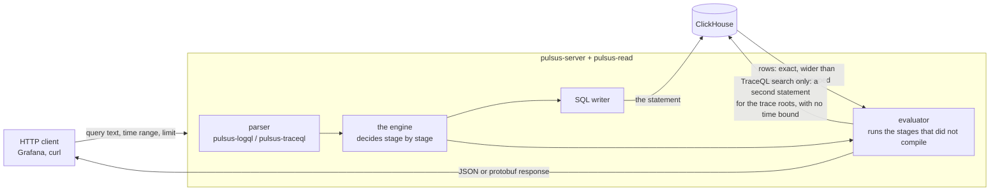
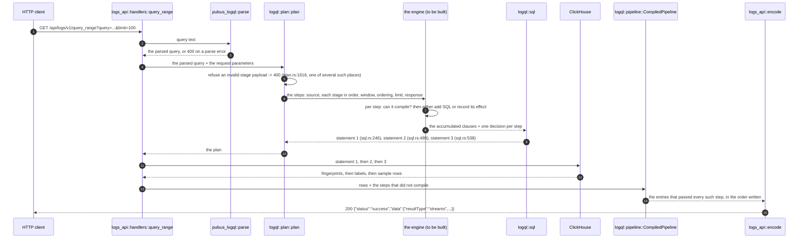
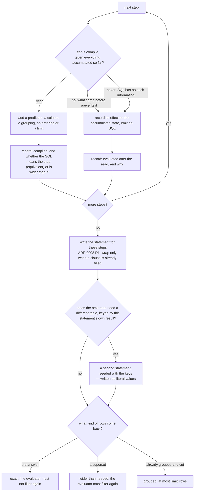
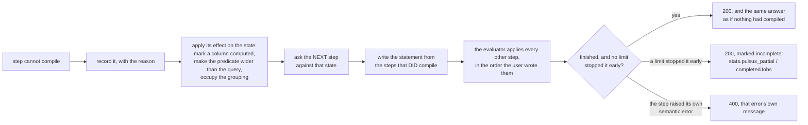
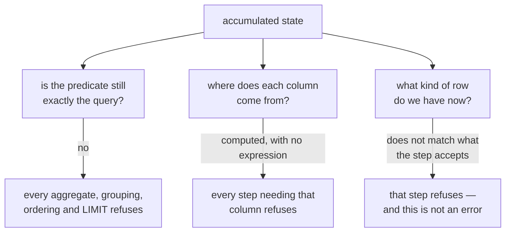
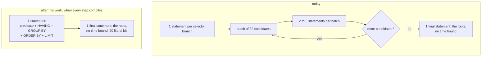
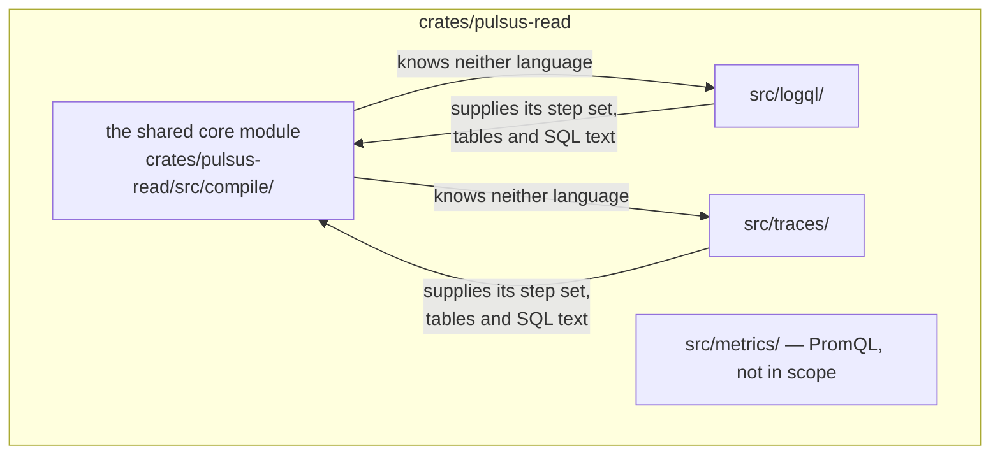

# Query to SQL

This document has four parts, in this order:

1. **[The SQL we send today](#1-the-sql-we-send-today)** — every stage of both query languages, and
   the exact statement text our shipped code produces for it now.
2. **[The SQL we will send](#2-the-sql-we-will-send)** — the same stages, with the statement text
   after this work. Where the design record fixes that text, part 2 quotes it; where it does not,
   part 2 **decides** it, and §2.7 sets out every such decision one stage at a time, with the clause
   the fragment lands in and what the database stops doing because of it. §2.8 and §2.9 work
   fourteen LogQL and eight TraceQL complete pipelines end to end. Read part 2 against part 1 and
   the difference is the work.
3. **[How it is built](#3-how-it-is-built)** — diagrams, and as few words as they need.
4. **[The specification](#4-the-specification)** — input queries paired with the SQL each one must
   produce, and the answer each one must return. This part is the deliverable: it is what a person
   writing the code builds against and what a person reviewing it checks against.

Three shorter parts follow: [what can never become SQL](#5-what-can-never-become-sql), [the queries
we already refuse](#6-the-queries-we-already-refuse), [where we and the reference disagree](#7-where-we-and-the-reference-disagree),
and [the limits](#8-the-limits).

**The code in part 2 does not exist yet.** Nothing in this tree makes the per-stage decision part 2
describes, so every statement marked *from the design* was worked out from the design record and
**was not produced by our code**. That sentence applies to every such block in the document and is
not repeated at each one.

**Statements marked *decided here* were run.** They are this document's own decisions, and each was
executed against `clickhouse/clickhouse-server:26.3`, server version 26.3.17.110, over the corpus of
part 4.1 loaded into tables built from `crates/pulsus-schema/src/catalog.rs`. That establishes that
the text parses, executes and returns what the entry says it returns. It does **not** establish that
our code will produce that text, because the code does not exist — the same limit as *from the
design*, and part 9 states it once.

## Words used here

Defined once, at first use, and used in only that sense afterwards.

| word | what it means here |
|---|---|
| **stage** | one step a user writes after the selector, separated by `\|` — `\| json`, `\|= "text"`, `\| level="error"`. Both query languages call these stages |
| **selector** | the part in braces that chooses which streams or spans are read: `{service_name="checkout"}`, `{ .service.namespace = "prod" }` |
| **compiles to SQL** | the stage becomes part of the statement we send to ClickHouse, so ClickHouse does that work |
| **evaluated after the read** | the stage does not become SQL; `pulsus-server` does that work itself, over the rows ClickHouse sent back |
| **the engine** | the code that decides, stage by stage, which of those two happens |
| **the walk** | the engine's single pass over the steps, left to right. It never stops early: a step that cannot become SQL is skipped and the next one is asked anyway |
| **candidate trace** | a trace whose id came back from the first statement and which may or may not satisfy the whole query. TraceQL reads candidates in groups of 32, and this document calls one group a **batch** |
| **root span** | the span of a trace that has no parent; if a trace has none, the earliest span |
| **bucket**, **grid** | a metric query returns one value per step-sized interval. Each interval is a bucket, and the sequence of them is the grid |
| **fingerprint** | the 64-bit number identifying one label set. A LogQL read resolves the selector to a list of these first, and every later statement filters on that list |
| **granule** | ClickHouse's unit of reading: 8,192 rows. The smallest run of rows a query can skip without reading it. Fewer granules read is less work |
| **primary key**, **prefix** | the `ORDER BY` a ClickHouse table is declared with. Its leading columns are its prefix. A predicate on the prefix lets ClickHouse skip granules; a predicate on any other column does not |
| **`PREWHERE`** | a ClickHouse clause read before the rest of the row. A row that fails it is never read past the columns the clause names |
| **semi-join** | `(trace_id, span_id) IN (SELECT trace_id, span_id FROM …)` — keeps rows whose key appears in the inner statement, and adds no columns |
| **structured metadata** | key/value pairs stored beside a log line, in the `structured_metadata` column of `log_samples` |
| **rollup table** | a pre-aggregated table. `log_metrics_5s` holds per-fingerprint line counts and byte totals in 5-second buckets, not individual lines |
| **exact rows** | the rows ClickHouse returns are the answer. `pulsus-server` must not filter them again |
| **wider-than-needed rows** | the rows ClickHouse returns include some the answer excludes. `pulsus-server` must filter them again |
| **grouped rows** | the rows ClickHouse returns are already grouped, ordered and cut to the requested limit |

## How to read a SQL cell

Every cell in parts 1 and 2 that shows SQL, or describes a change of state where a stage produces
no SQL, carries one of these markings.

| marking | meaning |
|---|---|
| *emitted today* | our shipped code produces this text now. Cited to the function that produces it |
| *from the design* | worked out from the design record `docs/query-lowering.md`. No code produces it |
| *decided here* | the design settles that the stage can compile to SQL and does not fix the text, so **this document fixes it**. Every such cell names what the decision rests on, and every SQL text so marked was executed against ClickHouse 26.3 — see part 2.7 |
| *cannot become SQL* | no correct SQL exists for it, and the reason is given in the cell. Distinct from *never becomes SQL* only in that part 5 collects the latter; the two mean the same thing |
| *evaluated after the read* | the stage always runs in `pulsus-server` |
| *never becomes SQL* | SQL cannot have the information. Part 5 gives the reason for each |
| *already compiled in full* | the TraceQL metrics routes compile the whole query, filter and aggregation alike. These stages are not part of the search route at all |

Placeholders used in statement text: `<fps>` is the resolved fingerprint list, `<start>` and `<end>`
are the request window bounds in nanoseconds, `<step>` is the request step in nanoseconds.

---

## 1. The SQL we send today

### 1.1 The statements a LogQL request produces

Nine builder functions produce every LogQL statement. All are in
`crates/pulsus-read/src/logql/sql.rs`.

| builder | line | what it reads | when it is used |
|---|---|---|---|
| `stage1` | `sql.rs:246` | `log_streams_idx` | every LogQL read. Resolves the selector to fingerprints |
| `stage2` | `sql.rs:489` | `log_streams` | every LogQL read. Fetches each fingerprint's service and label set |
| `stage3` | `sql.rs:538` | `log_samples` | a log query whose every stage either compiles to SQL or drops no lines. One statement, with `LIMIT` |
| `stage3_keyset` | `sql.rs:625` | `log_samples` | a log query with a stage that drops lines after the read. One statement **per page**, each resuming from the previous page's last sort key |
| `metric_instant` | `sql.rs:849` | `log_samples` | an instant metric query with no stage beyond a line filter |
| `metric_range` | `sql.rs:800` | `log_metrics_<res>` | **no production caller reaches it** — see the note below |
| `metric_raw_samples` | `sql.rs:948` | `log_samples` | an instant metric query that must be aggregated in `pulsus-server` |
| `metric_raw_samples_sliding` | `sql.rs:996` | `log_samples` | **every** range metric query |
| `probe` | `sql.rs:283` | `log_streams_idx` | only when the selector contains a regex matcher: a `count()` on one key's index prefix, to order the matchers cheapest-first |

The three statements a plain log query produces, in order. Text from `sql.rs:246`, `:489` and `:538`;
the values are those of part 4's corpus.

```sql
-- emitted today, sql.rs:246 — resolve the selector to fingerprints
SELECT fingerprint
FROM log_streams_idx
WHERE month = '2026-09-01'
  AND ((key = 'service_name' AND val = 'checkout'))
GROUP BY fingerprint
HAVING uniqExact(key, val) = 1
```

```sql
-- emitted today, sql.rs:489 — fetch each fingerprint's service and label set
SELECT fingerprint, service, labels FROM log_streams WHERE fingerprint IN (18374, 99120)
```

```sql
-- emitted today, sql.rs:538 — read the lines. One statement, with the request limit.
SELECT fingerprint, timestamp_ns, body, structured_metadata
FROM log_samples
PREWHERE service = 'checkout'
WHERE fingerprint IN (18374, 99120)
  AND timestamp_ns > <start> AND timestamp_ns <= <end>
  AND body LIKE '%CONN\\_REFUSED%'
ORDER BY timestamp_ns DESC, fingerprint DESC, cityHash64(body) DESC, body DESC
LIMIT 100
```

When any stage drops lines after the read, that third statement is replaced by a loop over this one,
each round resuming from the previous round's last sort key:

```sql
-- emitted today, sql.rs:625 — one page. The `LIMIT` is the request limit times
-- `reader.logql_pipeline_scan_factor`, so that after the dropping stage has run
-- the response can still hold `limit` entries.
SELECT fingerprint, timestamp_ns, body, cityHash64(body) AS body_hash, structured_metadata
FROM log_samples
PREWHERE service = 'checkout'
WHERE fingerprint IN (18374, 99120)
  AND timestamp_ns > <start> AND timestamp_ns <= <end>
ORDER BY timestamp_ns DESC, fingerprint DESC, body_hash DESC, body DESC
LIMIT 1000
```

A metric query produces one of two statements. An instant query is aggregated by ClickHouse:

```sql
-- emitted today, sql.rs:849 — the only LogQL metric form that aggregates in ClickHouse
SELECT fingerprint, count() AS n, structured_metadata
FROM log_samples
PREWHERE service = 'checkout'
WHERE fingerprint IN (18374, 99120) AND timestamp_ns > <start> AND timestamp_ns <= <end>
GROUP BY fingerprint, structured_metadata
```

A **range** query is not. Every one reads raw lines over the whole window, with no aggregation, no
bucket column and no `LIMIT`, and is aggregated in `pulsus-server`:

```sql
-- emitted today, sql.rs:996 — every range metric query, without exception
SELECT fingerprint, timestamp_ns, body, structured_metadata
FROM log_samples
PREWHERE service = 'checkout'
WHERE fingerprint IN (18374, 99120)
  AND timestamp_ns > <grid_start - range_ns> AND timestamp_ns <= <end>
ORDER BY service ASC, fingerprint ASC, timestamp_ns ASC
```

The `ORDER BY` there is the table's own primary key `(service, fingerprint, timestamp_ns)`, so
ClickHouse streams the rows and sorts nothing (`sql.rs:973-985`).

**`metric_range` is unreachable from a request.** It renders
`intDiv(bucket_ns, <step>) * <step> AS step` over a rollup table, but reaching it needs the routing
decision `RouteChoice::Rollup`, and that arm requires a range query (`plan.rs:2022`), while `let client = if … || is_range`
(`plan.rs:1826`) forces every range query onto the client-aggregated path first. The function is
kept and tested; no request reaches it. The same argument makes `MetricShape::RollupCount` and
`MetricShape::RollupBytes` — `sum(count)` and `sum(bytes)`, `sql.rs:105`, `sql.rs:107` — unreachable
text.

### 1.2 LogQL — the ten stage kinds

`Stage` has exactly ten variants (`crates/pulsus-logql/src/ast.rs:133`); `Parser` has four of its
own (`ast.rs:237`, `:242`, `:248`, `:251`), listed separately below.

Two functions decide everything in this table. `compile_line_filters` (`plan.rs:3052`) walks the
stages and collects the ones that become predicates on `body`. `has_unpushed_dropping_stage`
(`plan.rs:1655`) decides whether the read is one statement or a page loop.

| stage as written | SQL emitted today | marking and source |
|---|---|---|
| `\|= "text"` | `body LIKE '%text%'` | *emitted today*, `predicate.rs:538` via `escape.rs:93`. `%`, `_` and `\` inside the search text are escaped so they match themselves |
| `!= "text"` | `NOT (body LIKE '%text%')` | *emitted today*, `predicate.rs:521` |
| `\|~ "re"` | `match(body, 're')` | *emitted today*, `predicate.rs:542`. Not anchored: a LogQL line filter searches for a substring |
| `!~ "re"` | `NOT (match(body, 're'))` | *emitted today*, `predicate.rs:521` |
| `\|= "a" or "b"` | `((body LIKE '%a%') OR (body LIKE '%b%'))` | *emitted today*, `predicate.rs:500`. A filter with one value is not wrapped, so its text is unchanged |
| `\|= ip("10.0.0.0/8")` | none | *never becomes SQL*. `is_pushable_line_filter` returns `false` (`plan.rs:3086`), the stage is skipped, and **the walk continues** — a later literal filter still compiles |
| `\| json` | none | *evaluated after the read*. `metric_pipeline_construct` returns `"json"` (`plan.rs:1688`) |
| `\| logfmt` | none | *evaluated after the read*, `plan.rs:1689` |
| `\| regexp "…"` | none | *evaluated after the read*, `plan.rs:1690` |
| `\| pattern "…"` | none | *evaluated after the read*, `plan.rs:1691` |
| `\| level="error"` | none | *evaluated after the read*, `plan.rs:1692`. Also makes `has_unpushed_dropping_stage` return `true` (`plan.rs:1664`), which turns the read into a page loop |
| `\| line_format "…"` | none | *evaluated after the read*, `plan.rs:1693`. **Ends the line-filter walk** (`plan.rs:3067`), so every line filter after it is evaluated after the read too |
| `\| label_format k="…"` | none | *evaluated after the read*, `plan.rs:1694` |
| `\| unwrap x` | none | *evaluated after the read*, `plan.rs:1695`. In a bare log query it is a `400` — see part 6 |
| `\| unpack` | none | *evaluated after the read*, `plan.rs:1696`. Ends the line-filter walk, `plan.rs:3067` |
| `\| decolorize` | none | *evaluated after the read*, `plan.rs:1697`. Ends the line-filter walk, `plan.rs:3067` |
| `\| drop a, b` | none | *evaluated after the read*, `plan.rs:1698` |
| `\| keep a` | none | *evaluated after the read*, `plan.rs:1699` |

**Only line filters compile to SQL today.** Every one of the other nine stage kinds is evaluated
after the read, without exception, on every LogQL route.

### 1.3 LogQL — the parts that are not stages

The window, the aggregation levels, the ordering, the limit and the response are not `Stage`
variants. They are fields of `LogRange` (`ast.rs:2301`) and `MetricExpr` (`ast.rs:939`), or they
come from the request.

| part | SQL emitted today | marking and source |
|---|---|---|
| the `[5m]` window | `timestamp_ns > <grid_start - 5m> AND timestamp_ns <= <end>` | *emitted today*, `sql.rs:1010-1011`. The window widens to cover the first grid point; there is **no bucket column at all** |
| `count_over_time`, instant | `count()` | *emitted today*, `sql.rs:109`, through `metric_instant` (`sql.rs:849`) |
| `bytes_over_time`, instant | `sum(length(body))` | *emitted today*, `sql.rs:111` |
| `count_over_time`, range | none | *evaluated after the read*. Every range metric query reads raw lines and is aggregated in `pulsus-server` (`plan.rs:1826`) |
| any `_over_time` with `\| unwrap` | none | *evaluated after the read*, `plan.rs:1695` |
| `absent_over_time` | none | *never becomes SQL*. The answer is a statement about rows that are **absent**, so there is no row to compute it from |
| `sum by (level) (…)` | none | *evaluated after the read*. `grouping.is_some()` forces the client path (`plan.rs:1827`) |
| `topk(3, …)` | none | *evaluated after the read* |
| `label_replace(…)` | none | *evaluated after the read* |
| ordering, log query | `ORDER BY timestamp_ns DESC, fingerprint DESC, cityHash64(body) DESC, body DESC` | *emitted today*, `sql.rs:563`. All four columns follow the request direction. The four-column key is what makes rows that share a timestamp come back in the same order every run |
| ordering, range metric query | `ORDER BY service ASC, fingerprint ASC, timestamp_ns ASC` | *emitted today*, `sql.rs:1017`. This is the table's own primary key, so ClickHouse streams the rows and sorts nothing |
| `limit=100`, log query | `LIMIT 100` | *emitted today*, `sql.rs:538`. Present only when no stage drops lines after the read; otherwise the page loop asks for `limit × reader.logql_pipeline_scan_factor` rows a page (`plan.rs:1626`) |
| limit, metric query | none | *emitted today* — deliberately no `LIMIT`: an aggregation must see every matching line or stop on the byte budget, never silently cut (`metric_raw_samples_sliding`, `sql.rs:996-1019`, appends none) |
| the response | none | *evaluated after the read* |

### 1.4 TraceQL — the statements a search request produces

Eight builder functions, all in `crates/pulsus-read/src/traces/search_sql.rs`. A search issues one
statement per selector branch, then **two to five statements per batch of 32 candidate traces**
(`exec.rs:114`), then one final statement.

| builder | line | what it reads | when it is used |
|---|---|---|---|
| `generator_sql` | `search_sql.rs:153` | `trace_attrs_idx` or `trace_spans` | once per selector branch, before any batch |
| `hydration_sql` | `search_sql.rs:194` | `trace_spans` | once per batch. Reads the spans of the batch's traces |
| `membership_sql` | `search_sql.rs:222` | `trace_attrs_idx` | once per batch per attribute condition |
| `attr_values_sql` | `search_sql.rs:242` | `trace_attrs_idx` | once per batch per attribute the query aggregates, groups by or selects |
| `event_set_sql` | `search_sql.rs:314` | `trace_attrs_idx` | once per batch, for a span-event or span-link intrinsic |
| `trace_ctx_sql` | `search_sql.rs:385` | `trace_spans` | once per batch, only if the query names `traceDuration`, `rootName` or `rootServiceName`. **No time bound** |
| `child_count_sql` | `search_sql.rs:409` | `trace_spans` | once per batch, only if the query names `span:childCount`. **No time bound** |
| `root_sql` | `search_sql.rs:345` | `trace_spans` | once, at the end, over the traces that won. **No time bound** |

The first statement of a selector-only search, byte-exact from
`crates/pulsus-read/tests/golden/traces_search/unscoped_attr.sql`:

```sql
-- emitted today, search_sql.rs:153; query { .k = "v" }
SELECT trace_id, max(timestamp_ns) AS bound_ts
FROM trace_attrs_idx
WHERE date >= toDate('2023-11-14') AND date <= toDate('2023-11-15')
  AND timestamp_ns > 1700000000000000000 AND timestamp_ns <= 1700010800000000000
  AND (key = 'k' AND val = 'v')
GROUP BY trace_id
ORDER BY bound_ts DESC, trace_id ASC
LIMIT 100001
```

`bound_ts` is the newest timestamp among the spans that matched this one condition. It is an upper
bound on the trace's final sort key, which is what lets the engine stop early. The `+ 1` on the
limit is how the engine tells "exactly 100,000" from "more than 100,000".

### 1.5 TraceQL — the seven stage kinds, and the selector

`PipelineStage` has exactly seven variants (`crates/pulsus-traceql/src/ast.rs:981`). The selector
is not a stage; it is `SpansetExpr` (`ast.rs:99`).

| written as | SQL emitted today | marking and source |
|---|---|---|
| `{ .k = "v" }` | `key = 'k' AND val = 'v'` over `trace_attrs_idx` | *emitted today*, `search_sql.rs:153`. An unscoped attribute adds **no** `scope` term (`filter.rs:827`, `AttrScope::Unscoped => None`) |
| `{ resource.service.name = "checkout" }` | `PREWHERE service = 'checkout'` over `trace_spans` | *emitted today*, golden `count_pipeline.sql`. This one attribute is a physical column, so it reads the span table directly |
| `{ span.http.status_code >= 500 }` | `key = 'http.status_code' AND val_num >= 500 AND scope = 'span'` | *emitted today*, golden `val_num_range.sql`. Skips granules on the `key` prefix only: `val_num` is not part of `ORDER BY (key, val, scope, timestamp_ns, trace_id, span_id)` (`catalog.rs:382`) |
| `{ resource.service.name =~ "check.*" }` | `key = 'service.name' AND match(val, '^(?:check.*)$') AND scope = 'resource'` | *emitted today*, golden `service_regex.sql`. Anchored, unlike a LogQL line filter |
| `{ .a != nil }` | `key = 'a' AND 1` | *emitted today*, golden `existence_present.sql`. `ValuePred::KeyExists` renders the constant `1` (`filter.rs:817`), leaving a pure `key` prefix scan |
| `{ .env != "prod" }` | the **positive** form `(key = 'env' AND val = 'prod')` as a membership read; the first statement has no predicate at all | *emitted today*, golden `negated_attr.sql`. The negation is applied after the read, against the set of spans that matched the positive form |
| `{ a && b }` | one statement for **one** of the two conditions | *emitted today*, golden `nested_boolean.sql`: `{ (.a="1" \|\| .b="2") && (.c="3" \|\| .d="4") }` produces two statements, for `a` and `b` only. `c` and `d` are applied after the read |
| `{ a \|\| b }` | **two statements**, one per side, merged in `pulsus-server` | *emitted today*, golden `mixed_or.sql`. Not one `OR` predicate |
| `{ duration > 2s }` | `duration_ns > 2000000000` over `trace_spans` | *emitted today*, golden `mixed_or.sql` first statement |
| `{ nestedSetParent < 0 }` | none — the statement has no predicate | *emitted today*, golden `nested_set_root.sql`. On the **search** route the root test is evaluated after the read, even though the metrics route compiles it |
| `{ traceDuration > 2s }` | none, plus one extra statement per batch reading each trace's full time span with **no time bound** | *emitted today*, golden `trace_duration.sql` |
| `{ span:childCount > 2 }` | none, plus one extra statement per batch counting children with **no time bound** | *emitted today*, golden `child_count.sql` |
| `{ a } > { b }` and every other structural relation | none — one statement per side, both applied after the read | *emitted today*, golden `structural_child.sql` |
| `\| max(duration) > 1s` | none | *evaluated after the read*. `search_plan.rs:1218` records it; `search_eval.rs:2420` is the only code that reads it. Golden `count_pipeline.sql` shows no `HAVING` |
| `\| count() > 2` | none | *evaluated after the read*, golden `count_pipeline.sql` |
| `\| by(span.foo)` | none — but it adds a per-batch statement reading `foo`'s value for every candidate span | *evaluated after the read*, golden `spanset_by_attr.sql` shows the value read and **no** `GROUP BY` |
| `\| coalesce()` | none | *evaluated after the read*, golden `spanset_coalesce.sql` is byte-identical to the plain selector case |
| `\| select(.foo)` | none — adds a per-batch value read | *evaluated after the read*, golden `spanset_by_attr.sql` second value statement |
| `\| rate()`, `\| quantile_over_time(…)`, `compare(…)` | *already compiled in full* on the metrics routes | `metrics_sql.rs:90`. On the **search** route they are refused with `400` (`search_plan.rs:1228`, `:1235`, `:1241`) |
| ordering | `ORDER BY bound_ts DESC, trace_id ASC` on each first statement only | *emitted today*, `search_sql.rs:182`. The final ordering across statements is done in `pulsus-server` |
| `limit=20` | `LIMIT 100001` on each first statement — the candidate ceiling, not the request limit | *emitted today*, `search_sql.rs:183`. The request limit is applied after the read |
| the response | none | *never becomes SQL*. Part 5 gives the reason |

### 1.6 TraceQL — the metrics routes, which already compile everything

`/api/traces/v1/metrics/query_range` and `/api/traces/v1/metrics/query` compile the whole query.
Byte-exact from `crates/pulsus-read/tests/golden/traces_metrics/`.

```sql
-- emitted today, metrics_sql.rs:528; query { span.http.status_code >= 500 } | rate()
-- golden traces_metrics/attr_semi_join.sql
SELECT toUnixTimestamp64Milli(toStartOfInterval(fromUnixTimestamp64Nano(timestamp_ns), INTERVAL 60000 MILLISECOND)) AS t,
       uniqExact(trace_id, span_id) AS n
FROM trace_spans
WHERE timestamp_ns >= 1699999980000000000 AND timestamp_ns < 1700010840000000000
  AND (trace_id, span_id) IN (SELECT trace_id, span_id FROM trace_attrs_idx WHERE date >= toDate('2023-11-14') AND date <= toDate('2023-11-15') AND timestamp_ns >= 1699999980000000000 AND timestamp_ns < 1700010840000000000 AND key = 'http.status_code' AND val_num >= 500 AND scope = 'span')
GROUP BY t
ORDER BY t ASC
```

```sql
-- emitted today, metrics_sql.rs:676; query { span.http.status_code >= 500 } | sum_over_time(duration)
-- golden traces_metrics/sum_over_time_duration.sql
SELECT t, toFloat64(sum(val)) AS v
FROM (
  SELECT toUnixTimestamp64Milli(toStartOfInterval(fromUnixTimestamp64Nano(timestamp_ns), INTERVAL 60000 MILLISECOND)) AS t, trace_id, span_id,
         any(duration_ns) AS val
  FROM trace_spans
  WHERE timestamp_ns >= 1699999980000000000 AND timestamp_ns < 1700010840000000000
    AND (trace_id, span_id) IN (SELECT trace_id, span_id FROM trace_attrs_idx WHERE date >= toDate('2023-11-14') AND date <= toDate('2023-11-15') AND timestamp_ns >= 1699999980000000000 AND timestamp_ns < 1700010840000000000 AND key = 'http.status_code' AND val_num >= 500 AND scope = 'span')
  GROUP BY t, trace_id, span_id
)
GROUP BY t
ORDER BY t ASC
```

```sql
-- emitted today, metrics_sql.rs:528; query { duration > 1s } | rate() by(resource.service.name)
-- golden traces_metrics/rate_by_service.sql
SELECT toUnixTimestamp64Milli(toStartOfInterval(fromUnixTimestamp64Nano(timestamp_ns), INTERVAL 60000 MILLISECOND)) AS t, service AS g0,
       uniqExact(trace_id, span_id) AS n
FROM trace_spans
WHERE timestamp_ns >= 1699999980000000000 AND timestamp_ns < 1700010840000000000
  AND duration_ns > 1000000000
GROUP BY t, g0
ORDER BY t ASC, g0
```

```sql
-- emitted today, metrics_sql.rs:750; query {} | quantile_over_time(duration, 0.5, 0.9, 0.99)
-- golden traces_metrics/quantile_over_time_multi.sql
SELECT t, CAST(quantilesTDigest(0.5, 0.9, 0.99)(val) AS Array(Float64)) AS qs
FROM (
  SELECT toUnixTimestamp64Milli(toStartOfInterval(fromUnixTimestamp64Nano(timestamp_ns), INTERVAL 60000 MILLISECOND)) AS t, trace_id, span_id,
         any(duration_ns) AS val
  FROM trace_spans
  WHERE timestamp_ns >= 1699999980000000000 AND timestamp_ns < 1700010840000000000
  GROUP BY t, trace_id, span_id
)
GROUP BY t
ORDER BY t ASC
```

```sql
-- emitted today, metrics_sql.rs:833; query { span.http.status_code >= 500 } | histogram_over_time(duration)
-- golden traces_metrics/histogram_over_time_duration.sql
SELECT t, toUInt64(roundToExp2(val - 1)) * 2 AS bucket, count() AS n
FROM (
  SELECT toUnixTimestamp64Milli(toStartOfInterval(fromUnixTimestamp64Nano(timestamp_ns), INTERVAL 60000 MILLISECOND)) AS t, trace_id, span_id,
         any(duration_ns) AS val
  FROM trace_spans
  WHERE timestamp_ns >= 1699999980000000000 AND timestamp_ns < 1700010840000000000
    AND (trace_id, span_id) IN (SELECT trace_id, span_id FROM trace_attrs_idx WHERE date >= toDate('2023-11-14') AND date <= toDate('2023-11-15') AND timestamp_ns >= 1699999980000000000 AND timestamp_ns < 1700010840000000000 AND key = 'http.status_code' AND val_num >= 500 AND scope = 'span')
  GROUP BY t, trace_id, span_id
)
WHERE val >= 2
GROUP BY t, bucket
ORDER BY t ASC, bucket ASC
```

```sql
-- emitted today, metrics_sql.rs:414; query { nestedSetParent < 0 } | rate()
-- golden traces_metrics/nested_set_root_rate.sql
SELECT toUnixTimestamp64Milli(toStartOfInterval(fromUnixTimestamp64Nano(timestamp_ns), INTERVAL 60000 MILLISECOND)) AS t,
       uniqExact(trace_id, span_id) AS n
FROM trace_spans
WHERE timestamp_ns >= 1699999980000000000 AND timestamp_ns < 1700010840000000000
  AND parent_id = toFixedString(unhex('0000000000000000'), 8)
GROUP BY t
ORDER BY t ASC
```

**The two routes bound the window in opposite directions, deliberately.** Search uses
`timestamp_ns > start AND timestamp_ns <= end` (`search_sql.rs:111-113`); metrics uses
`timestamp_ns >= start AND timestamp_ns < end` (`metrics_sql.rs:68`). A span whose timestamp equals
`start` is counted by the metrics route and not by the search route.

---

## 2. The SQL we will send

Same stages, same order and same table columns as part 1, so the two can be read side by side. **A
few rows are here that are not in part 1**, because a stage the shipped code treats as one thing
splits into two or three once it can become SQL: `| label_format` splits into a rename, a constant
and a template; `| unwrap` splits into the plain form and the two conversion forms; `| drop` splits
on whether it carries a value matcher; and `| __error__=""` is called out from the label-filter row
because it is the filter every metric query over a parser needs. The source for every row is either
the design record `docs/query-lowering.md`, which passed review at round 15, or this document — and
the marking says which.

**Where the design settles that a stage can become SQL but does not fix the text, this document
fixes it and marks the cell *decided here*.** The design assigns every SQL fragment — predicates,
column expressions, escaping, regular-expression handling, time-bucket expressions — to
per-language work rather than to the shared core (`docs/query-lowering.md:829-830`). This part is
that work for the two languages. Each decision rests on three things and says which: the table
schema in `crates/pulsus-schema/src/catalog.rs`, what the shipped builders already emit, and what
ClickHouse 26.3 does when the expression is executed — the version floor is 26.3
(`crates/pulsus-schema/src/controller.rs:57`).

**Part 2.7 is where the decisions are set out in full**, one row per stage kind, with the clause the
fragment lands in and what the database stops doing because of it. Parts 2.8 and 2.9 work fourteen
LogQL and eight TraceQL complete pipelines end to end. The tables immediately below are the summary;
read them against part 1 and the difference is the work.

**Four things cannot become SQL and are marked so rather than left open**: the general form of
`| line_format` and of `| label_format`, both Go text/templates; `| unwrap duration(x)` and
`| unwrap bytes(x)`; and grouping a metric query by a name a parser produced. Each cell gives the
reason.

### 2.1 The two rules that decide most rows

**Rule A — a predicate may be wider than the query, never narrower.** Compiling a boolean expression to SQL
returns a pair: the SQL, and a flag saying whether the SQL means exactly what the expression means
(`docs/query-lowering.md:295-305`).

| the expression | the SQL | means exactly the same |
|---|---|---|
| one condition that can become SQL | its predicate | yes |
| one condition that cannot | the constant `1` | no |
| `a AND b` | `sql_a AND sql_b` | only if both do |
| `a OR b` | `sql_a OR sql_b` | only if both do |
| `NOT a`, where `a` means exactly the same | `NOT sql_a` | yes |
| `NOT a`, where `a` does not | the constant `1` | no |

Dropping one side of an `AND` is safe: the result is still a set at least as wide as the query needs.
Dropping one side of an `OR` is not: it would give a set narrower than the query needs and lose rows.
Negating a set that is too wide gives one that is too narrow, which is why `NOT` refuses unless its
operand meant exactly what it said.

**Rule B — an aggregate over a wider-than-needed set is wrong.** More filters can always be pushed;
the result stays a superset. But `max()` over a superset can return a value above the true maximum,
and `count()` a number above the true count. So every aggregate, every grouping, every ordering and
every `LIMIT` refuses unless the predicate so far means exactly what the query means.

### 2.2 LogQL — the ten stage kinds

| stage as written | SQL after this work | marking and source |
|---|---|---|
| `\|= "text"` | `body LIKE '%text%'` | *emitted today*, unchanged. Now also compiles **after** `\| decolorize` and `\| unpack`, against the rewritten expression |
| `!= "text"` | `NOT (body LIKE '%text%')` | *emitted today*, unchanged |
| `\|~ "re"` | `match(body, 're')` | *emitted today*, unchanged |
| `!~ "re"` | `NOT (match(body, 're'))` | *emitted today*, unchanged |
| `\|= "a" or "b"` | `((body LIKE '%a%') OR (body LIKE '%b%'))` | *emitted today*, unchanged |
| `\|= ip("10.0.0.0/8")` | none | *never becomes SQL*, `docs/query-lowering.md:1043`. Unchanged: the walk skips it and continues |
| `\| json` | none of its own; a later reference to name `k` compiles against `JSONExtractString(body, 'k')` | **decided here**, §2.7.1. The design widens the known column set through an *open source* over `body` — a source whose member names are not known until a row is read — and records that its `resolve` answers `None` (`docs/query-lowering.md:1044`). This document gives it an answer. A parser adds no predicate of its own; what it adds is the expression a later stage compiles against, and today's flattening and malformed-input rules (`pipeline.rs:4725`) and the collision renaming (`labels.rs:363`) are what the guards in §2.7.0 are for |
| `\| logfmt` | none of its own; `k` compiles against `extractKeyValuePairs(body, '=', ' \t\r\n', '"')['k']` | **decided here**, §2.7.1 |
| `\| regexp "re"` | none of its own; the *n*-th capture group compiles against `extractGroups(body, '(?-s)re')[n]` | **decided here**, §2.7.1. The `(?-s)` prefix is required and was measured: ClickHouse compiles the pattern with RE2's dot-matches-newline option on and the reference does not |
| `\| pattern "p"` | none of its own; capture `<name>` compiles against `extractGroups(body, '<p as a regular expression>')[n]` | **decided here**, §2.7.1, from the reference's own matcher (`pkg/logql/log/pattern/pattern.go:66-116` @ `v3.7.4`) |
| `\| level="error"` | `(JSONType(body, 'level') != 'String' OR JSONExtractString(body, 'level') = 'error' OR structured_metadata != '')` | **decided here**, §2.7.1 and §2.7.0. Wider than the query on purpose: the two extra terms keep every line SQL cannot decide, and `pulsus-server` removes them. Worked in §2.8's LogQL45 |
| `\| status >= 500` | `(JSONType(body, 'status') NOT IN ('Int64', 'UInt64', 'Double') OR JSONExtractFloat(body, 'status') >= 500 OR structured_metadata != '')` | **decided here**, §2.7.1. `JSONExtractFloat`, not a text comparison, because the reference converts the label text to a float before comparing. Worked in §2.8's LogQL46 |
| `\| trace_id="740e…"` | `JSONExtractString(structured_metadata, 'trace_id') = '740e…'` | **decided here**, §2.7.1. No guards: `structured_metadata` is a stored column holding a flat JSON object of text keys to text values written by our own encoder (`labels.rs:157-189`), so the extraction is the label |
| `\| __error__=""` after a parser | `match(body, '^[ \t\r\n]*\\{')` | **decided here**, §2.7.1. `JSONType(body) = 'Object'` would be wrong — measured, it answers `Null` for `{"a":1}trailing`, which our prefix parser accepts (`pipeline.rs:4692-4694`) |
| `\| line_format "…"` | none | *evaluated after the read*, `docs/query-lowering.md:1049`. A Go text/template with control flow has no SQL form. It marks the line computed **with no expression**, so every later stage that needs the line is evaluated after the read too. It removes no lines, so it does not by itself make the predicate wider than the query |
| `\| label_format dst=src` | none; `dst` compiles against whatever `src` compiled against, and `src` stops resolving | **decided here**, §2.7.1. A rename moves an entry in the name table and leaves no trace in the SQL. Worked in §2.8's LogQL51 |
| `\| label_format dst="text"` | none; `dst` compiles against the literal `'text'` | **decided here**. A later filter on `dst` compares two constants, which ClickHouse folds before reading a row |
| `\| label_format dst="{{…}}"` | | **cannot become SQL.** A Go text/template with conditionals, ranges and function calls, the same reason as `\| line_format` |
| `\| unwrap x` | the sample value becomes the column expression that `x` compiles against — `JSONExtractFloat(body, 'x')` after `\| json` | *from the design*, `docs/query-lowering.md:1051`; the expression **decided here**, §2.7.1 |
| `\| unwrap duration(x)`, `\| unwrap bytes(x)` | | **cannot become SQL.** The conversion parses a duration such as `1h30m` or a size such as `4KiB`; ClickHouse has no function for either, and a hand-built expression over the unit tables (`pipeline.rs:2890`, `:3002`) would be a second implementation of a parser whose agreement with the first cannot be established by reading it. A sample value feeds an aggregate, so rule B leaves no room for a wider-than-needed answer |
| `\| unpack` | `if(JSONHas(body,'_entry'), JSONExtractString(body,'_entry'), body)` | *from the design*, fixed at `docs/query-lowering.md:795`. A later line filter compiles against this expression |
| `\| decolorize` | `replaceRegexpAll(body, '\x1B\[[0-9;]*m', '')` | *from the design*, fixed at `docs/query-lowering.md:794`. **See part 7's last row:** the reference tests a following line filter against the **raw** line, and this expression would make us test the rewritten one |
| `\| drop a, b` | removes `a` and `b` from the known column set; contributes no SQL of its own | *from the design*, `docs/query-lowering.md:1054`. A later filter on a removed name is evaluated after the read; every other name is untouched, which is §2.8's LogQL50 |
| `\| drop level="info"` | none | **decided here.** The value matcher changes no SQL: the name stops resolving whatever the matcher says. Refusing to resolve a name is always safe — the stage that would have used it is evaluated after the read — and it avoids a predicate that would have to be right about a value nobody has parsed yet |
| `\| keep a` | restricts the known column set to `a` | *from the design*, `docs/query-lowering.md:1055`. Same payload type as `drop` (`Vec<DropKeepElem>`, `ast.rs:151`, `:154`), the complementary rule, and the same condition on a value matcher |

### 2.3 LogQL — the parts that are not stages

| part | SQL after this work | marking and source |
|---|---|---|
| the `[5m]` window | `<lo> + intDiv(timestamp_ns - <lo> + <step> - 1, <step>) * <step> AS bucket_ns`, where `<lo>` is `<grid_start> - <step>` | **decided here**, §2.7.2. It rounds **up** to the next grid point, which is what the reference's half-open interval `(g - range, g]` requires; a rounding-down expression is wrong, which is why §4.6's LogQL33 states the rule as four input/output pairs. Executed: all four come out right. Compiles only when the range is at most the step — see §2.7.2 |
| `count_over_time`, range | `count()` grouped by the bucket column | *from the design*, `docs/query-lowering.md:1062`. Conditional on the window compiling, on the predicate meaning exactly what the query means, and on `__error__` being either filtered out or carried in the grouping |
| `bytes_over_time`, range | `sum(length(body))` grouped by the bucket column | *from the design*, the same row |
| `sum_over_time(… \| unwrap x …)` | `sum(<the expression x resolves to>)` | *from the design*, `docs/query-lowering.md:1051` and `:1059`. Reachable only once `unwrap`'s column expression is determined |
| `absent_over_time` | none | *never becomes SQL*, `docs/query-lowering.md:1062` |
| `sum by (env) (…)`, `env` a stream label | `transform(fingerprint, [<fps>], [<env's value for each>], '') AS g0`, added to the `GROUP BY` | **decided here**, §2.7.2. The values come from the second statement, which has already read every selected stream's label set (`sql.rs:489`), so the group key is a lookup in a literal array — no extra read, no per-row parsing. Worked in §2.8's LogQL55 |
| `sum by (k) (…)`, `k` a structured-metadata key | `JSONExtractString(structured_metadata, 'k') AS g0` | **decided here**, §2.7.2 |
| `sum by (level) (…)`, `level` a parsed label | | **cannot become SQL.** A group key must reproduce the label's text exactly. No ClickHouse expression reproduces the parser's rendering of a JSON number: measured, `JSONExtractString('{"c":31.0}','c')` is `31`, and the reference's own captured answer for that corpus line is `dur_ms="31.0"` (§4.3's LogQL19). A filter may be wider than the query; a group key may not, because a wrong key is a wrong series name |
| `topk(3, …)` | `ORDER BY bucket_ns ASC, n DESC, g0 ASC` then `LIMIT 3 BY bucket_ns`, over the first level wrapped in a subquery | **decided here**, §2.7.2. `LIMIT n BY` is ClickHouse's own "n rows per group", so the second level is one more statement layer rather than a second read — ADR 0008 D1's wrap. Worked in §2.8's LogQL56, which has a genuine tie the reference breaks the same way |
| `label_replace(…)` | none | *evaluated after the read*, `docs/query-lowering.md:1064` and `:1064-1079`. Not for want of a SQL spelling of the rewrite: at range, label sets that collide after the rewrite merge into **one** series whose points repeat per grid timestamp, and a `GROUP BY` on the rewritten key gives one point per timestamp instead. Measured on the reference: the operand alone returns four series, the rewritten form returns one with four points at each of two timestamps (`crates/pulsus-read/tests/logqltest/corpus/b16_label_replace.test:252-262`). Because it removes series the SQL returned, it makes the predicate wider than the query |
| ordering | `ORDER BY timestamp_ns …, fingerprint …, cityHash64(body) …, body …` | *emitted today*, unchanged. Conditional on the ordering columns being in the projection |
| `limit=100` | `LIMIT 100` | *emitted today*. Conditional on an ordering being set **and** on the predicate meaning exactly what the query means. Over a wider-than-needed set the engine keeps today's behaviour and over-fetches instead |
| the response | none | *evaluated after the read*. Assembling streams and statistics is not a database operation |

### 2.4 TraceQL — the seven stage kinds, and the selector

| written as | SQL after this work | marking and source |
|---|---|---|
| `{ .k = "v" }` | `key = 'k' AND val = 'v'` | *emitted today*, unchanged |
| `{ span.http.status_code >= 500 }` | `key = 'http.status_code' AND val_num >= 500 AND scope = 'span'` | *emitted today*, unchanged |
| `{ a && b }` | `sql_a AND sql_b` in **one** statement | *from the design*, `docs/query-lowering.md:302`. A side that cannot become SQL contributes the constant `1`, so the conjunction keeps every row that side would have kept. **This is a change:** today the second conjunct of `{ (.a \|\| .b) && (.c \|\| .d) }` produces no SQL at all |
| `{ a \|\| b }` | `sql_a OR sql_b` in **one** statement, or the constant `1` if either side cannot | *from the design*, `docs/query-lowering.md:303`. **This is a change:** today each side is its own statement, merged in `pulsus-server` |
| `{ !a }` | `NOT sql_a`, only when `a` means exactly what it says; otherwise the constant `1` | *from the design*, `docs/query-lowering.md:304-305` |
| `{ .a != nil }` | `key = 'a' AND 1` | *emitted today*, unchanged |
| `{ nestedSetParent < 0 }` | `parent_id = toFixedString(unhex('0000000000000000'), 8)` | *from the design*, `docs/query-lowering.md:777`. The expression already exists on the metrics route (`metrics_sql.rs:414`); this work brings it to the search route |
| `\| max(duration) > 1s` | `HAVING max(duration_ns) > 1000000000` | *from the design*, `docs/query-lowering.md:608`. Three conditions, all required: the predicate so far means exactly what the query means, no grouping is set, and the rows so far are spans |
| `\| count() > 2` | `HAVING count() > 2` | *from the design*, the same three conditions |
| `\| by(name)` | `GROUP BY name` | *from the design*, `docs/query-lowering.md:609`. The same three conditions. After it, the rows are groups rather than spans |
| `\| coalesce()` after a `by()` | wraps the statement so far in a subquery and groups again | *from the design*, `docs/query-lowering.md:610` and ADR 0008 D1 |
| `\| coalesce()` with no preceding `by()` | none, and none is needed | *from the design*, `docs/query-lowering.md:611`. It is the identity |
| `\| select(.foo)` | a left join whose right side is `trace_attrs_idx` restricted to `key = 'foo'`, one value per span, projected as an extra column | **decided here**, §2.7.3. The alternative — widening the selector's own `key` predicate and picking the values apart with `anyIf` — was rejected on a measurement: it loses the `val` prune, and `key = 'service.namespace' AND val = 'prod'` reads 14 of 74 granules against 51 of 74 for `key IN ('service.namespace', 'foo')`. Worked in §2.9's TraceQL30. **A join is a clause ADR 0008 does not name** — part 10's open question 4 |
| `\| rate()`, `\| quantile_over_time(…)`, `compare(…)` | *already compiled in full* on the metrics routes | `metrics_sql.rs:90`. Still `400` on the search route (`search_plan.rs:1228`); this work does not change that |
| structural relations `>` `>>` `<` `<<` `~` | none | *never becomes SQL*, `docs/query-lowering.md:776`. Part 5 |
| `traceDuration`, `rootName`, `rootServiceName`, `span:childCount` | none | *never becomes SQL*, `docs/query-lowering.md:778`. Part 5 |
| ordering | `ORDER BY sort_key DESC, trace_id ASC` | *from the design*, `docs/query-lowering.md:616`. Refuses over a wider-than-needed set: the sort key is the newest matching span's timestamp, so a row the SQL should not have returned changes the order, not only the set |
| `limit=20` | `LIMIT 20` | *from the design*, `docs/query-lowering.md:617`. Requires an ordering to be set; since the ordering itself requires exactness, an inexact predicate refuses both |
| the response | none | *never becomes SQL*, `docs/query-lowering.md:780`. The trace's root summary is read across the whole trace with **no time bound**, because the true root may start before the search window, and `TraceSearchResult.root` is not optional (`exec.rs:385`). **So a compiled TraceQL search is two statements, not one** |

### 2.5 The one worked TraceQL query, before and after

`{ .service.namespace = "prod" } | max(duration) > 1s`, `limit=20`, five-day window.

**Today** — one first statement, then 554 rounds of two statements, then one final statement:

```sql
-- emitted today, search_sql.rs:153
SELECT trace_id, max(timestamp_ns) AS bound_ts
FROM trace_attrs_idx
WHERE date >= toDate('<d0>') AND date <= toDate('<d1>')
  AND timestamp_ns > <start> AND timestamp_ns <= <end>
  AND (key = 'service.namespace' AND val = 'prod')
GROUP BY trace_id
ORDER BY bound_ts DESC, trace_id ASC
LIMIT 100001
```

```sql
-- emitted today, search_sql.rs:194, once per batch of 32 candidates, 554 times, one after another
SELECT trace_id, span_id, parent_id,
       if(length(service) <= 8192, service, substringUTF8(service, 1, 2048)) AS service,
       if(length(name) <= 8192, name, substringUTF8(name, 1, 2048)) AS name,
       timestamp_ns, duration_ns, status_code,
       if(length(status_message) <= 8192, status_message, substringUTF8(status_message, 1, 2048)) AS status_message,
       kind,
       if(length(scope_name) <= 8192, scope_name, substringUTF8(scope_name, 1, 2048)) AS scope_name,
       if(length(scope_version) <= 8192, scope_version, substringUTF8(scope_version, 1, 2048)) AS scope_version
FROM trace_spans
WHERE trace_id IN (unhex('…'), … 32 of them)
  AND timestamp_ns > <start> AND timestamp_ns <= <end>
ORDER BY trace_id ASC, timestamp_ns ASC, span_id ASC
LIMIT 10001 BY trace_id
```

```sql
-- emitted today, search_sql.rs:222, the second statement of each of those 554 rounds
SELECT DISTINCT trace_id, span_id
FROM trace_attrs_idx
WHERE date >= toDate('<d0>') AND date <= toDate('<d1>')
  AND (key = 'service.namespace' AND val = 'prod')
  AND timestamp_ns > <start> AND timestamp_ns <= <end>
  AND trace_id IN (unhex('…'), … the same 32)
```

```sql
-- emitted today, search_sql.rs:345, once at the end. No time bound.
SELECT trace_id, span_id, parent_id,
       if(length(service) <= 8192, service, substringUTF8(service, 1, 2048)) AS service,
       if(length(name) <= 8192, name, substringUTF8(name, 1, 2048)) AS name,
       timestamp_ns, duration_ns
FROM trace_spans
WHERE trace_id IN (unhex('…'), … the 20 that won)
```

**After this work** — two statements in total. `trace_attrs_idx` carries `timestamp_ns` and
`duration_ns` on every attribute row (`catalog.rs:376`, `:379`), so for a single-condition selector
with a `duration`- or `count`-sourced aggregate the attribute index answers the whole query: no
join, no subquery, no second table.

```sql
-- from the design, docs/query-lowering.md:737-745
SELECT trace_id, max(timestamp_ns) AS sort_key
FROM trace_attrs_idx
WHERE date >= toDate('<d0>') AND date <= toDate('<d1>')
  AND timestamp_ns > <start> AND timestamp_ns <= <end>
  AND key = 'service.namespace' AND val = 'prod'
GROUP BY trace_id
HAVING max(duration_ns) > 1000000000
ORDER BY sort_key DESC, trace_id ASC
LIMIT 20
```

```sql
-- from the design; the text is today's final statement unchanged (search_sql.rs:345),
-- now reached with the 20 winning trace ids written in as literals and still no time bound
SELECT trace_id, span_id, parent_id,
       if(length(service) <= 8192, service, substringUTF8(service, 1, 2048)) AS service,
       if(length(name) <= 8192, name, substringUTF8(name, 1, 2048)) AS name,
       timestamp_ns, duration_ns
FROM trace_spans
WHERE trace_id IN (unhex('…'), … the 20 that won)
```

The design's own rendering of the first statement adds `AND scope = 'resource'`
(`docs/query-lowering.md:742`). **Our shipped code adds no `scope` term for an unscoped
attribute** — `AttrScope::Unscoped` maps to `None` (`filter.rs:827`) and the golden
`traces_search/unscoped_attr.sql` shows the predicate without it. The design's line therefore
corresponds to `resource.service.namespace`, not to the `.service.namespace` it is written beside.
Recorded as an open question at the end of this document rather than resolved here.

**Round trips and bytes, from the design's measurement** (`docs/query-lowering.md:762-766`): 1,110
statements become **2**; 76,616,608 bytes become **43,636**; 5,705,629,767 rows read become
**9,871,360**; 696,630 granules become **1,205**. Both sides of every ratio include the final
statement, so the two are counted the same way.

### 2.6 What decides how the statement is assembled

Three rules, from ADR 0008 (`docs/decisions/0008-sql-composition-for-lowered-pipelines.md`).

| rule | what it says | why |
|---|---|---|
| **D1** | one `SELECT` accumulating clauses, wrapped in a subquery exactly when a stage needs a clause that is already filled | measured: one statement and the same statement wrapped three deep read identical granules, rows and bytes, and differ by 0.005% in peak memory. ClickHouse flattens the nesting, so wrapping costs nothing |
| **D2** | **no `WITH` clause, ever** | measured: a `WITH` clause referenced twice reads 2,210 granules and 18,104,321 rows against 1,105 and 9,052,160 for one reference — exactly double, and byte-identical to writing the subquery out twice. ClickHouse substitutes the text rather than computing it once |
| **D3** | a set of keys crossing to `pulsus-server` is handed over as literal values, never as a subquery | measured on the final statement for 20 traces: `trace_id IN (<20 literal ids>)` reads 100 granules and 819,200 rows; `trace_id IN (SELECT … LIMIT 20)` reads 1,205 granules and 9,871,360 rows. Twelve times the rows for the same 20 traces, because the subquery form leaves the key set unknown and the read degrades to a scan of the window |

D3 has a ceiling, and it was measured rather than assumed: 32,768 literal ids is 1,409,081 bytes of
query text and ClickHouse refuses it with
`Code: 168. DB::Exception: AST is too big. Maximum: 50000.`
Raising `max_query_size` does not help; the limit counts parsed elements, not bytes. A set
too large to write out means the `LIMIT` did not compile, and the handoff is a candidate set
bounded by its own ceiling instead.

### 2.7 The fragment each stage contributes, and the clause it lands in

Parts 2.2 to 2.4 say *what* each stage becomes. This section says *where the text goes in the
statement* and *what the database stops doing because of it*. Every row that was empty in parts 2.2
to 2.4 is filled here and marked **decided here**; the basis for each decision is the table schema
(`crates/pulsus-schema/src/catalog.rs`), the shipped builders, and what ClickHouse 26.3 does when
the expression is executed — every SQL text below was run on `clickhouse/clickhouse-server:26.3`,
server version 26.3.17.110, over part 4.1's corpus. Parts 2.8 and 2.9 give the runs.

#### 2.7.0 Four standing guards, and one plan-time precondition

A LogQL parser stage — `| json`, `| logfmt`, `| regexp`, `| pattern` — produces label names that do
not exist until a line is read. When a later stage names one of them, the statement can still carry
a predicate, provided the predicate **keeps every line the query keeps**. It may keep extra lines;
`pulsus-server` runs the stage again over what comes back and removes them (rule A, §2.1). Four
extra terms are what make that true. Each is named once here, used by name below, and covers one
way our parser and ClickHouse can see a line differently. A guard is a term joined with `OR`, so it
only ever **adds** lines.

| guard | the term | why it is there |
|---|---|---|
| **the type guard** | `JSONType(body, 'k') != 'String'`, or `JSONType(body, 'k') NOT IN ('Int64', 'UInt64', 'Double')` for a numeric comparison | ClickHouse and our parser write a JSON **number** as different text. Measured: `JSONExtractString('{"c":31.0}', 'c')` is `31`, and the reference's own answer for the same corpus line is `dur_ms="31.0"` (part 4's LogQL19 body). The guard keeps every line whose value is not the type the comparison can decide |
| **the metadata guard** | `OR structured_metadata != ''` | when a parsed name collides with a structured-metadata key, the parser renames the **parsed** one to `<name>_extracted` and the label keeps the metadata value (`crates/pulsus-read/src/logql/labels.rs:363`). Which keys a line carries is not known until the line is read, so the guard keeps every line that carries any structured metadata at all. `structured_metadata` defaults to the empty string (`catalog.rs:441`), so on data that uses none the guard is false on every row and costs one comparison |
| **the escape guard** (`\| logfmt` only) | `OR position(body, '\\') > 0` | ClickHouse's key/value extractor and the reference's logfmt decoder unquote an escape sequence differently. Measured: for the line `k="a\"b" x=1` the extractor answers `a\` where the reference answers `a"b`. An escape sequence needs a backslash in the line, so keeping every line that contains one covers the difference |
| **the empty-value alternative** (`\| logfmt` and `\| pattern`) | write the comparison as `<k's expression> IN ('', 'v')` rather than `= 'v'` | the extractor answers the empty string when it finds nothing, and both of these parsers can produce a value where it finds nothing — logfmt on a shape its decoder tokenises differently, and `pattern` on a line where a literal is missing, which the reference answers by taking the rest of the line as the capture (`pkg/logql/log/pattern/pattern.go:96-101` @ `v3.7.4`). Keeping the empty case covers both. **Not needed for `\| regexp`**: a line the pattern does not match gets no label at all, so the reference drops it too — see §2.8's LogQL48 against LogQL49 |

**The plan-time precondition.** A parsed name compiles only when **no selected stream carries a
label of that name**. If one does, the stream's own label wins and the parsed value is renamed
(`labels.rs:363`), so a predicate over the line would drop lines the answer keeps. The label sets of
every selected stream are already in hand when the third statement is built — the second statement
fetched them (`crates/pulsus-read/src/logql/sql.rs:489`) — so this costs no extra read.

**What none of this buys.** No skip index prunes a predicate over a parsed field. Measured with
`EXPLAIN indexes=1` over 3,000,000 rows on the container: for
`(JSONType(body,'level') != 'String' OR JSONExtractString(body,'level') = 'error' OR structured_metadata != '')`
the plan lists `MinMax`, `Partition` and `PrimaryKey` and **no `Skip` section at all**; the primary
key cuts 367 granules to 124 and nothing cuts further. The gain is elsewhere and it is
measured in §2.8: the page loop shrinks.

#### 2.7.1 LogQL — every stage kind

`<start>`, `<end>` are the window bounds in nanoseconds; `<fps>` the resolved fingerprint list.
"third statement" means the read of `log_samples` — `stage3` (`sql.rs:538`) when nothing drops lines
after the read, `stage3_keyset` (`sql.rs:625`) when something does.

| stage as written | the fragment it contributes | where it lands | what the database does less of |
|---|---|---|---|
| `\|= "text"` | `body LIKE '%text%'` | `WHERE`, third statement | *emitted today*. With a needle of four bytes or more the `ngrambf_v1(4, …)` body index skips granules: measured, a needle occurring once in 100,000 rows cut 124 granules to 10 and read 81,920 rows instead of 1,015,808. A needle shorter than four bytes produces no n-gram and prunes nothing (`escape.rs:83-92`) |
| `!= "text"` | `NOT (body LIKE '%text%')` | `WHERE`, third statement | *emitted today*. A negation cannot prune: a granule is skipped only when it **cannot** contain a match |
| `\|~ "re"` | `match(body, 're')` | `WHERE`, third statement | *emitted today*. Whether a granule can be skipped depends on whether ClickHouse can pull a required substring out of the pattern and test it against the body indexes. **That was not measured here**, so no figure is claimed for it |
| `!~ "re"` | `NOT (match(body, 're'))` | `WHERE`, third statement | *emitted today*. As `!=` |
| `\|= "a" or "b"` | `((body LIKE '%a%') OR (body LIKE '%b%'))` | `WHERE`, third statement | *emitted today*. A granule survives if it can hold either alternative, so the prune is the union |
| `\|= ip("10.0.0.0/8")` | none | — | *never becomes SQL* (`plan.rs:3086`). The walk skips it and asks the next stage, so a later literal filter still compiles — §2.8's LogQL58 |
| `\| json` | none of its own; it makes a name `k` resolve to `JSONExtractString(body, 'k')` | nothing until a later stage names `k` | **decided here.** A parser is not a filter and adds no predicate. `JSONExtractString` decodes `\uXXXX` escapes in both the key and the value, and so does our parser, so the two agree byte for byte whenever the value is a JSON string. On a repeated key both take the **first** occurrence (measured: `JSONExtractString('{"a":"x","a":"y"}','a')` is `x`; our parser renames the second to `a_extracted`, `pipeline.rs:5934`) |
| `\| logfmt` | none of its own; `k` resolves to `extractKeyValuePairs(body, '=', ' \t\r\n', '"')['k']` | as above | **decided here.** The delimiter set is `' \t\r\n'`, not a single space, because the reference's decoder ends a key or an unquoted value at any byte at or below `0x20` (`pkg/logql/log/logfmt/decode.go`, the `c <= ' '` arms @ `v3.7.4`). Measured over eleven awkward lines; one shape disagrees and the escape guard covers it |
| `\| regexp "re"` | none of its own; the *n*-th capture group resolves to `extractGroups(body, '(?-s)re')[n]` | as above | **decided here.** The `(?-s)` prefix is load-bearing and was measured: ClickHouse compiles this pattern with RE2's dot-matches-newline option **on**, so `extractGroups('a\nb', '(?P<x>a.b)')` answers `['a\nb']` while `extractGroups('a\nb', '(?-s)(?P<x>a.b)')` answers `[]`. The reference leaves that option off. Our line-filter path already carries the same prefix for the same reason (`escape.rs:213-236`) |
| `\| pattern "p"` | none of its own; capture `<name>` resolves to `extractGroups(body, '<p as a regular expression>')[n]` | as above | **decided here.** The pattern becomes `(?s)^` then, in order, each literal with its regular-expression characters escaped, each `<name>` as `(?P<name>.*?)`, each `<_>` as `(?:.*?)`, and a trailing capture as `(?P<name>.*)`. `(?s)` — dot matches newline — is required here and `(?-s)` is required for `\| regexp`, because the reference's pattern matcher slices raw bytes with `bytes.Index` and never treats a newline specially (`pkg/logql/log/pattern/pattern.go:66-116` @ `v3.7.4`) |
| `\| k="v"` after a parser | `(<type guard> OR <k's expression> = 'v' <metadata guard>)` | `WHERE`, third statement | **decided here.** For `\| json` that is `(JSONType(body,'k') != 'String' OR JSONExtractString(body,'k') = 'v' OR structured_metadata != '')`. For `\| regexp` the type guard is not needed — a capture group is always text — so it is `(extractGroups(body,'(?-s)re')[n] = 'v' OR structured_metadata != '')`. For `\| pattern` the group may be empty where the reference still produced a value, so it is `extractGroups(…)[n] IN ('', 'v')`. For `\| logfmt` it is `extractKeyValuePairs(…)['k'] IN ('', 'v')` plus the escape guard. Measured page density: on 3,000,000 rows a 1,000-row page held 250 matching entries without this predicate and 1,000 with it, so the page loop needs a quarter of the rounds and moves a quarter of the bytes for the same answer |
| `\| k >= 500` after a parser | `(JSONType(body,'k') NOT IN ('Int64','UInt64','Double') OR JSONExtractFloat(body,'k') >= 500 OR structured_metadata != '')` | `WHERE`, third statement | **decided here.** `JSONExtractFloat` is used rather than a text comparison because the reference converts the label text to a float before comparing. It agrees across spellings: measured, `JSONExtractFloat('{"i":1e3}','i')` is `1000`. Restricted to JSON numbers because a numeric-looking **string** can hold text the two sides parse differently (`JSONExtractFloat('{"s":"12abc"}','s')` is `0`) |
| `\| k="v"` where `k` is a structured-metadata key | `JSONExtractString(structured_metadata, 'k') = 'v'` | `WHERE`, third statement | **decided here.** No guard and no page loop: `structured_metadata` is a stored column holding a flat JSON object of text keys to text values, written by our own encoder and read by a flat reader that accepts nothing else (`labels.rs:157-189`), so the extraction is the label. The plan-time precondition still applies, and here it is decidable in full — a metadata key that collides with a stream label is renamed at merge time (`labels.rs:363`) and the stream label sets are already in hand |
| `\| __error__=""` after `\| json` | `match(body, '^[ \t\r\n]*\{')` | `WHERE`, third statement | **decided here.** Reading `JSONType(body) = 'Object'` would be wrong: measured, `JSONType('{"a":1}trailing')` is `Null` while our parser accepts a JSON object followed by anything, because it parses a **prefix** (`pipeline.rs:4692-4694`). Every line our parser flattens begins, after optional whitespace, with `{`, so this term keeps all of them and drops the rest without parsing anything |
| `\| line_format "…"` | | — | **cannot become SQL.** A Go text/template with conditionals, ranges and function calls has no ClickHouse expression. The stage marks the line as computed with no expression, so every later stage that needs the line is evaluated after the read (`docs/query-lowering.md:1049`) |
| `\| label_format dst=src` | none; `dst` resolves to whatever `src` resolved to, and `src` stops resolving | nothing of its own | **decided here.** A rename moves an entry in the name table. §2.8's LogQL51 is the worked case |
| `\| label_format dst="text"` | none; `dst` resolves to the literal `'text'` | nothing of its own | **decided here.** A later filter on `dst` becomes a comparison of two constants, which ClickHouse folds before reading a row |
| `\| label_format dst="{{…}}"` | | — | **cannot become SQL**, the same template as `\| line_format` |
| `\| unwrap x` | `JSONExtractFloat(body, 'x')` after `\| json`; `toFloat64OrNull(<x's expression>)` after any other parser | the aggregate's argument | **decided here** for the expression, and executed: over this corpus it answers `12.5`, `31` and `3`, which are the reference's own three values (§4.6's LogQL37). Whether an aggregate over it compiles is a separate question this row does not settle: rule B (§2.1) requires an aggregate's input to be exactly right, and both forms answer `0` or `NULL` where the evaluator raises a sample-extraction error instead. Making them agree needs a further term — `JSONType(body, 'x') IN ('Int64', 'UInt64', 'Double')` — which drops lines, so it is sound only when the query already drops them itself with `\| unwrap x \| __error__=""`. §2.8's LogQL57 works a query where the aggregation cannot compile for a different reason again |
| `\| unwrap duration(x)`, `\| unwrap bytes(x)` | | — | **cannot become SQL.** The conversion parses a duration such as `1h30m` or a size such as `4KiB`. There is no ClickHouse function for either, and a hand-built expression over the unit tables (`pipeline.rs:2890`, `:3002`) would be a second implementation of a parser whose agreement with the first cannot be established by reading it. Because the result is an aggregate's input, rule B leaves no room for a wider-than-needed answer |
| `\| unpack` | `if(JSONHas(body,'_entry'), JSONExtractString(body,'_entry'), body)` replaces `body` in every later fragment | wherever `body` would have gone | *from the design*, fixed at `docs/query-lowering.md:795`; executed on the container and confirmed to leave a line without `_entry` unchanged |
| `\| decolorize` | `replaceRegexpAll(body, '\x1B\[[0-9;]*m', '')` replaces `body` in every later fragment | wherever `body` would have gone | *from the design*, `docs/query-lowering.md:794`. **Held back by §10's open question 2** — the reference tests a following line filter against the raw line, so compiling this would make our known-wrong answer faster |
| `\| drop a, b` | none | nothing | *from the design*, `docs/query-lowering.md:1054`. `a` and `b` stop resolving; every other name is untouched, which is §2.8's LogQL50 |
| `\| drop k="v"` | none | nothing | **decided here.** The value matcher does not change the SQL: the name stops resolving whatever the matcher says. Refusing to resolve a name is always safe — the stage that would have used it is evaluated after the read — and it avoids a predicate that would have to be right about a per-line value |
| `\| keep a` | none | nothing | *from the design*, `docs/query-lowering.md:1055`. Every name except `a` stops resolving |

#### 2.7.2 LogQL — the parts that are not stages

`<lo>` is `<grid_start> - <step>`, in nanoseconds. `<grid_start>` is the request's first grid point.

| part | the fragment it contributes | where it lands | what the database does less of |
|---|---|---|---|
| the `[5m]` window, as a bucket | `<lo> + intDiv(timestamp_ns - <lo> + <step> - 1, <step>) * <step> AS bucket_ns` | the `SELECT` list and the `GROUP BY` | **decided here.** It rounds a timestamp **up** to the next grid point, which is what the reference's half-open interval `(g - range, g]` requires; a rounding-down expression puts an entry at `g + 30s` in bucket `g` and is wrong, which is why part 4's LogQL33 states the rule as four input/output pairs. The numerator is positive on every row the statement can read, because the statement's own lower bound is `timestamp_ns > <lo>`, so the integer division needs no sign handling. Executed: the four pairs come out `G`, `G`, `G+60s`, `G+60s` as required. **Compiles only when the range is at most the step.** With a range under the step the statement also carries `AND timestamp_ns > bucket_ns - <range>` to drop the gaps between windows; with a range over the step one entry belongs to several buckets and no single column can say which |
| `count_over_time`, range | `count() AS n`, with `bucket_ns`, `fingerprint` and `structured_metadata` in the `GROUP BY` | `SELECT` and `GROUP BY` | *from the design*, `docs/query-lowering.md:1062`. `fingerprint` and `structured_metadata` are in the grouping because they are what a series is identified by — the same pair the shipped instant-query builder groups on (`sql.rs:849`). This is the change that stops every range metric query shipping raw lines: today one statement returns every matching line with no aggregation and no `LIMIT` (`sql.rs:996`) |
| `bytes_over_time`, range | `sum(length(body)) AS n` | as above | *from the design*. `length` counts bytes, which part 4's LogQL36 pins with a two-byte `é` |
| `sum_over_time(… \| unwrap x …)` | `sum(<x's expression>) AS n` | as above | *from the design*, `docs/query-lowering.md:1051`. `\| unwrap x` now has an expression, and the conditions an aggregate over it must meet are in that row of §2.7.1 — they are not weakened here |
| `absent_over_time` | | — | **cannot become SQL.** The answer is about lines that are **absent**; there is no row to compute it from |
| `sum by (k) (…)`, `k` a stream label | `transform(fingerprint, [<fps>], [<the value of k for each>], '') AS g0`, added to the `GROUP BY` | `SELECT` and `GROUP BY` | **decided here.** The values come from the second statement, which has already read every selected stream's label set (`sql.rs:489`), so the group key costs no extra read and no per-row parsing — it is a lookup in a literal array. Exact, because a structured-metadata key that collides with a stream label is renamed and can never overwrite it (`labels.rs:363`). Requires `k` to be a label of **every** selected stream |
| `sum by (k) (…)`, `k` a structured-metadata key | `JSONExtractString(structured_metadata, 'k') AS g0` | `SELECT` and `GROUP BY` | **decided here.** Same reasoning as the structured-metadata label filter above: a stored column, our own encoding, an exact extraction |
| `sum by (k) (…)`, `k` a parsed label | | — | **cannot become SQL.** A group key must reproduce the label's text exactly, and no ClickHouse expression reproduces the parser's rendering of a JSON number: measured, `JSONExtractString('{"c":31.0}','c')` is `31` and `JSONExtractRaw` is also `31`, while the reference's own captured answer for that corpus line is `dur_ms="31.0"` (part 4's LogQL19). A filter may be wider than the query; a group key may not, because a wrong key is a wrong series name |
| `topk(k, …)` | `ORDER BY bucket_ns ASC, n DESC, g0 ASC` then `LIMIT <k> BY bucket_ns`, over the first level wrapped in a subquery — `n` is the first level's count column | the outer statement | **decided here.** `LIMIT n BY` is ClickHouse's own "n rows per group" clause, so a second aggregation level is one more statement layer rather than a second read — ADR 0008 D1's wrap, which is measured to cost nothing. Executed against part 4.1's corpus: `topk(2, sum by (service_name) (count_over_time({env="prod"}[1m])))` has a genuine tie at 3 between `edge` and `ipcase`, the reference returns `edge`, and `g0 ASC` returns `edge`. Reachable only when the first level compiled |
| `label_replace(…)` | none | — | *evaluated after the read*, `docs/query-lowering.md:1064` |
| ordering | `ORDER BY timestamp_ns …, fingerprint …, cityHash64(body) …, body …` | `ORDER BY` | *emitted today*, `sql.rs:563` |
| `limit=100` | `LIMIT 100` | `LIMIT` | *emitted today*. **Whether a compiled filter brings the limit with it depends on the filter's `Fidelity`** (`docs/query-lowering.md` §2.7.7, and §10's answered open question 5). A filter over a **parser-produced** name is `Fidelity::Wider` — its predicate carries the guards part 2.7 puts on it — so rule B refuses a `LIMIT` over a set wider than the query and the read stays the over-fetch page loop it is today, with a denser page. A filter that is `Fidelity::Equivalent` — a structured-metadata key, or a `\| regexp` capture-group comparison over a name no selected stream carries — lets the `LIMIT` compile, and the read is one statement |
| the response | none | — | *evaluated after the read* |

#### 2.7.3 TraceQL — every stage kind, and the selector

`<d0>`, `<d1>` are the window's first and last dates. Two tables are in play:
`trace_attrs_idx`, ordered by `(key, val, scope, timestamp_ns, trace_id, span_id)` and partitioned by
date (`catalog.rs:381-382`), and `trace_spans`, ordered by `(trace_id, timestamp_ns)` with a
`service_time` projection ordered by `(service, timestamp_ns)` (`catalog.rs:353-358`).

| written as | the fragment it contributes | where it lands | what the database does less of |
|---|---|---|---|
| `{ .k = "v" }` | `key = 'k' AND val = 'v'` | `WHERE`, over `trace_attrs_idx` | *emitted today*. Two leading columns of the ordering key, so the prune is tight: measured on 200,000 spans, `key = 'service.namespace' AND val = 'prod'` read **14 of 74** granules |
| `{ resource.service.name = "checkout" }` | `PREWHERE service = 'checkout'` | `PREWHERE`, over `trace_spans` | *emitted today*. This attribute is a physical column, so the read goes to the span table and the `service_time` projection puts `service` first |
| `{ span.http.status_code >= 500 }` | `key = 'http.status_code' AND val_num >= 500 AND scope = 'span'` | `WHERE`, over `trace_attrs_idx` | *emitted today*. `key` prunes; `val_num` does not, because it is not in the ordering key (`catalog.rs:382`) |
| `{ resource.service.name =~ "check.*" }` | `key = 'service.name' AND match(val, '^(?:check.*)$') AND scope = 'resource'` | `WHERE` | *emitted today*. Anchored, unlike a LogQL line filter |
| `{ .a != nil }` | `key = 'a' AND 1` | `WHERE` | *emitted today*. A pure `key` prefix scan |
| `{ .env != "prod" }` | `NOT (key = 'env' AND val = 'prod')` when the inner condition means exactly what it says, otherwise the constant `1` | `WHERE` | *from the design*, `docs/query-lowering.md:304-305`. **This is a change:** today the negation is applied after the read against the set that matched the positive form |
| `{ a && b }` | `sql_a AND sql_b`, in one statement | `WHERE` | *from the design*, `docs/query-lowering.md:302`. A side that cannot become SQL contributes the constant `1`. **This is a change:** today the second half of `{ (.a \|\| .b) && (.c \|\| .d) }` produces no SQL at all |
| `{ a \|\| b }` | `sql_a OR sql_b`, in one statement, or the constant `1` if either side cannot | `WHERE` | *from the design*, `docs/query-lowering.md:303`. **This is a change:** today each side is its own statement. Executed on the container: an `OR` of two different `key` values runs as one statement and reads both key prefixes |
| `{ duration > 2s }` | `duration_ns > 2000000000` | `WHERE`, over `trace_spans` | *emitted today*. The `idx_duration` minmax index on `duration_ns` skips granules at granularity 4 (`catalog.rs:352`) |
| `{ nestedSetParent < 0 }` | `parent_id = toFixedString(unhex('0000000000000000'), 8)` | `WHERE` | *from the design*, `docs/query-lowering.md:777`. The text already exists on the metrics route (`metrics_sql.rs:414`) |
| `{ nestedSetLeft … }`, other than the root test | | — | **cannot become SQL.** A per-trace numbering computed at query time from the parent/child structure; no stored column carries it |
| `{ traceDuration > 2s }`, `rootName`, `rootServiceName` | | — | **cannot become SQL.** Resolved from a read across the whole trace with no time bound, because the true root may start before the window |
| `{ span:childCount > 2 }` | | — | **cannot become SQL**, the same reason |
| `{ a } > { b }` and every other structural relation | | — | **cannot become SQL.** The relation holds between two spans of one trace and is decided over the spans read back, which are cut at 10,000 per trace (`exec.rs:119`) |
| `\| max(duration) > 1s` | `HAVING max(duration_ns) > 1000000000` | `HAVING` | *from the design*, `docs/query-lowering.md:608`, on the three conditions §2.4 lists: the predicate so far means exactly what the query means, no grouping is set, and the rows so far are spans. Executed on the container over `trace_attrs_idx` alone: the index carries `duration_ns` on every attribute row (`catalog.rs:379`), so a single-condition selector with a duration aggregate needs no second table |
| `\| count() > 2` | `HAVING count() > 2` | `HAVING` | *from the design*, the same three conditions. Worked in §2.9's TraceQL27 |
| `\| by(name)` | `name` added to the `SELECT` list and the `GROUP BY` | `SELECT` and `GROUP BY` | *from the design*, `docs/query-lowering.md:609`. Removes **two** statements per batch of 32 candidates, not one — today the value is read twice, once as a number and once as text, because the key's type is not known until the values arrive (golden `spanset_by_attr.sql`) |
| `\| coalesce()` after a `by()` | the statement so far becomes a subquery and the outer statement groups again | a new outer statement | *from the design*, `docs/query-lowering.md:610` and ADR 0008 D1 |
| `\| coalesce()` with no preceding `by()` | none, and none is needed | — | *from the design*, `docs/query-lowering.md:611`. It is the identity |
| `\| select(.foo)` | a left join whose right side is the attribute index restricted to `key = 'foo'`, one value per span, projected as an extra column | `FROM … LEFT JOIN (…)` | **decided here.** The alternative is to widen the selector's own `key` predicate to `key IN ('a', 'foo')` and pick the two values apart with `anyIf`. That form was rejected on a measurement: widening the predicate loses the `val` prune, because `val` is the second column of the ordering key. `key = 'service.namespace' AND val = 'prod'` read **14 of 74** granules; `key IN ('service.namespace', 'foo')` read **51 of 74** — 3.6 times as many. The join keeps the selector's two-column prune and puts the value read on its own side. It replaces one statement **per batch** with one statement per query. **A join is a clause ADR 0008 does not name** — §10's open question 4 |
| `\| rate()`, `\| quantile_over_time(…)`, `compare(…)` | *already compiled in full* on the metrics routes | — | `metrics_sql.rs:90`. Still refused with `400` on the search route (`search_plan.rs:1228`) |
| ordering | `ORDER BY sort_key DESC, trace_id ASC` | `ORDER BY` | *from the design*, `docs/query-lowering.md:616`. Refuses over a set wider than the query: the sort key is the newest matching span's timestamp, so an extra row changes the order, not only the set |
| `limit=20` | `LIMIT 20` | `LIMIT` | *from the design*, `docs/query-lowering.md:617` |
| the response | none | — | **cannot become SQL.** The trace's root summary is read across the whole trace with no time bound and `TraceSearchResult.root` is not optional (`exec.rs:385`), so a compiled search is two statements, not one |

### 2.8 Fourteen worked LogQL pipelines

Each entry is one query, the one statement it becomes, and the answer it must return. **Statements
here carry literal values, not placeholders, because each one was executed** against
`clickhouse/clickhouse-server:26.3`, server version 26.3.17.110, over part 4.1's corpus loaded into a
`log_samples` table built from `catalog.rs:244-257` plus the `structured_metadata` column
(`catalog.rs:441`). The fingerprints are `checkout` 18374, `colors` 99120, `edge` 30001,
`ipcase` 40001, `bnd` 50001. Unless an entry says otherwise the request is
`start=1788256175000000000`, `end=1788256835000000000`, `limit=100`, `direction=backward`, so the
window terms read `timestamp_ns > 1788256175000000000 AND timestamp_ns <= 1788256835000000000`.

**Every answer below was captured on 2026-09-01 from `grafana/loki:3.7.4`, image digest
`sha256:87f0a067673756a3cede1bcbf0c74875f7df9b09fddb53e399d0c576f756cfcc`, with `data.stats`
removed and no other edit** — the same instance and the same rule as part 4.1. Each entry states
what the statement returned when it was run, so the two can be compared: the statement's rows must
**contain** the answer's rows, and `pulsus-server` removes any extra.

The first statement (`sql.rs:246`) and the second (`sql.rs:489`) are unchanged by all of this and
are not repeated per entry.

#### LogQL45 — a parser, a filter on a parsed name, and a line filter after both

```
{service_name="checkout"} | json | level="error" |= "pod-044"
```

**Marked: decided here.** `| json` contributes no predicate; `level` resolves; the line filter after
a parser still compiles, because a parser does not end the line-filter walk (`plan.rs:3068`).

```sql
-- decided here; executed on 26.3.17.110
SELECT fingerprint, timestamp_ns, body, cityHash64(body) AS body_hash, structured_metadata
FROM log_samples
PREWHERE service = 'checkout'
WHERE fingerprint IN (18374)
  AND timestamp_ns > 1788256175000000000 AND timestamp_ns <= 1788256835000000000
  AND (JSONType(body, 'level') != 'String' OR JSONExtractString(body, 'level') = 'error' OR structured_metadata != '')
  AND body LIKE '%pod-044%'
ORDER BY timestamp_ns DESC, fingerprint DESC, body_hash DESC, body DESC
LIMIT 1000
```

Returned **one row**, `1788256775283683840` — exactly the answer, nothing for `pulsus-server` to
remove. **The answer must be `200`:**

```json
{"status":"success","data":{"resultType":"streams","result":[{"stream":{"code":"ERR_CONN_REFUSED_7734","dur_ms":"12.5","env":"prod","level":"error","msg":"request completed for pod-044","pod":"pod-044","service_name":"checkout","status":"500"},"values":[["1788256775283683840","{\"level\":\"error\",\"status\":500,\"code\":\"ERR_CONN_REFUSED_7734\",\"msg\":\"request completed for pod-044\",\"dur_ms\":12.5}"]]}]}}
```

**What it avoids.** **Today's statement already carries `body LIKE '%pod-044%'`** — a label filter
does not end the line-filter walk (`plan.rs:3052-3070`, whose `_ => {}` arm falls through) — so the
comparison is one term against two, not nothing against something. Run against this corpus today's
statement returns **three** of the four lines and the new one returns **one**: the two lines whose
`level` is `warn` and `info` stop crossing the network and stop being parsed a second time in
`pulsus-server`. Pruning is unchanged: `pod-044` is eight bytes, so the `ngrambf_v1(4, …)` body
index can still skip granules on it, and the JSON term cannot prune and does not try.

#### LogQL46 — two numeric comparisons on parsed names

```
{service_name="checkout"} | json | status >= 500 | dur_ms < 20
```

**Marked: decided here.**

```sql
-- decided here; executed on 26.3.17.110
SELECT fingerprint, timestamp_ns, body, cityHash64(body) AS body_hash, structured_metadata
FROM log_samples
PREWHERE service = 'checkout'
WHERE fingerprint IN (18374)
  AND timestamp_ns > 1788256175000000000 AND timestamp_ns <= 1788256835000000000
  AND (JSONType(body, 'status') NOT IN ('Int64', 'UInt64', 'Double') OR JSONExtractFloat(body, 'status') >= 500 OR structured_metadata != '')
  AND (JSONType(body, 'dur_ms') NOT IN ('Int64', 'UInt64', 'Double') OR JSONExtractFloat(body, 'dur_ms') < 20 OR structured_metadata != '')
ORDER BY timestamp_ns DESC, fingerprint DESC, body_hash DESC, body DESC
LIMIT 1000
```

Returned **two rows**, `1788256778283683840` and `1788256775283683840`. The first is the line that
is not JSON: both type guards hold for it, so the statement keeps it and `pulsus-server` removes it.
That is the guard doing its job — dropping it in SQL would be dropping a line on a guess about a
value nobody has parsed yet. **The answer must be `200`:**

```json
{"status":"success","data":{"resultType":"streams","result":[{"stream":{"code":"ERR_CONN_REFUSED_7734","dur_ms":"12.5","env":"prod","level":"error","msg":"request completed for pod-044","pod":"pod-044","service_name":"checkout","status":"500"},"values":[["1788256775283683840","{\"level\":\"error\",\"status\":500,\"code\":\"ERR_CONN_REFUSED_7734\",\"msg\":\"request completed for pod-044\",\"dur_ms\":12.5}"]]}]}}
```

**What it avoids.** Two of four lines never leave ClickHouse. Neither term prunes a granule; both
are decided while `body` is already decompressed for the projection, so they add a JSON scan and no
extra column read.

#### LogQL47 — a key/value parser and a filter on one of its names

```
{service_name="edge"} | logfmt | status="200"
```

**Marked: decided here.** Adversarial on purpose: two of the three `edge` lines are not key/value
text at all, and one of them contains a literal `%` and a literal `_`.

```sql
-- decided here; executed on 26.3.17.110
SELECT fingerprint, timestamp_ns, body, cityHash64(body) AS body_hash, structured_metadata
FROM log_samples
PREWHERE service = 'edge'
WHERE fingerprint IN (30001)
  AND timestamp_ns > 1788256175000000000 AND timestamp_ns <= 1788256835000000000
  AND (extractKeyValuePairs(body, '=', ' \t\r\n', '"')['status'] IN ('', '200') OR position(body, '\\') > 0 OR structured_metadata != '')
ORDER BY timestamp_ns DESC, fingerprint DESC, body_hash DESC, body DESC
LIMIT 1000
```

Returned **three rows** — all of them. `100% cpu on node_7` and `latency spike in café-service`
contain no `=`, so the extractor finds no `status` and answers the empty string, which the predicate
keeps. **The answer must be `200`:**

```json
{"status":"success","data":{"resultType":"streams","result":[{"stream":{"env":"prod","path":"/a/b","service_name":"edge","status":"200"},"values":[["1788256782283683840","path=/a/b status=200"]]}]}}
```

**What it avoids.** On this corpus, nothing — and that is the honest reading. The predicate removes
a line only when the extractor finds `status` with a different value, and no corpus line does. On
data where most lines are key/value text with a `status` field it removes every line whose status is
not `200`; on data where they are not, it removes none and costs one extraction per row. This is the
weakest of the parser rows and §10's open question 3 says what would settle it.

#### LogQL48 — a regular-expression parser and a filter on its capture

```
{service_name="checkout"} | regexp "(?P<word>CONN_REFUSED)" | word="CONN_REFUSED"
```

**Marked: decided here.** No type guard: a capture group is always text, so the comparison is a
text comparison on both sides.

```sql
-- decided here; executed on 26.3.17.110
SELECT fingerprint, timestamp_ns, body, cityHash64(body) AS body_hash, structured_metadata
FROM log_samples
PREWHERE service = 'checkout'
WHERE fingerprint IN (18374)
  AND timestamp_ns > 1788256175000000000 AND timestamp_ns <= 1788256835000000000
  AND (extractGroups(body, '(?-s)(?P<word>CONN_REFUSED)')[1] = 'CONN_REFUSED' OR structured_metadata != '')
ORDER BY timestamp_ns DESC, fingerprint DESC, body_hash DESC, body DESC
LIMIT 1000
```

Returned **two rows**, `1788256778283683840` and `1788256775283683840` — exactly the answer.
**The answer must be `200`:**

```json
{"status":"success","data":{"resultType":"streams","result":[{"stream":{"env":"prod","pod":"pod-044","service_name":"checkout","word":"CONN_REFUSED"},"values":[["1788256778283683840","this line is not json at all and mentions CONN_REFUSED as a bare word"],["1788256775283683840","{\"level\":\"error\",\"status\":500,\"code\":\"ERR_CONN_REFUSED_7734\",\"msg\":\"request completed for pod-044\",\"dur_ms\":12.5}"]]}]}}
```

**What it avoids.** Half the lines. Note what is **not** here: no `''` alternative. A line the
pattern does not match gets no `word` label at all, so the reference drops it too — the two agree
without a guard. Contrast LogQL49, where they do not.

#### LogQL49 — a pattern parser, where the guard is required

```
{service_name="edge"} | pattern "path=<path> status=<code>" | code="200"
```

**Marked: decided here.**

```sql
-- decided here; executed on 26.3.17.110
SELECT fingerprint, timestamp_ns, body, cityHash64(body) AS body_hash, structured_metadata
FROM log_samples
PREWHERE service = 'edge'
WHERE fingerprint IN (30001)
  AND timestamp_ns > 1788256175000000000 AND timestamp_ns <= 1788256835000000000
  AND (extractGroups(body, '(?s)^path=(?P<path>.*?) status=(?P<code>.*)')[2] IN ('', '200') OR structured_metadata != '')
ORDER BY timestamp_ns DESC, fingerprint DESC, body_hash DESC, body DESC
LIMIT 1000
```

Returned **three rows**. **The answer must be `200`:**

```json
{"status":"success","data":{"resultType":"streams","result":[{"stream":{"code":"200","env":"prod","path":"/a/b","service_name":"edge"},"values":[["1788256782283683840","path=/a/b status=200"]]}]}}
```

**What it avoids.** On this corpus, nothing — the two lines that carry no `path=` are kept by the
empty-value alternative, as they must be. On data where most lines match the pattern it removes
every line whose `code` is not `200`. What it does buy on any data is that the pattern is applied
once, in ClickHouse, over a column already decompressed for the projection, rather than once per
line in `pulsus-server` after the line has crossed the network.

**Why the `''` alternative is required here and not in LogQL48.** The reference's pattern matcher
is not a regular-expression match. When it cannot find the literal that ends a capture, it takes
**the rest of the line as that capture** and stops, so a line such as `path=/a/b` with no
` status=` still produces `path="/a/b"` (`pkg/logql/log/pattern/pattern.go:96-101` @ `v3.7.4`). A
regular expression produces no match at all for the same line, so `extractGroups` answers the empty
string where the reference has a value. Keeping the empty case covers it.

#### LogQL50 — dropping one parsed name and filtering on another

```
{service_name="checkout"} | json | drop msg | level="warn"
```

**Marked: decided here.** `drop msg` stops `msg` resolving and leaves every other name alone.

```sql
-- decided here; executed on 26.3.17.110
SELECT fingerprint, timestamp_ns, body, cityHash64(body) AS body_hash, structured_metadata
FROM log_samples
PREWHERE service = 'checkout'
WHERE fingerprint IN (18374)
  AND timestamp_ns > 1788256175000000000 AND timestamp_ns <= 1788256835000000000
  AND (JSONType(body, 'level') != 'String' OR JSONExtractString(body, 'level') = 'warn' OR structured_metadata != '')
ORDER BY timestamp_ns DESC, fingerprint DESC, body_hash DESC, body DESC
LIMIT 1000
```

Returned **two rows**, `1788256778283683840` and `1788256776283683840`. **The answer must be `200`:**

```json
{"status":"success","data":{"resultType":"streams","result":[{"stream":{"code":"ERR_UNIQ_06Q924X3qTas_9","dur_ms":"31.0","env":"prod","host":"pod-044","level":"warn","pod":"pod-044","service_name":"checkout","status":"404"},"values":[["1788256776283683840","{\"level\":\"warn\",\"status\":404,\"code\":\"ERR_UNIQ_06Q924X3qTas_9\",\"msg\":\"not found\",\"host\":\"pod-044\",\"dur_ms\":31.0}"]]}]}}
```

**What it avoids.** Two of four lines. An implementation that treated `drop` as ending the name
table would emit no predicate here and read all four.

#### LogQL51 — a rename, then a filter on the new name, then a line filter

```
{service_name="checkout"} | json | label_format lvl=level | lvl="warn" |= "not found"
```

**Marked: decided here.** `lvl` resolves to what `level` resolved to; `level` stops resolving.

```sql
-- decided here; executed on 26.3.17.110
SELECT fingerprint, timestamp_ns, body, cityHash64(body) AS body_hash, structured_metadata
FROM log_samples
PREWHERE service = 'checkout'
WHERE fingerprint IN (18374)
  AND timestamp_ns > 1788256175000000000 AND timestamp_ns <= 1788256835000000000
  AND (JSONType(body, 'level') != 'String' OR JSONExtractString(body, 'level') = 'warn' OR structured_metadata != '')
  AND body LIKE '%not found%'
ORDER BY timestamp_ns DESC, fingerprint DESC, body_hash DESC, body DESC
LIMIT 1000
```

Returned **one row**, `1788256776283683840` — exactly the answer. Note that the predicate names
`level`, not `lvl`: the rename is a move in the name table and leaves no trace in the SQL.
**The answer must be `200`:**

```json
{"status":"success","data":{"resultType":"streams","result":[{"stream":{"code":"ERR_UNIQ_06Q924X3qTas_9","dur_ms":"31.0","env":"prod","host":"pod-044","lvl":"warn","msg":"not found","pod":"pod-044","service_name":"checkout","status":"404"},"values":[["1788256776283683840","{\"level\":\"warn\",\"status\":404,\"code\":\"ERR_UNIQ_06Q924X3qTas_9\",\"msg\":\"not found\",\"host\":\"pod-044\",\"dur_ms\":31.0}"]]}]}}
```

**What it avoids: on this corpus, nothing, and the entry is here anyway.** Today's statement already
carries `body LIKE '%not found%'` and returns the same one row. The added term matters only where
the line filter is not selective — where many lines say `not found` and few of them are `warn` — and
this corpus has one of each. **An entry whose gain is zero is worth writing down**, because a table
of only the flattering cases is how a design gets believed without being checked.

#### LogQL52 — the colour-stripping stage, deliberately not compiled

```
{service_name="colors"} | decolorize |= "upstream ok"
```

**Marked: held back.** The expression exists and runs —
`replaceRegexpAll(body, '\x1B\[[0-9;]*m', '')` was executed on the container and turns the corpus's
`colors` line into `upstream ok after retry` — but it must not be used yet.

```sql
-- unchanged from today, sql.rs:625. No body term.
SELECT fingerprint, timestamp_ns, body, cityHash64(body) AS body_hash, structured_metadata
FROM log_samples
PREWHERE service = 'colors'
WHERE fingerprint IN (99120)
  AND timestamp_ns > 1788256175000000000 AND timestamp_ns <= 1788256835000000000
ORDER BY timestamp_ns DESC, fingerprint DESC, body_hash DESC, body DESC
LIMIT 1000
```

**The answer must be `200`**, with an empty result:

```json
{"status":"success","data":{"resultType":"streams","result":[]}}
```

**Zero entries**, captured from the reference. Our shipped code returns one. The reference renders
the stripped line but tests the filter against the raw one; until part 7's last row is settled,
compiling this stage would make our wrong answer faster and no more right. §10's open question 2.

#### LogQL53 — the error filter compiles; the stage after the rewrite does not

```
{service_name="checkout"} | json | __error__="" | line_format "{{.msg}}" |= "ok"
```

**Marked: decided here** for the error filter; the line filter after `| line_format` is
*evaluated after the read* and cannot be otherwise.

```sql
-- decided here; executed on 26.3.17.110
SELECT fingerprint, timestamp_ns, body, cityHash64(body) AS body_hash, structured_metadata
FROM log_samples
PREWHERE service = 'checkout'
WHERE fingerprint IN (18374)
  AND timestamp_ns > 1788256175000000000 AND timestamp_ns <= 1788256835000000000
  AND match(body, '^[ \t\r\n]*\{')
ORDER BY timestamp_ns DESC, fingerprint DESC, body_hash DESC, body DESC
LIMIT 1000
```

Returned **three rows** — the three JSON lines. The fourth, the prose line, is gone. **The answer
must be `200`:**

```json
{"status":"success","data":{"resultType":"streams","result":[{"stream":{"dur_ms":"3.0","env":"prod","level":"info","msg":"ok for pod-044","pod":"pod-044","service_name":"checkout","status":"200"},"values":[["1788256777283683840","ok for pod-044"]]}]}}
```

**What it avoids.** Every line that cannot be JSON, without parsing any of them: the term is a byte
test on the first non-space character. `|= "ok"` contributes nothing, because it tests the line
`line_format` produced and no expression describes that line.

#### LogQL54 — the window as a bucket column

```
count_over_time({service_name="bnd"}[1m])
```

`start=1788256740000000000`, `end=1788256920000000000`, `step=60`. This is part 4's LogQL33 with
its statement now written.

**Marked: decided here.**

```sql
-- decided here; executed on 26.3.17.110
SELECT 1788256680000000000 + intDiv(timestamp_ns - 1788256680000000000 + 59999999999, 60000000000) * 60000000000 AS bucket_ns,
       fingerprint, structured_metadata, count() AS n
FROM log_samples
PREWHERE service = 'bnd'
WHERE fingerprint IN (50001)
  AND timestamp_ns > 1788256680000000000 AND timestamp_ns <= 1788256920000000000
GROUP BY bucket_ns, fingerprint, structured_metadata
ORDER BY bucket_ns ASC
```

Returned `1788256800000000000 → 1` and `1788256860000000000 → 2`. **The answer must be `200`:**

```json
{"status":"success","data":{"resultType":"matrix","result":[{"metric":{"service_name":"bnd"},"values":[[1788256800,"1"],[1788256860,"2"]]}]}}
```

**What it avoids.** Everything. Today this query reads every matching line over the whole window
with no aggregation, no bucket column and no `LIMIT` (`sql.rs:996`), and counts them in
`pulsus-server`; the number of rows crossing the network is the number of log lines. After, it is
the number of buckets — here two rows instead of three. Measured on the container over 3,000,000
rows, a window holding 192,956 matching lines: today's shape returns **192,956 rows and reads
27.54 MiB**; the bucketed form returns **12 rows and reads 3.72 MiB**. The bytes fall because
`body` is in today's projection and in neither the new projection nor any predicate, so ClickHouse
never decompresses it.

#### LogQL55 — grouping by a stream label

```
sum by (env) (count_over_time({service_name="edge"}[1m]))
```

Same window and step as LogQL54.

**Marked: decided here.**

```sql
-- decided here; executed on 26.3.17.110
SELECT 1788256680000000000 + intDiv(timestamp_ns - 1788256680000000000 + 59999999999, 60000000000) * 60000000000 AS bucket_ns,
       transform(fingerprint, [30001], ['prod'], '') AS g0,
       count() AS n
FROM log_samples
PREWHERE service = 'edge'
WHERE fingerprint IN (30001)
  AND timestamp_ns > 1788256680000000000 AND timestamp_ns <= 1788256920000000000
GROUP BY bucket_ns, g0
ORDER BY bucket_ns ASC, g0 ASC
```

Returned `1788256800000000000 | prod | 3`. **The answer must be `200`:**

```json
{"status":"success","data":{"resultType":"matrix","result":[{"metric":{"env":"prod"},"values":[[1788256800,"3"]]}]}}
```

**What it avoids.** The group key is a lookup in a literal array, not a parse: the values come from
the second statement, which read every selected stream's label set before this one was built
(`sql.rs:489`). No column beyond the ordering key and `body`'s absence from the projection means the
body is never read at all for a plain `count_over_time` — the projection here is three expressions
over `timestamp_ns` and `fingerprint`.

#### LogQL56 — two aggregation levels, and a tie

```
topk(2, sum by (service_name) (count_over_time({env="prod"}[1m])))
```

Same window and step. Adversarial: `edge` and `ipcase` both count 3, so the pair returned is decided
by the tie-break, not by the values.

**Marked: decided here.**

```sql
-- decided here; executed on 26.3.17.110
SELECT bucket_ns, g0, n
FROM (
  SELECT 1788256680000000000 + intDiv(timestamp_ns - 1788256680000000000 + 59999999999, 60000000000) * 60000000000 AS bucket_ns,
         transform(fingerprint, [18374, 99120, 30001, 40001], ['checkout', 'colors', 'edge', 'ipcase'], '') AS g0,
         count() AS n
  FROM log_samples
  PREWHERE service IN ('checkout', 'colors', 'edge', 'ipcase')
  WHERE fingerprint IN (18374, 99120, 30001, 40001)
    AND timestamp_ns > 1788256680000000000 AND timestamp_ns <= 1788256920000000000
  GROUP BY bucket_ns, g0
)
ORDER BY bucket_ns ASC, n DESC, g0 ASC
LIMIT 2 BY bucket_ns
```

Returned `checkout | 4` and `edge | 3`. **The answer must be `200`:**

```json
{"status":"success","data":{"resultType":"matrix","result":[{"metric":{"service_name":"checkout"},"values":[[1788256800,"4"]]},{"metric":{"service_name":"edge"},"values":[[1788256800,"3"]]}]}}
```

The reference returns `edge`, not `ipcase`, and `ORDER BY … g0 ASC` returns `edge` too. **That one
case does not establish the reference's tie-break rule** — it establishes that this expression
agrees with the reference on this case. Part 4's LogQL39 is the same observation on a different
query.

**What it avoids.** The second level is a clause on the outer statement, not a second read.
`LIMIT n BY` is ClickHouse's own "n rows per group", so at most two rows per bucket cross the
network however many series there are.

#### LogQL57 — an unwrapped value, where the aggregation still cannot compile

```
sum_over_time({service_name="checkout"} | json | __error__="" | unwrap dur_ms [1m])
```

Same window and step.

**Marked: decided here** for the filter and for the sample value; the aggregation is
*evaluated after the read* and this entry says why.

```sql
-- decided here; executed on 26.3.17.110
SELECT fingerprint, timestamp_ns, body, structured_metadata
FROM log_samples
PREWHERE service = 'checkout'
WHERE fingerprint IN (18374)
  AND timestamp_ns > 1788256680000000000 AND timestamp_ns <= 1788256920000000000
  AND match(body, '^[ \t\r\n]*\{')
ORDER BY service ASC, fingerprint ASC, timestamp_ns ASC
```

**The answer must be `200`:**

```json
{"status":"success","data":{"resultType":"matrix","result":[{"metric":{"code":"ERR_CONN_REFUSED_7734","env":"prod","level":"error","msg":"request completed for pod-044","pod":"pod-044","service_name":"checkout","status":"500"},"values":[[1788256800,"12.5"]]},{"metric":{"code":"ERR_UNIQ_06Q924X3qTas_9","env":"prod","host":"pod-044","level":"warn","msg":"not found","pod":"pod-044","service_name":"checkout","status":"404"},"values":[[1788256800,"31"]]},{"metric":{"env":"prod","level":"info","msg":"ok for pod-044","pod":"pod-044","service_name":"checkout","status":"200"},"values":[[1788256800,"3"]]}]}}
```

**Why `sum(JSONExtractFloat(body, 'dur_ms'))` is not in that statement.** Look at the three
`metric` objects: each is the **whole parsed label set** of one line. A grouped statement must name
its group columns, and these names are not known until a line is read. The sample value has an
expression — `JSONExtractFloat(body, 'dur_ms')`, and the reference's own values `12.5`, `31` and `3`
are what it computes — but there is nothing to group it by. The error filter still compiles, so the
line that is not JSON never crosses the network.

#### LogQL58 — a filter that cannot compile between the selector and one that can

```
{service_name="ipcase"} |= ip("10.0.0.0/8") |= "10.1.2.3" or "192.168.0.9"
```

**Marked: emitted today**, unchanged. Present because it is the case that proves the walk does not
stop at the first refusal.

```sql
-- emitted today, sql.rs:625; executed on 26.3.17.110
SELECT fingerprint, timestamp_ns, body, cityHash64(body) AS body_hash, structured_metadata
FROM log_samples
PREWHERE service = 'ipcase'
WHERE fingerprint IN (40001)
  AND timestamp_ns > 1788256175000000000 AND timestamp_ns <= 1788256835000000000
  AND ((body LIKE '%10.1.2.3%') OR (body LIKE '%192.168.0.9%'))
ORDER BY timestamp_ns DESC, fingerprint DESC, body_hash DESC, body DESC
LIMIT 1000
```

Returned **three rows** — every `ipcase` line, because the address filter that removes one of them
is not in the statement. **The answer must be `200`:**

```json
{"status":"success","data":{"resultType":"streams","result":[{"stream":{"env":"prod","service_name":"ipcase"},"values":[["1788256785283683840","conn from 10.1.2.3 accepted for pod-044"],["1788256783283683840","conn from 10.1.2.3 CONN_REFUSED for pod-044"]]}]}}
```

The `192.168.0.9` line is in the statement's rows and not in the answer: `pulsus-server` removes it.
`|= ip(…)` never becomes SQL (`plan.rs:3086`). It is the **first** stage here, and the walk does not
treat it as the end: the `or` group written after it still compiles. An engine that stopped at the
first refusal would emit no `body` term and read every `ipcase` line.

### 2.9 Eight worked TraceQL pipelines

Same rule as §2.8 for the SQL and a different one for the answers. **Every statement below was
executed** on `clickhouse/clickhouse-server:26.3`, server version 26.3.17.110, against
`trace_spans` and `trace_attrs_idx` built from `catalog.rs:340-384` plus the later added columns,
holding 200,000 spans in 50,000 traces of four spans each and 600,000 attribute rows.
**No response bodies are stated**, for the reason part 4.8 gives and part 9 repeats: no reference
instance was run for traces, and a body written from understanding looks exactly like one that was
captured. What is stated is the statement, that it runs, what it returns in shape, and what it
reads — all three checkable.

Every entry assumes `limit=20` and a window of `timestamp_ns > 1700000000000000000 AND
timestamp_ns <= 1700000200000000000`, whose dates are `2023-11-14` and `2023-11-15`. **A compiled
search is two statements, not one**: each of these, then the trace-root read with no time bound
(§2.4's last row). The second is identical in all eight and is not repeated.

#### TraceQL25 — a physical column and an indexed attribute in one statement

```
{ resource.service.name = "checkout" && span.http.status_code >= 500 }
```

**Marked: decided here.** The two conditions live in different tables, so one becomes a `PREWHERE`
on the span table and the other a semi-join to the attribute index — the shape the metrics route
already emits (`metrics_sql.rs:528`), brought to the search route.

```sql
-- decided here; executed on 26.3.17.110
SELECT trace_id, max(timestamp_ns) AS sort_key
FROM trace_spans
PREWHERE service = 'checkout'
WHERE timestamp_ns > 1700000000000000000 AND timestamp_ns <= 1700000200000000000
  AND (trace_id, span_id) IN (SELECT trace_id, span_id FROM trace_attrs_idx WHERE date >= toDate('2023-11-14') AND date <= toDate('2023-11-15') AND timestamp_ns > 1700000000000000000 AND timestamp_ns <= 1700000200000000000 AND key = 'http.status_code' AND val_num >= 500 AND scope = 'span')
GROUP BY trace_id
ORDER BY sort_key DESC, trace_id ASC
LIMIT 20
```

Ran, returning 20 rows; read 131,072 rows and 4.78 MiB.

**What it avoids.** `service` is the first column of the `service_time` projection
(`catalog.rs:353-354`), so the span side is a prefix read rather than a scan of the window. The
attribute side prunes on `key`, the first column of that table's ordering key. Today this query
produces one statement per branch and then two to five statements for every batch of 32 candidate
traces (`exec.rs:114`); at the 100,000-candidate ceiling that is 3,125 rounds.

#### TraceQL26 — an `or`, which today is two statements

```
{ .service.namespace = "prod" || span.http.status_code >= 500 }
```

**Marked: from the design** (`docs/query-lowering.md:303`), text decided here.

```sql
-- decided here; executed on 26.3.17.110
SELECT trace_id, max(timestamp_ns) AS sort_key
FROM trace_attrs_idx
WHERE date >= toDate('2023-11-14') AND date <= toDate('2023-11-15')
  AND timestamp_ns > 1700000000000000000 AND timestamp_ns <= 1700000200000000000
  AND ((key = 'service.namespace' AND val = 'prod' AND scope = 'resource')
       OR (key = 'http.status_code' AND val_num >= 500 AND scope = 'span'))
GROUP BY trace_id
ORDER BY sort_key DESC, trace_id ASC
LIMIT 20
```

Ran, returning 20 rows; read 163,840 rows and 6.84 MiB.

**What it avoids.** One statement instead of two, and one merge instead of two — today each side of
an `or` is its own statement and `pulsus-server` merges the trace-id lists (golden
`traces_search/mixed_or.sql`). ClickHouse reads both `key` prefixes here as it would have read one
each before, so the granules are the same; what disappears is a round trip and a client-side merge.
**The `scope = 'resource'` term on the first branch is written because this example scopes the
attribute.** An unscoped `.service.namespace` adds no scope term at all (`filter.rs:827`) — §10's
open question 1.

#### TraceQL27 — an aggregate as a `HAVING`

```
{ .service.namespace = "prod" } | count() > 1
```

**Marked: from the design** (`docs/query-lowering.md:608`), text decided here.

```sql
-- decided here; executed on 26.3.17.110
SELECT trace_id, max(timestamp_ns) AS sort_key
FROM trace_attrs_idx
WHERE date >= toDate('2023-11-14') AND date <= toDate('2023-11-15')
  AND timestamp_ns > 1700000000000000000 AND timestamp_ns <= 1700000200000000000
  AND key = 'service.namespace' AND val = 'prod' AND scope = 'resource'
GROUP BY trace_id
HAVING count() > 1
ORDER BY sort_key DESC, trace_id ASC
LIMIT 20
```

Ran, returning 20 rows; read 114,688 rows and 3.84 MiB. Only traces with more than one matching
span come back, and only 20 of those cross the network.

**What it avoids.** The candidate ceiling. Today the count is applied in `pulsus-server`
(`search_eval.rs:2420`) over every candidate the first statement produced, so a query whose
condition is common reads up to 100,000 traces' worth of spans to keep a handful. With the `HAVING`
in the statement, `LIMIT 20` is reached inside ClickHouse and 20 rows cross the network. The
predicate means exactly what the query means — one attribute equality — which is what rule B
requires before an aggregate may compile at all.

#### TraceQL28 — a grouping

```
{ .service.namespace = "prod" } | by(name)
```

**Marked: from the design** (`docs/query-lowering.md:609`), text decided here. `name` is a column of
`trace_spans`, so the statement reads the span table and semi-joins the attribute index.

```sql
-- decided here; executed on 26.3.17.110
SELECT trace_id, name, max(timestamp_ns) AS sort_key
FROM trace_spans
WHERE timestamp_ns > 1700000000000000000 AND timestamp_ns <= 1700000200000000000
  AND (trace_id, span_id) IN (SELECT trace_id, span_id FROM trace_attrs_idx WHERE date >= toDate('2023-11-14') AND date <= toDate('2023-11-15') AND timestamp_ns > 1700000000000000000 AND timestamp_ns <= 1700000200000000000 AND key = 'service.namespace' AND val = 'prod' AND scope = 'resource')
GROUP BY trace_id, name
ORDER BY sort_key DESC, trace_id ASC, name ASC
LIMIT 20
```

Ran, returning 20 rows; read 314,688 rows and 11.01 MiB.

**What it avoids.** Two statements per batch, not one. Today a `by()` over an attribute adds a
numeric value read **and** a text value read for every candidate span, because the group key's type
is not known until the values arrive (golden `traces_search/spanset_by_attr.sql`). Grouping by an
intrinsic such as `name` needs neither.

#### TraceQL29 — a grouping, then a merge back into spans

```
{ .service.namespace = "prod" } | by(name) | coalesce()
```

**Marked: from the design** (`docs/query-lowering.md:610`) and ADR 0008 D1: the grouping clause is
already filled, so the statement so far becomes a subquery and the outer statement groups again.

```sql
-- decided here; executed on 26.3.17.110
SELECT trace_id, max(sort_key) AS sort_key
FROM (
  SELECT trace_id, name, max(timestamp_ns) AS sort_key
  FROM trace_spans
  WHERE timestamp_ns > 1700000000000000000 AND timestamp_ns <= 1700000200000000000
    AND (trace_id, span_id) IN (SELECT trace_id, span_id FROM trace_attrs_idx WHERE date >= toDate('2023-11-14') AND date <= toDate('2023-11-15') AND timestamp_ns > 1700000000000000000 AND timestamp_ns <= 1700000200000000000 AND key = 'service.namespace' AND val = 'prod' AND scope = 'resource')
  GROUP BY trace_id, name
)
GROUP BY trace_id
ORDER BY sort_key DESC, trace_id ASC
LIMIT 20
```

Ran, returning 20 rows; read **314,688 rows and 11.01 MiB — the same figures as TraceQL28**, which is ADR 0008 D1's
claim reproduced here: ClickHouse flattens the nesting and the wrap costs nothing.

#### TraceQL30 — selecting an attribute for the response

```
{ span.http.status_code >= 500 } | select(.foo)
```

**Marked: decided here.** The selected value is a projected column supplied by a left join whose
right side is the attribute index restricted to `key = 'foo'`.

```sql
-- decided here; executed on 26.3.17.110
SELECT s.trace_id, s.span_id, sel.val AS sel_foo
FROM trace_spans AS s
LEFT JOIN (
  SELECT trace_id, span_id, any(if(length(val) <= 8192, val, substringUTF8(val, 1, 2048))) AS val
  FROM trace_attrs_idx
  WHERE date >= toDate('2023-11-14') AND date <= toDate('2023-11-15')
    AND key = 'foo' AND scope = 'span'
    AND timestamp_ns > 1700000000000000000 AND timestamp_ns <= 1700000200000000000
  GROUP BY trace_id, span_id
) AS sel ON sel.trace_id = s.trace_id AND sel.span_id = s.span_id
WHERE s.timestamp_ns > 1700000000000000000 AND s.timestamp_ns <= 1700000200000000000
  AND (s.trace_id, s.span_id) IN (SELECT trace_id, span_id FROM trace_attrs_idx WHERE date >= toDate('2023-11-14') AND date <= toDate('2023-11-15') AND timestamp_ns > 1700000000000000000 AND timestamp_ns <= 1700000200000000000 AND key = 'http.status_code' AND val_num >= 500 AND scope = 'span')
ORDER BY s.trace_id ASC, s.span_id ASC
LIMIT 20
```

Ran, returning 20 span rows each carrying its `foo` value; read 311,296 rows and 11.59 MiB. The
`if(length(val) <= 8192, …)` wrapper is today's, unchanged (`search_sql.rs:242`).

**Why a join rather than one wider scan.** The form without a join widens the selector's own
predicate to `key IN ('http.status_code', 'foo')` and picks the two apart with `anyIf`. It reads
more, and the amount was measured with `EXPLAIN indexes=1` on the same tables:
`key = 'service.namespace' AND val = 'prod'` reads **14 of 74 granules**, because `key` and `val`
are the first two columns of the ordering key; `key IN ('service.namespace', 'foo')` reads
**51 of 74**, because dropping `val` from the predicate drops it from the prune. The join keeps the
selector's two-column prune and gives the value read its own, narrower one. **A join is a clause
ADR 0008 does not name, and ADR 0008 now forbids one until it is amended** — §10's open question 4, and the ADR's "A clause these rules do not name: the join".

**What it avoids.** One statement per query instead of one per batch. Today the value read is
issued once per 32 candidates (`search_sql.rs:242`, `exec.rs:114`); at the candidate ceiling that is
3,125 statements over the same `key = 'foo'` prefix, and the `trace_id IN (…32)` term in each of
them prunes nothing, because `trace_id` is the fifth column of the ordering key
(`catalog.rs:382`).

#### TraceQL31 — two intrinsic conditions, one statement, no second table

```
{ nestedSetParent < 0 && duration > 2s }
```

**Marked: decided here**, from the design's root-test expression (`docs/query-lowering.md:777`) and
the `&&` rule (`:302`).

```sql
-- decided here; executed on 26.3.17.110
SELECT trace_id, max(timestamp_ns) AS sort_key
FROM trace_spans
WHERE timestamp_ns > 1700000000000000000 AND timestamp_ns <= 1700000200000000000
  AND parent_id = toFixedString(unhex('0000000000000000'), 8)
  AND duration_ns > 2000000000
GROUP BY trace_id
ORDER BY sort_key DESC, trace_id ASC
LIMIT 20
```

Ran, returning 20 rows; read 200,000 rows and 7.63 MiB — no attribute-index read at all.

**What it avoids.** Both conditions are columns of `trace_spans`, so there is no join and no second
table. `duration_ns` carries a minmax skip index at granularity 4 (`catalog.rs:352`), so granules
whose largest duration is at or below two seconds are skipped without reading a row. Today
**neither** condition is in the statement: the golden `nested_set_root.sql` shows a first statement
with no predicate, and the root test is applied after the read.

#### TraceQL32 — a conjunct that can never become SQL, beside one that can

```
{ traceDuration > 2s && .service.namespace = "prod" }
```

**Marked: from the design** (`docs/query-lowering.md:302`), text decided here. `traceDuration` is
resolved from a read across the whole trace with no time bound, so it can never become SQL; under
rule A it contributes the constant `1` and the conjunction keeps every row it would have kept.

```sql
-- decided here; executed on 26.3.17.110
SELECT trace_id, max(timestamp_ns) AS sort_key
FROM trace_attrs_idx
WHERE date >= toDate('2023-11-14') AND date <= toDate('2023-11-15')
  AND timestamp_ns > 1700000000000000000 AND timestamp_ns <= 1700000200000000000
  AND (1 AND (key = 'service.namespace' AND val = 'prod' AND scope = 'resource'))
GROUP BY trace_id
```

Ran; read 114,688 rows and 3.84 MiB — the fewest of the eight, because the surviving conjunct prunes
on two leading columns of the ordering key. It returned **50,000 rows**, the most of the eight.

**There is no `ORDER BY` and no `LIMIT` on this one, and those 50,000 rows are why that matters.**
The constant `1` makes the predicate wider than the query, so rule B refuses the ordering and refuses
the limit after it, and every candidate crosses to `pulsus-server`, where the trace-wide read that
resolves `traceDuration` still runs per batch of 32. What the compiled conjunct buys is a smaller
candidate set for that read to run over — not a smaller number of statements. **This is the entry
that shows what compiling half a query is worth**, which is less than the other seven and more than
nothing.

---

## 3. How it is built

### 3.1 Where the engine sits



### 3.2 One LogQL request, end to end



Under `crates/`: the route is mounted at `pulsus-server/src/logs_api/mod.rs:55-59` and planned at
`pulsus-read/src/logql/plan.rs:1020`. The three passes this engine replaces are `plan.rs:3052`,
`plan.rs:1655` and `plan.rs:1680`. Evaluation after the read is `logql/pipeline.rs:1168`. The
TraceQL equivalents are `traces/search_plan.rs:1083`, `traces/search_sql.rs:153` and
`traces/exec.rs:1747`.

### 3.3 The decision, per step



**The walk never stops early.** A step that cannot compile is skipped, not treated as the end; the
next step is asked against the state this one produced. That is not a design preference, it is what
the shipped code already does — `compile_line_filters` skips a filter it cannot compile and carries
on (`plan.rs:3063`, the empty arm that falls through). Over 3,375 enumerated LogQL stage sequences, a model that stopped at the
first refusal disagreed with shipped behaviour on **715** of them; a narrower repair that skipped
only a line filter still disagreed on **463**; the walk above disagrees on **0**
(`docs/query-lowering.md:330-336`).

### 3.4 What one step that cannot compile does to the next



### 3.5 The three things that block a later step



| what it is | what it holds | what it blocks |
|---|---|---|
| **exactness** | whether the accumulated predicate means exactly what the query means | every aggregate, grouping, ordering and `LIMIT`. More filters are always safe; an aggregate over a superset is wrong |
| **where a column comes from** | for each column: the stored one, or an expression a stage computed, or computed with no expression at all | `\| line_format` marks the line computed with no expression, so a later line filter has nothing to compile against |
| **the kind of row** | spans, traces or groups for TraceQL; lines, samples or series for LogQL | a step whose input kind does not match refuses. A mismatch is a refusal, not an error |

### 3.6 The two forms a TraceQL search can take



The second statement never goes away. The trace's root summary is read across the whole trace with
no time bound, because the true root may start before the search window, and the response type
requires it (`exec.rs:385`). **Two statements is the floor, not one.**

### 3.7 Where the code goes



**The directory name is settled: `crates/pulsus-read/src/compile/`.** The design record previously
named it after the term this document avoids throughout; that name would have entered the tree as a
path and as module identifiers, so it was raised as this document's open question 3 and answered by
owner ruling on [#492](https://github.com/digitalis-io/pulsusdb/issues/492) — rename before anything
is written into the directory, because afterwards it is expensive. The per-language pieces are
`crates/pulsus-read/src/logql/compile.rs` and `crates/pulsus-read/src/traces/compile.rs`, and the
design record now says the same (`docs/query-lowering.md`, §6 "Where the code lives").

Both read paths are already modules of one crate, so the core is a sibling module and **adds no
new dependency between crates**: `crates/pulsus-read/Cargo.toml` already depends on `pulsus-logql`
and `pulsus-traceql`, and the core depends on neither (`docs/query-lowering.md:854-860`).

### 3.8 What is shared and what is not

| concern | fixed by the shared core — a language cannot vary it | supplied per language |
|---|---|---|
| the sequence of steps | the steps read left to right, with the ordering, the limit and the response added as ordinary steps | the step type itself, and the code that builds the chain |
| the decision | the three answers — yes, no, never — evaluated against the accumulated state | the rule each step answers with |
| applying the decision | the walk applies the state effect on **every** outcome, not only refusals, with no early return | what each step's effect does |
| row kinds | that they compare equal, and that a step's input kind must match the accumulated one | the kinds themselves |
| columns | the column set, the resolver, and where each column came from | which sources exist and what each resolves to |
| predicates | rule A of §2.1, including `NOT` refusing unless exact | every SQL fragment: predicates, column expressions, escaping, regex handling, time-bucket expressions |
| assembling the statement | which clause each part goes in, and ADR 0008's wrap rule; the parts of the writer that do not depend on the language | building the fragments |
| the handover | the three kinds of output and where each one's ceiling goes | the handover type and the evaluator that reads it |
| whether to compile at all | that a step which **can** compile always **does**. There is no per-language cost rule and no hook: the read is greedy for both languages, argued from the cost model and from two measurements that looked like counterexamples and are not | nothing |
| how many statements | the four reasons a plan gets a second statement, and the three shapes that must **not** open one — including the rule that a statement may never be seeded by a value we computed per row | which table a step would read; how big its key set can get; what that key set costs to write out |
| whether a compiled step still runs after the read | that each step says which — the SQL **means** the step, or is **wider** than it — and that the width is what decides whether the request's `LIMIT` can enter the statement | which of the two each step returns. The default is *wider*, which is what ships today |
| errors | that each language has an error type | the errors and their HTTP mapping |

Three things are deliberately **not** shared (`docs/query-lowering.md`, §6): the row kinds are a
per-language type rather than one enumeration over both, because one enumeration would carry
per-language invalid values and every match on it would acquire unreachable arms; the writer is
shared only in the parts that do not depend on the language, because LogQL's escaping and
time-bucket expressions have nothing to do with TraceQL's; and each language supplies the **facts**
about its own tables and key sets, while every **rule** about how many statements a request becomes
is shared. That last one used to be a per-language cost rule and is not one any more: the greedy
question is answered once, for both languages, and the single place the two genuinely differ —
LogQL's page loop — is handled by whether a step's SQL means the step or is wider than it, which is
a property of the SQL rather than a policy.

---

## 4. The specification

**This part is the deliverable.** Every entry is one input query with three things attached: the SQL
we send for it today, the SQL we must send after this work, and the answer it must return. **No
entry leaves the target SQL out any more.** Where the design fixed no text, part 2.7 fixes it and
the entry either carries it or says which of four things cannot become SQL and why.

Entries are numbered `LogQL1`…`LogQL44` and `TraceQL1`…`TraceQL24`, and the numbering is stable —
cite an entry by its number. **The numbering continues into part 2**: the worked pipelines of §2.8
are `LogQL45`…`LogQL58` and those of §2.9 are `TraceQL25`…`TraceQL32`, so no number means two
things.

### 4.1 The corpus every LogQL answer was computed over

Fourteen entries across five streams. Non-ASCII and control bytes are written as escapes in the
script below so that nothing between this document and the request can alter a byte.

| stream | offset from `t0` | line, as bytes |
|---|---|---|
| `{service_name="checkout", env="prod", pod="pod-044"}` | `0s` | `{"level":"error","status":500,"code":"ERR_CONN_REFUSED_7734","msg":"request completed for pod-044","dur_ms":12.5}` |
| the same | `1s` | `{"level":"warn","status":404,"code":"ERR_UNIQ_06Q924X3qTas_9","msg":"not found","host":"pod-044","dur_ms":31.0}` |
| the same | `2s` | `{"level":"info","status":200,"msg":"ok for pod-044","dur_ms":3.0}` |
| the same | `3s` | `this line is not json at all and mentions CONN_REFUSED as a bare word` |
| `{service_name="colors", env="prod"}` | `4s` | `1b5b33326d757073747265616d201b5b33326d6f6b1b5b306d206166746572207265747279` (37 bytes) |
| `{service_name="edge", env="prod"}` | `5s` | `100% cpu on node_7` |
| the same | `6s` | `latency spike in café-service` (30 bytes; `é` is `c3 a9`) |
| the same | `7s` | `path=/a/b status=200` |
| `{service_name="ipcase", env="prod"}` | `8s` | `conn from 10.1.2.3 CONN_REFUSED for pod-044` |
| the same | `9s` | `conn from 192.168.0.9 CONN_REFUSED for pod-044` |
| the same | `10s` | `conn from 10.1.2.3 accepted for pod-044` |
| `{service_name="bnd"}` | at `G` | `at G` |
| the same | at `G+30s` | `at G+30s` |
| the same | at `G+60s` | `at G+60s` |

`t0` = `1788256775283683840`. `G` = `1788256800000000000`. Unless an entry says otherwise the request
is `start=1788256175000000000`, `end=1788256835000000000`, `limit=100`, `direction=backward`.

**Seven choices in this corpus each make a plausible wrong implementation give a different answer.**
`CONN_REFUSED` occurs only as a fragment inside `ERR_CONN_REFUSED_7734` on one line and as a whole
word on another, **and it contains an underscore**, which is a wildcard in SQL `LIKE`. `pod-044` sits
in `msg` on two lines and in `host` on a third. The fourth line is not JSON, so `| json` labels it
with an error. The fifth line has an escape sequence **inside** the phrase `upstream ok`. The `edge`
lines carry a literal `%`, a literal `_` and a two-byte `é`. The `ipcase` lines put one address
inside `10.0.0.0/8` and one outside. The `bnd` lines sit exactly on, half way past, and one step past
a grid point.

```python
# The corpus, reproduced. Run against a reference at 127.0.0.1:33407.
import json, urllib.request
t0  = 1788256775283683840
G   = 1788256800000000000
ESC = chr(27)
streams = [
 {"stream":{"service_name":"checkout","env":"prod","pod":"pod-044"},"values":[
   [str(t0+0),              '{"level":"error","status":500,"code":"ERR_CONN_REFUSED_7734","msg":"request completed for pod-044","dur_ms":12.5}'],
   [str(t0+1_000_000_000),  '{"level":"warn","status":404,"code":"ERR_UNIQ_06Q924X3qTas_9","msg":"not found","host":"pod-044","dur_ms":31.0}'],
   [str(t0+2_000_000_000),  '{"level":"info","status":200,"msg":"ok for pod-044","dur_ms":3.0}'],
   [str(t0+3_000_000_000),  'this line is not json at all and mentions CONN_REFUSED as a bare word'],
 ]},
 {"stream":{"service_name":"colors","env":"prod"},"values":[
   [str(t0+4_000_000_000),  ESC+"[32mupstream "+ESC+"[32mok"+ESC+"[0m after retry"],
 ]},
 {"stream":{"service_name":"edge","env":"prod"},"values":[
   [str(t0+5_000_000_000),  "100% cpu on node_7"],
   [str(t0+6_000_000_000),  "latency spike in café-service"],
   [str(t0+7_000_000_000),  "path=/a/b status=200"],
 ]},
 {"stream":{"service_name":"ipcase","env":"prod"},"values":[
   [str(t0+8_000_000_000),  'conn from 10.1.2.3 CONN_REFUSED for pod-044'],
   [str(t0+9_000_000_000),  'conn from 192.168.0.9 CONN_REFUSED for pod-044'],
   [str(t0+10_000_000_000), 'conn from 10.1.2.3 accepted for pod-044'],
 ]},
 {"stream":{"service_name":"bnd"},"values":[
   [str(G),                 'at G'],
   [str(G+30_000_000_000),  'at G+30s'],
   [str(G+60_000_000_000),  'at G+60s'],
 ]},
]
body = json.dumps({"streams": streams}).encode()
r = urllib.request.Request("http://127.0.0.1:33407/loki/api/v1/push", data=body,
                           headers={"Content-Type":"application/json"})
print("push status", urllib.request.urlopen(r).status)
```

**Where the LogQL answers come from.** Every one was captured on 2026-09-01 from `grafana/loki:3.7.4`,
image digest `sha256:87f0a067673756a3cede1bcbf0c74875f7df9b09fddb53e399d0c576f756cfcc`, build
revision `b318f282`, configured with `discover_log_levels: false` so no `detected_level` label is
added. Under the parity mandate that is the answer PulsusDB must give; part 7 lists the places our
tree is known to differ.

That reference writes a `data.stats` object on every successful `query_range` response and **no
request parameter removes it**. Measured rather than assumed: two identical requests returned
byte-identical status and result content and differed in five timing fields; six spellings of a
suppression parameter — `stats=false`, `stats=0`, `include_stats=false`, `includeStats=false`,
`statistics=false`, `no_stats=true` — were each accepted with `200` and each ignored, the response
still carrying the keys `["result","resultType","stats"]`. The v3.7.4 request parser contains no
`stats` key (`pkg/loghttp/params.go`) and the encoder writes the object unconditionally
(`pkg/util/marshal/query.go:301`, `:322-324`). Its members are timings and byte counts that change
run to run, so **each body below is the captured `data.resultType` and `data.result` with
`data.stats` removed, and that is the only edit made to any of them.**

### 4.2 LogQL — line filters

#### LogQL1 — a substring inside a longer token

```
{service_name="checkout"} |= "CONN_REFUSED"
```

`CONN_REFUSED` occurs twice in the corpus: once as a whole word, and once inside the longer
underscore-joined token `ERR_CONN_REFUSED_7734`. An implementation matching whole tokens returns one
entry; one matching substrings returns two.

**Note the escaped underscore in the pattern.** `_` is a single-character wildcard in SQL `LIKE`, so
`escape.rs:100` writes it `\\_`. Without that escape the pattern also matches `CONNXREFUSED`.

**SQL today** — one statement, `sql.rs:538`. The filter is the only stage, so nothing drops lines after the read and `has_unpushed_dropping_stage` is `false` (`plan.rs:1655`).

```sql
SELECT fingerprint, timestamp_ns, body, structured_metadata
FROM log_samples
PREWHERE service = 'checkout'
WHERE fingerprint IN (<fps>)
  AND timestamp_ns > <start> AND timestamp_ns <= <end>
  AND body LIKE '%CONN\\_REFUSED%'
ORDER BY timestamp_ns DESC, fingerprint DESC, cityHash64(body) DESC, body DESC
LIMIT 100
```

**SQL after this work** — unchanged.

**The answer must be `200`**, with this body:

```json
{"status":"success","data":{"resultType":"streams","result":[{"stream":{"env":"prod","pod":"pod-044","service_name":"checkout"},"values":[["1788256778283683840","this line is not json at all and mentions CONN_REFUSED as a bare word"],["1788256775283683840","{\"level\":\"error\",\"status\":500,\"code\":\"ERR_CONN_REFUSED_7734\",\"msg\":\"request completed for pod-044\",\"dur_ms\":12.5}"]]}]}}
```

Reaches the changed code through `compile_line_filters` (`plan.rs:3052`) and
`predicate::line_filter` (`predicate.rs:492`). No stage forces evaluation after the read, so
ClickHouse genuinely executes this predicate.

#### LogQL2 — a mixed-case value that occurs once

```
{service_name="checkout"} |= "06Q924X3qTas"
```

**SQL today** — one statement, `sql.rs:538`.

```sql
SELECT fingerprint, timestamp_ns, body, structured_metadata
FROM log_samples
PREWHERE service = 'checkout'
WHERE fingerprint IN (<fps>)
  AND timestamp_ns > <start> AND timestamp_ns <= <end>
  AND body LIKE '%06Q924X3qTas%'
ORDER BY timestamp_ns DESC, fingerprint DESC, cityHash64(body) DESC, body DESC
LIMIT 100
```

**SQL after this work** — unchanged.

**The answer must be `200`**, with this body:

```json
{"status":"success","data":{"resultType":"streams","result":[{"stream":{"env":"prod","pod":"pod-044","service_name":"checkout"},"values":[["1788256776283683840","{\"level\":\"warn\",\"status\":404,\"code\":\"ERR_UNIQ_06Q924X3qTas_9\",\"msg\":\"not found\",\"host\":\"pod-044\",\"dur_ms\":31.0}"]]}]}}
```

A fragment of the longer token `ERR_UNIQ_06Q924X3qTas_9`. The value itself has no underscore,
so its pattern is unescaped — the contrast with LogQL1 is the point.

#### LogQL3 — the same search as a regular expression

```
{service_name="checkout"} |~ "CONN_REFUSED"
```

**SQL today** — one statement, `sql.rs:538`. Not anchored, and **not** underscore-escaped: `_` is an ordinary character in a regular expression (`predicate.rs:542`, `escape.rs:156-163`).

```sql
SELECT fingerprint, timestamp_ns, body, structured_metadata
FROM log_samples
PREWHERE service = 'checkout'
WHERE fingerprint IN (<fps>)
  AND timestamp_ns > <start> AND timestamp_ns <= <end>
  AND match(body, 'CONN_REFUSED')
ORDER BY timestamp_ns DESC, fingerprint DESC, cityHash64(body) DESC, body DESC
LIMIT 100
```

**SQL after this work** — unchanged.

**The answer must be `200`**, with this body:

```json
{"status":"success","data":{"resultType":"streams","result":[{"stream":{"env":"prod","pod":"pod-044","service_name":"checkout"},"values":[["1788256778283683840","this line is not json at all and mentions CONN_REFUSED as a bare word"],["1788256775283683840","{\"level\":\"error\",\"status\":500,\"code\":\"ERR_CONN_REFUSED_7734\",\"msg\":\"request completed for pod-044\",\"dur_ms\":12.5}"]]}]}}
```

Must return exactly what LogQL1 returns. The two predicates escape the same value differently
and must still agree; if they disagree, one of them is wrong. This pairing is the check, and it is the
kind of query that was answering wrongly before issue #450.

#### LogQL4 — the negative filter

```
{service_name="checkout"} != "CONN_REFUSED"
```

**SQL today** — one statement, `sql.rs:538`. `predicate.rs:521` wraps the positive predicate.

```sql
SELECT fingerprint, timestamp_ns, body, structured_metadata
FROM log_samples
PREWHERE service = 'checkout'
WHERE fingerprint IN (<fps>)
  AND timestamp_ns > <start> AND timestamp_ns <= <end>
  AND NOT (body LIKE '%CONN\\_REFUSED%')
ORDER BY timestamp_ns DESC, fingerprint DESC, cityHash64(body) DESC, body DESC
LIMIT 100
```

**SQL after this work** — unchanged.

**The answer must be `200`**, with this body:

```json
{"status":"success","data":{"resultType":"streams","result":[{"stream":{"env":"prod","pod":"pod-044","service_name":"checkout"},"values":[["1788256777283683840","{\"level\":\"info\",\"status\":200,\"msg\":\"ok for pod-044\",\"dur_ms\":3.0}"],["1788256776283683840","{\"level\":\"warn\",\"status\":404,\"code\":\"ERR_UNIQ_06Q924X3qTas_9\",\"msg\":\"not found\",\"host\":\"pod-044\",\"dur_ms\":31.0}"]]}]}}
```

`body` is a non-null `String` column and the positive predicate is total over it, so `NOT (…)` is
the exclusion directly. These two entries plus LogQL1's two are the whole four-entry stream.

#### LogQL5 — an empty search value

```
{service_name="checkout"} |= ""
```

**SQL today** — one statement, `sql.rs:538`. `ch_like_contains("")` renders `'%%'`; the case is pinned at `predicate.rs:715`.

```sql
SELECT fingerprint, timestamp_ns, body, structured_metadata
FROM log_samples
PREWHERE service = 'checkout'
WHERE fingerprint IN (<fps>)
  AND timestamp_ns > <start> AND timestamp_ns <= <end>
  AND body LIKE '%%'
ORDER BY timestamp_ns DESC, fingerprint DESC, cityHash64(body) DESC, body DESC
LIMIT 100
```

**SQL after this work** — unchanged.

**The answer must be `200`**, with this body:

```json
{"status":"success","data":{"resultType":"streams","result":[{"stream":{"env":"prod","pod":"pod-044","service_name":"checkout"},"values":[["1788256778283683840","this line is not json at all and mentions CONN_REFUSED as a bare word"],["1788256777283683840","{\"level\":\"info\",\"status\":200,\"msg\":\"ok for pod-044\",\"dur_ms\":3.0}"],["1788256776283683840","{\"level\":\"warn\",\"status\":404,\"code\":\"ERR_UNIQ_06Q924X3qTas_9\",\"msg\":\"not found\",\"host\":\"pod-044\",\"dur_ms\":31.0}"],["1788256775283683840","{\"level\":\"error\",\"status\":500,\"code\":\"ERR_CONN_REFUSED_7734\",\"msg\":\"request completed for pod-044\",\"dur_ms\":12.5}"]]}]}}
```

A boundary the reference accepts, answering with every entry. An implementation treating an empty
value as an error would return `400`; one emitting `body LIKE ''` would return zero entries.

#### LogQL6 — two alternatives in one filter

```
{service_name="checkout"} |= "CONN" or "06Q924X3qTas"
```

**SQL today** — one statement, `sql.rs:538`. Each alternative is wrapped and the group is wrapped again (`predicate.rs:500-519`).

```sql
SELECT fingerprint, timestamp_ns, body, structured_metadata
FROM log_samples
PREWHERE service = 'checkout'
WHERE fingerprint IN (<fps>)
  AND timestamp_ns > <start> AND timestamp_ns <= <end>
  AND ((body LIKE '%CONN%') OR (body LIKE '%06Q924X3qTas%'))
ORDER BY timestamp_ns DESC, fingerprint DESC, cityHash64(body) DESC, body DESC
LIMIT 100
```

**SQL after this work** — unchanged.

**The answer must be `200`**, with this body:

```json
{"status":"success","data":{"resultType":"streams","result":[{"stream":{"env":"prod","pod":"pod-044","service_name":"checkout"},"values":[["1788256778283683840","this line is not json at all and mentions CONN_REFUSED as a bare word"],["1788256776283683840","{\"level\":\"warn\",\"status\":404,\"code\":\"ERR_UNIQ_06Q924X3qTas_9\",\"msg\":\"not found\",\"host\":\"pod-044\",\"dur_ms\":31.0}"],["1788256775283683840","{\"level\":\"error\",\"status\":500,\"code\":\"ERR_CONN_REFUSED_7734\",\"msg\":\"request completed for pod-044\",\"dur_ms\":12.5}"]]}]}}
```

`CONN` is a fragment of both `ERR_CONN_REFUSED_7734` and the bare word `CONN_REFUSED`, so the
first alternative matches two entries and the second a third.

#### LogQL7 — a negated group of alternatives

```
{service_name="checkout"} != "CONN" or "06Q924X3qTas"
```

**SQL today** — one statement, `sql.rs:538`. `predicate.rs:521` wraps the **whole group**, not each alternative.

```sql
SELECT fingerprint, timestamp_ns, body, structured_metadata
FROM log_samples
PREWHERE service = 'checkout'
WHERE fingerprint IN (<fps>)
  AND timestamp_ns > <start> AND timestamp_ns <= <end>
  AND NOT (((body LIKE '%CONN%') OR (body LIKE '%06Q924X3qTas%')))
ORDER BY timestamp_ns DESC, fingerprint DESC, cityHash64(body) DESC, body DESC
LIMIT 100
```

**SQL after this work** — unchanged.

**The answer must be `200`**, with this body:

```json
{"status":"success","data":{"resultType":"streams","result":[{"stream":{"env":"prod","pod":"pod-044","service_name":"checkout"},"values":[["1788256777283683840","{\"level\":\"info\",\"status\":200,\"msg\":\"ok for pod-044\",\"dur_ms\":3.0}"]]}]}}
```

Exactly the one entry LogQL6 does not return. An implementation negating each alternative and
joining them with `OR` returns three entries instead of one.

#### LogQL8 — a percent sign, which is a wildcard in LIKE

```
{service_name="edge"} |= "%"
```

**SQL today** — one statement, `sql.rs:538`. `escape.rs:99` writes `%` as `\\%`.

```sql
SELECT fingerprint, timestamp_ns, body, structured_metadata
FROM log_samples
PREWHERE service = 'edge'
WHERE fingerprint IN (<fps>)
  AND timestamp_ns > <start> AND timestamp_ns <= <end>
  AND body LIKE '%\\%%'
ORDER BY timestamp_ns DESC, fingerprint DESC, cityHash64(body) DESC, body DESC
LIMIT 100
```

**SQL after this work** — unchanged.

**The answer must be `200`**, with this body:

```json
{"status":"success","data":{"resultType":"streams","result":[{"stream":{"env":"prod","service_name":"edge"},"values":[["1788256780283683840","100% cpu on node_7"]]}]}}
```

Without the escape the pattern is `'%%%'`, matching every line, and this returns all three `edge`
entries instead of one.

#### LogQL9 — an underscore on its own

```
{service_name="edge"} |= "_"
```

**SQL today** — one statement, `sql.rs:538`. `escape.rs:100` writes `_` as `\\_`.

```sql
SELECT fingerprint, timestamp_ns, body, structured_metadata
FROM log_samples
PREWHERE service = 'edge'
WHERE fingerprint IN (<fps>)
  AND timestamp_ns > <start> AND timestamp_ns <= <end>
  AND body LIKE '%\\_%'
ORDER BY timestamp_ns DESC, fingerprint DESC, cityHash64(body) DESC, body DESC
LIMIT 100
```

**SQL after this work** — unchanged.

**The answer must be `200`**, with this body:

```json
{"status":"success","data":{"resultType":"streams","result":[{"stream":{"env":"prod","service_name":"edge"},"values":[["1788256780283683840","100% cpu on node_7"]]}]}}
```

Without the escape the pattern is `'%_%'`, matching every line of at least one character — all
three `edge` entries. Only `100% cpu on node_7` holds a literal underscore.

#### LogQL10 — an underscore inside a word

```
{service_name="edge"} |= "node_7"
```

**SQL today** — one statement, `sql.rs:538`.

```sql
SELECT fingerprint, timestamp_ns, body, structured_metadata
FROM log_samples
PREWHERE service = 'edge'
WHERE fingerprint IN (<fps>)
  AND timestamp_ns > <start> AND timestamp_ns <= <end>
  AND body LIKE '%node\\_7%'
ORDER BY timestamp_ns DESC, fingerprint DESC, cityHash64(body) DESC, body DESC
LIMIT 100
```

**SQL after this work** — unchanged.

**The answer must be `200`**, with this body:

```json
{"status":"success","data":{"resultType":"streams","result":[{"stream":{"env":"prod","service_name":"edge"},"values":[["1788256780283683840","100% cpu on node_7"]]}]}}
```

The value that made an earlier token-based prefilter fail the query outright with
`BAD_ARGUMENTS` (`predicate.rs:466-482`). It must be an ordinary substring search now.

#### LogQL11 — a value that is not ASCII

```
{service_name="edge"} |= "café"
```

**SQL today** — one statement, `sql.rs:538`. `é` is the two bytes `c3 a9` and passes through `escape.rs:101` unchanged.

```sql
SELECT fingerprint, timestamp_ns, body, structured_metadata
FROM log_samples
PREWHERE service = 'edge'
WHERE fingerprint IN (<fps>)
  AND timestamp_ns > <start> AND timestamp_ns <= <end>
  AND body LIKE '%café%'
ORDER BY timestamp_ns DESC, fingerprint DESC, cityHash64(body) DESC, body DESC
LIMIT 100
```

**SQL after this work** — unchanged.

**The answer must be `200`**, with this body:

```json
{"status":"success","data":{"resultType":"streams","result":[{"stream":{"env":"prod","service_name":"edge"},"values":[["1788256781283683840","latency spike in café-service"]]}]}}
```

The corpus line `latency spike in café-service` holds the same two bytes. A value written with a
combining accent instead — `e` followed by `cc 81` — is a different byte sequence and returns zero
entries. Both engines compare bytes, not normalised text, and this was measured: a capture taken
against a corpus whose accent was written the other way returned zero for this query.

#### LogQL12 — a regular expression over a non-ASCII line

```
{service_name="edge"} |~ "caf."
```

**SQL today** — one statement, `sql.rs:538`.

```sql
SELECT fingerprint, timestamp_ns, body, structured_metadata
FROM log_samples
PREWHERE service = 'edge'
WHERE fingerprint IN (<fps>)
  AND timestamp_ns > <start> AND timestamp_ns <= <end>
  AND match(body, 'caf.')
ORDER BY timestamp_ns DESC, fingerprint DESC, cityHash64(body) DESC, body DESC
LIMIT 100
```

**SQL after this work** — unchanged.

**The answer must be `200`**, with this body:

```json
{"status":"success","data":{"resultType":"streams","result":[{"stream":{"env":"prod","service_name":"edge"},"values":[["1788256781283683840","latency spike in café-service"]]}]}}
```

`.` in ClickHouse's `match` covers one UTF-8 character. This case checks the pattern arrives
unanchored and uncorrupted; `pulsus_re2::clickhouse_match_strategy` classifies it `Verbatim`, so it
renders exactly as written (`escape.rs:157-160`).

#### LogQL13 — an address filter, which never becomes SQL

```
{service_name="ipcase"} |= ip("10.0.0.0/8")
```

**SQL today** — one statement per page, `sql.rs:625`, with **no `body` term at all**. `is_pushable_line_filter` is `false` (`plan.rs:3086`), so `compile_line_filters` skips it; `has_unpushed_dropping_stage` returns `true` (`plan.rs:1668`), so the read becomes a page loop.

```sql
SELECT fingerprint, timestamp_ns, body, cityHash64(body) AS body_hash, structured_metadata
FROM log_samples
PREWHERE service = 'ipcase'
WHERE fingerprint IN (<fps>)
  AND timestamp_ns > <start> AND timestamp_ns <= <end>
ORDER BY timestamp_ns DESC, fingerprint DESC, body_hash DESC, body DESC
LIMIT 1000
```

**SQL after this work** — unchanged. `docs/query-lowering.md:1043` keeps it as never becoming SQL.

**The answer must be `200`**, with this body:

```json
{"status":"success","data":{"resultType":"streams","result":[{"stream":{"env":"prod","service_name":"ipcase"},"values":[["1788256785283683840","conn from 10.1.2.3 accepted for pod-044"],["1788256783283683840","conn from 10.1.2.3 CONN_REFUSED for pod-044"]]}]}}
```

Two of the three `ipcase` entries hold an address in `10.0.0.0/8`; the third holds `192.168.0.9`.
An implementation emitting any `body` predicate here drops entries the evaluator must see.

#### LogQL14 — a filter that cannot compile, between two that can

```
{service_name="ipcase"} |= "CONN_REFUSED" |= ip("10.0.0.0/8") |= "pod-044"
```

**This query fixes the walk's stopping rule.** The first and third filters must both become SQL
and the second must be skipped. Ending the walk at the second turns one statement into a page loop
over every line in the window.

**SQL today** — one statement per page, `sql.rs:625`, carrying **both** literal predicates. The address filter is skipped through the empty arm at `plan.rs:3063` and the walk continues.

```sql
SELECT fingerprint, timestamp_ns, body, cityHash64(body) AS body_hash, structured_metadata
FROM log_samples
PREWHERE service = 'ipcase'
WHERE fingerprint IN (<fps>)
  AND timestamp_ns > <start> AND timestamp_ns <= <end>
  AND body LIKE '%CONN\\_REFUSED%'
  AND body LIKE '%pod-044%'
ORDER BY timestamp_ns DESC, fingerprint DESC, body_hash DESC, body DESC
LIMIT 1000
```

**SQL after this work** — unchanged.

**The answer must be `200`**, with this body:

```json
{"status":"success","data":{"resultType":"streams","result":[{"stream":{"env":"prod","service_name":"ipcase"},"values":[["1788256783283683840","conn from 10.1.2.3 CONN_REFUSED for pod-044"]]}]}}
```

All three `ipcase` entries hold `pod-044`; two hold `CONN_REFUSED`; two are in `10.0.0.0/8`.
Exactly one satisfies all three. An implementation stopping at the address filter still returns one
entry — by reading every line in the window and filtering in `pulsus-server` — so the entry count
alone does not discriminate. LogQL15 does.

#### LogQL15 — the same pattern, with a value that matches nothing

```
{service_name="ipcase"} |= "CONN_REFUSED" |= ip("10.0.0.0/8") |= "zzz"
```

**SQL today** — one statement per page, `sql.rs:625`, carrying both literal predicates.

```sql
SELECT fingerprint, timestamp_ns, body, cityHash64(body) AS body_hash, structured_metadata
FROM log_samples
PREWHERE service = 'ipcase'
WHERE fingerprint IN (<fps>)
  AND timestamp_ns > <start> AND timestamp_ns <= <end>
  AND body LIKE '%CONN\\_REFUSED%'
  AND body LIKE '%zzz%'
ORDER BY timestamp_ns DESC, fingerprint DESC, body_hash DESC, body DESC
LIMIT 1000
```

**SQL after this work** — unchanged.

**The answer must be `200`**, with this body:

```json
{"status":"success","data":{"resultType":"streams","result":[]}}
```

Zero entries. Paired with LogQL14 this separates the two implementations: a walk that ended at
the address filter emits neither literal predicate, so the **statement text** differs even though both
answers are right. Assert the SQL here, not only the body.
### 4.3 LogQL — parsers and label filters

#### LogQL16 — a parser on its own

```
{service_name="checkout"} | logfmt
```

**SQL today** — one statement, `sql.rs:538`, with **no `body` term**. `metric_pipeline_construct` names `logfmt` (`plan.rs:1689`), but a parser drops no lines, so `has_unpushed_dropping_stage` stays `false` (`plan.rs:1648-1654`) and the read is a single statement with the request limit — **not** a page loop.

```sql
SELECT fingerprint, timestamp_ns, body, structured_metadata
FROM log_samples
PREWHERE service = 'checkout'
WHERE fingerprint IN (<fps>)
  AND timestamp_ns > <start> AND timestamp_ns <= <end>
ORDER BY timestamp_ns DESC, fingerprint DESC, cityHash64(body) DESC, body DESC
LIMIT 100
```

**SQL after this work** — unchanged, and that is the decision. A parser is not a filter and contributes no predicate: it makes a later reference to name `k` compile against `extractKeyValuePairs(body, '=', ' \t\r\n', '"')['k']` (§2.7.1). With no later stage naming anything, the statement is the one above. The answer below is the proof that this must be so — all four entries come back.

**The answer must be `200`**, with this body:

```json
{"status":"success","data":{"resultType":"streams","result":[{"stream":{"env":"prod","pod":"pod-044","service_name":"checkout"},"values":[["1788256778283683840","this line is not json at all and mentions CONN_REFUSED as a bare word"],["1788256777283683840","{\"level\":\"info\",\"status\":200,\"msg\":\"ok for pod-044\",\"dur_ms\":3.0}"],["1788256776283683840","{\"level\":\"warn\",\"status\":404,\"code\":\"ERR_UNIQ_06Q924X3qTas_9\",\"msg\":\"not found\",\"host\":\"pod-044\",\"dur_ms\":31.0}"],["1788256775283683840","{\"level\":\"error\",\"status\":500,\"code\":\"ERR_CONN_REFUSED_7734\",\"msg\":\"request completed for pod-044\",\"dur_ms\":12.5}"]]}]}}
```

All four entries come back. Three are JSON, which `logfmt` cannot parse into fields, and the
fourth is prose — yet none is dropped and none gains an error label in the returned stream, because
every line is a single unparsed token. This is the case that proves a parser is not a filter: an
implementation treating a parse failure as a drop returns fewer than four.

#### LogQL17 — a parser then a label filter

```
{service_name="checkout"} | json | level="error"
```

**No SQL is shown for either stage after this work, and that is the point of this entry.**

**SQL today** — one statement **per page**, `sql.rs:625`, with no `body` term. `plan.rs:1688` names `json`; `plan.rs:1664` returns `true` at the label filter, so the read pages at `limit × reader.logql_pipeline_scan_factor` = 1,000 rows a page (`plan.rs:1626`).

```sql
SELECT fingerprint, timestamp_ns, body, cityHash64(body) AS body_hash, structured_metadata
FROM log_samples
PREWHERE service = 'checkout'
WHERE fingerprint IN (<fps>)
  AND timestamp_ns > <start> AND timestamp_ns <= <end>
ORDER BY timestamp_ns DESC, fingerprint DESC, body_hash DESC, body DESC
LIMIT 1000
```

**SQL after this work** — the page query above, with one term added (§2.7.1, **decided here**):

```sql
  AND (JSONType(body, 'level') != 'String' OR JSONExtractString(body, 'level') = 'error' OR structured_metadata != '')
```

Executed on 26.3.17.110 over this corpus it returns **two** of the four rows: the `error` line, and the line that is not JSON — the latter kept because its type guard holds, and removed afterwards by `pulsus-server`. The answer is one entry either way. §2.8's LogQL45 is the same shape with a line filter after it, where the statement returns exactly the answer.

**The answer must be `200`**, with this body:

```json
{"status":"success","data":{"resultType":"streams","result":[{"stream":{"code":"ERR_CONN_REFUSED_7734","dur_ms":"12.5","env":"prod","level":"error","msg":"request completed for pod-044","pod":"pod-044","service_name":"checkout","status":"500"},"values":[["1788256775283683840","{\"level\":\"error\",\"status\":500,\"code\":\"ERR_CONN_REFUSED_7734\",\"msg\":\"request completed for pod-044\",\"dur_ms\":12.5}"]]}]}}
```

One entry either way. Whoever fills those two cells must keep this answer identical.

#### LogQL18 — a numeric comparison on a parsed field

```
{service_name="checkout"} | json | status >= 500
```

**SQL today** — one statement per page, `sql.rs:625`, with no `body` term.

```sql
SELECT fingerprint, timestamp_ns, body, cityHash64(body) AS body_hash, structured_metadata
FROM log_samples
PREWHERE service = 'checkout'
WHERE fingerprint IN (<fps>)
  AND timestamp_ns > <start> AND timestamp_ns <= <end>
ORDER BY timestamp_ns DESC, fingerprint DESC, body_hash DESC, body DESC
LIMIT 1000
```

**SQL after this work** — the page query above, with one term added (§2.7.1, **decided here**):

```sql
  AND (JSONType(body, 'status') NOT IN ('Int64', 'UInt64', 'Double') OR JSONExtractFloat(body, 'status') >= 500 OR structured_metadata != '')
```

`JSONExtractFloat` rather than a text comparison, because the reference converts the label text to a float before comparing; measured, it agrees across spellings — `JSONExtractFloat('{"i":1e3}','i')` is `1000`. §2.8's LogQL46 chains a second numeric comparison onto this one.

**The answer must be `200`**, with this body:

```json
{"status":"success","data":{"resultType":"streams","result":[{"stream":{"code":"ERR_CONN_REFUSED_7734","dur_ms":"12.5","env":"prod","level":"error","msg":"request completed for pod-044","pod":"pod-044","service_name":"checkout","status":"500"},"values":[["1788256775283683840","{\"level\":\"error\",\"status\":500,\"code\":\"ERR_CONN_REFUSED_7734\",\"msg\":\"request completed for pod-044\",\"dur_ms\":12.5}"]]}]}}
```

`status` is a JSON number in the corpus and the returned label value is the string `"500"`, so
the comparison is numeric while the label is textual. An implementation comparing as text returns the
same single entry here — `"500" >= "500"` — so this case does not discriminate on that alone; it
fixes the answer, and the discriminating case is LogQL19.

#### LogQL19 — a numeric comparison with a value in scientific notation

```
{service_name="checkout"} | json | dur_ms > 1e1
```

**SQL today** — one statement per page, `sql.rs:625`. **We answer `400` here and the reference answers `200`** — part 7, row 4.

```sql
SELECT fingerprint, timestamp_ns, body, cityHash64(body) AS body_hash, structured_metadata
FROM log_samples
PREWHERE service = 'checkout'
WHERE fingerprint IN (<fps>)
  AND timestamp_ns > <start> AND timestamp_ns <= <end>
ORDER BY timestamp_ns DESC, fingerprint DESC, body_hash DESC, body DESC
LIMIT 1000
```

**SQL after this work** — unchanged until part 7's row 4 is settled. The engine must keep refusing rather than answering.

**The answer must be `200`**, with this body:

```json
{"status":"success","data":{"resultType":"streams","result":[{"stream":{"code":"ERR_CONN_REFUSED_7734","dur_ms":"12.5","env":"prod","level":"error","msg":"request completed for pod-044","pod":"pod-044","service_name":"checkout","status":"500"},"values":[["1788256775283683840","{\"level\":\"error\",\"status\":500,\"code\":\"ERR_CONN_REFUSED_7734\",\"msg\":\"request completed for pod-044\",\"dur_ms\":12.5}"]]},{"stream":{"code":"ERR_UNIQ_06Q924X3qTas_9","dur_ms":"31.0","env":"prod","host":"pod-044","level":"warn","msg":"not found","pod":"pod-044","service_name":"checkout","status":"404"},"values":[["1788256776283683840","{\"level\":\"warn\",\"status\":404,\"code\":\"ERR_UNIQ_06Q924X3qTas_9\",\"msg\":\"not found\",\"host\":\"pod-044\",\"dur_ms\":31.0}"]]}]}}
```

The reference returns the two entries whose `dur_ms` exceeds 10: `12.5` and `31.0`. We reject at
`classify_numeric_literal` (`pipeline.rs:2876`) because `e1` is in neither `QUERY_BYTES_SUFFIXES`
(`pipeline.rs:3002`) nor `DURATION_UNITS` (`pipeline.rs:2890`). Part 7 records this as a defect of
ours, not an accepted difference.

#### LogQL20 — a regular-expression parser with a named group

```
{service_name="checkout"} | regexp "(?P<word>CONN_REFUSED)"
```

**SQL today** — one statement, `sql.rs:538`, with no `body` term. `plan.rs:1690` names `regexp`; the parser drops no lines, so this is a single statement, not a page loop.

```sql
SELECT fingerprint, timestamp_ns, body, structured_metadata
FROM log_samples
PREWHERE service = 'checkout'
WHERE fingerprint IN (<fps>)
  AND timestamp_ns > <start> AND timestamp_ns <= <end>
ORDER BY timestamp_ns DESC, fingerprint DESC, cityHash64(body) DESC, body DESC
LIMIT 100
```

**SQL after this work** — unchanged. The parser adds no predicate; it makes `word` compile against `extractGroups(body, '(?-s)(?P<word>CONN_REFUSED)')[1]` (§2.7.1, **decided here**). Nothing here names `word`, so nothing is added — which is exactly why all four entries must come back. §2.8's LogQL48 adds `| word="CONN_REFUSED"` and the predicate appears.

**The answer must be `200`**, with this body:

```json
{"status":"success","data":{"resultType":"streams","result":[{"stream":{"env":"prod","pod":"pod-044","service_name":"checkout","word":"CONN_REFUSED"},"values":[["1788256778283683840","this line is not json at all and mentions CONN_REFUSED as a bare word"],["1788256775283683840","{\"level\":\"error\",\"status\":500,\"code\":\"ERR_CONN_REFUSED_7734\",\"msg\":\"request completed for pod-044\",\"dur_ms\":12.5}"]]},{"stream":{"env":"prod","pod":"pod-044","service_name":"checkout"},"values":[["1788256777283683840","{\"level\":\"info\",\"status\":200,\"msg\":\"ok for pod-044\",\"dur_ms\":3.0}"],["1788256776283683840","{\"level\":\"warn\",\"status\":404,\"code\":\"ERR_UNIQ_06Q924X3qTas_9\",\"msg\":\"not found\",\"host\":\"pod-044\",\"dur_ms\":31.0}"]]}]}}
```

All four entries come back, in **two** streams: the two lines containing `CONN_REFUSED` gain the
label `word="CONN_REFUSED"` and the other two do not. A parser that dropped non-matching lines would
return two entries in one stream. This is the clearest case that a parser is not a filter.

### 4.4 LogQL — the stages that rewrite the line

#### LogQL21 — a stage that rewrites the line, then a filter

```
{service_name="checkout"} | json | line_format "{{.msg}}" |= "pod-044"
```

**SQL today** — one statement per page, `sql.rs:625`, with **no `body` term**. `compile_line_filters` ends its walk at `line_format` (`plan.rs:3067`), so the filter after it emits nothing; `has_unpushed_dropping_stage` returns `true` at that filter (`plan.rs:1666`), so the read pages.

```sql
SELECT fingerprint, timestamp_ns, body, cityHash64(body) AS body_hash, structured_metadata
FROM log_samples
PREWHERE service = 'checkout'
WHERE fingerprint IN (<fps>)
  AND timestamp_ns > <start> AND timestamp_ns <= <end>
ORDER BY timestamp_ns DESC, fingerprint DESC, body_hash DESC, body DESC
LIMIT 1000
```

**SQL after this work** — unchanged. `line_format` marks the line computed **with no expression** (`docs/query-lowering.md:1049`), so the filter after it has nothing to compile against and is evaluated after the read.

**The answer must be `200`**, with this body:

```json
{"status":"success","data":{"resultType":"streams","result":[{"stream":{"code":"ERR_CONN_REFUSED_7734","dur_ms":"12.5","env":"prod","level":"error","msg":"request completed for pod-044","pod":"pod-044","service_name":"checkout","status":"500"},"values":[["1788256775283683840","request completed for pod-044"]]},{"stream":{"dur_ms":"3.0","env":"prod","level":"info","msg":"ok for pod-044","pod":"pod-044","service_name":"checkout","status":"200"},"values":[["1788256777283683840","ok for pod-044"]]}]}}
```

Two entries, each rendered down to its `msg`. The filter tests the rewritten line.

#### LogQL22 — the same two stages, the other way round

```
{service_name="checkout"} | json |= "pod-044" | line_format "{{.msg}}"
```

**SQL today** — one statement, `sql.rs:538`, **carrying the predicate** — the filter now precedes the rewrite, and a parser does not end the walk (`plan.rs:3039`, `plan.rs:3068`). No stage drops lines after the read, so this is one statement with the request limit.

```sql
SELECT fingerprint, timestamp_ns, body, structured_metadata
FROM log_samples
PREWHERE service = 'checkout'
WHERE fingerprint IN (<fps>)
  AND timestamp_ns > <start> AND timestamp_ns <= <end>
  AND body LIKE '%pod-044%'
ORDER BY timestamp_ns DESC, fingerprint DESC, cityHash64(body) DESC, body DESC
LIMIT 100
```

**SQL after this work** — unchanged.

**The answer must be `200`**, with this body:

```json
{"status":"success","data":{"resultType":"streams","result":[{"stream":{"code":"ERR_CONN_REFUSED_7734","dur_ms":"12.5","env":"prod","level":"error","msg":"request completed for pod-044","pod":"pod-044","service_name":"checkout","status":"500"},"values":[["1788256775283683840","request completed for pod-044"]]},{"stream":{"code":"ERR_UNIQ_06Q924X3qTas_9","dur_ms":"31.0","env":"prod","host":"pod-044","level":"warn","msg":"not found","pod":"pod-044","service_name":"checkout","status":"404"},"values":[["1788256776283683840","not found"]]},{"stream":{"dur_ms":"3.0","env":"prod","level":"info","msg":"ok for pod-044","pod":"pod-044","service_name":"checkout","status":"200"},"values":[["1788256777283683840","ok for pod-044"]]}]}}
```

**Three** entries, not LogQL21's two: the filter now tests the raw line, and one line carries
`"host":"pod-044"` while its `msg` does not. An implementation treating `line_format` as though its
position did not matter returns the same count for both, and is wrong for one of them. This pair is
the order-sensitivity check, and the SQL differs too — one statement against a page loop.

#### LogQL23 — the colour-stripping stage on its own

```
{service_name="colors"} | decolorize
```

**SQL today** — one statement, `sql.rs:538`, with no `body` term. `plan.rs:1697` names it; it drops no lines.

```sql
SELECT fingerprint, timestamp_ns, body, structured_metadata
FROM log_samples
PREWHERE service = 'colors'
WHERE fingerprint IN (<fps>)
  AND timestamp_ns > <start> AND timestamp_ns <= <end>
ORDER BY timestamp_ns DESC, fingerprint DESC, cityHash64(body) DESC, body DESC
LIMIT 100
```

**SQL after this work** — `replaceRegexpAll(body, '\x1B\[[0-9;]*m', '')` becomes the line's expression (`docs/query-lowering.md:794`). The stage still contributes no predicate; what changes is that a **following** filter can compile against that expression.

**The answer must be `200`**, with this body:

```json
{"status":"success","data":{"resultType":"streams","result":[{"stream":{"env":"prod","service_name":"colors"},"values":[["1788256779283683840","upstream ok after retry"]]}]}}
```

One entry, with the escape sequences removed. The stored line is the 37 bytes
`1b5b33326d757073747265616d201b5b33326d6f6b1b5b306d206166746572207265747279`.

#### LogQL24 — a filter after the colour-stripping stage

```
{service_name="colors"} | decolorize |= "upstream ok"
```

**The reference returns zero entries, and this is the case part 7's last row is about.**

**SQL today** — one statement per page, `sql.rs:625`, with **no `body` term**: the walk ends at `decolorize` (`plan.rs:3067`) and the filter after it is evaluated after the read.

```sql
SELECT fingerprint, timestamp_ns, body, cityHash64(body) AS body_hash, structured_metadata
FROM log_samples
PREWHERE service = 'colors'
WHERE fingerprint IN (<fps>)
  AND timestamp_ns > <start> AND timestamp_ns <= <end>
ORDER BY timestamp_ns DESC, fingerprint DESC, body_hash DESC, body DESC
LIMIT 1000
```

**SQL after this work** — **must stay as it is today** until part 7's last row is settled. The design's expression would make the filter test the rewritten line, and the reference tests the raw one.

**The answer must be `200`**, with this body:

```json
{"status":"success","data":{"resultType":"streams","result":[]}}
```

The phrase `upstream ok` exists only after the colour codes are removed — the raw line has an
escape sequence between `upstream ` and `ok`. The reference strips the codes from the line it
**renders** (LogQL23 proves that) and still tests the filter against the raw line. **We return one
entry here.** Compiling this stage without settling that question would keep our wrong answer and
make it faster.

#### LogQL25 — the same, with a phrase spanning no escape sequence

```
{service_name="colors"} | decolorize |= "ok after"
```

**SQL today** — one statement per page, `sql.rs:625`, with no `body` term.

```sql
SELECT fingerprint, timestamp_ns, body, cityHash64(body) AS body_hash, structured_metadata
FROM log_samples
PREWHERE service = 'colors'
WHERE fingerprint IN (<fps>)
  AND timestamp_ns > <start> AND timestamp_ns <= <end>
ORDER BY timestamp_ns DESC, fingerprint DESC, body_hash DESC, body DESC
LIMIT 1000
```

**SQL after this work** — as LogQL24.

**The answer must be `200`**, with this body:

```json
{"status":"success","data":{"resultType":"streams","result":[]}}
```

`ok after` also occurs only in the stripped line — the raw line has `\x1b[0m` between `ok` and
` after`. The reference returns zero, which rules out the explanation that it tests the raw line only
when the phrase straddles a code: it tests the raw line always.

#### LogQL26 — a control that was proposed and is false

```
{service_name="colors"} | decolorize | line_format "{{.__line__}}" |= "upstream ok"
```

**SQL today** — one statement per page, `sql.rs:625`, no `body` term.

```sql
SELECT fingerprint, timestamp_ns, body, cityHash64(body) AS body_hash, structured_metadata
FROM log_samples
PREWHERE service = 'colors'
WHERE fingerprint IN (<fps>)
  AND timestamp_ns > <start> AND timestamp_ns <= <end>
ORDER BY timestamp_ns DESC, fingerprint DESC, body_hash DESC, body DESC
LIMIT 1000
```

**SQL after this work** — as LogQL24.

**The answer must be `200`**, with this body:

```json
{"status":"success","data":{"resultType":"streams","result":[]}}
```

An earlier draft offered this as a control that makes both engines return one entry. **It does
not** — the reference returns zero here as well, and
`{service_name="colors"} | decolorize | line_format "{{.__line__}}"`
renders an **empty** line. Recorded so the idea is not proposed again.

#### LogQL27 — the unpacking stage over a line that is not packed

```
{service_name="colors"} | unpack
```

**SQL today** — one statement, `sql.rs:538`, no `body` term. `plan.rs:1696` names it.

```sql
SELECT fingerprint, timestamp_ns, body, structured_metadata
FROM log_samples
PREWHERE service = 'colors'
WHERE fingerprint IN (<fps>)
  AND timestamp_ns > <start> AND timestamp_ns <= <end>
ORDER BY timestamp_ns DESC, fingerprint DESC, cityHash64(body) DESC, body DESC
LIMIT 100
```

**SQL after this work** — `if(JSONHas(body,'_entry'), JSONExtractString(body,'_entry'), body)` becomes the line's expression (`docs/query-lowering.md:795`). A following filter compiles against it.

**The answer must be `200`**, with this body:

```json
{"status":"success","data":{"resultType":"streams","result":[{"stream":{"__error__":"JSONParserErr","__error_details__":"expecting json object(6), but it is not","env":"prod","service_name":"colors"},"values":[["1788256779283683840","\u001b[32mupstream \u001b[32mok\u001b[0m after retry"]]}]}}
```

One entry, kept, with `__error__="JSONParserErr"` and the line unchanged. The stage is not a
filter: an unpackable line is kept and labelled. The design's expression has the same property —
`JSONHas` is false, so the `else` branch returns `body` unchanged.

### 4.5 LogQL — dropping, keeping and renaming labels

#### LogQL28 — dropping a parsed label, then filtering the line

```
{service_name="checkout"} | json | drop level |= "CONN_REFUSED"
```

**SQL today** — one statement, `sql.rs:538`, **carrying the predicate**: neither `json` nor `drop` ends the walk (`plan.rs:3067` lists only `line_format`, `decolorize`, `unpack`) and neither drops lines, so this is one statement with the request limit.

```sql
SELECT fingerprint, timestamp_ns, body, structured_metadata
FROM log_samples
PREWHERE service = 'checkout'
WHERE fingerprint IN (<fps>)
  AND timestamp_ns > <start> AND timestamp_ns <= <end>
  AND body LIKE '%CONN\\_REFUSED%'
ORDER BY timestamp_ns DESC, fingerprint DESC, cityHash64(body) DESC, body DESC
LIMIT 100
```

**SQL after this work** — unchanged. The stage removes `level` from the known column set and contributes no SQL (`docs/query-lowering.md:1054`); a later filter on a removed name is evaluated after the read. **A value matcher — `drop level="info"` — changes nothing** (§2.7.1, **decided here**): the name stops resolving whatever the matcher says, because refusing to resolve a name is always safe and a predicate over the matcher would have to be right about a value nobody has parsed yet.

**The answer must be `200`**, with this body:

```json
{"status":"success","data":{"resultType":"streams","result":[{"stream":{"__error__":"JSONParserErr","__error_details__":"Value looks like object, but can't find closing '}' symbol","env":"prod","pod":"pod-044","service_name":"checkout"},"values":[["1788256778283683840","this line is not json at all and mentions CONN_REFUSED as a bare word"]]},{"stream":{"code":"ERR_CONN_REFUSED_7734","dur_ms":"12.5","env":"prod","msg":"request completed for pod-044","pod":"pod-044","service_name":"checkout","status":"500"},"values":[["1788256775283683840","{\"level\":\"error\",\"status\":500,\"code\":\"ERR_CONN_REFUSED_7734\",\"msg\":\"request completed for pod-044\",\"dur_ms\":12.5}"]]}]}}
```

Two entries, in two streams. `level` is absent from both label sets, and the unparseable fourth
line is kept with its two error labels. The filter still compiles to SQL because it precedes nothing
that rewrites the line — this is the entry that shows `drop` does not end the walk.

#### LogQL29 — keeping one parsed label, then filtering the line

```
{service_name="checkout"} | json | keep level |= "CONN_REFUSED"
```

**SQL today** — one statement, `sql.rs:538`, carrying the predicate.

```sql
SELECT fingerprint, timestamp_ns, body, structured_metadata
FROM log_samples
PREWHERE service = 'checkout'
WHERE fingerprint IN (<fps>)
  AND timestamp_ns > <start> AND timestamp_ns <= <end>
  AND body LIKE '%CONN\\_REFUSED%'
ORDER BY timestamp_ns DESC, fingerprint DESC, cityHash64(body) DESC, body DESC
LIMIT 100
```

**SQL after this work** — the complement of LogQL28: the column set narrows to `level` (`docs/query-lowering.md:1055`). Same payload type `Vec<DropKeepElem>` (`ast.rs:151`, `:154`), same condition on a value matcher.

**The answer must be `200`**, with this body:

```json
{"status":"success","data":{"resultType":"streams","result":[{"stream":{"__error__":"JSONParserErr","__error_details__":"Value looks like object, but can't find closing '}' symbol"},"values":[["1788256778283683840","this line is not json at all and mentions CONN_REFUSED as a bare word"]]},{"stream":{"level":"error"},"values":[["1788256775283683840","{\"level\":\"error\",\"status\":500,\"code\":\"ERR_CONN_REFUSED_7734\",\"msg\":\"request completed for pod-044\",\"dur_ms\":12.5}"]]}]}}
```

Two entries. One stream is `{level="error"}` alone — **every** other label is gone, including
`service_name`, `env` and `pod`. The other keeps `__error__` and `__error_details__`, because `keep`
does not remove error labels. An implementation that kept the stream selector's own labels returns
different label sets and fails here.

#### LogQL30 — renaming a label, then filtering on the new name

```
{service_name="checkout"} | json | label_format lvl=level | lvl="warn"
```

**SQL today** — one statement per page, `sql.rs:625`, no `body` term. `plan.rs:1694` names `label_format`; the label filter at `plan.rs:1664` makes the read page.

```sql
SELECT fingerprint, timestamp_ns, body, cityHash64(body) AS body_hash, structured_metadata
FROM log_samples
PREWHERE service = 'checkout'
WHERE fingerprint IN (<fps>)
  AND timestamp_ns > <start> AND timestamp_ns <= <end>
ORDER BY timestamp_ns DESC, fingerprint DESC, body_hash DESC, body DESC
LIMIT 1000
```

**SQL after this work** — the page query above, with one term added (§2.7.1, **decided here**):

```sql
  AND (JSONType(body, 'level') != 'String' OR JSONExtractString(body, 'level') = 'warn' OR structured_metadata != '')
```

**The predicate names `level`, not `lvl`.** A rename moves an entry in the name table and leaves no trace in the SQL; the filter compiles against whatever `level` compiled against. §2.8's LogQL51 is this query with a line filter added, where the statement returns exactly the answer.

**The answer must be `200`**, with this body:

```json
{"status":"success","data":{"resultType":"streams","result":[{"stream":{"code":"ERR_UNIQ_06Q924X3qTas_9","dur_ms":"31.0","env":"prod","host":"pod-044","lvl":"warn","msg":"not found","pod":"pod-044","service_name":"checkout","status":"404"},"values":[["1788256776283683840","{\"level\":\"warn\",\"status\":404,\"code\":\"ERR_UNIQ_06Q924X3qTas_9\",\"msg\":\"not found\",\"host\":\"pod-044\",\"dur_ms\":31.0}"]]}]}}
```

One entry, whose label set carries `lvl="warn"` and **no** `level`. The rename replaces rather
than copies.

### 4.6 LogQL — metric queries, and the window boundary

#### LogQL31 — a grouped count over a parsed label

```
sum by (level) (count_over_time({service_name="checkout"} | json | __error__="" [1m]))
```

**SQL today** — one statement, `sql.rs:996` — a scan of the whole window with **no aggregation and no `LIMIT`**. Every matching line crosses to `pulsus-server` and is counted there. Three separate reasons force this: `has_beyond_line_filter` (`json`), `grouping.is_some()`, and `is_range` (`plan.rs:1822-1827`).

```sql
SELECT fingerprint, timestamp_ns, body, structured_metadata
FROM log_samples
PREWHERE service = 'checkout'
WHERE fingerprint IN (<fps>)
  AND timestamp_ns > <grid_start - range_ns> AND timestamp_ns <= <end>
ORDER BY service ASC, fingerprint ASC, timestamp_ns ASC
```

**SQL after this work** — the error filter compiles and the aggregation does not, and this entry is where that is decided:

```sql
-- decided here; executed on 26.3.17.110
SELECT fingerprint, timestamp_ns, body, structured_metadata
FROM log_samples
PREWHERE service = 'checkout'
WHERE fingerprint IN (<fps>)
  AND timestamp_ns > <grid_start - range_ns> AND timestamp_ns <= <end>
  AND match(body, '^[ \t\r\n]*\{')
ORDER BY service ASC, fingerprint ASC, timestamp_ns ASC
```

`| __error__=""` becomes `match(body, '^[ \t\r\n]*\{')` (§2.7.1): every line our parser flattens begins, after optional whitespace, with `{`, so the term keeps all of them and drops the rest without parsing anything. Executed over this corpus it drops the fourth line and keeps three.

**`sum by (level)` cannot become SQL, and the reason is measurable.** The group key must reproduce the label's text exactly, and no ClickHouse expression reproduces the parser's rendering of a JSON number — `JSONExtractString('{"c":31.0}','c')` is `31` and `JSONExtractRaw` is also `31`, while the reference's own captured answer for that corpus line is `dur_ms="31.0"` (LogQL19's body). A filter may be wider than the query; a group key may not, because a wrong key is a wrong series name. §2.8's LogQL55 shows the case that **does** compile: a group key that is a stream label.

**The answer must be `200`**, with this body:

```json
{"status":"success","data":{"resultType":"matrix","result":[{"metric":{"level":"error"},"values":[[1788256800,"1"]]},{"metric":{"level":"info"},"values":[[1788256800,"1"]]},{"metric":{"level":"warn"},"values":[[1788256800,"1"]]}]}}
```

Three series, one per level, each with a single point. The fourth corpus line is not JSON, so
`| json` sets an error label on it; `| __error__=""` removes it before the aggregation. Without that
filter the same query is a `400` — LogQL32.

#### LogQL32 — the same query without the error filter

```
sum by (level) (count_over_time({service_name="checkout"} | json [1m]))
```

**SQL today** — one statement, `sql.rs:996`. The refusal happens in `pulsus-server`, after the read, when a line reaches the aggregation carrying a non-empty error label.

```sql
SELECT fingerprint, timestamp_ns, body, structured_metadata
FROM log_samples
PREWHERE service = 'checkout'
WHERE fingerprint IN (<fps>)
  AND timestamp_ns > <grid_start - range_ns> AND timestamp_ns <= <end>
ORDER BY service ASC, fingerprint ASC, timestamp_ns ASC
```

**SQL after this work** — unchanged. A stage evaluated after the read still raises its own errors; compiling stages does not change which queries are refused.

**The answer must be `400`**, with this body:

```text
pipeline error: 'JSONParserErr' for series: '{__error__="JSONParserErr", __error_details__="Value looks like object, but can't find closing '}' symbol", env="prod", pod="pod-044", service_name="checkout"}'.
Use a label filter to intentionally skip this error. (e.g | __error__!="JSONParserErr").
To skip all potential errors you can match empty errors.(e.g __error__="")
The label filter can also be specified after unwrap. (e.g | unwrap latency | __error__="" )
```

`400`, and the body below is produced character for character by `crates/pulsus-read/src/logql/error.rs:782-785`. This is the single most important case for the
engine: **a query that is refused today must still be refused after this work**, with the same body.

#### LogQL33 — the window boundary

```
count_over_time({service_name="bnd"}[1m])
```

This entry exists to fix the bucketing rule part 2.7.2 settles. The
corpus stream `bnd` holds one entry at grid point `G` = `1788256800000000000`, one at `G+30s` and one
at `G+60s`, and the request runs `start=1788256740000000000`, `end=1788256920000000000`, `step=60`.

**SQL today** — one statement, `sql.rs:996`, with **no bucket column at all** — the window widens by the range so the first grid point is covered, and every bucket is computed in `pulsus-server`.

```sql
SELECT fingerprint, timestamp_ns, body, structured_metadata
FROM log_samples
WHERE fingerprint IN (<fps>)
  AND timestamp_ns > <grid_start - range_ns> AND timestamp_ns <= <end>
ORDER BY service ASC, fingerprint ASC, timestamp_ns ASC
```

**SQL after this work** — one statement with a bucket column and a `GROUP BY` (§2.7.2, **decided here**):

```sql
-- decided here; executed on 26.3.17.110
SELECT 1788256680000000000 + intDiv(timestamp_ns - 1788256680000000000 + 59999999999, 60000000000) * 60000000000 AS bucket_ns,
       fingerprint, structured_metadata, count() AS n
FROM log_samples
PREWHERE service = 'bnd'
WHERE fingerprint IN (<fps>)
  AND timestamp_ns > 1788256680000000000 AND timestamp_ns <= 1788256920000000000
GROUP BY bucket_ns, fingerprint, structured_metadata
ORDER BY bucket_ns ASC
```

Written generally that column is `<lo> + intDiv(timestamp_ns - <lo> + <step> - 1, <step>) * <step>` with `<lo> = <grid_start> - <step>`; here `<grid_start>` is `1788256740000000000` and `<step>` is `60000000000`. **The rule it must satisfy is the table below**, and it satisfies all four rows — executed, the four inputs come out `G`, `G`, `G+60s`, `G+60s`. Run against this corpus the statement returns `1788256800000000000 → 1` and `1788256860000000000 → 2`, which is the answer.

**The answer must be `200`**, with this body:

```json
{"status":"success","data":{"resultType":"matrix","result":[{"metric":{"service_name":"bnd"},"values":[[1788256800,"1"],[1788256860,"2"]]}]}}
```

With range and step both 60s, the entries counted at grid point `G` are those in the half-open
interval `(G - 60s, G]` — left end excluded, right end included. Any candidate expression must map:

| an entry at | belongs to grid point | a flooring expression `G + intDiv(t-G, 60s) * 60s` gives |
|---|---|---|
| `G - 30s` | `G` | `G` — correct |
| `G` | `G` | `G` — correct |
| `G + 30s` | `G + 60s` | `G` — **wrong** |
| `G + 60s` | `G + 60s` | `G + 60s` — correct |

An earlier draft printed that flooring expression, which fails the third row. That is why the
requirement is recorded here as four input/output pairs rather than as one expression. **The
expression above rounds up rather than down and satisfies all four**, which was checked by running
it: the numerator is positive on every row the statement can read, because the statement's own lower
bound is `timestamp_ns > <lo>`, so the integer division needs no sign handling.

**It compiles only when the range is at most the step.** With a range under the step the statement
also carries `AND timestamp_ns > bucket_ns - <range>`, which drops the gaps between windows; with a
range over the step the windows overlap, one entry belongs to several grid points, and no single
bucket column can say which — that case is evaluated after the read, as today.

#### LogQL34 — a count with no stages, as an instant query

```
count_over_time({service_name="checkout"}[1m])
```

**SQL today** — one statement, `sql.rs:849`, **aggregated in ClickHouse**. This is the one metric form that compiles today. `plan.rs:2009` routes an instant query to the raw table, and `metric_instant` groups by fingerprint and structured metadata.

```sql
SELECT fingerprint, count() AS n, structured_metadata
FROM log_samples
PREWHERE service = 'checkout'
WHERE fingerprint IN (<fps>) AND timestamp_ns > <start> AND timestamp_ns <= <end>
GROUP BY fingerprint, structured_metadata
```

**SQL after this work** — unchanged.

**The answer must be `200`**, with this body:

```json
{"status":"success","data":{"resultType":"vector","result":[{"metric":{"env":"prod","pod":"pod-044","service_name":"checkout"},"value":[1788256835,"4"]}]}}
```

One series, value 4 — every entry in the stream. Contrast with LogQL35, the same aggregation at
range, which compiles nothing.

#### LogQL35 — the same count as a range query

```
sum_over_time({service_name="checkout"}[1m])
```

**SQL today** — rejected before any statement is built.

**SQL after this work** — unchanged. Part 6 lists this refusal.

**The answer must be `400`**, with this body:

```text
parse error : invalid aggregation sum_over_time without unwrap
```

`400`. `sum_over_time` needs an unwrapped value; without one it is refused at `plan.rs:1779`.
Included here because it is the edge of what LogQL34's form accepts.

#### LogQL36 — a byte count as an instant query

```
bytes_over_time({service_name="edge"}[1m])
```

**SQL today** — one statement, `sql.rs:849`, with the byte aggregate from `sql.rs:111`.

```sql
SELECT fingerprint, sum(length(body)) AS n, structured_metadata
FROM log_samples
PREWHERE service = 'edge'
WHERE fingerprint IN (<fps>) AND timestamp_ns > <start> AND timestamp_ns <= <end>
GROUP BY fingerprint, structured_metadata
```

**SQL after this work** — unchanged.

**The answer must be `200`**, with this body:

```json
{"status":"success","data":{"resultType":"vector","result":[{"metric":{"env":"prod","service_name":"edge"},"value":[1788256835,"68"]}]}}
```

One series, value 68 — the total bytes of the three `edge` lines: 18 + 30 + 20. `length()` counts
bytes, not characters, and `café` holds a two-byte `é`, so an implementation counting characters
returns 67. This is the discriminating case for that column expression.

#### LogQL37 — an aggregation over an unwrapped value

```
sum_over_time({service_name="checkout"} | json | unwrap dur_ms [1m])
```

**SQL today** — one statement, `sql.rs:996`, no aggregation. `has_unwrap` forces the client path (`plan.rs:1825`).

```sql
SELECT fingerprint, timestamp_ns, body, structured_metadata
FROM log_samples
PREWHERE service = 'checkout'
WHERE fingerprint IN (<fps>)
  AND timestamp_ns > <grid_start - range_ns> AND timestamp_ns <= <end>
ORDER BY service ASC, fingerprint ASC, timestamp_ns ASC
```

**SQL after this work** — the sample value is `JSONExtractFloat(body, 'dur_ms')` (§2.7.1, **decided here**), and the aggregation still does not compile. Look at the three `metric` objects below: each is the **whole parsed label set** of one line. A grouped statement must name its group columns and these names are not known until a line is read, so there is nothing to group the sum by. §2.8's LogQL57 works the same query with the statement written out.

**`unwrap duration(x)` and `unwrap bytes(x)` cannot become SQL** (§2.7.1): the conversion parses a duration such as `1h30m` or a size such as `4KiB`, ClickHouse has no function for either, and a sample value feeds an aggregate, so rule B leaves no room for a wider-than-needed answer.

**The answer must be `200`**, with this body:

```json
{"status":"success","data":{"resultType":"matrix","result":[{"metric":{"code":"ERR_CONN_REFUSED_7734","env":"prod","level":"error","msg":"request completed for pod-044","pod":"pod-044","service_name":"checkout","status":"500"},"values":[[1788256800,"12.5"]]},{"metric":{"code":"ERR_UNIQ_06Q924X3qTas_9","env":"prod","host":"pod-044","level":"warn","msg":"not found","pod":"pod-044","service_name":"checkout","status":"404"},"values":[[1788256800,"31"]]},{"metric":{"env":"prod","level":"info","msg":"ok for pod-044","pod":"pod-044","service_name":"checkout","status":"200"},"values":[[1788256800,"3"]]}]}}
```

Three series, one per distinct label set, values `12.5`, `31` and `3`. Note the rendering: `31.0`
and `3.0` in the source lines come back as `31` and `3`, and `12.5` keeps its fraction. An
implementation formatting floats with a fixed number of places fails here.

#### LogQL38 — an aggregation about absence

```
absent_over_time({service_name="nosuch"}[1m])
```

**SQL today** — one statement, `sql.rs:996`, with the lean projection — this is the only reducer that omits `structured_metadata` (`sql.rs:889-895`).

```sql
SELECT fingerprint, timestamp_ns, body
FROM log_samples
PREWHERE service = 'nosuch'
WHERE fingerprint IN (<fps>)
  AND timestamp_ns > <grid_start - range_ns> AND timestamp_ns <= <end>
ORDER BY service ASC, fingerprint ASC, timestamp_ns ASC
```

**SQL after this work** — none, permanently. **Never becomes SQL** (`docs/query-lowering.md:1062`): the answer is a statement about rows that are absent, so there is no row to compute it from.

**The answer must be `200`**, with this body:

```json
{"status":"success","data":{"resultType":"matrix","result":[{"metric":{"service_name":"nosuch"},"values":[[1788256140,"1"],[1788256200,"1"],[1788256260,"1"],[1788256320,"1"],[1788256380,"1"],[1788256440,"1"],[1788256500,"1"],[1788256560,"1"],[1788256620,"1"],[1788256680,"1"],[1788256740,"1"],[1788256800,"1"],[1788256860,"1"]]}]}}
```

Thirteen points, all `1`, across a stream that has no entries at all — and the series carries the
selector's own label `service_name="nosuch"`. An implementation returning an empty result, or one
omitting the label, fails here.

#### LogQL39 — a second level of aggregation

```
topk(2, sum by (level) (count_over_time({service_name="checkout"} | json | __error__="" [1m])))
```

**SQL today** — one statement, `sql.rs:996`. Both aggregation levels run in `pulsus-server`.

```sql
SELECT fingerprint, timestamp_ns, body, structured_metadata
FROM log_samples
PREWHERE service = 'checkout'
WHERE fingerprint IN (<fps>)
  AND timestamp_ns > <grid_start - range_ns> AND timestamp_ns <= <end>
ORDER BY service ASC, fingerprint ASC, timestamp_ns ASC
```

**SQL after this work** — the second level wraps the first and becomes `ORDER BY bucket_ns ASC, n DESC, g0 ASC` with `LIMIT 2 BY bucket_ns` (§2.7.2, **decided here**): `LIMIT n BY` is ClickHouse's own "n rows per group", so it is one more statement layer rather than a second read. **This query cannot reach it**, because its group key `level` is a parsed label and a parsed label cannot be a group key — see LogQL31. §2.8's LogQL56 is the reachable form, with a genuine tie the reference and this expression break the same way.

**The answer must be `200`**, with this body:

```json
{"status":"success","data":{"resultType":"matrix","result":[{"metric":{"level":"error"},"values":[[1788256800,"1"]]},{"metric":{"level":"info"},"values":[[1788256800,"1"]]}]}}
```

Two series of LogQL31's three. All three have the identical value `1`, so which two are returned
is decided by the tie-break, not by the values: the reference returns `error` and `info`, the two
lowest label values. An implementation with a different tie-break returns a different pair and fails
here even though its counts are right.
### 4.7 LogQL — queries that must be refused, and one limit boundary

#### LogQL40 — an unwrapped value outside an aggregation

```
{service_name="checkout"} | unwrap dur_ms
```

These five queries are refused before any statement is built, so no amount of compiling can change
them. **They are here because the engine must not widen what is accepted.** A query refused today must
be refused after this work, with the same status and the same body.

**SQL today** — none — refused at `plan.rs:1616`.

**SQL after this work** — unchanged.

**The answer must be `400`**, with this body:

```text
parse error at line 1, col 29: syntax error: unexpected unwrap
```

**Our body differs from the reference's**, shown here, and neither engine answers the query. Ours
is `` `unwrap` is only valid inside a range aggregation (e.g. sum_over_time({...} | unwrap x [5m])) ``
(`plan.rs:1617-1619`); the reference reports a parse error. Both are `400`. The difference in wording
is not something this work changes.

#### LogQL41 — an aggregation that needs an unwrapped value and has none

```
sum_over_time({service_name="checkout"}[1m])
```

**SQL today** — none — refused at `plan.rs:1779`, with the body `invalid aggregation sum_over_time without unwrap`.

**SQL after this work** — unchanged.

**The answer must be `400`**, with this body:

```text
parse error : invalid aggregation sum_over_time without unwrap
```

Our body is the reference's with the reference's own `parse error : ` prefix removed. The
condition and the status match.

#### LogQL42 — an aggregation given an unwrapped value it cannot use

```
count_over_time({service_name="checkout"} | unwrap dur_ms [1m])
```

**SQL today** — none — refused at `plan.rs:1784`, with the body `invalid aggregation count_over_time with unwrap`.

**SQL after this work** — unchanged.

**The answer must be `400`**, with this body:

```text
parse error : invalid aggregation count_over_time with unwrap
```

The complement of LogQL41. The pair fixes both directions of the rule.

#### LogQL43 — a regular expression that does not compile

```
{service_name="checkout"} |~ "("
```

**SQL today** — none. The pattern is compiled **before any read**, at the point the predicate is built (`predicate.rs:542` through `escape.rs:150-155`), so an uncompilable pattern is a `400` at planning time rather than a ClickHouse failure part-way through a query.

**SQL after this work** — unchanged, and this property is load-bearing for compiling more stages: every new predicate that carries a user pattern must validate at the same point.

**The answer must be `400`**, with this body:

```text
parse error : stage '|~ "("' : error parsing regexp: missing closing ): `(`
```

Our body is `bad regex: regex parse error: …  error: unclosed group` (`pipeline.rs:370`); the
reference's is shown here. Both are `400`, and both refuse before reading anything.

#### LogQL44 — a limit of one, cutting a stream

```
{service_name="checkout"} |= "CONN_REFUSED"
```

**SQL today** — one statement, `sql.rs:538`, with `LIMIT 1` — the request limit goes into the statement because nothing drops lines after the read.

```sql
SELECT fingerprint, timestamp_ns, body, structured_metadata
FROM log_samples
PREWHERE service = 'checkout'
WHERE fingerprint IN (<fps>)
  AND timestamp_ns > <start> AND timestamp_ns <= <end>
  AND body LIKE '%CONN\\_REFUSED%'
ORDER BY timestamp_ns DESC, fingerprint DESC, cityHash64(body) DESC, body DESC
LIMIT 1
```

**SQL after this work** — unchanged. The limit compiles only when the predicate means exactly what the query means; here it does, because the one stage is a filter that became SQL.

**The answer must be `200`**, with this body:

```json
{"status":"success","data":{"resultType":"streams","result":[{"stream":{"env":"prod","pod":"pod-044","service_name":"checkout"},"values":[["1788256778283683840","this line is not json at all and mentions CONN_REFUSED as a bare word"]]}]}}
```

The newest of LogQL1's two entries, and only that one. This is the boundary case for the limit:
with `limit=1` the answer depends on the ordering being right, so it checks the four-column sort key
as much as the limit. Compare LogQL13, where the same request limit does **not** enter the statement
because a stage drops lines after the read.
### 4.8 TraceQL — the selector and the stages

**Where the TraceQL SQL comes from, and where the answers do not.** Every "SQL today" block in this
section is read out of a committed golden file under `crates/pulsus-read/tests/golden/traces_search/`
by the script that generated this document — none of it was retyped, so a golden that changes makes
this document loudly wrong rather than quietly wrong. The trace **response bodies** are a different
matter: **they are not captures.** No reference instance was run for them, so this section states the
SQL and the statement counts, which are checkable against the goldens, and does not state literal
response bodies, which would not be. That is a stated gap, not an omission — part 9 records it.

#### TraceQL1 — one unscoped attribute

```
{ .k = "v" }
```

**SQL today** — one first statement, then two statements per batch of 32 candidates, then one final statement. An unscoped attribute adds **no** `scope` term (`filter.rs:827`).

`crates/pulsus-read/tests/golden/traces_search/unscoped_attr.sql`, phase1 generator[0]:

```sql
SELECT trace_id, max(timestamp_ns) AS bound_ts
FROM trace_attrs_idx
WHERE date >= toDate('2023-11-14') AND date <= toDate('2023-11-15')
  AND timestamp_ns > 1700000000000000000 AND timestamp_ns <= 1700010800000000000
  AND (key = 'k' AND val = 'v')
GROUP BY trace_id
ORDER BY bound_ts DESC, trace_id ASC
LIMIT 100001
```

`crates/pulsus-read/tests/golden/traces_search/unscoped_attr.sql`, membership, once per batch:

```sql
SELECT DISTINCT trace_id, span_id
FROM trace_attrs_idx
WHERE date >= toDate('2023-11-14') AND date <= toDate('2023-11-15')
  AND (key = 'k' AND val = 'v')
  AND timestamp_ns > 1700000000000000000 AND timestamp_ns <= 1700010800000000000
  AND trace_id IN (unhex('000102030405060708090a0b0c0d0e0f'), unhex('101112131415161718191a1b1c1d1e1f'))
```

`crates/pulsus-read/tests/golden/traces_search/unscoped_attr.sql`, the final statement — no time bound:

```sql
SELECT trace_id, span_id, parent_id, if(length(service) <= 8192, service, substringUTF8(service, 1, 2048)) AS service, if(length(name) <= 8192, name, substringUTF8(name, 1, 2048)) AS name, timestamp_ns, duration_ns
FROM trace_spans
WHERE trace_id IN (unhex('000102030405060708090a0b0c0d0e0f'))
```

**SQL after this work** — the first statement is unchanged. The per-batch membership statement disappears: the condition is already in the first statement and the predicate means exactly what the query means, so the ordering and the limit compile too.

```sql
SELECT trace_id, max(timestamp_ns) AS sort_key
FROM trace_attrs_idx
WHERE date >= toDate('2023-11-14') AND date <= toDate('2023-11-15')
  AND timestamp_ns > 1700000000000000000 AND timestamp_ns <= 1700010800000000000
  AND (key = 'k' AND val = 'v')
GROUP BY trace_id
ORDER BY sort_key DESC, trace_id ASC
LIMIT 20
```

**The answer is a `200` whose `traces` array holds at most 20 entries, newest first.** The response
form is `docs/api.md` §4.2. The TraceQL bodies in this part are **not captures** — see the note at the
head of part 4.9.

The pair of statements to assert is the first and the last. If the membership statement is still
issued, the work did not happen.

#### TraceQL2 — a numeric comparison on a scoped attribute

```
{ span.http.status_code >= 500 }
```

**SQL today** — as TraceQL1, with the numeric column and the scope term.

`crates/pulsus-read/tests/golden/traces_search/val_num_range.sql`, phase1 generator[0]:

```sql
SELECT trace_id, max(timestamp_ns) AS bound_ts
FROM trace_attrs_idx
WHERE date >= toDate('2023-11-14') AND date <= toDate('2023-11-15')
  AND timestamp_ns > 1700000000000000000 AND timestamp_ns <= 1700010800000000000
  AND (key = 'http.status_code' AND val_num >= 500 AND scope = 'span')
GROUP BY trace_id
ORDER BY bound_ts DESC, trace_id ASC
LIMIT 100001
```

**SQL after this work** — unchanged in text; the per-batch membership statement disappears and an ordering and limit are added, as TraceQL1.

Skips granules on the `key` prefix only. `val_num` is not part of
`ORDER BY (key, val, scope, timestamp_ns, trace_id, span_id)` (`catalog.rs:382`), so the numeric
comparison narrows rows but prunes nothing. **Compiling a stage and pruning granules are separate
facts**, and this entry is where they come apart.

#### TraceQL3 — a service name, which is a physical column

```
{ resource.service.name = "checkout" }
```

**SQL today** — the first statement reads `trace_spans` directly with a `PREWHERE`, not the attribute index, and **no membership statement is issued at all** — the condition is already exact on the span table.

`crates/pulsus-read/tests/golden/traces_search/count_pipeline.sql`, first statement (the golden's query carries a stage TraceQL9 covers):

```sql
SELECT trace_id, max(timestamp_ns) AS bound_ts
FROM trace_spans
PREWHERE service = 'checkout'
WHERE timestamp_ns > 1700000000000000000 AND timestamp_ns <= 1700010800000000000
GROUP BY trace_id
ORDER BY bound_ts DESC, trace_id ASC
LIMIT 100001
```

**SQL after this work** — unchanged.

One of exactly two selector forms that read the span table today; the other is `duration`.
The `PREWHERE` means a span failing it is never read past its `service` column.

#### TraceQL4 — an anchored regular expression

```
{ resource.service.name =~ "check.*" }
```

**SQL today** — the attribute index, with an **anchored** pattern — unlike a LogQL line filter, which is not anchored.

`crates/pulsus-read/tests/golden/traces_search/service_regex.sql`, phase1 generator[0]:

```sql
SELECT trace_id, max(timestamp_ns) AS bound_ts
FROM trace_attrs_idx
WHERE date >= toDate('2023-11-14') AND date <= toDate('2023-11-15')
  AND timestamp_ns > 1700000000000000000 AND timestamp_ns <= 1700010800000000000
  AND (key = 'service.name' AND match(val, '^(?:check.*)$') AND scope = 'resource')
GROUP BY trace_id
ORDER BY bound_ts DESC, trace_id ASC
LIMIT 100001
```

**SQL after this work** — unchanged.

`^(?:check.*)$` is rendered by `escape.rs:139-149`. A TraceQL attribute match must cover the whole
value; `escape.rs` has separate anchored and unanchored functions and this is the anchored one. An
implementation using the unanchored one matches `precheck.foo` and is wrong.

#### TraceQL5 — a test that an attribute exists

```
{ .a != nil }
```

**SQL today** — the constant `1` stands in for the value test, leaving a pure `key` prefix scan (`filter.rs:817`).

`crates/pulsus-read/tests/golden/traces_search/existence_present.sql`, phase1 generator[0]:

```sql
SELECT trace_id, max(timestamp_ns) AS bound_ts
FROM trace_attrs_idx
WHERE date >= toDate('2023-11-14') AND date <= toDate('2023-11-15')
  AND timestamp_ns > 1700000000000000000 AND timestamp_ns <= 1700010800000000000
  AND (key = 'a' AND 1)
GROUP BY trace_id
ORDER BY bound_ts DESC, trace_id ASC
LIMIT 100001
```

**SQL after this work** — unchanged.

`(key = 'a' AND 1)` is not a placeholder for something missing — it is the correct predicate.
Any row with that key satisfies the query, and the `1` keeps every fragment the same form, so the
surrounding boolean rules need no special case.

#### TraceQL6 — a negated attribute

```
{ .env != "prod" }
```

**The first statement carries no predicate at all**, and the membership statement carries the
**positive** form. The negation is applied after the read, over the set of spans that matched the
positive form.

**SQL today** — one first statement over `trace_spans` with only the time bound, plus a membership statement per batch.

`crates/pulsus-read/tests/golden/traces_search/negated_attr.sql`, phase1 generator[0]:

```sql
SELECT trace_id, max(timestamp_ns) AS bound_ts
FROM trace_spans
WHERE timestamp_ns > 1700000000000000000 AND timestamp_ns <= 1700010800000000000
GROUP BY trace_id
ORDER BY bound_ts DESC, trace_id ASC
LIMIT 100001
```

`crates/pulsus-read/tests/golden/traces_search/negated_attr.sql`, membership, once per batch:

```sql
SELECT DISTINCT trace_id, span_id
FROM trace_attrs_idx
WHERE date >= toDate('2023-11-14') AND date <= toDate('2023-11-15')
  AND (key = 'env' AND val = 'prod')
  AND timestamp_ns > 1700000000000000000 AND timestamp_ns <= 1700010800000000000
  AND trace_id IN (unhex('000102030405060708090a0b0c0d0e0f'), unhex('101112131415161718191a1b1c1d1e1f'))
```

**SQL after this work** — `NOT (key = 'env' AND val = 'prod')` **only if** the inner condition means exactly what it says; otherwise the constant `1` (`docs/query-lowering.md:304-305`). Negating a set that is wider than the query gives a set that is narrower, which loses rows — that is why the rule refuses rather than approximating.

An implementation emitting the negation directly against the attribute index would be wrong for a
second reason the boolean rule does not cover: a span with **no** `env` attribute has no row in the
index at all, so `NOT (key='env' AND val='prod')` over that index never sees it. The rows are the
spans that have the key, not the spans that satisfy the query.

#### TraceQL7 — two conditions joined by OR

```
{ duration > 2s || span.foo = "x" }
```

**Today this is two statements, one per side, merged in `pulsus-server`.** They read different
tables.

**SQL today** — two first statements.

`crates/pulsus-read/tests/golden/traces_search/mixed_or.sql`, first statement, side one — the span table:

```sql
SELECT trace_id, max(timestamp_ns) AS bound_ts
FROM trace_spans
WHERE timestamp_ns > 1700000000000000000 AND timestamp_ns <= 1700010800000000000
  AND (duration_ns > 2000000000)
GROUP BY trace_id
ORDER BY bound_ts DESC, trace_id ASC
LIMIT 100001
```

`crates/pulsus-read/tests/golden/traces_search/mixed_or.sql`, first statement, side two — the attribute index:

```sql
SELECT trace_id, max(timestamp_ns) AS bound_ts
FROM trace_attrs_idx
WHERE date >= toDate('2023-11-14') AND date <= toDate('2023-11-15')
  AND timestamp_ns > 1700000000000000000 AND timestamp_ns <= 1700010800000000000
  AND (key = 'foo' AND val = 'x' AND scope = 'span')
GROUP BY trace_id
ORDER BY bound_ts DESC, trace_id ASC
LIMIT 100001
```

**SQL after this work** — one statement whose predicate is `sql_a OR sql_b`, or the constant `1` if either side cannot compile (`docs/query-lowering.md:303`). **Both sides must compile or neither does** — dropping one side of an `OR` gives a set narrower than the query and loses rows.

The two sides read different tables, so joining them into one statement is not simply a matter of
writing `OR`: one side must become a condition over the other's table. That is the part the design
leaves to per-language work, and it is why this entry's target SQL states the rule rather than the
text.

#### TraceQL8 — nested boolean conditions

```
{ (.a = "1" || .b = "2") && (.c = "3" || .d = "4") }
```

**Today only the first pair produces SQL.** `c` and `d` are applied entirely after the read.

**SQL today** — two first statements, for `a` and `b`. There is no statement for `c` or `d`.

`crates/pulsus-read/tests/golden/traces_search/nested_boolean.sql`, first statement, for `a`:

```sql
SELECT trace_id, max(timestamp_ns) AS bound_ts
FROM trace_attrs_idx
WHERE date >= toDate('2023-11-14') AND date <= toDate('2023-11-15')
  AND timestamp_ns > 1700000000000000000 AND timestamp_ns <= 1700010800000000000
  AND (key = 'a' AND val = '1')
GROUP BY trace_id
ORDER BY bound_ts DESC, trace_id ASC
LIMIT 100001
```

`crates/pulsus-read/tests/golden/traces_search/nested_boolean.sql`, first statement, for `b`:

```sql
SELECT trace_id, max(timestamp_ns) AS bound_ts
FROM trace_attrs_idx
WHERE date >= toDate('2023-11-14') AND date <= toDate('2023-11-15')
  AND timestamp_ns > 1700000000000000000 AND timestamp_ns <= 1700010800000000000
  AND (key = 'b' AND val = '2')
GROUP BY trace_id
ORDER BY bound_ts DESC, trace_id ASC
LIMIT 100001
```

**SQL after this work** — `(sql_a OR sql_b) AND (sql_c OR sql_d)` in one statement (`docs/query-lowering.md:302`). A side that cannot compile contributes the constant `1`, so the conjunction still keeps every row that side would have kept.

This is the clearest example of what part 2 changes: a conjunct that produces **no SQL today**
must produce SQL after. The design's own measurement on this kind of query: pushing the second condition of
`key='http.method' AND val='GET'` moved a read from 1,225 granules to 210, a factor of 5.8
(`docs/query-lowering.md:322-324`).

#### TraceQL9 — an aggregate over the matched spans

```
{ resource.service.name = "checkout" } | count() > 2
```

**The aggregate produces no SQL today.** Every matching span is read and then discarded.

**SQL today** — one first statement and one hydration statement per batch, and **no `HAVING`** anywhere. `search_plan.rs:1218` records the aggregate; `search_eval.rs:2420` is the only code that reads it.

`crates/pulsus-read/tests/golden/traces_search/count_pipeline.sql`, phase1 generator[0]:

```sql
SELECT trace_id, max(timestamp_ns) AS bound_ts
FROM trace_spans
PREWHERE service = 'checkout'
WHERE timestamp_ns > 1700000000000000000 AND timestamp_ns <= 1700010800000000000
GROUP BY trace_id
ORDER BY bound_ts DESC, trace_id ASC
LIMIT 100001
```

`crates/pulsus-read/tests/golden/traces_search/count_pipeline.sql`, span read, once per batch:

```sql
SELECT trace_id, span_id, parent_id, if(length(service) <= 8192, service, substringUTF8(service, 1, 2048)) AS service, if(length(name) <= 8192, name, substringUTF8(name, 1, 2048)) AS name, timestamp_ns, duration_ns, status_code, if(length(status_message) <= 8192, status_message, substringUTF8(status_message, 1, 2048)) AS status_message, kind, if(length(scope_name) <= 8192, scope_name, substringUTF8(scope_name, 1, 2048)) AS scope_name, if(length(scope_version) <= 8192, scope_version, substringUTF8(scope_version, 1, 2048)) AS scope_version
FROM trace_spans
WHERE trace_id IN (unhex('000102030405060708090a0b0c0d0e0f'), unhex('101112131415161718191a1b1c1d1e1f'))
  AND timestamp_ns > 1700000000000000000 AND timestamp_ns <= 1700010800000000000
ORDER BY trace_id ASC, timestamp_ns ASC, span_id ASC
LIMIT 10001 BY trace_id
```

**SQL after this work** — `HAVING count() > 2` in the first statement, on three conditions, all required (`docs/query-lowering.md:608`): the predicate means exactly what the query means, no grouping is set, and the rows so far are spans.

```sql
SELECT trace_id, max(timestamp_ns) AS sort_key
FROM trace_spans
PREWHERE service = 'checkout'
WHERE timestamp_ns > 1700000000000000000 AND timestamp_ns <= 1700010800000000000
GROUP BY trace_id
HAVING count() > 2
ORDER BY sort_key DESC, trace_id ASC
LIMIT 20
```

#### TraceQL10 — an aggregate over a duration

```
{ .service.namespace = "prod" } | max(duration) > 1s
```

**SQL today** — as TraceQL9: the aggregate produces no SQL. The statements are TraceQL1's.

**SQL after this work** — `HAVING max(duration_ns) > 1000000000`, on the same three conditions (`docs/query-lowering.md:608`). `trace_attrs_idx` carries `duration_ns` on every attribute row (`catalog.rs:379`), so the attribute index answers the whole query — no join, no subquery, no second table.

```sql
SELECT trace_id, max(timestamp_ns) AS sort_key
FROM trace_attrs_idx
WHERE date >= toDate('<d0>') AND date <= toDate('<d1>')
  AND timestamp_ns > <start> AND timestamp_ns <= <end>
  AND key = 'service.namespace' AND val = 'prod'
GROUP BY trace_id
HAVING max(duration_ns) > 1000000000
ORDER BY sort_key DESC, trace_id ASC
LIMIT 20
```

This is the query part 2.5 measures: 1,110 statements become 2, and 76,616,608 bytes become
43,636.

#### TraceQL11 — grouping the matched spans

```
{ .a = "1" } | by(span.foo)
```

**The grouping produces no `GROUP BY` today.** Instead it adds a statement per batch that reads
`foo`'s value for every candidate span.

**SQL today** — the first statement and the membership statement of TraceQL1, plus **two** value statements per batch — one numeric, one textual, because the group key's type is not known until the values are read.

`crates/pulsus-read/tests/golden/traces_search/spanset_by_attr.sql`, numeric value read, once per batch:

```sql
SELECT trace_id, span_id, any(val_num) AS v
FROM trace_attrs_idx
WHERE date >= toDate('2023-11-14') AND date <= toDate('2023-11-15')
  AND key = 'foo'
  AND scope = 'span'
  AND isNotNull(val_num)
  AND timestamp_ns > 1700000000000000000 AND timestamp_ns <= 1700010800000000000
  AND trace_id IN (unhex('000102030405060708090a0b0c0d0e0f'), unhex('101112131415161718191a1b1c1d1e1f'))
GROUP BY trace_id, span_id
```

`crates/pulsus-read/tests/golden/traces_search/spanset_by_attr.sql`, textual value read, once per batch:

```sql
SELECT trace_id, span_id, any(if(length(val) <= 8192, val, substringUTF8(val, 1, 2048))) AS v
FROM trace_attrs_idx
WHERE date >= toDate('2023-11-14') AND date <= toDate('2023-11-15')
  AND key = 'foo'
  AND scope = 'span'
  AND timestamp_ns > 1700000000000000000 AND timestamp_ns <= 1700010800000000000
  AND trace_id IN (unhex('000102030405060708090a0b0c0d0e0f'), unhex('101112131415161718191a1b1c1d1e1f'))
GROUP BY trace_id, span_id
```

**SQL after this work** — `GROUP BY foo` in the first statement, on the same three conditions as TraceQL9 (`docs/query-lowering.md:609`). After it, the rows are groups rather than spans.

Two statements per batch disappear, not one. An implementation that removed only the numeric read
halves the saving and leaves the other.

#### TraceQL12 — a grouping then an aggregate, in that order

```
{ .a = "1" } | by(span.foo) | count() > 2
```

**A worked case of one step blocking the next.** `by()` compiles and produces groups; `count()`
accepts spans, not groups, so it cannot compile there — and everything after it refuses too.

**SQL today** — TraceQL11's statements. Neither stage produces SQL.

**SQL after this work** — `GROUP BY foo` compiles. `count() > 2` does not: its input kind does not match, so it is evaluated after the read. The walk continues — the ordering is asked next and refuses, because the aggregate evaluated after the read made the predicate wider than the query (`docs/query-lowering.md:616`); the limit refuses after it because no ordering was set (`:617`). **Neither clause appears in the statement.**

```sql
SELECT trace_id, name, max(timestamp_ns) AS sort_key
FROM trace_spans
WHERE timestamp_ns > <start> AND timestamp_ns <= <end>
  AND (trace_id, span_id) IN (SELECT trace_id, span_id FROM trace_attrs_idx
      WHERE date >= toDate('<d0>') AND date <= toDate('<d1>')
        AND timestamp_ns > <start> AND timestamp_ns <= <end>
        AND key = 'a' AND val = '1')
GROUP BY trace_id, name
```

Rows come back wider than the query needs. The evaluator applies `count() > 2`, then the ordering,
then the limit. `count() > 2` drops whole groups, so the projected sort key is still right for the
groups it keeps. **With no `LIMIT` in the statement the read is bounded by two settings rather than by
the statement text** — the candidate ceiling, and `max_rows_to_group_by` with
`group_by_overflow_mode = 'throw'`. A stage evaluated after the read that follows a grouping is
exactly the case where the statement cannot carry its own limit, which is why part 8 adds that bound.

#### TraceQL13 — the same two stages, the other way round

```
{ .a = "1" } | count() > 2 | by(span.foo)
```

**SQL today** — TraceQL11's statements. **We return the same result set as TraceQL12, and the reference does not** — it applies the stages in the order written. A defect the design corrects (issue #492).

**SQL after this work** — `HAVING count() > 2` compiles; `by()` then refuses, because the aggregate produced traces and `by()` accepts spans (`docs/query-lowering.md:622-623`). **The mirror image of TraceQL12, and the two must give different answers.**

Included as a pair with TraceQL12 because an implementation that ignores stage order gives both
queries one answer and passes each of them read alone. The assertion is that the two differ.

#### TraceQL14 — merging groups back into spans

```
{ .a = "1" } | coalesce()
```

**SQL today** — byte for byte TraceQL1's statements — the stage contributes nothing at all.

`crates/pulsus-read/tests/golden/traces_search/spanset_coalesce.sql`, phase1 generator[0]:

```sql
SELECT trace_id, max(timestamp_ns) AS bound_ts
FROM trace_attrs_idx
WHERE date >= toDate('2023-11-14') AND date <= toDate('2023-11-15')
  AND timestamp_ns > 1700000000000000000 AND timestamp_ns <= 1700010800000000000
  AND (key = 'a' AND val = '1')
GROUP BY trace_id
ORDER BY bound_ts DESC, trace_id ASC
LIMIT 100001
```

**SQL after this work** — with no preceding `by()` it is the identity and contributes no SQL, exactly as today (`docs/query-lowering.md:611`). **After a `by()`** it needs a grouping that is already occupied, so ADR 0008 D1 wraps the statement so far in a subquery and groups again (`docs/query-lowering.md:610`).

One rule, not two special cases. Wrapping is measured to cost nothing: one statement and the
same statement wrapped three deep read identical granules, rows and bytes
(`docs/decisions/0008-sql-composition-for-lowered-pipelines.md:53-58`).

#### TraceQL15 — the root test on the search route

```
{ nestedSetParent < 0 }
```

**The same test compiles on the metrics route and does not on the search route.** This is the
clearest single case where the two routes disagree about the same condition.

**SQL today** — the first statement carries **no predicate**; the test is applied after the read.

`crates/pulsus-read/tests/golden/traces_search/nested_set_root.sql`, phase1 generator[0]:

```sql
SELECT trace_id, max(timestamp_ns) AS bound_ts
FROM trace_spans
WHERE timestamp_ns > 1700000000000000000 AND timestamp_ns <= 1700010800000000000
GROUP BY trace_id
ORDER BY bound_ts DESC, trace_id ASC
LIMIT 100001
```

**SQL after this work** — `parent_id = toFixedString(unhex('0000000000000000'), 8)` — the expression the metrics route already emits (`metrics_sql.rs:414`), brought to the search route (`docs/query-lowering.md:777`).

The metrics route's rendering of the identical condition, from
`crates/pulsus-read/tests/golden/traces_metrics/nested_set_root_rate.sql`, is quoted in part 1.6. The
rest of the nested-set numbering never becomes SQL — part 5.

#### TraceQL16 — a trace-level value

```
{ traceDuration > 2s }
```

**Adds a statement rather than removing one, and that statement has no time bound.**

**SQL today** — the first statement carries no predicate, and each batch gains a trace-wide read.

`crates/pulsus-read/tests/golden/traces_search/trace_duration.sql`, phase1 generator[0]:

```sql
SELECT trace_id, max(timestamp_ns) AS bound_ts
FROM trace_spans
WHERE timestamp_ns > 1700000000000000000 AND timestamp_ns <= 1700010800000000000
GROUP BY trace_id
ORDER BY bound_ts DESC, trace_id ASC
LIMIT 100001
```

`crates/pulsus-read/tests/golden/traces_search/trace_duration.sql`, trace-level read, once per batch — no time bound:

```sql
SELECT trace_id, min(timestamp_ns) AS trace_start_ns, max(timestamp_ns + duration_ns) AS trace_end_ns, argMin(if(length(name) <= 8192, name, substringUTF8(name, 1, 2048)), (toUInt8(parent_id != toFixedString(unhex('0000000000000000'), 8)), timestamp_ns, span_id)) AS root_name, argMin(if(length(service) <= 8192, service, substringUTF8(service, 1, 2048)), (toUInt8(parent_id != toFixedString(unhex('0000000000000000'), 8)), timestamp_ns, span_id)) AS root_service
FROM trace_spans
WHERE trace_id IN (unhex('000102030405060708090a0b0c0d0e0f'), unhex('101112131415161718191a1b1c1d1e1f'))
GROUP BY trace_id
```

**SQL after this work** — none. **Never becomes SQL** (`docs/query-lowering.md:778`): the value is resolved from a read that is deliberately trace-wide with no time bound, because the true root may start before the search window, and a window-bounded statement cannot read those rows at all.

Note `argMin(…, (toUInt8(parent_id != <zero>), timestamp_ns, span_id))`: a span with no parent
sorts before every span with one, and within a class the earliest wins. That tuple picks the same span
the evaluator would pick, term for term (`search_sql.rs:356-368`).

#### TraceQL17 — counting a span's children

```
{ span:childCount > 2 }
```

**SQL today** — the first statement carries no predicate; each batch gains a trace-wide child count.

`crates/pulsus-read/tests/golden/traces_search/child_count.sql`, child count, once per batch — no time bound:

```sql
SELECT trace_id, parent_id, count(DISTINCT span_id) AS child_count
FROM trace_spans
WHERE trace_id IN (unhex('000102030405060708090a0b0c0d0e0f'), unhex('101112131415161718191a1b1c1d1e1f'))
  AND parent_id != toFixedString(unhex('0000000000000000'), 8)
GROUP BY trace_id, parent_id
```

**SQL after this work** — none. **Never becomes SQL**, the same reason as TraceQL16.

`count(DISTINCT span_id)`, not `count()`: ingest is at-least-once, so a replayed span would
otherwise be counted twice (`search_sql.rs:401-408`).

#### TraceQL18 — a structural relation between two spans

```
{ resource.service.name = "checkout" } > { span.foo = "x" }
```

**SQL today** — one first statement per side and no relation predicate anywhere. The relation is applied over the spans read back.

`crates/pulsus-read/tests/golden/traces_search/structural_child.sql`, first statement, the parent side:

```sql
SELECT trace_id, max(timestamp_ns) AS bound_ts
FROM trace_spans
PREWHERE service = 'checkout'
WHERE timestamp_ns > 1700000000000000000 AND timestamp_ns <= 1700010800000000000
GROUP BY trace_id
ORDER BY bound_ts DESC, trace_id ASC
LIMIT 100001
```

`crates/pulsus-read/tests/golden/traces_search/structural_child.sql`, first statement, the child side:

```sql
SELECT trace_id, max(timestamp_ns) AS bound_ts
FROM trace_attrs_idx
WHERE date >= toDate('2023-11-14') AND date <= toDate('2023-11-15')
  AND timestamp_ns > 1700000000000000000 AND timestamp_ns <= 1700010800000000000
  AND (key = 'foo' AND val = 'x' AND scope = 'span')
GROUP BY trace_id
ORDER BY bound_ts DESC, trace_id ASC
LIMIT 100001
```

**SQL after this work** — none. **Never becomes SQL** (`docs/query-lowering.md:776`): the relation holds between two spans of one trace and is evaluated over the spans read back, which are bounded by the window and cut at 10,000 spans per trace (`exec.rs:119`). The answer depends on our own batching, so a SQL form would have to reproduce a ceiling that only the read defines.

Every structural relation — `>`, `>>`, `<`, `<<`, `~`, and their `!` and `&` forms — is this
case. This entry stands for all of them.
### 4.9 TraceQL — the metrics routes, which already compile everything

#### TraceQL19 — a rate over a scoped attribute

```
{ span.http.status_code >= 500 } | rate()
```

On the metrics routes the whole query already becomes SQL — filter and aggregation alike. These
six entries are the form part 2 intends for the search route, and they are the only place in this
document where a whole query is already one statement.

**SQL today** — one statement. The attribute condition becomes a semi-join over the attribute index; the bucket, the grouping and the ordering are all in the statement.

`crates/pulsus-read/tests/golden/traces_metrics/attr_semi_join.sql`, the range route:

```sql
SELECT toUnixTimestamp64Milli(toStartOfInterval(fromUnixTimestamp64Nano(timestamp_ns), INTERVAL 60000 MILLISECOND)) AS t,
       uniqExact(trace_id, span_id) AS n
FROM trace_spans
WHERE timestamp_ns >= 1699999980000000000 AND timestamp_ns < 1700010840000000000
  AND (trace_id, span_id) IN (SELECT trace_id, span_id FROM trace_attrs_idx WHERE date >= toDate('2023-11-14') AND date <= toDate('2023-11-15') AND timestamp_ns >= 1699999980000000000 AND timestamp_ns < 1700010840000000000 AND key = 'http.status_code' AND val_num >= 500 AND scope = 'span')
GROUP BY t
ORDER BY t ASC
```

`crates/pulsus-read/tests/golden/traces_metrics/attr_semi_join.sql`, the instant route:

```sql
SELECT uniqExact(trace_id, span_id) AS n
FROM trace_spans
WHERE timestamp_ns >= 1699999980000000000 AND timestamp_ns < 1700010840000000000
  AND (trace_id, span_id) IN (SELECT trace_id, span_id FROM trace_attrs_idx WHERE date >= toDate('2023-11-14') AND date <= toDate('2023-11-15') AND timestamp_ns >= 1699999980000000000 AND timestamp_ns < 1700010840000000000 AND key = 'http.status_code' AND val_num >= 500 AND scope = 'span')
```

**SQL after this work** — unchanged. This work does not touch the metrics routes.

The window is `timestamp_ns >= start AND timestamp_ns < end` — the **opposite** half-open form
from the search route's `> start AND <= end` (`metrics_sql.rs:68` against `search_sql.rs:111-113`). A
span whose timestamp equals `start` is counted here and not by a search. The bound is repeated inside
the semi-join, so both sides agree.

#### TraceQL20 — a rate grouped by service

```
{ duration > 1s } | rate() by(resource.service.name)
```

**SQL today** — one statement, plus a probe that refuses the query if the grouping would produce too many series.

`crates/pulsus-read/tests/golden/traces_metrics/rate_by_service.sql`, the range route:

```sql
SELECT toUnixTimestamp64Milli(toStartOfInterval(fromUnixTimestamp64Nano(timestamp_ns), INTERVAL 60000 MILLISECOND)) AS t, service AS g0,
       uniqExact(trace_id, span_id) AS n
FROM trace_spans
WHERE timestamp_ns >= 1699999980000000000 AND timestamp_ns < 1700010840000000000
  AND duration_ns > 1000000000
GROUP BY t, g0
ORDER BY t ASC, g0
```

`crates/pulsus-read/tests/golden/traces_metrics/rate_by_service.sql`, the series probe:

```sql
SELECT count() AS n FROM (
  SELECT service AS g0
  FROM trace_spans
  WHERE timestamp_ns >= 1699999980000000000 AND timestamp_ns < 1700010840000000000
    AND duration_ns > 1000000000
  GROUP BY g0
  LIMIT 1001
)
```

**SQL after this work** — unchanged.

`duration` is a physical column, so this reads `trace_spans` alone with no semi-join. The probe
is the mechanism part 8 borrows for the search route's grouping bound: it counts groups with its own
limit before the real statement runs.

#### TraceQL21 — a sum over durations

```
{ span.http.status_code >= 500 } | sum_over_time(duration)
```

**SQL today** — one statement, wrapped one level: the inner statement takes one value per span, the outer sums them.

`crates/pulsus-read/tests/golden/traces_metrics/sum_over_time_duration.sql`, the range route:

```sql
SELECT t, toFloat64(sum(val)) AS v
FROM (
  SELECT toUnixTimestamp64Milli(toStartOfInterval(fromUnixTimestamp64Nano(timestamp_ns), INTERVAL 60000 MILLISECOND)) AS t, trace_id, span_id,
         any(duration_ns) AS val
  FROM trace_spans
  WHERE timestamp_ns >= 1699999980000000000 AND timestamp_ns < 1700010840000000000
    AND (trace_id, span_id) IN (SELECT trace_id, span_id FROM trace_attrs_idx WHERE date >= toDate('2023-11-14') AND date <= toDate('2023-11-15') AND timestamp_ns >= 1699999980000000000 AND timestamp_ns < 1700010840000000000 AND key = 'http.status_code' AND val_num >= 500 AND scope = 'span')
  GROUP BY t, trace_id, span_id
)
GROUP BY t
ORDER BY t ASC
```

**SQL after this work** — unchanged.

`any(duration_ns) … GROUP BY t, trace_id, span_id` in the inner statement is the read-time
removal of duplicates: ingest is at-least-once, so a replayed span would otherwise be summed twice.
The wrapping is exactly ADR 0008 D1's rule — a second grouping needs a grouping that is filled, so the
statement so far moves into the `FROM`.

#### TraceQL22 — several quantiles at once

```
{} | quantile_over_time(duration, 0.5, 0.9, 0.99)
```

**SQL today** — one statement returning all three quantiles as an array, with an empty selector and therefore no predicate beyond the window.

`crates/pulsus-read/tests/golden/traces_metrics/quantile_over_time_multi.sql`, the range route:

```sql
SELECT t, CAST(quantilesTDigest(0.5, 0.9, 0.99)(val) AS Array(Float64)) AS qs
FROM (
  SELECT toUnixTimestamp64Milli(toStartOfInterval(fromUnixTimestamp64Nano(timestamp_ns), INTERVAL 60000 MILLISECOND)) AS t, trace_id, span_id,
         any(duration_ns) AS val
  FROM trace_spans
  WHERE timestamp_ns >= 1699999980000000000 AND timestamp_ns < 1700010840000000000
  GROUP BY t, trace_id, span_id
)
GROUP BY t
ORDER BY t ASC
```

**SQL after this work** — unchanged.

`quantilesTDigest(0.5, 0.9, 0.99)(val)` computes all three in one pass. An implementation issuing
one statement per quantile reads the same rows three times.

#### TraceQL23 — a histogram over durations

```
{ span.http.status_code >= 500 } | histogram_over_time(duration)
```

**SQL today** — one statement, wrapped one level, bucketing by powers of two.

`crates/pulsus-read/tests/golden/traces_metrics/histogram_over_time_duration.sql`, the range route:

```sql
SELECT t, toUInt64(roundToExp2(val - 1)) * 2 AS bucket, count() AS n
FROM (
  SELECT toUnixTimestamp64Milli(toStartOfInterval(fromUnixTimestamp64Nano(timestamp_ns), INTERVAL 60000 MILLISECOND)) AS t, trace_id, span_id,
         any(duration_ns) AS val
  FROM trace_spans
  WHERE timestamp_ns >= 1699999980000000000 AND timestamp_ns < 1700010840000000000
    AND (trace_id, span_id) IN (SELECT trace_id, span_id FROM trace_attrs_idx WHERE date >= toDate('2023-11-14') AND date <= toDate('2023-11-15') AND timestamp_ns >= 1699999980000000000 AND timestamp_ns < 1700010840000000000 AND key = 'http.status_code' AND val_num >= 500 AND scope = 'span')
  GROUP BY t, trace_id, span_id
)
WHERE val >= 2
GROUP BY t, bucket
ORDER BY t ASC, bucket ASC
```

**SQL after this work** — unchanged.

`WHERE val >= 2` sits on the **outer** statement, after the per-span value is taken. It excludes
durations below 2ns, for which `roundToExp2(val - 1)` is not defined. An implementation putting that
condition in the inner statement changes which spans are read, not which buckets are emitted.

#### TraceQL24 — the root test on the metrics route

```
{ nestedSetParent < 0 } | rate()
```

**SQL today** — one statement, with the root test **as a predicate** — the case TraceQL15 shows the search route not compiling.

`crates/pulsus-read/tests/golden/traces_metrics/nested_set_root_rate.sql`, the range route:

```sql
SELECT toUnixTimestamp64Milli(toStartOfInterval(fromUnixTimestamp64Nano(timestamp_ns), INTERVAL 60000 MILLISECOND)) AS t,
       uniqExact(trace_id, span_id) AS n
FROM trace_spans
WHERE timestamp_ns >= 1699999980000000000 AND timestamp_ns < 1700010840000000000
  AND parent_id = toFixedString(unhex('0000000000000000'), 8)
GROUP BY t
ORDER BY t ASC
```

**SQL after this work** — unchanged on this route. TraceQL15 brings this same expression to the search route.

Read this against TraceQL15. The two entries are the same condition on two routes, and the
difference is the whole of what part 2 changes for it.
### 4.10 TraceQL — payloads that must be refused

Each of these is refused by `plan_pipeline` (`crates/pulsus-read/src/traces/search_plan.rs:1083`)
before any statement is built, and mapped to `400` at
`crates/pulsus-server/src/traces_api/error.rs:303`. `PlanError` renders with the prefix
`type mismatch: ` or `unsupported field: ` (`filter.rs:76-79`).

**A query the shipped planner refuses must still be refused.** This work must not turn a refused
payload into a stage evaluated after the read and then answer it.

| query | `400` body | where |
|---|---|---|
| `{ .service.namespace = "prod" } \| max(.a + .b) > 1` | `type mismatch: max((.a + .b)) is not an executable aggregation source: only a bare duration or attribute can be aggregated` | `search_plan.rs:1212-1215` |
| `{ .service.namespace = "prod" } \| max(span:childCount) > 1` | `type mismatch: span:childCount is not numerically aggregatable` | `search_plan.rs:1200-1202` |
| `{ .service.namespace = "prod" } \| max(.a) > 1s` | `type mismatch: aggregate comparisons require a numeric (or duration, for duration aggregates) threshold` | `search_plan.rs:1057-1058` |
| `{ .service.namespace = "prod" } \| by(.a + .b) \| count() > 1` | `type mismatch: by((.a + .b)) is not a group key this engine can execute: a grouping key must resolve to a single per-span value, so it must be an attribute or an intrinsic` | `search_plan.rs:1125-1126` |
| `{ .service.namespace = "prod" } \| by(event:name) \| count() > 1` | `unsupported field: by(event:name): grouping by a span-event / span-link intrinsic is not supported (a span carries a collection of events/links, so there is no single group value)` | `search_plan.rs:1435-1436` |
| `{ .service.namespace = "prod" } \| select(rootName)` | `type mismatch: select() of this intrinsic is not supported` | `search_plan.rs:1322-1323` |
| `{ .service.namespace = "prod" } \| select(nestedSetLeft)` | `type mismatch: select() of a nested-set intrinsic is not supported` | `search_plan.rs:1277` |
| `{ .service.namespace = "prod" } \| rate()` | the metrics stages are not search-route stages | `search_plan.rs:1228` |

Every one carries `Content-Type: text/plain; charset=utf-8`. **The traces route does not set
`X-Content-Type-Options: nosniff` and the logs route does** — `traces_api/error.rs:270-274` against
`logs_api/error.rs:148-153`. That difference is deliberate and each side matches its own reference.

One refusal that is **not** a payload rejection, because it happens during evaluation:

| query | status | body | where |
|---|---|---|---|
| `{ !.a = 1 }` against a span whose `a` is present and is not a boolean | `400` | `expression (!.a) expected a boolean` | raised at `search_eval.rs:878`, mapped at `traces_api/error.rs:385`, pinned character for character by `crates/pulsus-server/tests/traces_search_live.rs:1428` |

This one matters most for this work: **it is raised by a stage evaluated after the read, and it must
stay a `400` regardless of how much of the query became SQL.** Compiling a stage changes which
process evaluates it, never whether the request is refused.

---

## 5. What can never become SQL

`Never` here means SQL does not have the information — not that the work has not been done. Each row
is a permanent boundary, and part 4 gives a worked entry for most of them.

| construct | why SQL cannot have it | worked entry |
|---|---|---|
| TraceQL structural relations `>` `>>` `<` `<<` `~` and their `!` and `&` forms | the relation holds between two spans of one trace and is evaluated over the spans read back, which are bounded by the window and cut at 10,000 spans per trace (`exec.rs:119`). The answer depends on our own batching, so a SQL form would have to reproduce a ceiling that only the read defines | TraceQL18 |
| TraceQL `nestedSetLeft`, `nestedSetRight`, `nestedSetParent` — except the root test | a numbering computed per trace at query time from the parent/child structure. No stored column carries it. **The root test is expressible and does become SQL** | TraceQL15 for the exception |
| TraceQL `traceDuration`, `rootName`, `rootServiceName`, `span:childCount` | resolved from a read that is deliberately across the whole trace with no time bound, because the true root may start before the window. A window-bounded statement cannot read those rows at all | TraceQL16, TraceQL17 |
| TraceQL `!` against a value that is present and is not a boolean | it must refuse the whole request, not skip the span. SQL evaluates row by row and cannot turn one row's type into a request-level refusal | part 4.10's last row |
| the TraceQL search response | the trace's root summary is read across the whole trace with no time bound, and `TraceSearchResult.root` is not optional (`exec.rs:385`). Unconditional on that route, not a case that sometimes arises | part 3.6 |
| LogQL `absent_over_time` | the answer is a statement about rows that are **absent**. There is no row to compute it from | LogQL38 |
| LogQL `\|= ip("...")` | an address-range test over substrings has no `LIKE` or `match` predicate the body indexes could use (`plan.rs:3086`) | LogQL13, LogQL14 |
| LogQL `\| line_format "…"`, and `\| label_format k="{{…}}"` | a Go text/template with conditionals, ranges and function calls. Reproducing it as a ClickHouse expression would be writing a second template engine, and there would be nothing to check the second against but the first | LogQL21, LogQL22 |
| LogQL `\| unwrap duration(x)` and `\| unwrap bytes(x)` | the conversion parses a duration such as `1h30m` or a size such as `4KiB`. ClickHouse has no function for either, and a hand-built expression over the unit tables (`pipeline.rs:2890`, `:3002`) is a second implementation of a parser whose agreement with the first cannot be established by reading it. Unlike a filter, a sample value feeds an aggregate, so rule B leaves no room for an answer that is merely close | LogQL37 |
| LogQL `sum by (k) (…)` where `k` comes from a parser | a group key must reproduce the label's text exactly, and no ClickHouse expression reproduces the parser's rendering of a JSON number — measured, `JSONExtractString('{"c":31.0}','c')` is `31` and the reference's own answer for that corpus line is `dur_ms="31.0"`. **Grouping by a stream label or a structured-metadata key does become SQL** (§2.7.2) | LogQL31 |

**Four constructs are deliberately not in that table, and each was a candidate.**

- `| decolorize` and `| unpack` **do** have SQL forms (part 2.2), so a filter after them compiles
  against the rewritten expression. That was settled by running each expression against a container,
  not by reading (`docs/query-lowering.md:792-796`).
- TraceQL's `{ .a = .b }` compares two rows of the attribute index sharing a `(trace_id, span_id)`.
  The information is present and it is a self-join: expensive, not impossible. Calling it impossible
  would be wrong; what it is not is cheap, and that is a different claim.
- `| drop level="info"` and `| keep` with a value matcher contribute no SQL, and that is a choice
  rather than a boundary. The matcher tests the label's value at that point in the query
  (`crates/pulsus-logql/src/ast.rs:157-160`); §2.7.1 decides that the name simply stops resolving
  whatever the matcher says, because refusing to resolve a name is always safe and the alternative
  is a predicate that has to be right about a value nobody has parsed yet. A later document could
  compile the matcher; nothing in SQL prevents it.
- The **general** form of `| label_format` is in the table above and its **rename** and **constant**
  forms are not, because those two are decided and contribute a name-table move and a literal
  respectively (§2.7.1, worked in §2.8's LogQL51). One stage, three forms, two verdicts.

---

## 6. The queries we already refuse

Part 4.7 and part 4.10 carry these as full entries with their bodies. The rule they establish is one
sentence: **compiling stages must not widen what is accepted.** Validation of a stage's payload runs
before the engine sees the query at all, so a query refused today is refused after this work, with
the same status and the same body.

For every payload the planner rejects, the rejection governs and the question of whether the stage
could have become SQL never arises. The chain builder validates the payload first and returns the
same error; no step is constructed, no state exists, and the request is the same `400` it is today
(`docs/query-lowering.md:559-565`).

---

## 7. Where we and the reference disagree

**These are defects in our implementation, not deliberate differences.** Nobody has argued the
reference is wrong in any of them, so none is an accepted divergence. The reference column was
captured on 2026-09-01 from `grafana/loki:3.7.4`, digest `sha256:87f0a067...cfcc`, against part 4.1's
corpus. The PulsusDB column was **not** measured end to end in every row, and the last column says
what evidence there is for each.

| query | PulsusDB | grafana/loki 3.7.4, measured | evidence for the PulsusDB column |
|---|---|---|---|
| `sum by (level) (count_over_time({service_name="checkout"} \| json \| __error__!="LogfmtParserErr" [1m]))` | `400` `pipeline error: 'JSONParserErr' ...` | `200`, four series: `{level="error"} 1`, `{level="info"} 1`, `{level="warn"} 1`, `{} 1` | **unverified.** Read only: the filter does not clear a `JSONParserErr` label, and a non-empty error label reaching the aggregation raises the error at `logql/error.rs:782-785`. Settled by one live request against the streams route with the fourth corpus line ingested, asserting status and body |
| `quantile_over_time(1e-1, {service_name="checkout"} \| json \| unwrap dur_ms [1m])` | `400` `unexpected duration "1e" at byte 19: expected the quantile parameter (e.g. 0.95)` | `200`, three series | **measured** 2026-09-01: `pulsus_logql::parse` on this exact text returns that error character for character. The parser is the whole refusal, so no later layer is involved |
| `vector(1e3)` | `400` `unexpected duration "1e3" at byte 7: expected the vector value (e.g. vector(0))` | `200`, one series, `{}` = `1000` at every grid point | **measured** 2026-09-01, the same way |
| `{service_name="checkout"} \| json \| dur_ms > 1e1` | `400` `bad parser expression: literal "1e1" is neither a duration nor a bytes quantity` | `200`, two entries — `dur_ms` `12.5` and `31.0` | **partly measured.** The parse was run: it succeeds, giving a comparison whose right-hand side is the literal `1e1`. The refusal itself is read, not executed — the suffix `e1` is in neither `QUERY_BYTES_SUFFIXES` (`pipeline.rs:3002`) nor `DURATION_UNITS` (`pipeline.rs:2890`), so `classify_numeric_literal` (`pipeline.rs:2876`) returns that message. Part 4's LogQL19 |
| `{service_name="colors"} \| decolorize \|= "upstream ok"` | `200`, **one** entry | `200`, **zero** entries | **unverified.** See below. Part 4's LogQL24, LogQL25, LogQL26 |

### The colour-stripping row, and what the committed corpus cannot tell us

**The last row is the one where we answer and the reference does not, and its mechanism was
measured.** On the fifth corpus line the reference returns `upstream ok after retry` for
`{service_name="colors"} | decolorize` — it does remove the colour codes from the line it renders —
yet `| decolorize |= "ok after"` returns zero entries, and `ok after` occurs only in the stripped
line. **It renders the rewritten line and tests the filter against the raw one.**

An earlier draft offered a `line_format` between the two stages as a control that makes both engines
return one entry. That is false:
`{service_name="colors"} | decolorize | line_format "{{.__line__}}" |= "upstream ok"`
also returns zero, and `| decolorize | line_format "{{.__line__}}"` renders an **empty** line.

**Our committed corpus cannot distinguish the two behaviours, and the enumeration that establishes
that was run over the whole corpus rather than over a sample.** Reading all 46 files as bytes: the
only line containing escape bytes is
`crates/pulsus-read/tests/logqltest/corpus/b2_formatters.test:165`, and it contains **four** of them.
Parsing all 316 load blocks and searching them for 13 textual spellings of an escape — the backslash forms `\e`, `\x1b`, `\033`, `\o{33}`, `\u001b`, `\U0000001b` and
`\c[`; caret notation; `0x1b` and `U+001B`; `%1b`; the HTML entities `&#27;` and `&#x1b;`;
the words `<ESC>` and `[ESC]`; and `char(27)` or `chr(27)` —
gives zero hits. Of the 50 queries that use `decolorize`, **46** carry a line filter after it, and
every one of those 46 loads colour-free lines: five in `b1_parsers_filters.test` at lines `321`,
`333`, `345`, `356` and `381`; 27 in `b24_string_escapes.test`; 14 in
`b25_re2_reject_parity.test`. The remaining four, at `b2_formatters.test:169`, `:174`, `:179` and
`:184`, are the only queries over the escape-bearing line and **none of them puts a line filter
after the stage.**

So no committed case can tell "tested the raw line" from "tested the rewritten line". Settling it
needs one corpus row whose line has an escape sequence inside the matched phrase.

**For this work all five rows are constraints, not tasks.** Until each is settled the shipped
refusal applies, so part 2's rules must refuse rather than answering `200` where we answer `400`
today — and in the last row's case must not compile the stage in a way that makes our wrong answer
faster.

---

## 8. The limits

Nothing on either read path may become an unbounded read. What a request may ask for, what the
engine will read, and what it will return:

| bound | value | where |
|---|---|---|
| LogQL query span | 157,680,000,000,000,000 ns, which is 43,800 hours | `pulsus-logql/src/limits.rs:96`; over it is `400` |
| LogQL entry limit | default 100, ceiling 5,000; above the ceiling is `400` | `docs/api.md` §2.1 |
| LogQL metric grid | at most 11,000 intervals; over it is `422` | `logql/window.rs:148` |
| LogQL stream count | 100,000 fingerprints | `logql/params.rs:121` |
| LogQL byte scan budget | `reader.logql_scan_budget_bytes`, default 50 GiB | field at `pulsus-config/src/model.rs:354`, default at `:511`. Exhausting it returns the entries already kept, with `stats.pulsus_partial: true` |
| LogQL per-query memory | `reader.logql_read_max_memory_bytes`, default 8 GiB | field at `model.rs:431`, default at `:524`; exceeding it is `422`. The setting refuses rather than writing intermediate state to disk |
| LogQL result bytes | 1 GiB still held when the statement ends | `logql/charge.rs:1270`; refused `422`, never cut short |
| LogQL over-fetch factor | `reader.logql_pipeline_scan_factor`, default 10 | field at `model.rs:376`, default at `:512`. Applies only while a stage that drops lines is evaluated after the read |
| TraceQL candidates | `reader.traceql_max_candidates`, default 100,000 | field at `model.rs:388`, default at `:514`. Per first statement and for the merged set |
| TraceQL batch size | 32 traces | `traces/exec.rs:114` |
| spans per trace | 10,000 | `traces/exec.rs:119`; a trace over it is reported incomplete |
| TraceQL span-read bytes | 256 MiB | `traces/exec.rs:144` |
| ClickHouse result bytes, traces | 64 MiB, refusing rather than truncating | `traces/exec.rs:161`, applied at `:2468` |
| rendered SQL text | 8 MiB; at or past it is `422 query_too_broad` | `pulsus-read/src/querytext.rs:52` |
| handover size | at most one set of values written into the text of the next statement. 32,768 literal ids is `Code: 168. DB::Exception: AST is too big. Maximum: 50000.` | ADR 0008 D3 |

**Two bounds this work adds**, because compiling stages moves where the work happens.

- **The number of groups.** A statement ending in `GROUP BY` returns at most `limit` rows, but
  nothing bounds the grouping that produced them. TraceQL12 shows why that matters: when an
  aggregate is evaluated after the read the statement has no `LIMIT` at all, so the grouping is the
  only thing left to bound. The bound is `max_rows_to_group_by` with
  `group_by_overflow_mode = 'throw'`, reported as the existing `422`. The metrics route already has
  the same mechanism for sets — 1,000,000 rows, `traces/exec.rs:197` — and TraceQL20's series probe
  is the same idea applied before the statement runs.
- **The window on every statement.** Every compiled search statement carries the request's own
  half-open bound, `timestamp_ns > start AND timestamp_ns <= end` (`traces/search_sql.rs:111-113`),
  plus a `date` bound on `trace_attrs_idx`; the metrics route uses the other half-open form,
  `>= start AND < end` (`traces/metrics_sql.rs:68`). So no compiled read covers a longer time range
  than the request. The one exception is the trace-root read, which has no time bound by necessity
  (part 5) and is bounded instead by its list of literal ids.

Behaviour at 1 TB is not claimed anywhere in this document; it is
[issue #25](https://github.com/digitalis-io/pulsusdb/issues/25).

---

## 9. How this document was checked, and where the checking stops

Every claim here is one of three kinds, and each kind has a different weakness. Naming them is
cheaper than having the next reader find them.

### Measured

| claim | what established it | what it cannot see |
|---|---|---|
| the 51 LogQL answers in part 4 | replayed against `grafana/loki:3.7.4`, digest `sha256:87f0a067…cfcc`, on 2026-09-01, over part 4.1's corpus; the run reproduced an earlier capture with **no differences** | only that the reference answers this way over **this** corpus. It says nothing about a corpus we did not write |
| the corpus is exactly the 14 entries listed | the live instance was queried for each of the five streams and every line printed as hex before any answer was used | nothing — but note it caught a real problem: an earlier capture had been taken against a **different** corpus state, and one of its rows recorded a non-matching accented value that was a difference in how the accent was written, not a behaviour. That capture is discarded and is not in this document |
| the escaped `LIKE` patterns in part 4 | computed by re-implementing `escape.rs:93-105` over `escape.rs:51-67` and printing the result for each value, rather than written by hand | that the re-implementation matches the Rust. It agrees with the five cases pinned at `predicate.rs:709-716`, which is a check on five values, not on all of them |
| the `400` body of LogQL32 | the template at `logql/error.rs:782-785` was rendered with the captured values and compared to the captured body: **462 bytes each, identical** | that the template is reached for this query. That is read from `logql/error.rs:775-781`, not executed |
| the committed corpus cannot distinguish the two colour-stripping behaviours | all 46 corpus files read as bytes; one line has escape bytes and it has four; 46 of 50 queries using the stage carry a later filter and all 46 load colour-free lines | it is a statement about the **committed** corpus at this commit. A row added tomorrow changes it, and nothing detects that |
| every `file:line` in this document | each was printed with `sed -n "${n}p"` and read before being written down | that the line still says that after the next commit. There is no mechanism holding these citations true |
| every SQL text marked *decided here* parses and executes | each was run against `clickhouse/clickhouse-server:26.3`, server version 26.3.17.110, on 2026-09-01, over part 4.1's corpus in a `log_samples` built from `catalog.rs:244-257` plus `structured_metadata`, and over 200,000 synthetic spans in `trace_spans`/`trace_attrs_idx` built from `catalog.rs:340-384` | that our code will emit that text. No code emits it. It also cannot see whether a **different** corpus makes the statement and the reference disagree |
| the §2.8 statements agree with the reference over this corpus | the **nine** log-query statements (LogQL45–51, LogQL53, LogQL58) were run and their returned timestamps compared to the reference's captured entries: all nine contain every answer row, and LogQL45, LogQL48 and LogQL51 return exactly it. The **three** metric statements (LogQL54, LogQL55, LogQL56) were run and compared for equality, not containment, and each reproduced the reference's answer exactly — including LogQL56's tie between `edge` and `ipcase` | that containment holds on **any** corpus. The corpus is fourteen lines. The property is argued below and the argument, not this run, is what carries it. LogQL52 is held back and LogQL57's aggregation does not compile, so neither is in either count |
| the fourteen answers of §2.8 | captured from `grafana/loki:3.7.4`, digest `sha256:87f0a067…cfcc`, on 2026-09-01, over part 4.1's corpus, with `data.stats` removed and no other edit | the same limit as part 4's answers: only that the reference answers this way over **this** corpus |
| the ClickHouse behaviours the guards rest on | run and pasted into the cells that use them: `JSONExtractString('{"c":31.0}','c')` is `31`; `JSONExtractString('{"b":500}','b')` is `500`; `JSONExtractFloat('{"i":1e3}','i')` is `1000`; `JSONExtractFloat('{"s":"12abc"}','s')` is `0`; `JSONType('{"a":1}trailing')` is `Null`; `JSONExtractString('{"a":"x","a":"y"}','a')` is `x`; `extractGroups('a\nb','(?P<x>a.b)')` is `['a\nb']` and with `(?-s)` is `[]` | that they hold on another ClickHouse version. They were run on 26.3.17.110 only, which is the version floor (`controller.rs:57`) |
| the granule and byte figures | `EXPLAIN indexes=1` and `system.query_log` over 3,000,000 synthetic log rows and 200,000 synthetic spans on the same server. Log side: the primary key cuts 367 granules to 124; a rare needle's `LIKE` cuts 124 to 10 and reads 81,920 rows against 1,015,808; the parsed-field predicate adds **no `Skip` section at all**; a 1,000-row page holds 250 matching entries without it and 1,000 with it; today's range-count shape returns 192,956 rows and reads 27.54 MiB where the bucketed form returns 12 rows and reads 3.72 MiB. Trace side: `key='service.namespace' AND val='prod'` reads 14 of 74 granules and `key IN ('service.namespace','foo')` reads 51 of 74 | how any of it scales. These are CI-scale ratios on synthetic data, chosen because a ratio is scale-invariant and a wall-clock number is not. Behaviour at 1 TB is [issue #25](https://github.com/digitalis-io/pulsusdb/issues/25) |
| the key/value extractor disagrees with the reference's logfmt decoder on exactly one of eleven shapes tried | eleven awkward lines were run through `extractKeyValuePairs(body, '=', ' \t\r\n', '"')` and each answer compared to what `pkg/logql/log/logfmt/decode.go` @ `v3.7.4` produces by its own rules. Ten agree or answer the empty string; `k="a\"b" x=1` answers `a\` where the reference answers `a"b` | **that eleven is enough.** It is an enumeration, not a proof. §10's open question 3 says what would close it |

### Read

| claim | where | what reading cannot establish |
|---|---|---|
| every "SQL today" row of part 1 | the builder functions in `logql/sql.rs`, `logql/predicate.rs`, `traces/search_sql.rs`, `traces/metrics_sql.rs`, and the routing decisions in `logql/plan.rs` and `traces/search_plan.rs` | that a **request** reaches that builder. Two claims in part 1 rest on reachability arguments rather than on a captured statement: that `metric_range` has no caller, and that a range metric query never takes the rollup route. Both are argued below |
| every "SQL after this work" row of part 2 | `docs/query-lowering.md` and ADR 0008 | that the design is right, or that the text it fixes is the text that will be written. The design passed review at round 15; that is a stronger statement about the design than about this document |
| the TraceQL statement text of part 4.8 and 4.9 | **not read — extracted.** The generator that produced this document reads each block out of the committed golden file by name and section | that the golden is what a live request produces. The goldens are byte-frozen against the builders, not against a running ClickHouse |
| the reference's pattern matcher takes the rest of the line when it cannot find the literal that ends a capture | `pkg/logql/log/pattern/pattern.go:96-101` @ `v3.7.4`, checkout verified at tag `v3.7.4`, commit `b318f2829f0ae2094ab3a1e90780450e9e4b03be` | that our translation to a regular expression is right in every other respect. Reading the matcher gives the rule; §2.8's LogQL49 is one case of it |
| the reference's logfmt decoder ends a key or an unquoted value at any byte at or below `0x20` | `pkg/logql/log/logfmt/decode.go`, the `c <= ' '` arms @ `v3.7.4` | which other shapes the two decoders disagree on — that is the enumeration above, and it is not complete |
| `structured_metadata` is a flat JSON object of text keys to text values | `crates/pulsus-read/src/logql/labels.rs:157-189`, a hand-written reader that accepts nothing else, and `render_labels_json_sorted` (`labels.rs:66`) on the writing side | that every row in an existing database obeys it. Rows written before the column existed read back as the empty string (`catalog.rs:441`), which the reader treats as none |
| a parsed name that collides with a stream label or a structured-metadata key is renamed rather than overwriting | `crates/pulsus-read/src/logql/labels.rs:363` and `pipeline.rs:5934` | nothing further — but note the direction it forces: a **stream** label can never be overwritten, which is what makes §2.7.2's stream-label group key exact, while a parsed name can be, which is what the metadata guard is for |

### Argued

- **`metric_range` is unreachable from a request.** Reaching it needs `RouteChoice::Rollup`
  (`plan.rs:2022`), which needs a range query, and `plan.rs:1826` puts every range query on the
  client-aggregated path before that arm is considered. **What would falsify it:** removing
  `|| is_range` from `plan.rs:1826`, or adding a second route to `RouteChoice::Rollup`. Neither is
  detected by any test that would fail; the function's own tests would keep passing, because they
  call it directly.
- **Every predicate marked *decided here* keeps at least the lines the query keeps.** The argument
  is the same in each case and has three steps. First, the expression agrees with the reference
  wherever both can see the value — established for `| json` by the escape decoding on both sides
  and the measured first-occurrence rule for a repeated key, for `| regexp` by both engines being
  RE2, and for `| logfmt` and `| pattern` by the enumeration and the source read above. Second,
  wherever SQL **cannot** see the value the guard keeps the line: the type guard for a value that is
  not the type the comparison can decide, the metadata guard for a line that carries structured
  metadata at all, the escape guard for a line containing a backslash, the empty-value alternative
  for an extractor that found nothing. Third, the plan-time precondition removes the one case a
  runtime guard cannot reach — a name that is also a stream label — using label sets the second
  statement already read. **What would falsify it:** one line, one query, where the statement drops
  a row the reference's answer contains. Nine such statements were run against the corpus and none
  did; that is fourteen lines, not a proof, and the enumeration limit above is the honest boundary.
- **The unscoped-attribute `scope` term.** The design's worked example writes
  `AND scope = 'resource'` for a selector written `.service.namespace`
  (`docs/query-lowering.md:742`). `AttrScope::Unscoped` maps to `None` (`filter.rs:827`) and the
  golden `traces_search/unscoped_attr.sql` shows no scope term. **This document follows the source
  and records the difference as an open question** rather than choosing one. What would settle it:
  the design's line saying which selector it means.

### Where the checking stops

**The TraceQL response bodies are not in this document, because they were not captured.** No Tempo
instance was run. Part 4.8 and 4.9 therefore state the SQL and the statement counts — both checkable
against committed goldens — and do not state literal response bodies, which would be written from
understanding rather than observation. That is the single largest gap here, and it is deliberate: a
body written from understanding looks exactly like a body that was captured, and the LogQL half of
this document exists because that difference matters.

**The gap the *decided here* statements leave is a different one, and it is narrower than it looks.**
The statements were executed, so "does it parse", "does it run" and "what does it return over this
corpus" are all settled by observation rather than reasoning. What is **not** settled is that our
code will emit them — no code emits them — and that they keep every line the reference keeps on a
corpus nobody has written. The second of those is the one that matters, and the only thing that
would close it is a differential test: replay a corpus through both, compare the statement's rows to
the reference's answer, and require containment. **This document does not contain such a test and
cannot stand in for one.** What it contains is fourteen worked cases with the answer captured from
the reference beside each statement, which is the material such a test would be built from.

Three smaller stopping points. **The `31.0` finding rests on one value.** `sum by (…)` over a parsed
label is ruled out because ClickHouse renders a JSON number differently from our parser, and the
evidence is `31.0` against `31` on one corpus line and one captured reference answer. If that
rendering were made to agree, the row would move. **The reachability arguments above have no test
behind them**, so a future change can make part 1 wrong silently. And **every `file:line` citation
ages**: they were all printed and read at `2f78c53`, and nothing keeps them true afterwards.

### When to open another round on this document

Another round is warranted when a finding **changes what a person implementing this would write** —
specifically, when it changes a SQL statement's text, moves a row between *emitted today*, *from the
design*, *decided here* and *cannot become SQL*, changes an expected status or body in part 4 or in
§2.8, or changes which construct part 5 says can never become SQL.

**One class of finding always warrants a round: a query for which a *decided here* statement drops a
line the reference's answer contains.** That is a wrong answer, not a wording problem, and it moves
the predicate text. Naming the query and the line is enough; no other justification is needed.

A finding that does none of those is recorded and reported, not re-litigated: a `file:line` that has
drifted by a line or two, a wording preference, a missing cross-reference, or a citation that points
at a function's doc comment rather than its first statement. Those are corrected in place when
noticed and are not grounds for a new round.

---

## 10. Open questions

1. **The `scope` term on an unscoped attribute.** `docs/query-lowering.md:742` writes
   `AND scope = 'resource'` beside a selector written `.service.namespace`. Our source emits no
   scope term for an unscoped attribute (`filter.rs:827`, golden
   `traces_search/unscoped_attr.sql`). Either the design's example means
   `resource.service.namespace`, or the target predicate differs from the current one in a way the
   design has not stated. **This document follows the source and does not choose.**
2. **The colour-stripping behaviour.** Part 7's last row is unverified on our side and the committed
   corpus cannot settle it. Until it is settled, part 2's expression for that stage must not be
   implemented — compiling it would make our wrong answer faster. Settling it needs one corpus row
   whose line has an escape sequence inside the matched phrase.
3. **~~The shared core's directory name.~~ ANSWERED, 2026-09-02: `crates/pulsus-read/src/compile/`.**
   The design record had named it after the term this document was asked to remove, and that name
   would have entered the tree as a path and as module identifiers. Settled by owner ruling on
   [#492](https://github.com/digitalis-io/pulsusdb/issues/492): rename the directory before anything
   is written into it. Both documents now say `compile/`, and the per-language pieces are
   `logql/compile.rs` and `traces/compile.rs`. §3.7 carries it.

   **And one that is this document's own, and is still open.** The key/value extractor chosen for `| logfmt` was
   compared to the reference's decoder on eleven awkward lines and disagreed on one, which the
   escape guard covers. Eleven is an enumeration, not a proof. What would close it is a test that
   runs every line of the committed LogQL corpus (`crates/pulsus-read/tests/logqltest/corpus/`)
   through both and requires, for every key, that the extractor's answer is either the empty string
   or exactly the label our parser produced. Until that runs, the `| logfmt` row is the weakest of
   the parser rows and §2.8's LogQL47 says so in place.
4. **A left join is a clause ADR 0008 does not name — and as of 2026-09-02 the ADR forbids one
   until it is amended.** `| select(.foo)` becomes a left join (§2.7.3, §2.9's TraceQL30), and ADR
   0008's three rules cover one accumulating `SELECT`, the ban on `WITH`, and how a key set crosses
   to `pulsus-server`. They do not say whether a join may be added, or where it goes when a later
   stage needs a clause the join already occupies. The alternative that stays inside D1 was measured
   and reads 3.6 times the granules, so this document chooses the join and records the gap rather
   than pretending the ADR covers it.

   **What changed is the disposition of the gap, not the measurement.** ADR 0008 now carries the
   rule explicitly — no emitted SQL may contain a join until the ADR names the clause — and lists
   the three things an amendment owes: which slot a join occupies, what the wrap rule does when a
   later stage needs a slot the join has filled, and whether the join's right side counts against
   D3's two ceilings. `Relation` has no join slot, so the prohibition is a type property rather than
   a request. **Field selection is therefore not in the first implementation wave**, and this
   question stays open until whoever builds it amends the ADR first.
5. **~~A label filter clears exactness even when its SQL is provably equivalent.~~ ANSWERED,
   2026-09-02: the link says which, and the mechanism is `Fidelity`.** The design's rule used to be
   unconditional, so a compiled parsed-name filter kept today's over-fetch page loop and the request
   `LIMIT` never entered the statement — including for the two forms decided here that are
   equivalent rather than merely wider: `| regexp` with a capture-group comparison, and a filter on
   a structured-metadata key, both over a name no selected stream carries.

   The design record now has `Lower::fidelity`, returning `Fidelity::Equivalent` (`orig <=> sql`,
   the evaluator must **not** re-apply the link) or `Fidelity::Wider` (`orig => sql`, it must), and
   the fold ANDs it into `exact` — `docs/query-lowering.md` §2.7.7, with the trait method at §2.2 and
   the fold line at §2.5. So the two forms above are `Equivalent`, the `LIMIT` compiles, and the read
   is **one statement** instead of a page loop; a filter over a parser-produced name is `Wider` by
   construction, because its predicate carries the type, metadata and escape guards this document's
   part 2.7 puts on it, and the loop stays. `Wider` is the default, so a link whose author has not
   considered it degrades to today's behaviour rather than to a wrong answer.

   **What this document still owes, and it is not a question but a job.** Every SQL cell in part 2
   and part 4 that compiles a label filter must say which of the two it is, because the cell is what
   the implementer builds from. That is a per-row edit across §§2.2, 2.7, 4.3 and 4.5, it moves no
   statement text, and it is not done here.
6. **`| json` name resolution is restricted to a top-level key and this document does not say what
   the restriction is in code.** `JSONExtractString(body, 'k')` reads the document key literally
   named `k`. The parser also produces `k` by flattening a nested path with `_`, by replacing a
   character that is not a letter, digit or underscore with `_`, and by prefixing `_` to a key that
   starts with a digit (`pipeline.rs:6018-6038`), so several document keys can produce one label
   name. Every one of those cases is covered by a guard — the extra keys are simply not found, and a
   line where SQL finds nothing is kept — so no answer is wrong. What is open is whether the
   resolver should decline a name that cannot be a top-level key at all, which would save a
   pointless extraction on every row.

**No cell is marked *not yet determined* any more.** The marking is retired: part 2.7 decides every
row that carried it, and the four constructs for which no correct SQL exists are marked *cannot
become SQL* with the reason in the cell — the general forms of `| line_format` and `| label_format`,
`| unwrap duration(x)` and `| unwrap bytes(x)`, and a metric grouping whose key is a parsed label.
